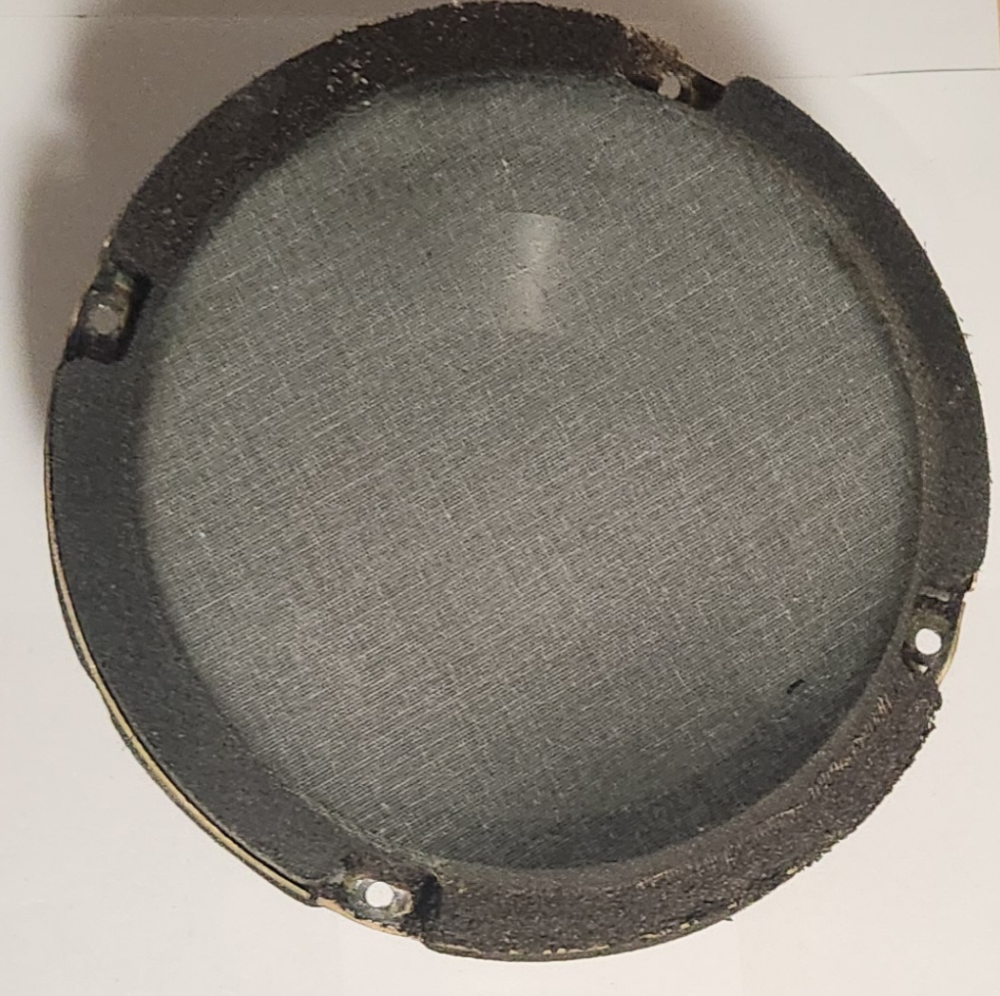
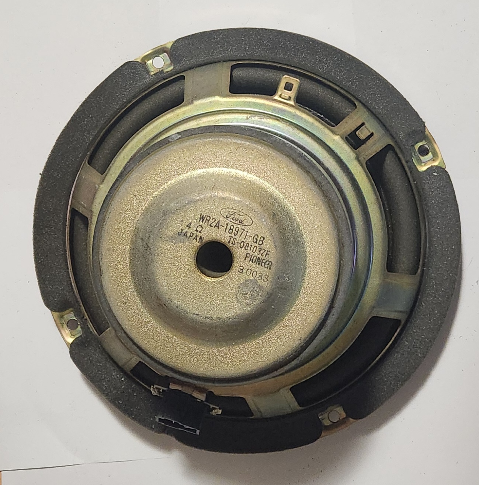
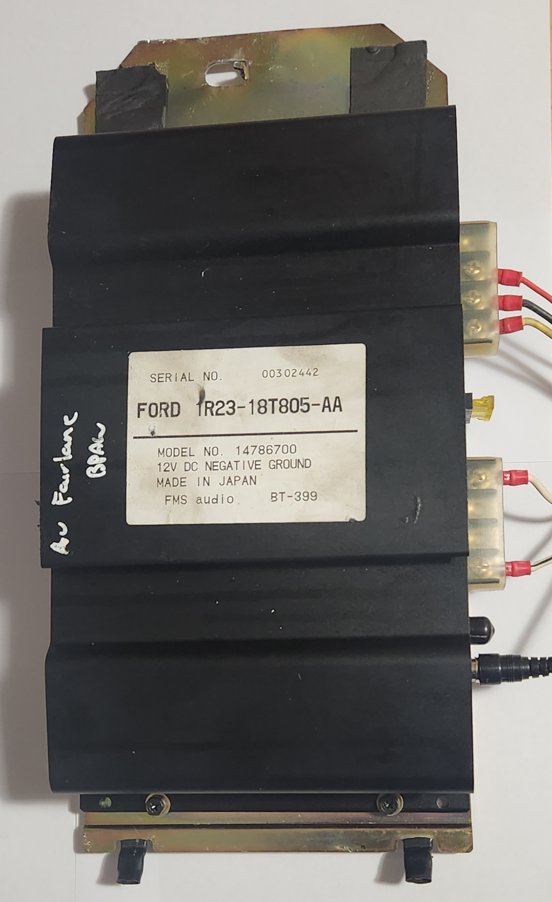
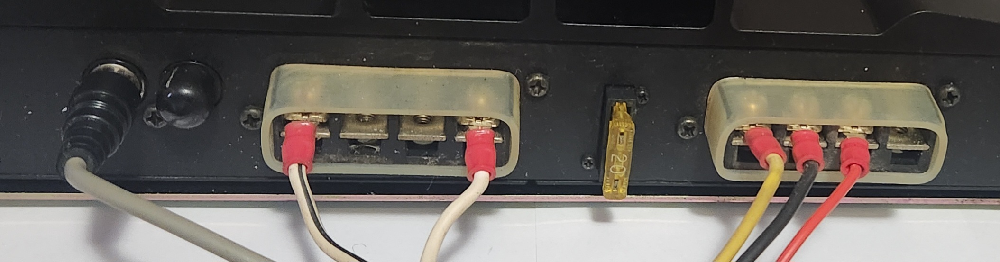

# Premium Audio System

> Information on this page is incomplete due to lack of resources
{: .block-note}

Some models of the AU Falcon were optioned with the Premium Audio System, which improves the audio solution of the vehicle by adding an external amplifier and a subwoofer. This is easier to find in the "Upmarket" models of the vehicle, such as the Fairmont GHIA or Fairlane, however any model could be optioned with it, assuming it was requested at the time of original purchase.

## Subwoofer

The following information is known about the factory Subwoofer:

| Information | Notes |
| --- | --- |
| Size | 8.5" |
| Manufacturer | Pioneer |
| Type | Free-Air |
| Resistance | 4Ω |
| Model # | Varies, generally `TS-08*****` |

> Pictures of a 8" Subwoofer from a Premium Audio System fitted model, specifically a AUII Fairmont Sedan

## Amplifier - S1

> Information on these amplifiers is incomplete due to lack of resources
{: .block-note}

The [Series 1](../../Miscellaneous/SeriesInformation/SeriesInformation.md#series-1) AU Falcons contained an amplifier which was used to power both the subwoofer and the rear speakers. The only known information on these amplifiers is the wiring colours:

> All polarities are assumed due to lack of available information
{: .block-note}

| Pin Purpose | Colour |
| --- | --- |
| Driver Rear Speaker - | Red/Green |
| Driver Rear Speaker + | Pink/Blue |
| Subwoofer - | Blue/Green |
| Subwoofer + | Blue/White |
| Passenger Rear Speaker - | Pink/Green |
| Passenger Rear Speaker + | Green/Orange |
| 12v Power | Yellow |
| 12v SIG | Red |
| GND | Black |
{: .sortable-table}

## Amplifier - S2-3

After the [Series 1](../../Miscellaneous/SeriesInformation/SeriesInformation.md#series-1) AU Falcons, the subwoofer was changed to a model that only contains an amplifier for the Subwoofer, and not the rear speakers. The following information is known about these amplifiers:

> Information on the Amplifier is limited due to a limited amount of these vehicles being still available for parts
{: .block-note}

| Information | Notes |
| --- | --- |
| Manufacturer | FMS Audio (Now known as Sanyo) |
| Channels | 2 |
| Wattage | Unknown, assumed 200-250W approximate |
| Connection | Subwoofer Only |

> A photo of a premium amplifier, originally from an AU Fairlane

### Plug Information

All connections for the speakers and subwoofer in the amplifier are screw terminal style connectors or RCA connections. As such, for any re-wiring attempts, small spade terminals and RCA male plugs should be used for the wires.

> There is a small loom that connects the subwoofer and speakers to the rest of the Audio Loom within the vehicle, however information on this loom is limited
{: .block-note}

> A photo of the rear of the amplifier, with factory wiring present as it was from factory. Note there is a spare RCA output behind a black dust cover, and that not all terminals are populated.

### Pinout

due to various plugs present on the rear of the Premium Audio Amplifier, the following information is divided into sections. Each section is progressing left to right, while looking at the amplifier while it is sitting flat on the screw mountable side:

<table>
    <thead>
        <th>01 - RCA</th>
        <th>02 - Screw Terminal Audio</th>
        <th>03 - Fuse</th>
        <th>04 - Screw Terminal Power</th>
    </thead>
</table>

#### Section 01 - RCA

The first section of the amplifier contains audio inputs via RCA connections. While stereo audio can be input, wiring on the amplifier itself suggests that all audio is converted to mono output.

> Only one plug, the left-most, is populated when using a factory loom
{: .block-note}

#### Section 02 - Screw Terminal Audio

The next section of the amplifier contains terminals for the audio output of the amplifier, with the layout and pinout listed below:

<table>
    <thead>
        <th>01</th>
        <th>02</th>
        <th>03</th>
        <th>04</th>
    </thead>
</table>

| Pin | Purpose | Notes |
| --- | --- | --- |
| 01 | Subwoofer - | |
| 02 | Speaker - | assumed, unused |
| 03 | Speaker + | assumed, unused |
| 04 | Subwoofer + | |

#### Section 03 - Fuse

The fuse section of the amplifier contains a Standard sized 20A fuse

#### Section 04 - Screw Terminal Power

The final section of the wiring for the amplifier contains the wiring for 12v power, in the following layout and pinout:

<table>
    <thead>
        <th>01</th>
        <th>02</th>
        <th>03</th>
        <th>04</th>
    </thead>
</table>

| Pin | Purpose | Notes |
| --- | --- | --- |
| 01 | 12v Constant | 20A signal required |
| 02 | GND1 | |
| 03 | 12v Signal | assumed, untested |
| 04 | GND2 | assumed, unused |

### Additional Information

Any additional information on the premium audio system is listed below:

- Premium audio is not compatible with Wagon or Ute body styles.
- Premium Audio cannot be "Plug and Play" installed into a lower model that did not have the option fitted. The following is required to allow for the installation of the PAS in a non-optioned vehicle:
    - Physical amplifier mounting, requires factory backplate or similar, screwed or riveted into inside of boot
    - One of:
      - New wiring from rear of vehicle to battery, constant power, and radio signal/audio
      - Audio loom replacement from optioned vehicle
    - Hole needs to be cut in sedan rear-shelf. While the steel has the hole present, the carpet cover does not and will need to be modified.
- There is partial information to suggest some [Series 3](../../Miscellaneous/SeriesInformation/SeriesInformation.md#series-3) AU Falcons may have come with the amplifier used in the BA Falcons with the same option installed. This information cannot be confirmed definitively however, and as such information is provided [below](#retrofit---ba-fgx-premium-audio-amplifier) accordingly.

<!-- TODO complete and add instructions on wiring in your own premium audio -->

## Retrofit - BA-FG Premium Audio Amplifier

The following information is know about the premium audio amplifier from later models of Ford Falcon, which if required, can be retrofitted to work with the AU:

> The information shown here was added due to the higher quantity of cars produced with the later model of amplifier, which at time of writing has resulted in a lower unit cost. Similar sound quality *should* be possible but *has not* been compared with an AU Falcon Factory Amplifier to confirm
{: .block-note}

### Specifications

| Information | Notes |
| --- | --- |
| Manufacturer | FMS Audio (Now known as Sanyo) |
| Channels | 1 |
| Wattage | 100W Standard, 150W Max. |
| Connection | Subwoofer only |

### Plug type

The amplifier for the later model amplifiers use an AMP Multilock .070 design with the following details:

| Name | Product Number | Notes |
| --- | --- | --- |
| Male Terminal Housing | 173851-1 | Loom end connector |
| Female Terminal Housing | 174933-1 | Amplifier connector |
| Male Terminal | 173645-1 | 20-16 AWG |
| Female Terminal | 173708-1 | 20-14 AWG |

### Pin Layout

The following notes assume pin numbers where you are looking at the Amplifier unit itself, with the flat edge facing upwards and the clip receiver facing down:

| `01` | `02` | `03` | `04` | `05` | `06` | `07` |
| --- | --- | --- | --- | --- | --- | --- |
| **`08`** | **`09`** | **`10`** | | | **`11`** | **`12`** |

### Pinout

> Audio In will need to already be converted to the right frequency range to work correctly. Use a low-pass filter from a split output from the rear shelf speakers, or your aftermarket headunits subwoofer output, as required
{: .block-note}

| Position | Colour | Function |
| --- | --- | --- |
| 01 | Black | Audio In - |
| 02 | N/a | |
| 03 | Light Blue/White | Subwoofer + |
| 04 | Green | ICC Diag (not required) |
| 05 | Red | ACC 12v+ |
| 06 | Black | GND |
| 07 | Black | GND |
| 08 | Yellow | Audio In + |
| 09 | N/a | |
| 10 | Blue | Subwoofer - |
| 11 | Yellow | Amplifier + |
| 12 | Yellow | Amplifier + |

> Information Sources:
> - [Haynes Manuals](../../Credits.md#sources) BA-BF Falcon Wiring Diagram
> - Physical Inspection/testing
{: .info-sources}

## Retrofit - FGII-FGX Premium Audio Amplifier

While statistically unlikely, should you find yourself with a later model FG or FGX Falcon amplifier, the recommended course of action is to avoid installation into your AU Falcon as a retrofit. This is due to there being multiple "sense" wires which were designed to be used with the later model ICCs which have been known to be impossible to emulate. Regardless, found information during the investigation as to whether this is possible is shown below, in the case it is decoded or someone wiring an amplifier into a compatible ICC needs this information and finds themselves here:

### Plug Type

The FGII-FGX Falcon amplifiers use a Yazaki Connector, part of their YESC Kaizen 1.5 System Connector line

| Name | Product Number | Notes |
| --- | --- | --- |
| Male Terminal Housing | 7282-6453-60 | Amplifier connector |
| Female Terminal Housing | 7283-6453-60 | Loom end connector |

### Pin Layout

The following notes assume pin numbers where you are looking at the Amplifier unit itself, with the flat edge facing down and the clip receiver facing upwards:

| `01` | `02` | `03` | `04` | `05` | `06` | `07` | `08` |
| --- | --- | --- | --- | --- | --- | --- | --- |
| **`09`** | **`10`** | **`11`** | **`12`** | **`13`** | **`14`** | **`15`** | **`16`** |

### Pinout

> Information incomplete due to lack of resources
{: .block-note}

| Position | Colour | Function |
| --- | --- | --- |
| 01 | Yellow | 12+ |
| 02 | Yellow | 12+ |
| 03 | | |
| 04 | Blue | Subwoofer (+ assumed)
| 05 | Blue/White | Subwoofer (- assumed)
| 06 | | |
| 07 | | |
| 08 | Brown | ICC Communications |
| 09 | Black | GND |
| 10 | Black | GND |
| 11 | White | ICC Communications |
| 12 | | |
| 13 | | |
| 14 | Orange | ICC Communications |
| 15 | | |
| 16 | Yellow | ICC Communications |

> Information Sources:
> - [Haynes Manuals](../../Credits.md#sources) FGX Falcon Wiring Diagram
{: .info-sources}

## Installation Configurations

For some common tested configurations that can be used for fitting premium audio features into a low model AU Falcon, please see the [Premium Audio Custom Installation](./PremiumAudioCustomInstallation/PremiumAudioCustomInstallation.md) page.