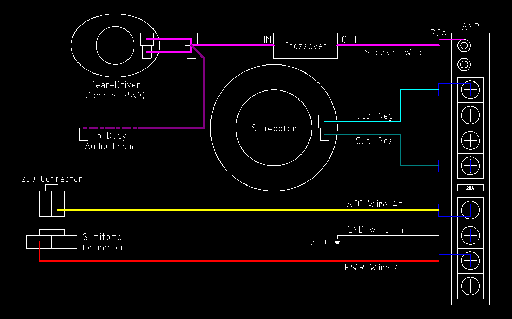
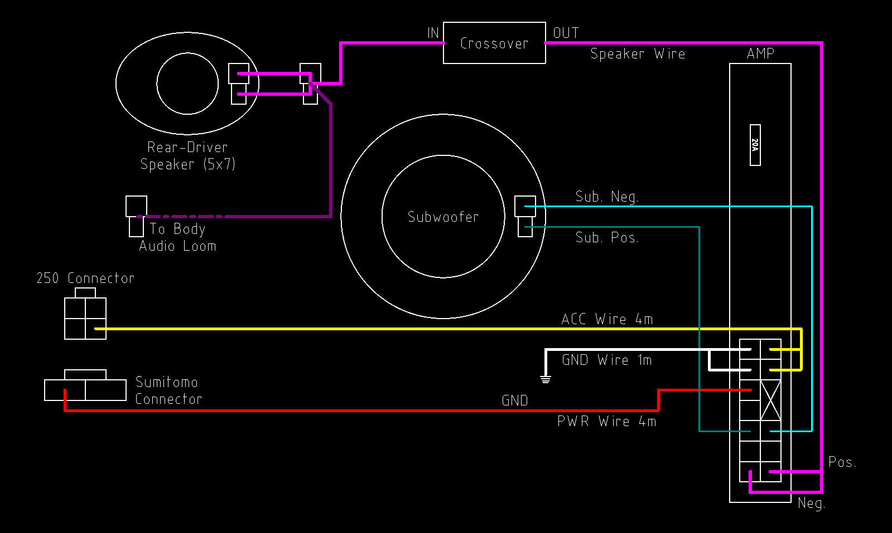
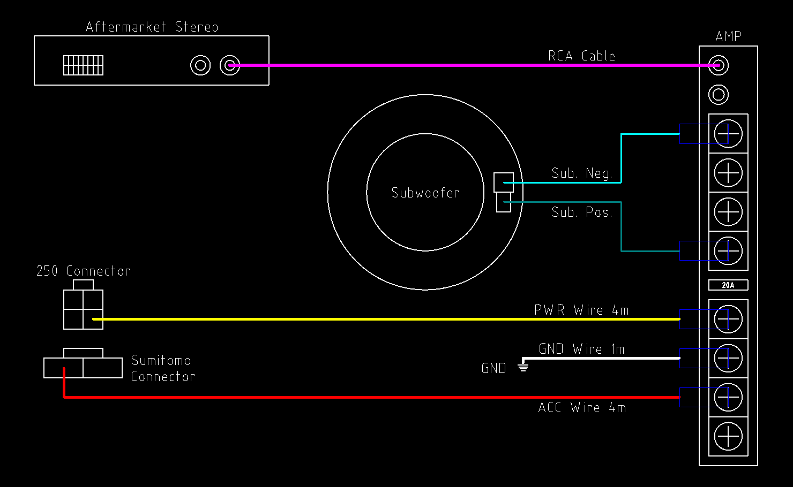
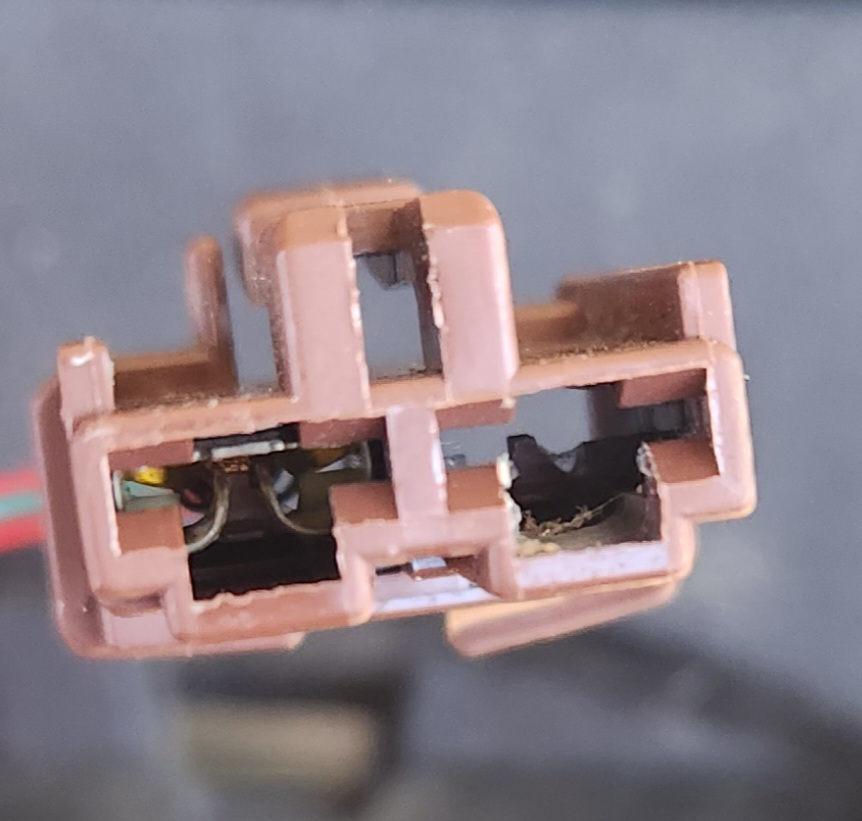
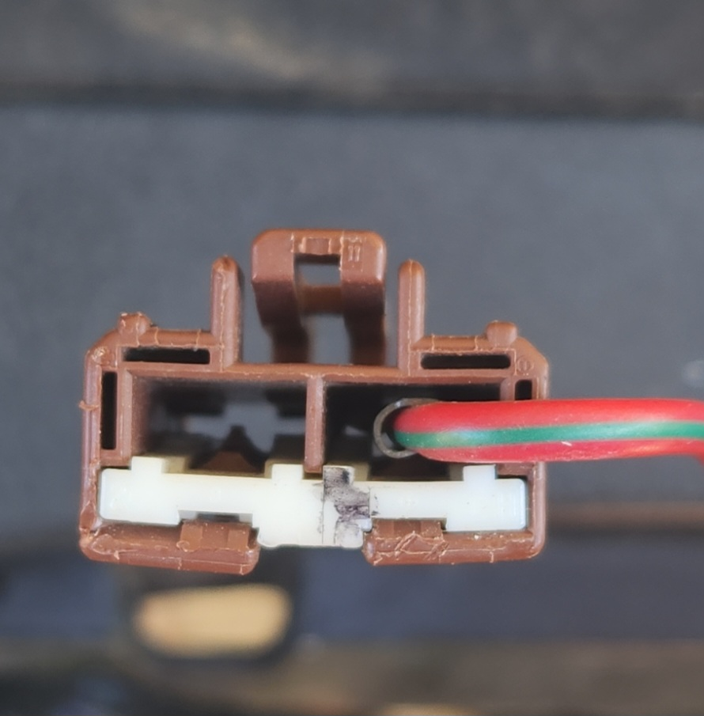

# Premium Audio Custom Installation

Depending on the configuration of your AU Falcons current audio system, certain different parts may be required. As a result, a section has been made for a couple of common configurations:

> No listed configuration allows for the use of the Premium Audio headunit or the premium audio body loom, due to a lack of resources and the unlikely scenario where a premium headunit was fitted to factory without the wiring provisioned to install an amplifier and subwoofer "plug-and-play".
>
> In addition, all configurations listed here are at least partially made from factory parts. There is sufficient information in this page to create a complete custom solution, but this was deemed out of scope.
{: .block-note}

## Note on Diagrams

All diagrams in this page are *indicative only*, as they are not "true" electrical diagrams. Every effort has been made to make the diagrams comprehensible through the use of approximate imagery and colours, however nothing on the diagrams are to scale, only "to shape", and only to a degree

## Configuration 1 - "AU Purity"

This configuration contains all factory AU Falcon parts wherever viable and possible.

> Factory amplifier boot loom not used as one connector is unidentified
{: .block-note}

> Audio level of rear driver speaker may be diminished due to splitting the output to a Crossover. This may be partially fixed using Fade & Balance combinations but must be considered if this method is used
{: .block-note}

### Parts

- 1x AU Falcon [Series 2-3 Amplifier](../PremiumAudio.md#amplifier---s2-3) Amplifier
- 1x AU Falcon Factory Subwoofer
- AU Falcon Subwoofer hardware:
    - 4x bolts
    - 1x grille
    - 1x plastic surround
- 1x Male RCA Connector
- 5x Fork Terminals
- 1x Ring Terminal
- 1x [Sumitomo](../../../Credits.md#sources) 8240-4140 female terminal
- 2x 250 Series Quick-Connect 2 way connector (male terminal housing)
- 2x 250 Series Quick-Connect 2 way connector (female terminal housing)
- 1x 250 Series Quick-Connect 4 way connector (male terminal housing)
- 4m of 12V20A rated wire (red preferred)
- 4m of 12V5A rated wire (yellow preferred)
- 50cm of 12V20A rated wire (black preferred)
- 2.15m standard audio cable (red/black preferred, cut into 2 1m lengths and 1 15cm length)
- 1x Audio Crossover (Passive if on budget, active for better quality)

### Steps

> The following are instructions on installation using this configuration. Should you prefer a visual representation of these steps, a [Diagram](#diagram) is supplied below these steps
{: .block-note}

1. Create a custom wiring loom, to be used for power delivery in this configuration, using the following notes:

    > Requires:
    > - 4m 12V20A Wire
    > - 4m 12V5A Wire
    > - Sumitomo female terminal
    > - 2x Fork Terminals
    > 4 way 250 Quick Connect Male Terminal Housing

    - Sumitomo Terminal - front end of 12V20A wire (red)
    - 4 way quick connector male terminal - front end of 12V5A wire (yellow)
    - Fork terminal #1 - rear end of 12V20A wire (red)
    - Fork terminal #2 - rear end of 12V5A wire (yellow)

1. Create a simple wiring loom using the short length of 12V20A wire with a Fork Terminal at one end, and a Ring Terminal at the other. This will be the Ground Loom

1. Create a custom wiring loom, to be used for the subwoofer in this configuration, using the following notes:

    > Requires:
    > - 1x 250 Quick Connect Male Terminal Housing
    > - 1m length audio wire
    > - 2x Fork Terminals

    - 250 Quick Connect female terminal housing horizontal pin - subwoofer end negative audio wire
    - 250 Quick Connect female terminal housing vertical pin - subwoofer end positive audio wire
    - Fork terminals - amplifier end negative audio wire & amplifier end positive audio wire

1. Create a custom wiring loom, to be used to split the audio between the rear driver speaker and the amplifier in this configuration, using the following notes:

    > Requires:
    > - 1x 250 Quick Connect Male Terminal Housing
    > - 1x 250 Quick Connect Female Terminal housing
    > - Crossover
    > - RCA Connector
    > - Speaker Wire

    - 250 Quick Connect female terminal housing horizontal pin - speaker end negative audio wire X2 (Splitting audio)
    - 250 Quick Connect female terminal housing vertical pin - speaker end positive audio wire X2 (Splitting audio)
    - 250 Quick Connect male terminal housing #1 horizontal pin - audio loom negative audio wire (short length)
    - 250 Quick Connect male terminal housing #1 vertical pin - audio loom positive audio wire (short length)
    - Crossover input negative wire - 250 Quick Connect male terminal housing #2 horizontal pin
    - Crossover input positive wire - 250 Quick Connect male terminal housing #2 vertical pin
    - Crossover output negative wire - RCA Connector negative
    - Crossover output positive wire - RCA Connector positive

1. Install the amplifier into the factory location, on the driver side wall of the boot, near the [internal trailer connector](../../../Electrical/TrailerPlug/TrailerPlug.md)

1. Install the factory subwoofer and associated hardware into the factory location, which is the centre of the rear shelf

    <!-- TODO add pic of speaker location -->

1. Install the custom wiring looms according to the list below:

    - Power Delivery Loom:
        - Connect 4 way 250 Quick Connect connector to [accessory plug under dash](../../../Electrical/AccessoryPlug/AccessoryPlug.md#how-to-find-it)
        - [Install the Sumitomo terminal](#common-step---connecting-the-sumitomo-terminal-to-the-cabin-fuse-panel)
        - Connect fork terminals to relevant screws on [factory amplifier](../PremiumAudio.md#plug-information)
    - Ground Loom:
        - Connect fork terminal to relevant screw on [factory amplifier](../PremiumAudio.md#plug-information)
        - Connect Ring terminal to body ground at rear of amplifier installation location

        <!-- TODO add pic of ground location -->

    - Subwoofer Loom:
        - Connect the 250 Quick Connect connector to the subwoofer
        - Connect the 2 fork terminals to the relevant screws on [factory amplifier](../PremiumAudio.md#plug-information)
    - Audio Loom:
        - Connect the 250 Quick Connect male terminal housing into the audio loom for the driver side rear speaker
        - Connect the 250 Quick Connect female terminal housing into the rear of the driver side rear speaker
        - Connect the RCA connector to the RCA port on the amplifier

1. Verify functionality

1. Done

### Diagram

Below is a diagram of this configuration:

## Configuration 2 - "Falcon Parts Sharing"

This configuration contains as many factory parts as possible, but sourcing from later model Ford Falcons due to increased availability and lower price at time of writing. The Crossover section of this configuration can be replaced with an RCA Male connector on the end of a 5m length of standard speaker wire, terminated to 2 Multilock 070 Female terminals in [the positions for speaker input on the later model falcon amplifier plug](../PremiumAudio.md#pinout-1)

> Audio level of rear driver speaker may be diminished due to splitting the output to a Crossover. This may be partially fixed using Fade & Balance combinations but must be considered if this method is used
{: .block-note}

### Parts

- 1x Factory Amplifier from one of:
    - BA Falcon
    - BF Falcon
    - SX Territory
    - SY Territory
- 1x Factory Subwoofer from one of:
    - AU Falcon
    - BA Falcon
    - BF Falcon
    - FG Falcon
    - FGX Falcon
- AU Falcon Subwoofer hardware:
    - 4x bolts
    - 1x grille
    - 1x plastic surround
- 1x [Sumitomo](../../../Credits.md#sources) 8240-4140 female terminal
- 2x 250 Series Quick-Connect 2 way connector (female terminal housing)
- 2x 250 Series Quick-Connect 2 way connector (male terminal housing)
- 1x 250 Series Quick-Connect 4 way connector (male terminal housing)
- 1x RCA connector (Male)
- 5m standard audio cable
- 1x AMP Multilock .070 173851-1 connector (female terminal housing)
  - Including 8x AMP Multilock .070 173708-1 female terminals (not all terminals to be populated)
- 4m of 12V20A rated wire (red preferred)
- 4m of 12V5A rated wire (yellow preferred)
- 1x Audio Crossover (Passive if on budget, active for better quality)

### Steps

> The following are instructions on installation using this configuration. Should you prefer a visual representation of these steps, a [Diagram](#diagram-1) is supplied below these steps
{: .block-note}

1. Create a custom wiring loom, to be used for power delivery in this configuration, using the following notes:

    > Requires:
    > - 4m 12V20A Wire
    > - 4m 12V5A Wire
    > - Sumitomo female terminal
    > - 2x Multilock Terminals
    > - 4 way 250 Quick Connect Male Terminal Housing

    - Sumitomo Terminal - front end of 12V20A wire (red)
    - 4 way quick connector male terminal - front end of 12V5A wire (yellow)
    - Multilock terminal #1 - rear end of 12V20A wire (red)
    - Multilock terminal #2 - rear end of 12V5A wire (yellow)

1. Create a simple wiring loom using the short length of 12V20A wire with a Multilock Terminal at one end, and a Ring Terminal at the other. This will be the Ground Loom

1. Create a custom wiring loom, to be used to split the audio between the rear driver speaker and the amplifier in this configuration, using the following notes:

    > Requires:
    > - 1x 250 Quick Connect Male Terminal Housing
    > - 1x 250 Quick Connect Female Terminal housing
    > - Crossover
    > - RCA Connector

    - 250 Quick Connect female terminal housing horizontal pin - speaker end negative audio wire X2 (Splitting audio)
    - 250 Quick Connect female terminal housing vertical pin - speaker end positive audio wire X2 (Splitting audio)
    - 250 Quick Connect male terminal housing #1 horizontal pin - audio loom negative audio wire (short length)
    - 250 Quick Connect male terminal housing #1 vertical pin - audio loom positive audio wire (short length)
    - Crossover input negative wire - 250 Quick Connect male terminal housing #2 horizontal pin
    - Crossover input positive wire - 250 Quick Connect male terminal housing #2 vertical pin
    - Crossover output negative wire - Speaker Wire negative
    - Crossover output positive wire - Speaker Wire positive

1. Install the amplifier into the factory location, on the driver side wall of the boot, near the [internal trailer connector](../../../Electrical/TrailerPlug/TrailerPlug.md)

1. Install the factory subwoofer and associated hardware into the factory location, which is the centre of the rear shelf

    <!-- TODO add pic of speaker location -->

1. Install the custom wiring looms according to the list below:

    - Power Delivery Loom:
        - Connect 4 way 250 Quick Connect connector to [accessory plug under dash](../../../Electrical/AccessoryPlug/AccessoryPlug.md#how-to-find-it)
        - [Install the Sumitomo terminal](#common-step---connecting-the-sumitomo-terminal-to-the-cabin-fuse-panel)
        - Connect Multilock terminals to relevant positions on the [the amplifier](../PremiumAudio.md#pin-layout)
    - Ground Loom:
        - Connect Multilock terminal to relevant position on the [factory amplifier](../PremiumAudio.md#pin-layout)
        - Connect Ring terminal to body ground at rear of amplifier installation location

        <!-- TODO add pic of ground location -->

    - Subwoofer Loom:
        - Connect the 250 Quick Connect connector to the subwoofer
        - Connect the 2 Multilock terminals to the relevant positions on [factory amplifier](../PremiumAudio.md#pin-layout)
    - Audio Loom:
        - Connect the 250 Quick Connect male terminal housing into the audio loom for the driver side rear speaker
        - Connect the 250 Quick Connect female terminal housing into the rear of the driver side rear speaker
        - Connect the Speaker Wire Multilock terminals to the relevant positions on the [factory amplifier](../PremiumAudio.md#pin-layout)

1. Verify functionality

1. Done

### Diagram

Below is a diagram of this configuration:

## Configuration 3 - "AU Purity - Aftermarket Head-Unit"

This configuration is a copy of the [AU Purity Configuration](#configuration-1---au-purity), but with the assumption that the factory head unit has been replaced with an aftermarket unit with RCA subwoofer output. This has the benefit of being more plug-and-play without relying on a Crossover, however still retains the drawback of the relative rarity of the AU Falcon Amplifier and Subwoofer assemblies.

### Parts

- 1x Aftermarket Stereo with RCA Subwoofer Output
- Aftermarket Stereo adapter loom(s) & hardware

    > Looms and adapters can be supplied from companies such as [Aerpro](../../../Credits.md#sources)
    {: .block-note}

- 1x AU Falcon [Series 2-3 Amplifier](../PremiumAudio.md#amplifier---s2-3) Amplifier
- 1x AU Falcon Factory Subwoofer
- AU Falcon Subwoofer hardware:
    - 4x bolts
    - 1x grille
    - 1x plastic surround
- 5x Fork Terminals
- 1x Ring Terminal
- 1x [Sumitomo](../../../Credits.md#sources) 8240-4140 female terminal
- 1x 250 Series Quick-Connect 4 way connector (male terminal housing)
- 1x 250 Series Quick-Connect 2 way connector (female terminal housing)
- 4m of 12V20A rated wire (red preferred)
- 4m of 12V5A rated wire (yellow preferred)
- 50cm of 12V20A rated wire (black preferred)
- 5m RCA Cable Male-Male

### Steps

> The following are instructions on installation using this configuration. Should you prefer a visual representation of these steps, a [Diagram](#diagram-2) is supplied below these steps
{: .block-note}

1. Create a custom wiring loom, to be used for power delivery in this configuration, using the following notes:

    > Requires:
    > - 4m 12V20A Wire
    > - 4m 12V5A Wire
    > - Sumitomo female terminal
    > - 2x Fork Terminals

    - Sumitomo Terminal - front end of 12V20A wire (red)
    - 4 way quick connector male terminal - front end of 12V5A wire (yellow)
    - Fork terminal #1 - rear end of 12V20A wire (red)
    - Fork terminal #2 - rear end of 12V5A wire (yellow)

1. Create a simple wiring loom using the short length of 12V20A wire with a Fork Terminal at one end, and a Ring Terminal at the other. This will be the Ground Loom

1. Create a custom wiring loom, to be used for the subwoofer in this configuration, using the following notes:

    > Requires:
    > - 1x 250 Quick Connect Male Terminal Housing
    > - 1m length audio wire
    > - 2x Fork Terminals

    - 250 Quick Connect male terminal housing horizontal pin - subwoofer end negative audio wire
    - 250 Quick Connect male terminal housing vertical pin - subwoofer end positive audio wire
    - Fork terminals - amplifier end negative audio wire & amplifier end positive audio wire

1. Connect the RCA cable to the amplifier and the aftermarket headunit subwoofer out respectively

1. Install the amplifier into the factory location, on the driver side wall of the boot, near the [internal trailer connector](../../../Electrical/TrailerPlug/TrailerPlug.md)

1. Install the factory subwoofer and associated hardware into the factory location, which is the centre of the rear shelf

    <!-- TODO add pic of speaker location -->

1. Install the custom wiring looms according to the list below:

    - Power Delivery Loom:
        - Connect 4 way 250 Quick Connect connector to [accessory plug under dash](../../../Electrical/AccessoryPlug/AccessoryPlug.md#how-to-find-it)
        - [Install the Sumitomo terminal](#common-step---connecting-the-sumitomo-terminal-to-the-cabin-fuse-panel)
        - Connect fork terminals to relevant screws on [factory amplifier](../PremiumAudio.md#plug-information)
    - Ground Loom:
        - Connect fork terminal to relevant screw on [factory amplifier](../PremiumAudio.md#plug-information)
        - Connect Ring terminal to body ground at rear of amplifier installation location

        <!-- TODO add pic of ground location -->

    - Subwoofer Loom:
        - Connect the 250 Quick Connect connector to the subwoofer
        - Connect the 2 fork terminals to the relevant screws on [factory amplifier](../PremiumAudio.md#plug-information)

1. Verify functionality

1. Done

### Diagram

Below is a diagram of this configuration:

## Common step - Connecting the Sumitomo Terminal to the Cabin Fuse Panel

All of the preceding configurations require that you remove the cabin fuse panel and install a Sumitomo terminal into the factory location for the amplifier circuit. Follow the instructions below to perform this step:

1. ***DISCONNECT THE BATTERY***
1. Remove the 2 phillips head screws holding the panel into place, and gently pull the panel from the dash
1. Locate and disconnect the 2 position brown connector from the rear of the panel.

    > This connector should only have one terminal pin populated. If this is not the case, your vehicle likely has the premium audio wiring loom, rendering this page useless to your specific vehicle.

    
    

    > Picture of the front and rear of the connector to be unplugged from the fuse panel

1. push your terminated wire into the empty position in the plug housing, and reinstall into the cabin fuse panel

    > Due to age, there may be dirt or other build-up in the plastic housing. For best results, clean this cavity before performing this step
    {: .block-note}

1. Reinstall the cabin fuse panel into the vehicle, ensuring both screws are tight.

1. (Optional, if fuse previously removed) Install a 20A fuse into the AMP fuse location on the cabin fuse panel.

    <!-- TODO add position pic -->

1. Reconnect the battery and test that the circuit receives power using a multimeter.

1. Done