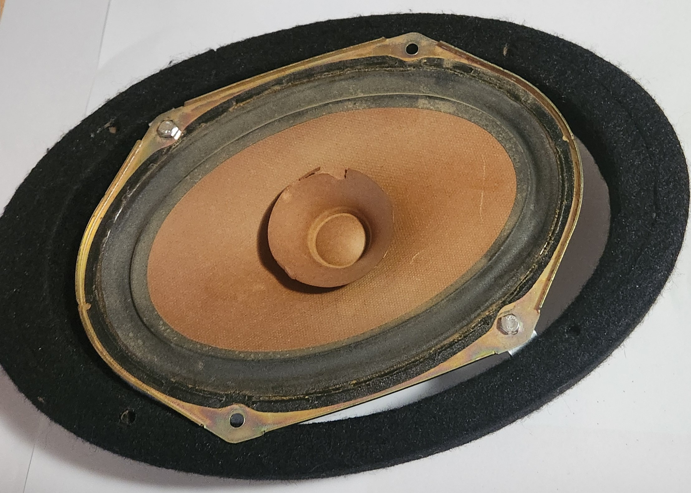
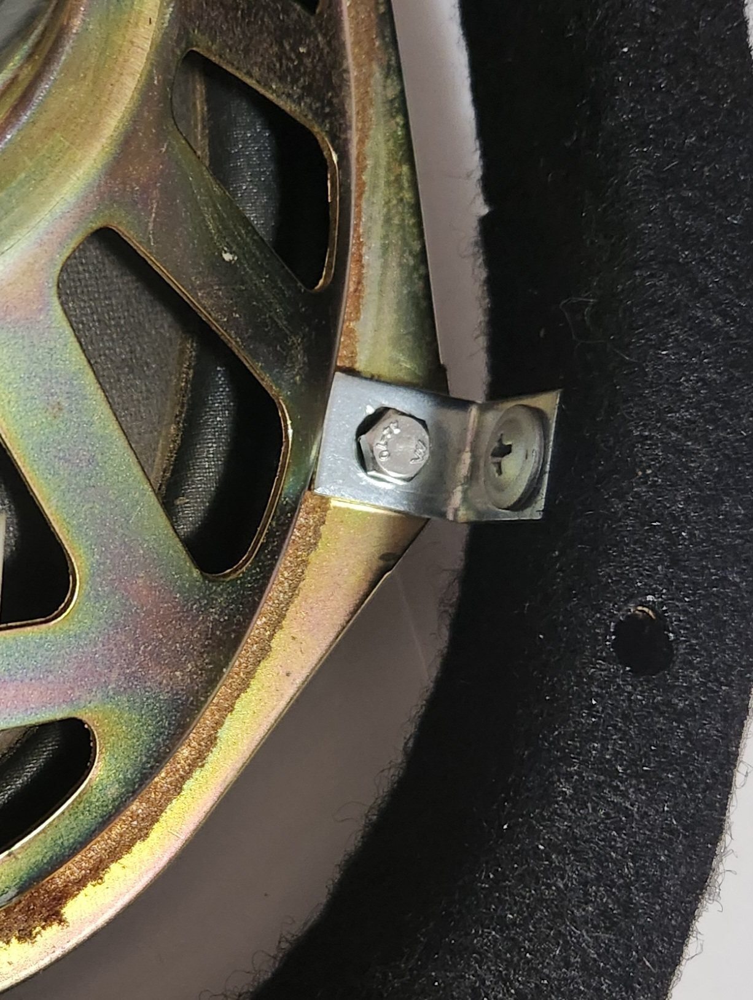
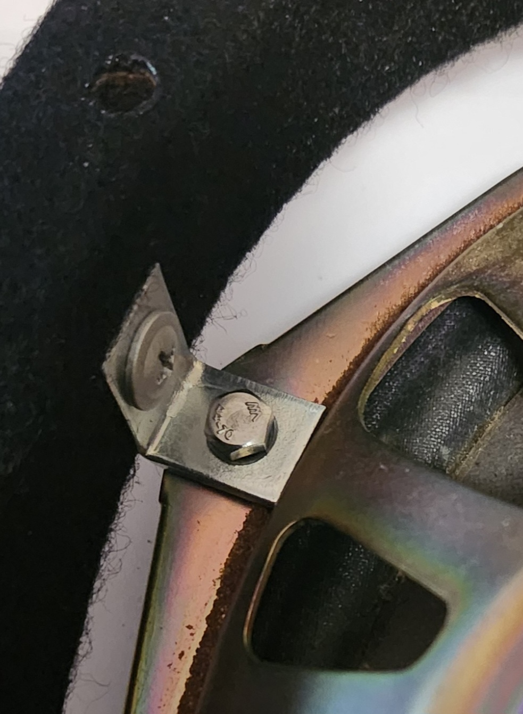
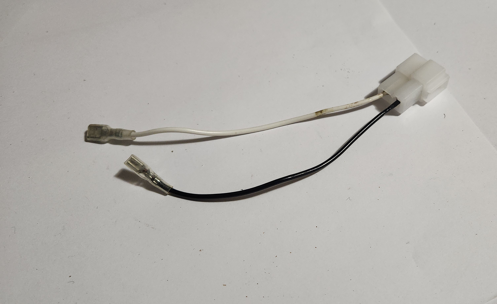

# Sedan audio upgrade - 6x9" Speakers

A common upgrade performed by AU Falcon owners who would like to simply upgrade the sound quality of their rear speakers is to install 6x9" speakers in place of the factory 5x7" original speakers. The following steps assume you have no drill or are otherwise unable or unwilling to modify the factory rear shelf.

> This is by no means the best way to install these speakers, simply the one of the easiest with the above limitations. Additional materials such as additional foam and rubber for enclosure sealing and vibration control are recommended, but are not used for these instructions.
{: .block-note}

## What you will need

For the installation of both rear speakers, the following hardware will be required:

> Specific information included to allow for accurate recreation as necessary
{: .block-note}

| Item | QTY | Specific part used | Notes |
| --- | --- | --- | --- |
| 6x9" Speakers | 2 | Pioneer TSA6960F | |
| 6x9" Speaker Spacer | 2 | [Aerpro](../../../Credits.md#sources) AP3081C Carpeted MDF Speaker Spacers | |
| 20mm Right-angle brackets | 4 | Zenith 20mm Zinc Plated Angle Brackets WEB1020 | |
| 8G 15mm timber screws | 4 | Zenith 8G x 15mm Button Head Stitching Screw | Button head screw preferred |
| M4 x 20mm Bolts | 4 | Pinnacle Hardware M4 x 20mm Hex Head Bolts & Nuts | |
| M4 x 20mm Nuts | 4-8 | Pinnacle Hardware M4 x 20mm Hex Head Bolts & Nuts | 4 if using thread-locker, 8 if not | 
| Thread-locker | 1 | N/a | Optional |
| Speaker Mounting Hardware | N/a | Various | |

## Instructions

> These instructions assume no LPG tank is present directly behind the rear seats. Installation may be very difficult in these models
{: .block-note}

> Instructions explain procedure for single speaker. Repeat steps once more to replace both speakers
{: .block-note}

1. Remove the factory speaker according to the [normal removal steps](../Speakers.md#rear-speakers---sedan)
1. Screw 2 of the right angled brackets to 2 diagonally opposite holes on the factory speaker, according to the guide below, using the bolts and nuts. Ensure they are loosely fitted to allow for adjustment, with the bolt threaded through from *below* the speaker face (upside-down)

    - Angled configuration: For installation where speakers sit on a similar angle to factory location, place driver side speaker brackets on the *top-left* and *bottom-right* mounting holes, and passenger side speaker brackets on the *top-right* and *bottom-left* mounting holes (while facing the speaker face)

        > This configuration has a slightly sharper angle to the original speakers
        {: .block-note}

    - Flat configuration: For installation where the bottom edge of the speakers sit parallel to angle of rear seats, place driver side speaker brackets on the *top-right* and *bottom-left* mounting holes, and place passenger side brackets on the *top-left* and *bottom-right* mounting holes (while facing the speaker face)

        > This configuration has a reasonably flat angle vs. the original speakers, but leaves a small gap in the rear shelf carpet on the rear side. This *does not* seem to affect functionality and is not very noticeable to the eye, but is worth noting regardless in case this configuration is not desired or results in degraded audio performance.
        {: .block-note}

1. Align the speaker onto the bottom face of the spacer, noting the following points on positioning, then mark the locations on the 2 brackets on where the timber screws should go:
    - Magnet should be as central as possible inside spacer
    - Brackets should be firmly up against inside face of spacer
    - 2 remaining corners of factory speaker should sit flush on bottom face of spacer

    > The orientation of the speaker mounted using these instructions will be rotated from the orientation of the spacer. This is normal and is corrected in later steps with the larger speaker
    {: .block-note}

    > You can mark the 2 locations using the sharp end of the screw using your thumb. For this reason, a button-head screw is recommended.
    {: .block-note}

    

    > Picture of a passenger speaker, dry fit to the bottom of the speaker spacer in a "flat" configuration

1. Remove the factory speaker from the brackets by undoing the bolts, and then mount the brackets using the timber screws in the marked locations, ensuring that the bracket sits as flush as possible with the bottom of the spacer.

    > Now is a good time to test fit the spacer and ensure all holes line up before tightening the screws down completely
    {: .block-note}

    > A socket wrench with a screwdriver bit installed or "stubby" screwdriver is recommended for this step due to tight working spaces
    {: .block-note}

    
    
    > Pictures of the right angled brackets installed onto a speaker

1. (Optional) Make adapter loom according to the [normal removal steps](../Speakers.md#rear-speakers---sedan), and install onto the 6x9" speaker

    
    > Picture of an example adapter loom, for a Pioneer 6x9 Speaker

1. Flip the spacers to have the brackets on the bottom, place the bolts loosely in the lower holes of the bracket, and place a nut on each bolt.

    > This step is only to prevent the bolt falling out during the following steps, as the head of the bolt will be inaccessible later on in the procedure
    {: .block-note}

1. Place the 6x9" speaker and cover onto the spacer assembly using appropriate screws or bolts, ensuring it is securely together.

    > No picture added as assembly will look different depending on model of speakers used
    {: .block-note}

1. (depending on hardware selected) place a small amount of thread-locker on the threads of the bolts

1. Carefully remove the 4 nuts from the 4 bolts, place the assembled speaker into the factory holes, and screw 2 nuts back onto the bottom of the 2 bolts.

    > You may need to feed a small screwdriver or a finger in under the speaker to hold the top of the bolt while the nut is screwed in and tightened. Failing this, use a small spanner to spin the nut while holding the thread of the bolt using a pair of pliers. You may also need to push down on the speaker assembly to ensure a tight fit from the speakers.
    {: .block-note}

1. Connect speaker wires or adapter connector to car loom

1. (depending on hardware selected) Install the remaining 2 nuts onto the rear of the bolts in a similar manner

    > This doubling-up of the nuts makes the rear-most nut a "lock-nut", creating a "poor-man's thread-locker".
    {: .block-note}

1. Done