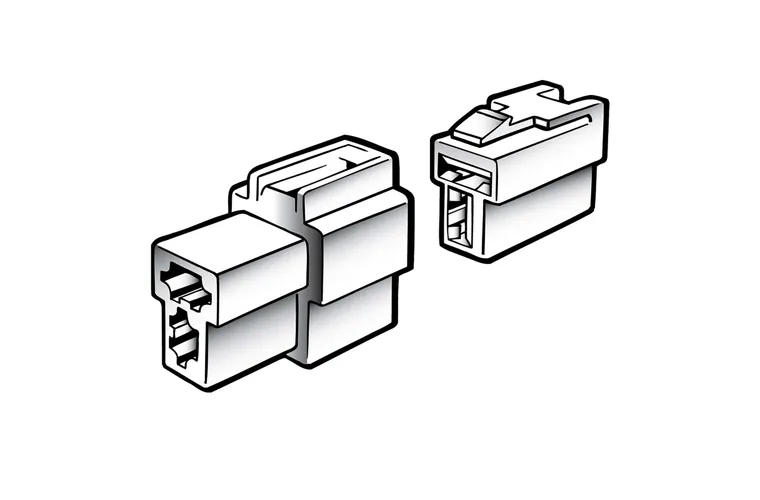
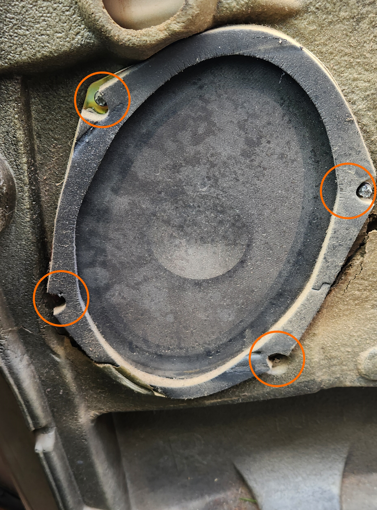
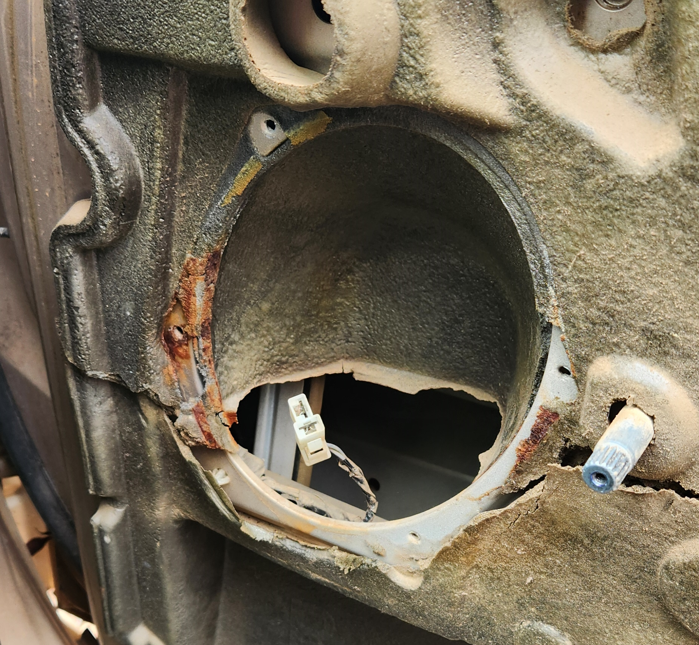
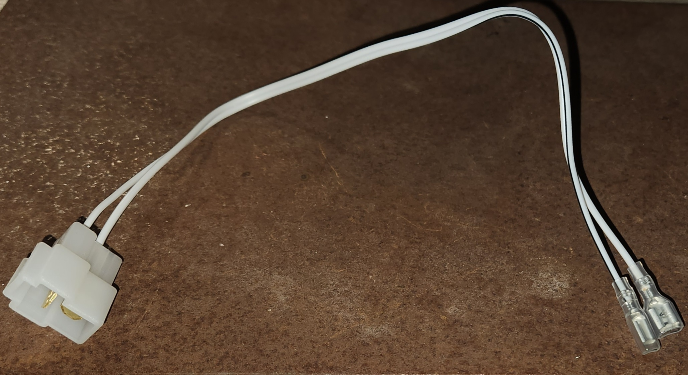
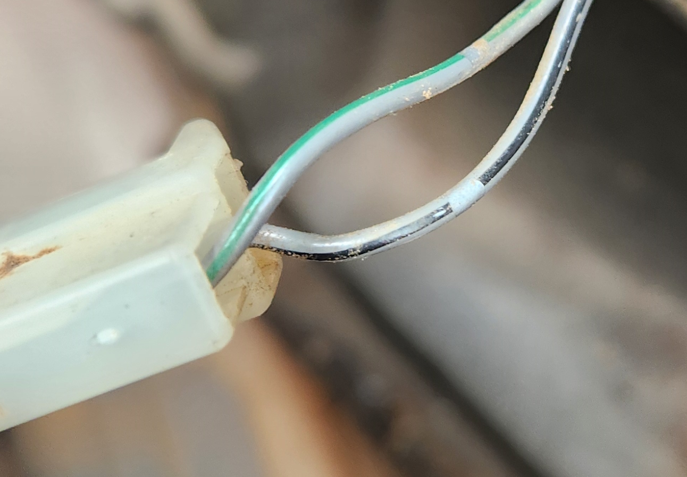
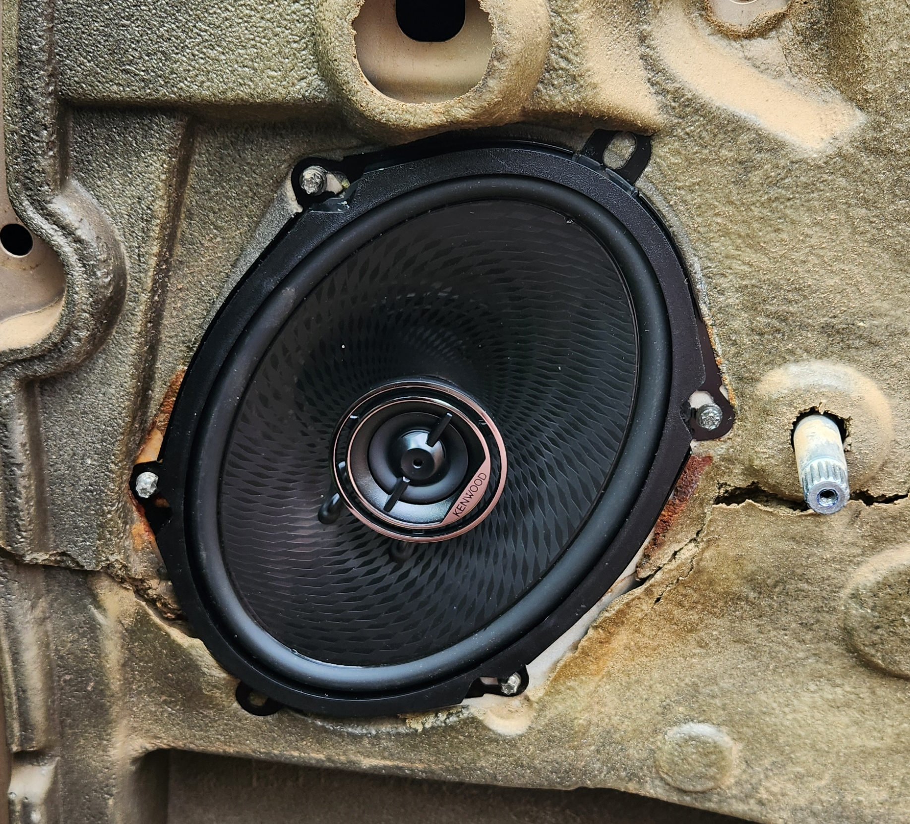

<link rel="stylesheet" type="text/css" href="../../Common/overrides.css">

# Speakers

## Sizes

The size of most speakers across the AU Falcon range are 5x7" oval speakers, which is a non-standard size. Note that 6x9" speakers can be used in both locations, however additional holes will need to be drilled to allow for them, and special care must be taken for the front door speakers depth, as they can foul the window mechanism.

> NOTE: popular replacements for these speakers are the Kenwood KFC-PS5796C, as they require no amp and are a drop-in replacement, barring the plug (explained in installation steps)

Exceptions to this include:
- Wagon Rear Speakers (speakers are seemingly 4-5")

## Plug
The standard speakers used in the AU Falcon are known as a 250 Series Quick Connect 2-way connector. They are easy enough to identify as they have a T-shaped housing on them. There are many manufacturers for these connectors, and such it should be relatively trivial to find one from an Automotive Shop

> Picture taken from Narva product page for a pack of both 1 male connector housing (left) and one female connector housing (right) (product code 56272BL)

## Replacement

> NOTE: you will need a uncommon bit for this job, an E-Torx XXX. These can be found in certain screwdriver or drill driver bit sets. Alternatively there is known mixed success using either a 5mm socket or a pair of vice grip pliers (however the latter should only be used if a new screw is going to replace it as it will likely damage the head of the screw)

<!--TODO work out the exact bit needed-->

### Driver Door Speakers

Follow the steps below to replace the driver door speakers:
1. Remove the door card, noting the following:
    - Manual window winding models will need to have the handle removed first (use a phillips head screwdriver)
    - Electronic window models will need to have the button plate gently removed (use a trim removal tool or a flat head screwdriver)
    - the mirror switch will need to be unplugged (if drivers door)
    - extra care will need to be taken around the door lock stalk (if drivers door)

    

    > Photo of screw locations

1. Remove the 4 screws holding the speaker into place and unplug the speaker from the wiring loom

    > NOTE: after removal, it may be a good idea to clean up the door, as the surfaces where the speaker and door meet is prone to crust and rust, seemingly as a result of adhesives used at some point

    
    

    > Photos of the speaker screw locations in the door assembly, and the door post-removal respectively

1. do one of the following:
    - if keeping the original loom, create an adapter with a [male housing 2 way quick connector](#plug) on one end, and the spade connectors for your speakers on the other
    - if modifying the loom, cut and crimp the spade connectors for your speakers onto the loom, noting:
        - On the [plug](#plug), the top connection (horizontal pin) is the negative
        - as much slack as possible should be secured to the door or the back of the speaker, to avoid interference with other components
        - if you are comfortable with a soldering iron, adding a little bit of solder to the connector pin before inserting it into the housing makes for a stronger connection

        

        > example of a loom made for a set of Kenwood speakers
        
    

    > Photo of the wires from the back of the plug in the door side of the wiring loom. Note the wire with the Black line is Negative, and the one with the Green line is Positive

1. Connect your speaker to the wiring harness and reinstall into the door

    > NOTE: now is a good time to test that the speakers are connected correctly by turning on the radio

    

    > photo of speaker installed. Note you can use the original screws, or the new screws and brackets from the new speakers if wanted/needed

1. reinstall the door card, remembering to reconnect the window winder handle (on manual winding models) or the electronic window panel (on electronic window models)
1. done

### Rear Speakers - Sedan
Follow these steps below to replace the rear shelf speakers (Sedan only):
1. use a trim removal tool or a small flat head screwdriver to remove the speaker cover(s) on the shelf
1. remove the 4 screws holding the speaker into place and unplug the speaker(s) from the wiring loom
1. do one of the following:
    - if keeping the original loom, create 1-2 (as needed) adapters with a [2 way quick connector](#plug) on one end, and the spade connectors for your speakers on the other
    - if modifying the loom, cut and crimp or solder the spade connectors for your speakers onto the loom
    <!--TODO add more information on wiring-->
1. Connect your speaker(s) to the wiring loom and reinstall into the shelf
    > NOTE: now is a good time to test that the speakers are connected correctly by turning on the radio
1. place cover back onto speakers
1. done

### Rear Speakers - Wagon
> NOTE: lack of images in this section due to project only involving Sedan

Follow these steps below to replace the rear C-Pillar speakers (Wagon only):
1. remove the plastic C-Pillar upper trim. Note that this is held in with screws and will require the removal of the outer cushioning for the rear seats
1. remove all plastic clips and screws holding the cloth panelling on the side of the car you are working on, and remove or peel back the panel itself to reveal the speakers. Remove the 4 screws holding in the speakers and remove
1. do one of the following:
    - if keeping the original loom, create 1-2 (as needed) adapters with a [2 way quick connector](#plug) on one end, and the spade connectors for your speakers on the other
    - if modifying the loom, cut and crimp or solder the spade connectors for your speakers onto the loom
    <!--TODO add more information on wiring-->
1. Connect your speaker(s) to the wiring harness and reinstall into the body
    > NOTE: now is a good time to test that the speakers are connected correctly by turning on the radio
1. reinstall the cloth trim for the side of the car you are working on, and reinstall all plastic clips and screws.
1. reinstall the C-Pillar trim and the outer cushioning for the rear seats, remembering to screw in the trim itself
1. done
<!--TODO add pictures if you ever can-->

### Rear Speakers - Ute
> NOTE: lack of images in this section due to project only involving Sedan

> NOTE: Ute rear speakers were optional, but should have the same 5x7" speakers as the Sedans. Ensure this is correct *BEFORE* performing these steps

1. use a trim removal tool or a small flat head screwdriver to remove the speaker cover(s) on the rear panel
1. remove the 4 screws holding the speaker into place and unplug the speaker(s) from the wiring loom
1. do one of the following. For either step, keep in mind that the negative for each speaker is the wire with a black line in it:
    - if keeping the original loom, create 1-2 (as needed) adapters with a [2 way quick connector](#plug) on one end, and the spade connectors for your speakers on the other
    - if modifying the loom, cut and crimp or solder the spade connectors for your speakers onto the loom
2. Connect your speaker(s) to the wiring harness and reinstall into the rear panel
    > NOTE: now is a good time to test that the speakers are connected correctly by turning on the radio
3. place cover back onto speakers
4. done