# Speakers

## Sizes

The size of most speakers across the AU Falcon range are 5x7" oval speakers, which is a non-standard size. Note that 6x9" speakers can be used in both locations with some modifications, however additional holes will need to be drilled to allow for them, and special care must be taken for the front door speakers depth, as they can foul the window mechanism. Alternatively 6" round speakers can be fitted using off the shelf adapters from online marketplaces such as [eBay](../../Credits.md#sources)

> Popular replacements for these speakers are the [Kenwood](../../Credits.md#aftermarket-components-information) KFC-PS5796C, as they require no amp and are a drop-in replacement, barring the plug (explained in installation steps)
{: .block-note}

The only known exception to this is wagon body Falcons, which have 5.25" round speakers in the rear

## Plug
The standard speakers used in the AU Falcon are known as a 250 Series Quick Connect 2-way connector. They are easy enough to identify as they have a T-shaped housing on them. There are many manufacturers for these connectors, and such it should be relatively trivial to find one from an Automotive Shop.

Note that the Loom end connector is the female terminal housing and that the factory speakers were fitted with male terminal housings.

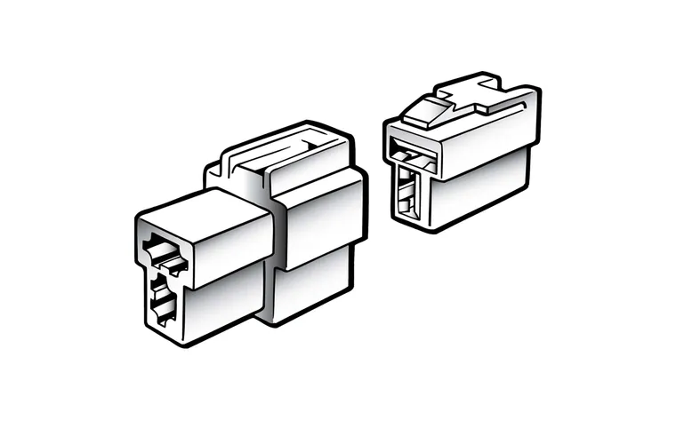

> Picture taken from [Narva](../../Credits.md#sources) product page for a pack of both 1 male terminal housing (left) and one female terminal housing (right) (product code 56272BL)

## Further information

The following miscellaneous information is known about the Speakers in the AU Falcon:

- lower and/or earlier models contain unknown branded speakers. Only visible markings are a Ford logo and a Ford part number.
- Models fitted with [Premium Audio System](../PremiumAudio/PremiumAudio.md) known to have Pioneer branded speakers. These Pioneer speakers appear to have propagated to lower models by the AUIII

## Replacement

> You will need a uncommon bit for the below listed jobs, an E6 E-Torx socket. These can be found in certain screwdriver or socket sets, but are a specialty bit in most cases. Alternatively there is known success using either a 5mm standard socket or a pair of vice grip pliers (however either of these options should only be used if a new screw is going to replace it, as it will likely damage the head of the screw)
{: .block-note}

### Front Door Speakers

Follow the steps below to replace the front door speakers:

1. Remove the door card, noting the following:
    - Manual window winding models will need to have the handle removed first (use a phillips head screwdriver)
    - Electronic window models will need to have the button plate gently removed (use a trim removal tool or a flat head screwdriver)
    - The mirror switch will need to be unplugged (if drivers door)
    - Extra care will need to be taken around the door lock stalk (if drivers door)

    

    > Photo of screw locations

1. Remove the 4 screws holding the speaker into place and unplug the speaker from the wiring loom

    > After removal, it may be a good idea to clean up the door, as the surfaces where the speaker and door meet is prone to crust and rust, seemingly as a result of adhesives used at some point
    {: .block-note}

    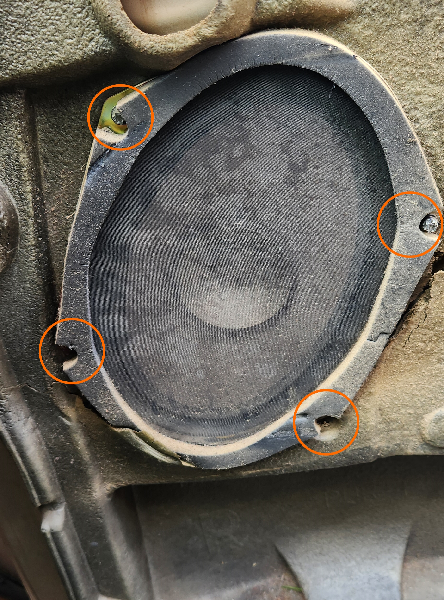
    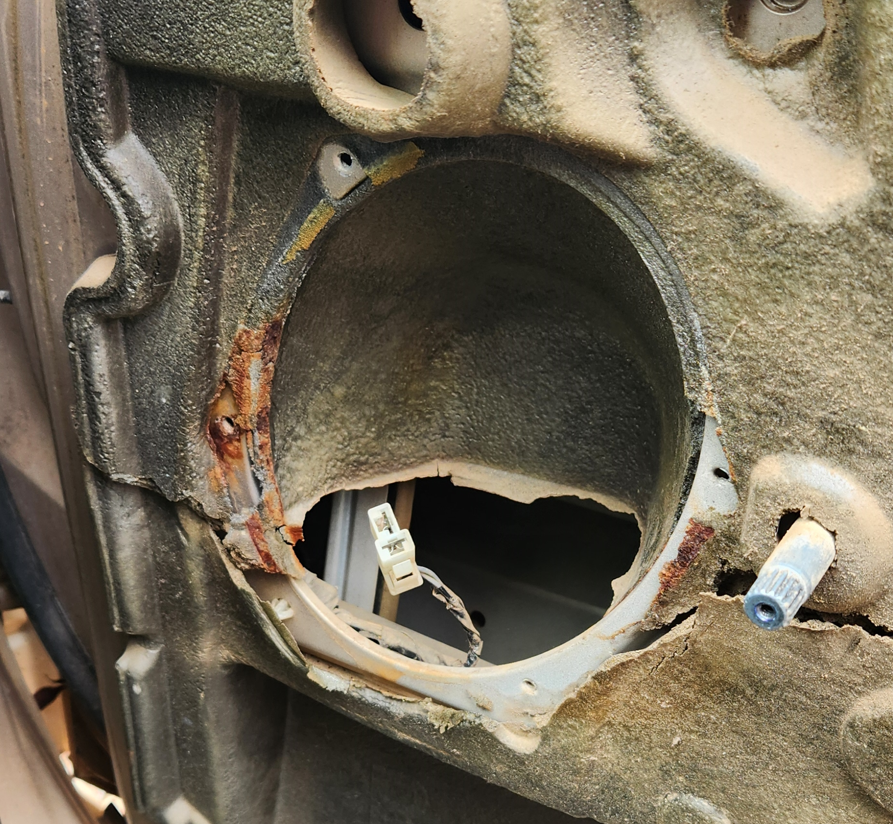

    > Photos of the speaker screw locations in the door assembly, and the door post-removal respectively

1. Do one of the following:
    - If keeping the original loom, create or purchase an adapter with a [male housing 2 way quick connector](#plug) on one end, and the spade connectors for your speakers on the other

        > Manufacturers such as [Aerpro](../../Credits.md#sources) can provide these adapters at time of writing, part number `APS58`

    - If modifying the loom, cut and crimp the spade connectors for your speakers onto the loom. As much slack as possible should be secured to the door or the back of the speaker, to avoid interference with other components

        Regardless of method used, note:
        - On the [plug](#plug), the top connection (horizontal pin) is the negative
        - If you are comfortable with a soldering iron, adding a little bit of solder to the connector pin before inserting it into the housing makes for a stronger connection

        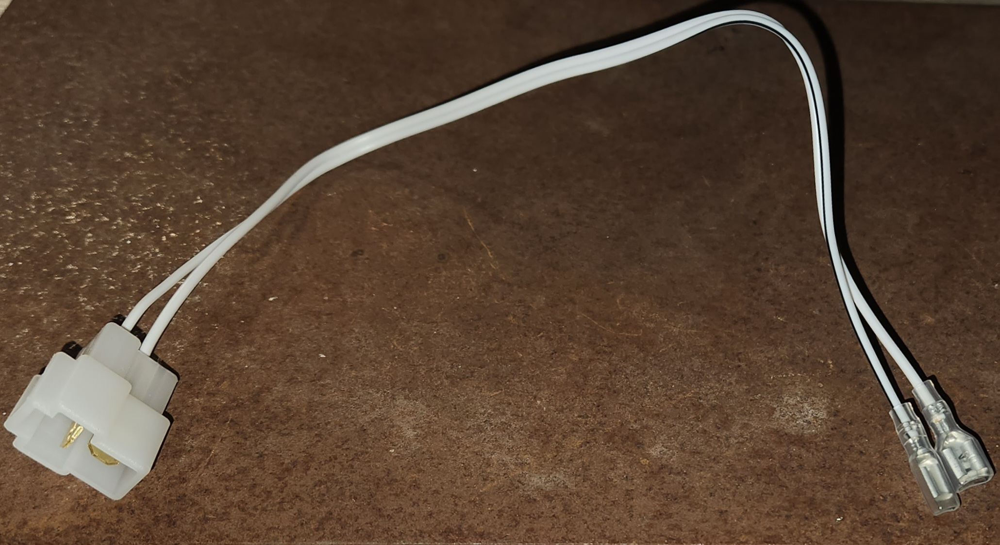

        > Example of a loom made for a set of Kenwood speakers
        
        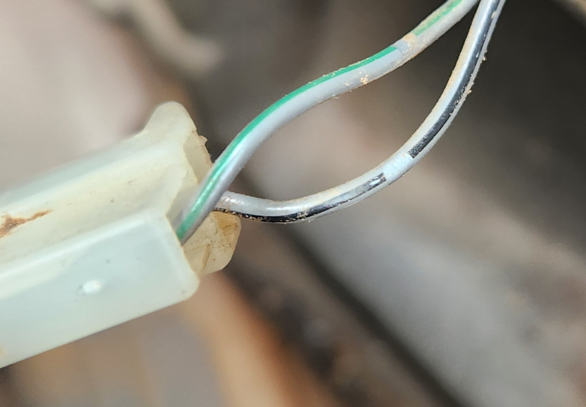

        > Photo of the wires from the back of the plug in the door side of the wiring loom. Note the wire with the Black line is Negative, and the one with the Green line is Positive

1. Connect your speaker to the wiring harness and reinstall into the door

    > Now is a good time to test that the speakers are connected correctly by turning on the radio
    {: .block-note}

    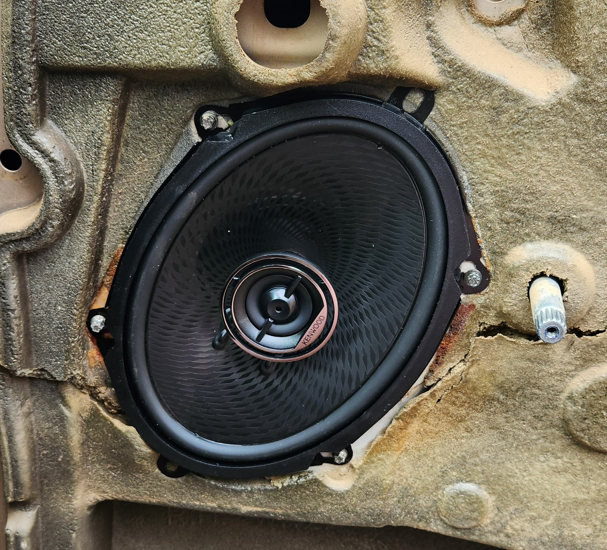

    > Photo of speaker installed. Note you can use the original screws, or the new screws and brackets from the new speakers if wanted/needed

1. Reinstall the door card, remembering to reconnect the window winder handle (on manual winding models) or the electronic window panel (on electronic window models)
1. Done

### Rear Speakers - Sedan

> Rear Sedan speakers can be upgraded to 6x9" speakers with relative simplicity. See the [6x9 upgrade guide](./6x9-Upgrade/6x9-Upgrade.md) for more information
{: .block-note}

Follow these steps below to replace the rear shelf speakers (Sedan only):
1. Use a trim removal tool or a small flat head screwdriver to remove the speaker cover(s) on the shelf
1. Remove the 4 screws holding the speaker into place and unplug the speaker(s) from the wiring loom

> Photo of the screw locations for the rear shelf speaker. Note mesh covers not present (see note below)

> The rear shelf speakers contain mesh covers similar to the factory speakers [in the front doors](#front-door-speakers), however these are prone to separation from the speaker assembly due to the direct sunlight exposure of these speakers. A common temporary fix is to carefully remove these covers to remove the vibration, however this leaves the cone more exposed to damage and debris.
{: .block-note}

1. Do one of the following:
    - If keeping the original loom, create 1-2 (as needed) adapters with a [2 way quick connector](#plug) on one end, and the spade connectors for your speakers on the other
    - If modifying the loom, cut and crimp or solder the spade connectors for your speakers onto the loom, noting that the wire in the loom with a black line in it is *always* negative

    Regardless of method used, note:
    - On the [plug](#plug), the top connection (horizontal pin) is the negative
    - If you are comfortable with a soldering iron, adding a little bit of solder to the connector pin before inserting it into the housing makes for a stronger connection

    

    > Example of a loom made for a set of Kenwood speakers
    
1. Connect your speaker(s) to the wiring loom and reinstall into the shelf

    > Now is a good time to test that the speakers are connected correctly by turning on the radio
    {: .block-note}

1. Place cover back onto speakers
1. Done

### Rear Speakers - Ute

> Lack of images and information in this section due to project only involving Sedan
{: .block-note}

> Ute rear speakers were optional, but should have the same 5x7" speakers as the Sedans. Ensure this is correct *BEFORE* performing these steps
{: .block-note}

1. Use a trim removal tool or a small flat head screwdriver to remove the speaker cover(s) on the rear panel
1. Remove the 4 screws holding the speaker into place and unplug the speaker(s) from the wiring loom
1. Do one of the following. For either step, keep in mind that the negative for each speaker is the wire with a black line in it:
    - If keeping the original loom, create 1-2 (as needed) adapters with a [2 way quick connector](#plug) on one end, and the spade connectors for your speakers on the other
    - If modifying the loom, cut and crimp or solder the spade connectors for your speakers onto the loom

    Regardless of method used, note:
    - On the [plug](#plug), the top connection (horizontal pin) is the negative
    - If you are comfortable with a soldering iron, adding a little bit of solder to the connector pin before inserting it into the housing makes for a stronger connection

    

    > Example of a loom made for a set of Kenwood speakers

1. Connect your speaker(s) to the wiring harness and reinstall into the rear panel

    > Now is a good time to test that the speakers are connected correctly by turning on the radio
    {: .block-note}

1. Place cover back onto speakers
1. Done

### Rear Speakers - Wagon

> This section is not related to [SPUD](../../Disclaimer.md#spud) as it is a Sedan body type, but this has been created using an associated vehicle, [Roadkill](../../Disclaimer.md#associated-vehicles). Despite being a later model, these instructions should work without issue on AU Falcon Wagons

Follow these steps below to replace the rear C-Pillar speakers (Wagon only):
1. Remove the rear seat base by unclipping the 2 plastic clips under the seat and lifting the cushion out of the vehicle
1. Undo the single 10mm bolt at the bottom of the rear seat bolster, and then lift the bolster to disengage it from a single clip in the top of the assembly

    > Theoretically the top clip could be disengaged without unbolting the bolster allowing you to push it away from the C-pillar enough for the rest of this procedure, but this is not recommended due to the risk of damage to the bolster plastic clip
    {: .block-note}

    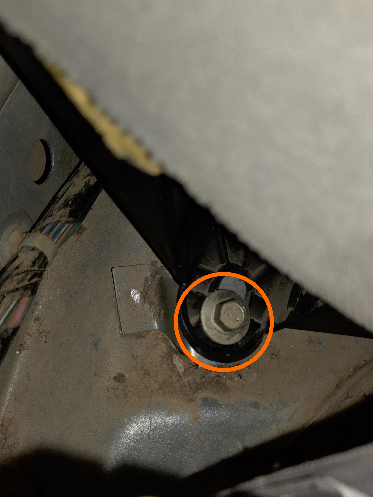
    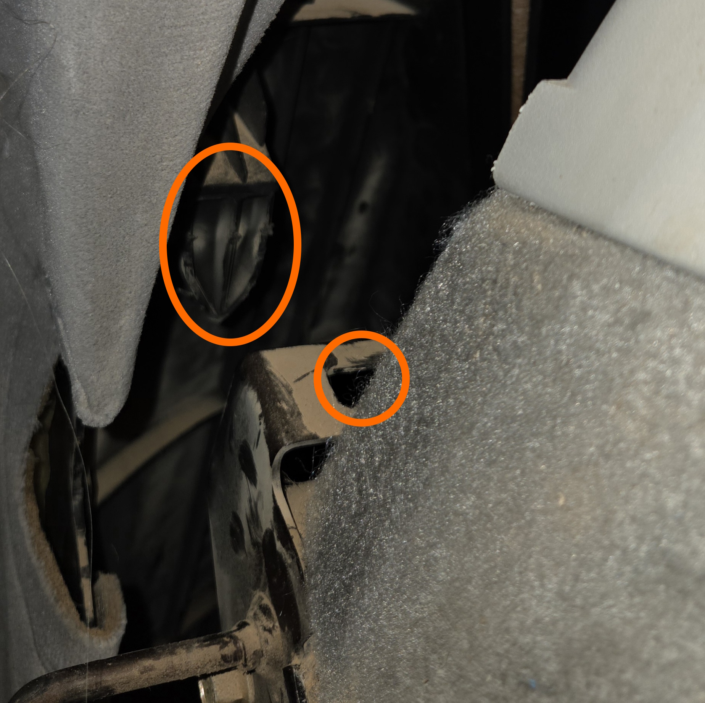
    > Picture of the bottom bolster bolt and the clip and its original location in the top of the bolster respectively

1. Remove the speaker cover by gently unclipping it from the C-Pillar trim

    > This is simply done as a precaution against breaking, as the covers are thin and can become brittle over time
    {: .block-note}

1. Remove the plastic C-Pillar upper trim. Note that this is held in with a screw in addition to clips along the C-Pillar itself

    > Without removing the bottom mount for the rear seatbelts, the C-Pillar trim cannot be removed completely. Simply slide it down the seatbelt out of the way for this procedure
    {: .block-note}

    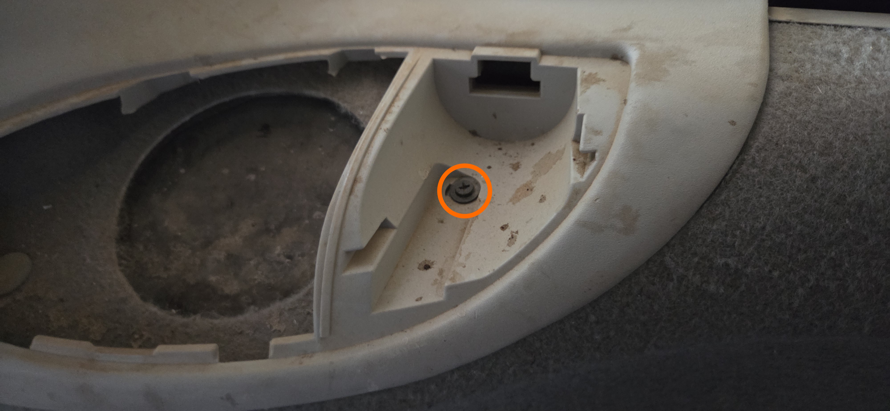
    > Picture of the screw in the C-Pillar

1. Remove all plastic tabs and screws holding the cloth panelling on the side of the car you are working on. This will involve at least the following:
    - 1 plastic tab near the speaker itself

        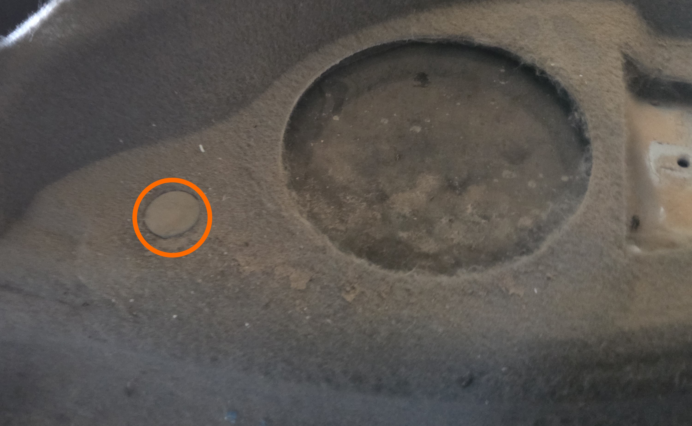
        > Picture of the plastic tab to the side of the speaker

    - 1 plastic tab on the boot end of the panel

        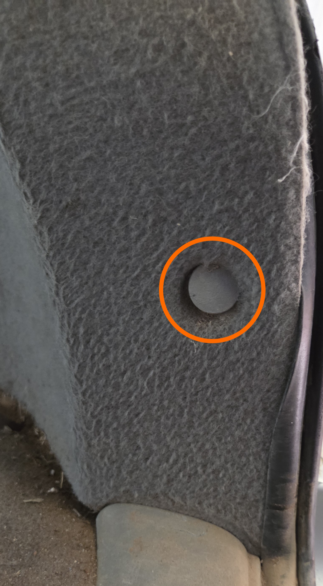
        > Picture of the plastic tab at the rear of the panel, in line with the interior edge of the tailgate

    - 2 Torx T27 screws, holding in the Cargo Net clips. Once removed the clips themselves can be pulled out with moderate force

        > The removal of these is not strictly required if inconvenient, however this prevents damage to the panel on removal. If you choose to leave them, be careful of a small lip around the base of each clip
        {: .block-note}

        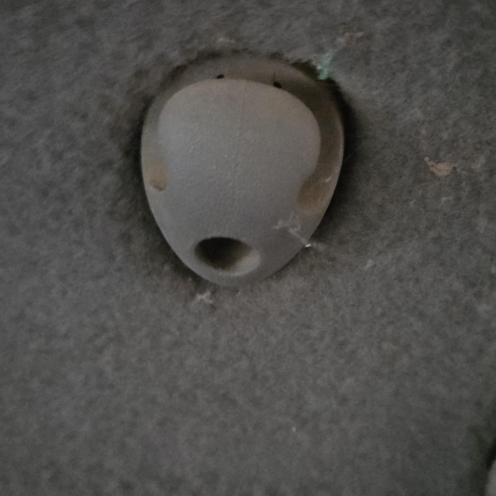
        > Picture of one of the cargo clips in the boot side panel
    - (If drivers side) 1 emergency jack & wheel tool compartment door

        > This is optional to remove, however removal of this prevents any possibility of damage to the plastic knob on the door itself
        {: .block-note}

        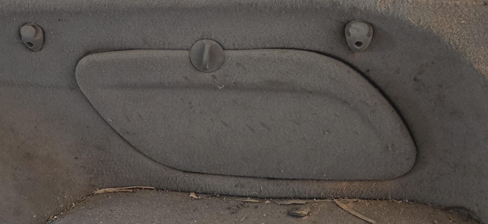
        > Picture of the emergency jack and wheel tool compartment

1. Remove the cloth panel itself from the inside of the boot

1. Remove the 4 screws holding in the speakers and remove

    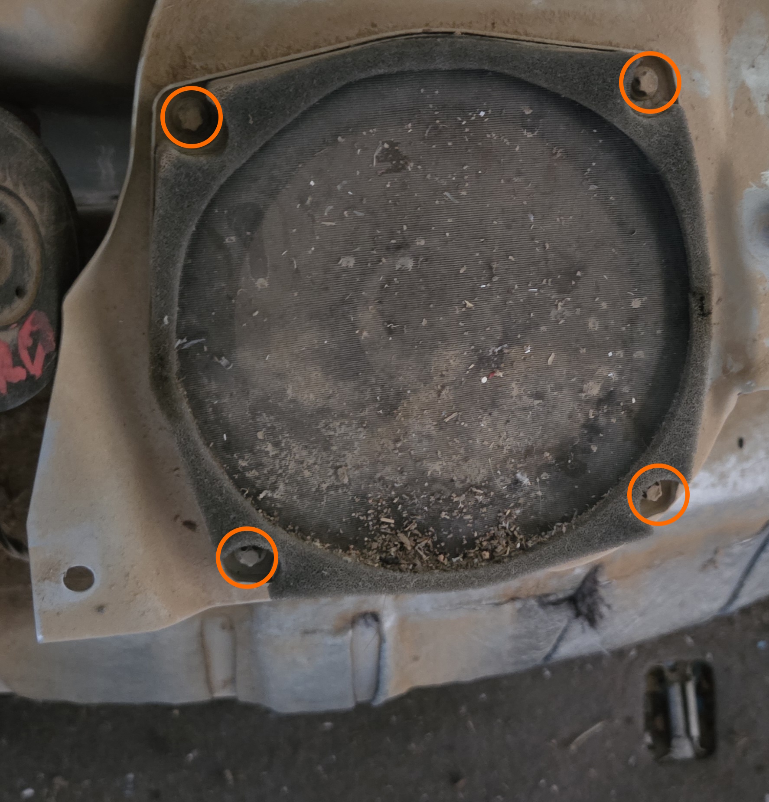
    > Picture of the screw locations for the rear speaker

1. Do one of the following:
    - If keeping the original loom, create 1-2 (as needed) adapters with a [2 way quick connector](#plug) on one end, and the spade connectors for your speakers on the other
    - If modifying the loom, cut and crimp or solder the spade connectors for your speakers onto the loom noting that the wire in the loom with a black line in it is *always* negative

    Regardless of method used, note:
    - On the [plug](#plug), the top connection (horizontal pin) is the negative
    - If you are comfortable with a soldering iron, adding a little bit of solder to the connector pin before inserting it into the housing makes for a stronger connection

    

    > Example of a loom made for a set of Kenwood speakers

1. Connect your speaker(s) to the wiring harness and reinstall into the body

    > Now is a good time to test that the speakers are connected correctly by turning on the radio
    {: .block-note}

1. Reinstall the cloth trim for the side of the car you are working on, and reinstall all plastic clips and screws.
1. Reinstall the C-Pillar trim and the outer cushioning for the rear seats, remembering to screw in the trim itself
1. Done