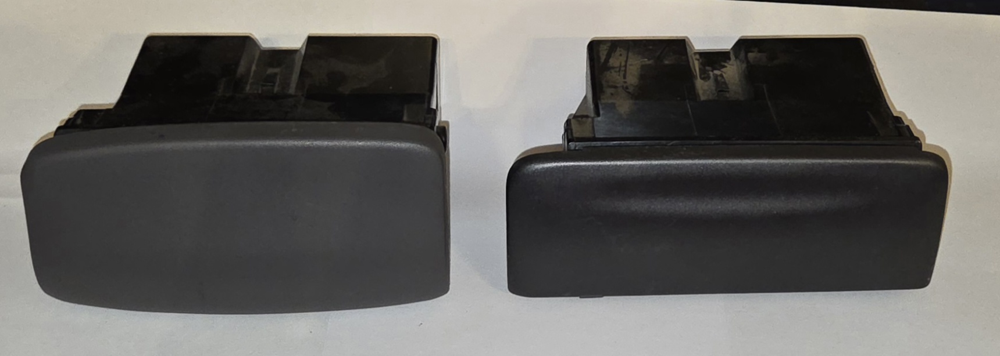

# Centre Dash Ashtray

## Series/Model Differences

There are 2 parts for the centre ashtray due to differences in interior design, listed below:

> Side by side visual comparison of [Series 1 / High model ashtray](#series-1-low--series-1-3-high-model) (left) and [Series 2-3 Low model ashtray](#series-2-3-low-model) (Right)

> Note that the rear assembly of both variants is identical, however removal of the face plate is difficult, making swapping between them impossible

### Series 1 Low & Series 1-3 High Model

This centre ashtray is the original which was equipped on the first AU Falcon models. Due to the high models not getting the same interior facelift as the low models during the switch from Series 1 to Series 2, this also means that all high model ashtrays from any series can fit a series 1 low interior.

Identifying factors:

* Not as wide than their Series 2 low counterparts
* Generally lighter colours: the Series 2/3 high models didn't get a facelift, but the colour palette was generally darkened in line with the low model facelift
* face panel tends to be more central on assembly

#### 3D Model - Face replacement

A basic 3D model is below, for the purposes of blanking out the centre ashtray to be a flat panel. This model was designed with further modifications in mind: if 3D printed, this can be printed with a high density and drilled as needed for buttons, switches etc., or the model itself can be modified to suit other purposes such as gauge holders.

Should you block out a Series 1 centre ashtray, you can use the scanned and modified 3D model found on GitHub, [HERE](https://github.com/digi-ron/AU-Falcon-S1-CentreAshtray-Blank)

> This model is a modified scan of an original part. The following tools and settings were used. Physically this should match all dimensions of the original ashtray, however there are some imperfections in non-visible parts of the model, caused by the relative inexperience of the author. Regardless, this should be "showroom ready" once installed:
>
> - [Revopoint](../../Credits.md#software--hardware) Inspire (3D scanner)
> - AESUB Blue vanishing spray (3D scanning spray)
> - [Blender](../../Credits.md#software--hardware) (Modelling software):
>   - Model modified with material removed for ease of wire routing or saving of material when printing
> - Ender 3 V1 (3D printer):
>   - Recommended Material: ASA/ABS
>   - Supports: yes
>   - Notes: Printed horizontally for decreased printing lines, printer modified for high temperature printing material.
> - Fitting note: The clip on the top of the assembly is purposely taller to allow for tighter fitmet, as it will not be frequently removed in theory. Note this may cause strain on the small metal clip on the centre dash if this is removed and reinstalled regularly as a result.

> In the interest of this projects vision, the published STL file is stored on this website as a backup [HERE](./ashtray.stl). *Last synced - 03/03/26*
{: .block-note}

### Series 2-3 Low Model

This centre ashtray is in all series 2 and 3 low model AU Falcon models. The reason for this change is due to the fact that the centre dash was one of the largest changes made during the facelift between Series 1 and 2. For high models refer to the [appropriate section](#series-1-low--series-1-3-high-model)

Identifying factors:

* Wider than their counterparts, with a flatter bottom edge
* Generally darker colours as a result of the Series 2 facelift
* face panel offset is to the left of the assembly

#### 3D Model - Face replacement

> No 3D Models have been made as yet for this variant due to time required to make a cohesive model. Please use the contact form at the bottom of the page if you are in need of this and it will be prioritised as needed.
{: .block-note}

<!-- TODO scan and make a S2 model when you have a spare couple of weeks to relearn blender -->