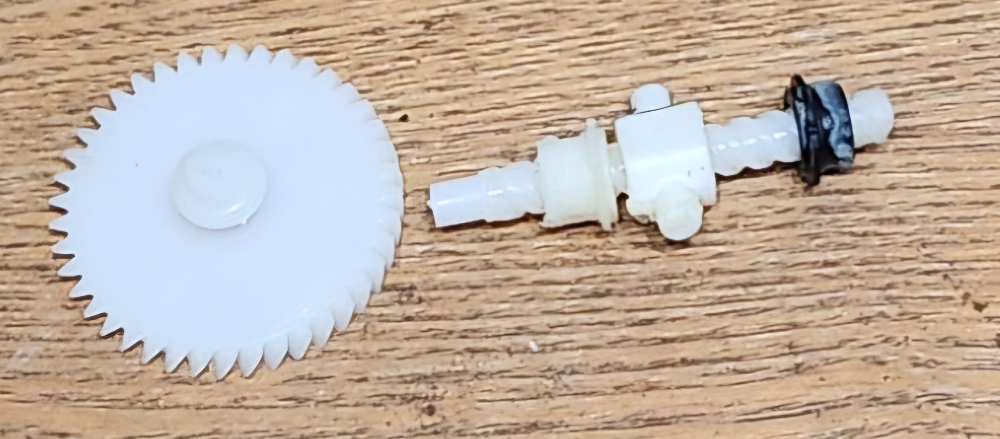
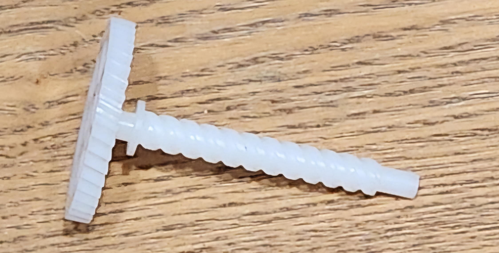
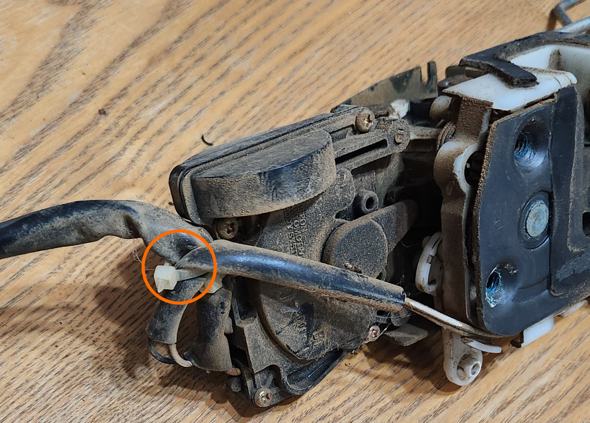
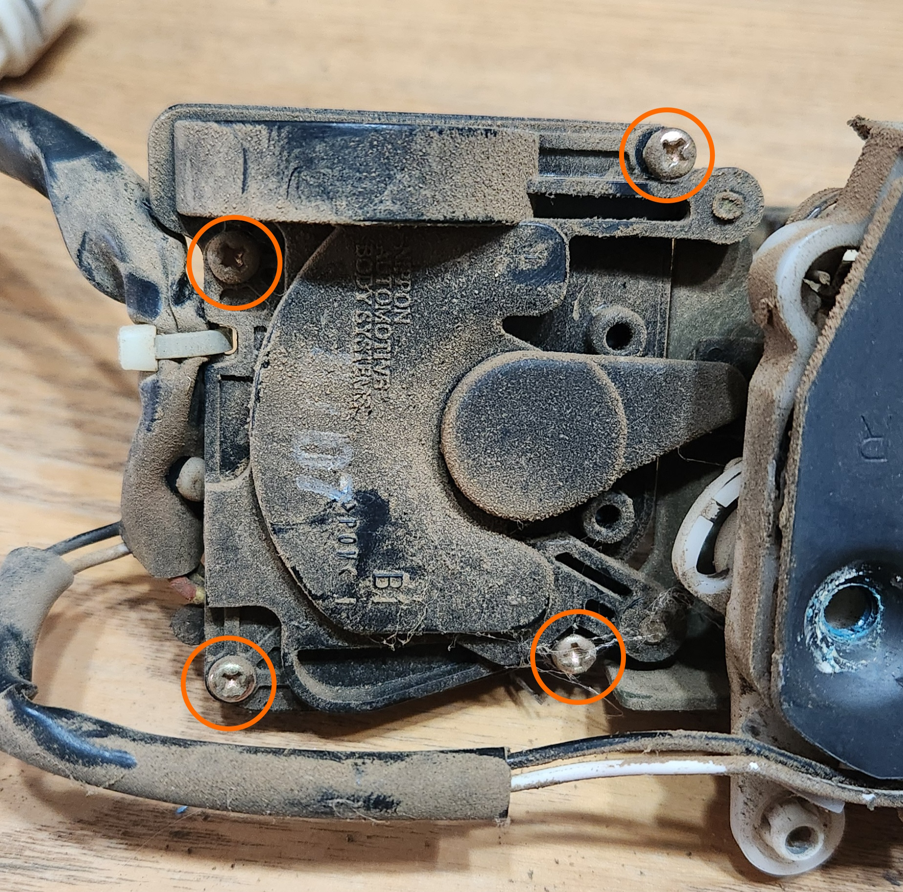
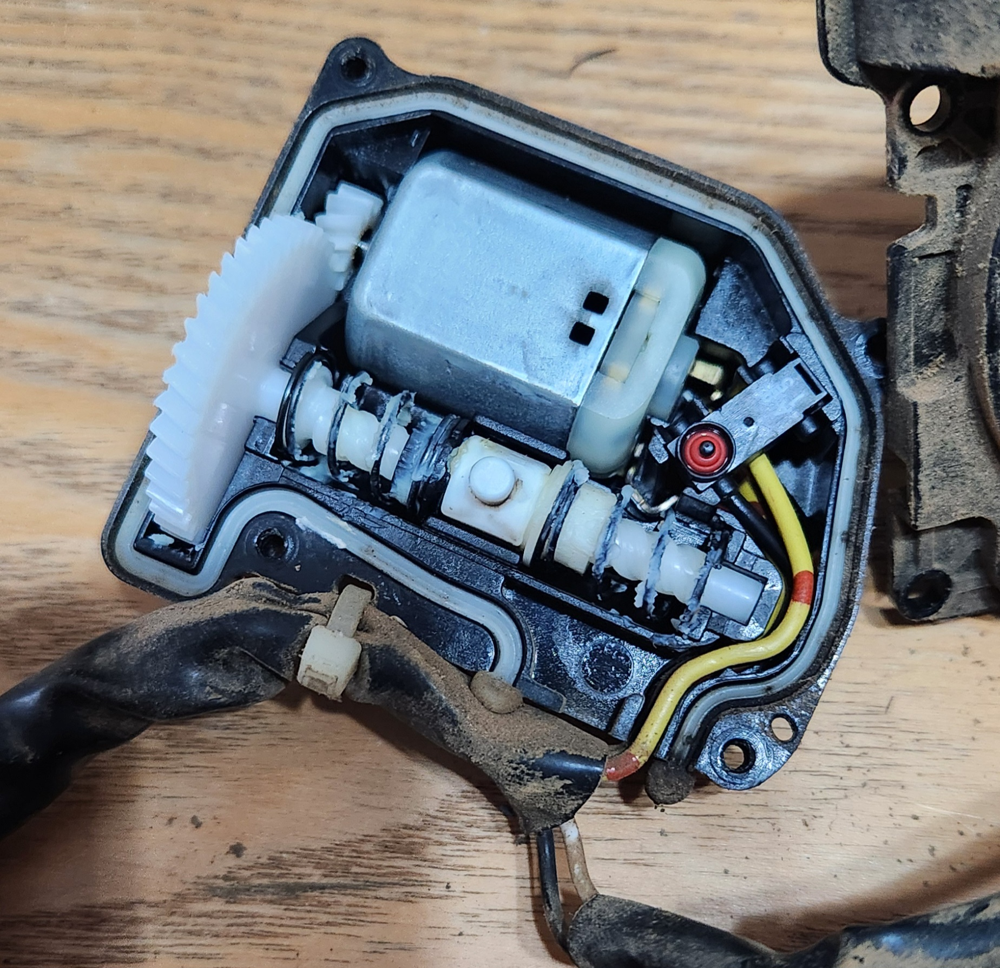
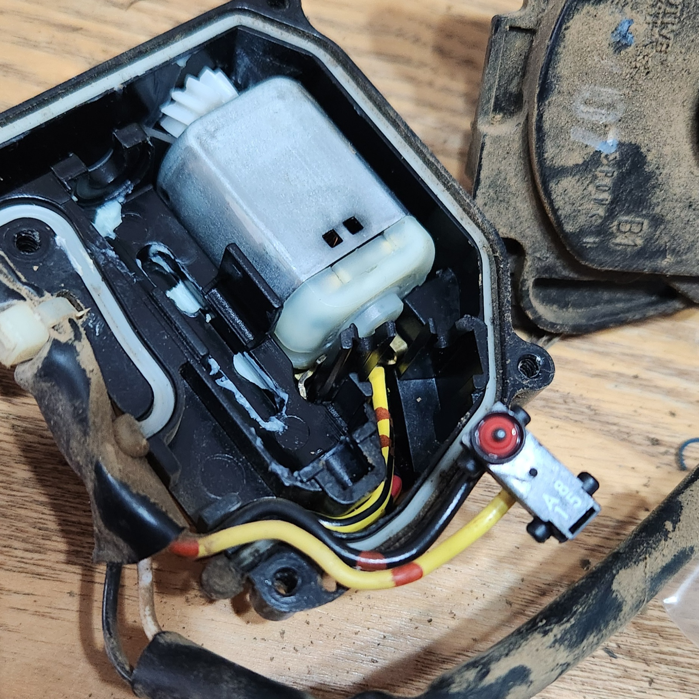
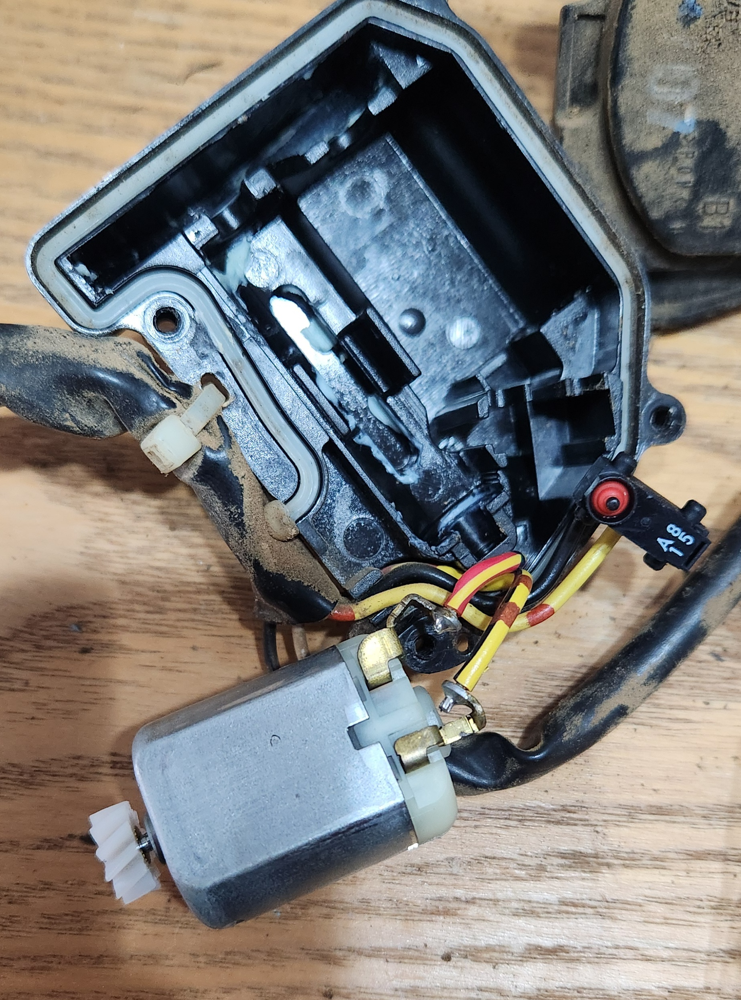
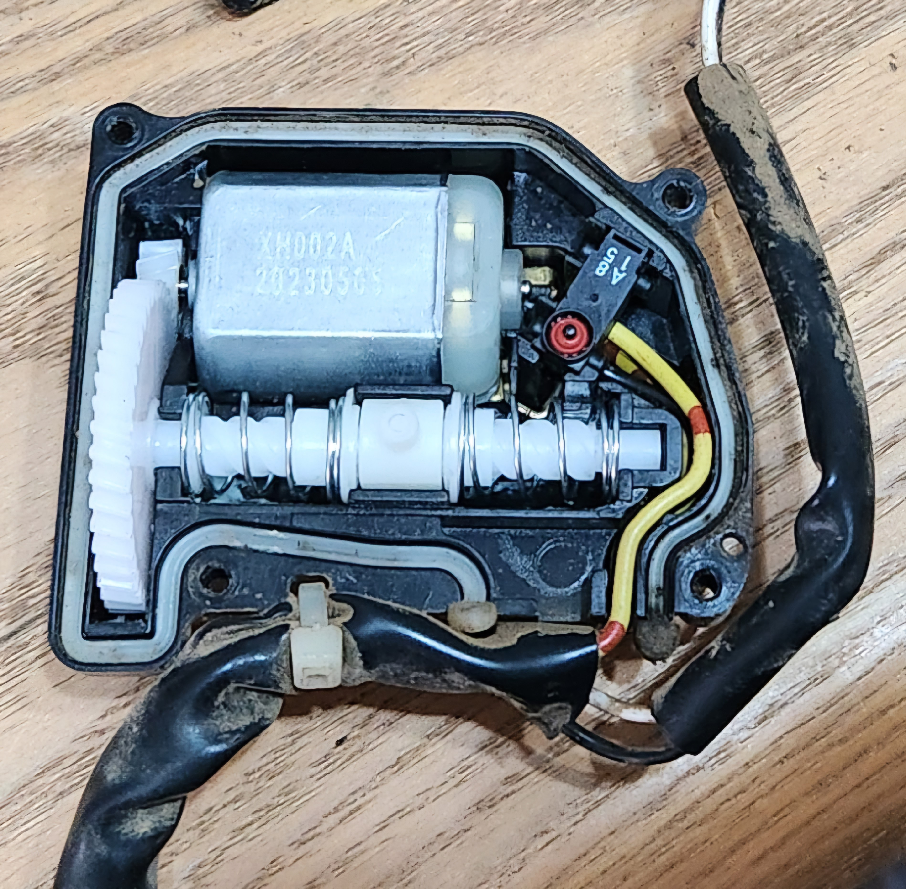

# Door Lock Actuators

A well known issue with 1998-2010 Falcon (AU-BFIII) and 2004-2016 (SX-SZ) Territory models is that the door lock actuators are notoriously weak, and usually the cause of this failure is caused by plastic pieces inside the actuator itself. Thankfully repair kits are cheap* if required, otherwise new actuators can be sourced from wreckers (however if choosing the latter, care should be taken to get one verified working or with a short-term warranty)

*at time of writing in 2024

> Photo of an example of the broken internal actuator component, and the part it is supposed to be respectively

## Replacement
If repairing instead of replacing, you will need:
- a rebuild kit (usually consists of 3 plastic pieces, a spring, and a small motor)
- some grease (general purpose is fine)

> NOTE: if replacing, note that the there is a change in electrical plugs between the AU and other models. Adapter cables were available for a time but are hard to come by, so the accepted advice is to ensure you source AU parts

> NOTE: some photos not available due to working in tight spaces

Follow the steps below to repair or replace the Door Lock Actuator:

1. Remove the door card, noting the following:
    - Manual window winding models will need to have the handle removed first (use a phillips head screwdriver)
    - Electronic window models will need to have the button plate gently removed (use a trim removal tool or a flat head screwdriver)
    - the mirror switch will need to be unplugged (if drivers door)
    - extra care will need to be taken around the door lock stalk (if drivers door)
    
    > NOTE: the locations are different for rear doors but are similar e.g. there are 2 screws along the bottom, one on the back edge, one in the grab pocket, etc.

    

    > photo of screws to remove. Note the one around the side of the door, and be careful of the plastic clips holding in the top and sides in particular

1. If present, gently peel off the sound deadening foam on the inside of the door card, then reach into the hole towards the top of the door and unclip the plastic from the steel rod connecting the actuator to the outside door handle. This can be done by rotating the clip
1. If you are working on the driver door, unclip the additional steel rod connecting the actuator to the door lock stalk the same way as the previous step
1. unplug the electrical connector to the lock actuator. Note that the plug is actually clipped into the door, and can be unclipped from the door to make unplugging easier
1. unscrew the 3 bolts holding in the lock actuator to the striker part of the door. Note this is either a phillips head bolt, or a Torx head bolt, depending on the series of Falcon it is

    

    > photo of the striker bolt locations. note that they are prone to rounding out as they are especially exposed to the elements

1. remove the lock actuator from the door. If replacing the actuator, perform the reverse of all listed steps to this point with the new actuator
    > NOTE: while removing, disengage the cable running from the actuator to the inside door handle by rotating the steel cylinder end on the actuator. This is easiest done with the actuator almost out of the door

    

    > Remove the steel inner cable from the plastic fitting in the actuator, by rotating to the shown position and pulling towards you through the keyed hole. Note that you'll need to push the cable sleeve out of the steel housing first (see bottom of image)

1. if repairing, move the actuator to a flat surface and cut the outer-most zip tie holding the plug wiring in place

    

    > photo of what to cut. You can cut the other zip tie also but it is not required

1. remove the 4 screws holding in the back casing of the actuator electronics
    
    

    > remove these 4 screws

1. remove the plastic components and springs from the housing. If you are also replacing the motor, remove the driver door electrical switch (if present), gently lift the motor out and pry the 2 small spade connectors using a small screwdriver or a fingernail, and place the new motor in the same location as the old one was.
    
    
    
    

    > photos of the step by step process of removing the driver switch (if present), and the motor

1. apply a thin layer of grease to the bottom of the housing while exposed (where the plastic was), being careful to avoid touching the spade end connections
1. pre-assemble the parts onto the stalk of the worm gear in the following order (from cog to end):
    - spring (can go over lip near cog end, but will need to be compressed on placement later)
    - stopper (with cylinder end inside spring)
    - pin ring
    - stopper (with cylinder end facing towards end of stalk)
    - spring (will be longer than assembly, will need to be compressed on placement later)

    

    > visual representation of the order the parts go in
    
1. carefully compress the springs and place the assembly into the actuator housing, ensuring that:
    - the pin ring is sitting central in the square plastic housing
    - the cog on the end of the worm gear is sitting in the teeth for the motor properly
    - the spring on the cog end is sitting on the black plastic **before** the lip in the gear
    - the pring on the far end is sitting inside the assembly securely

    

    > complete assembly photo after pressing into the housing. nothing should fly out from here, but be careful when pressing the plastic cover over the top so as not to disturb the inner workings
    
1. apply a moderate amount of grease to the:
    - cog (put a little on and spin the cog back and forth to lubricate the motor)
    - the spring (mostly near the stoppers)
    - the pin ring
1. reassemble the back of the housing casing and zip tie the electrical connectors back to the plastic backing, and reinstall the actuator back into the car, ensuring:
    - that the inside door handle cable is installed back to the actuator before inserting into the door completely
    - you screw all 3 bolts on the striker
    - the plastic clip for the steel rod for the door handle and the door lock stalk (if drivers door) are re-engaged
    - the electrical connector for electrical activation is reconnected
    > NOTE: now is a good time to test the door, before reinstalling the door card
1. reinstall the door card and window winder handle/panel
1. done