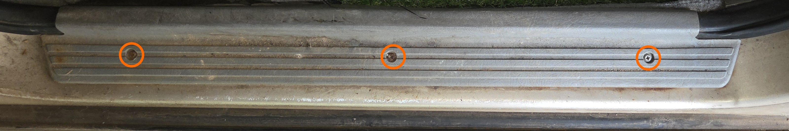
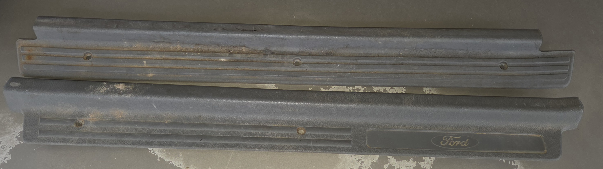
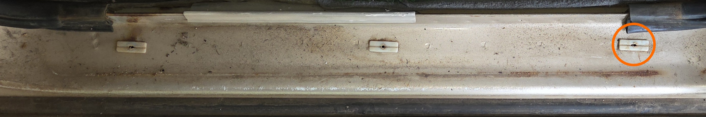
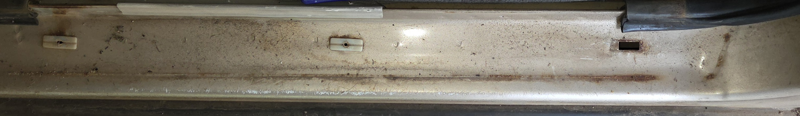
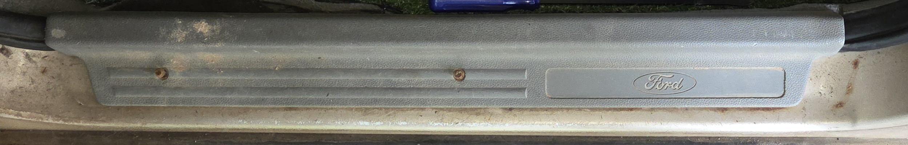

# Door Scuff Plates

## Removal/Replacement

Removal of the scuff plates is simple, simply remove all visible screws from the top of the plate, and pull up gently to remove. on AU Falcons, there are no other tabs, however the scuff plates themselves can be brittle due to age

> Picture of the screw locations for the front passenger door. The driver side door is a mirror of this, and the rear scuff plates (on sedans and wagons) are very similar but only contain 2 screws

## Screw replacement

suitable replacement screws for the scuff plates have been identified as 10G X 16mm Metal Screws. Note that galvanised, non-tapping screws are recommended to prevent rust and unnecessary damage to plastic tabs respectively, however self-tapping screws can be used, provided care is taken with screwing in the screws required, to make sure they go in straight rather than boring a new hole in the plastic tabs underneath

## Retrofitting BA/BF Falcon Scuff Plates into an AU Falcon (Front plates only)

BA or BF Falcon scuff plates can be fitted to an AU Falcon with minimal modification, making it appealing for aesthetic reasons, broader aftermarket support (specifically the installation of custom badges) or simply due to a larger availability of intact factory parts as the AU Falcon parts become older and harder to come by. The following information can be used as needed for retrofitting a B-series scuff plate to an AU Falcon

> Picture of the front passenger scuff plate, from SPUD (top) and a B-Series associated vehicle, [Roadkill](../../Disclaimer.md#associated-vehicles) (bottom)

### Notes on procedure
* This is a possibly destructive procedure due to handling brittle plastic components
* Rear scuff plates are not included, as they did not change the mounting method between AU-BFIII
* This is not a 1:1 replacement, as the external look of the scuff plates are different between series. Replace as pairs when possible

### Instructions

Follow the instructions below to replace the front door scuff plates of your AU Falcon with ones from a B-series Falcon

1. [Remove the AU Falcon scuff plate](#removalreplacement)

1. Locate the rear-most plastic tab, and gently pry it from the steel underneath

    > This may break the part due to the plastic tabs having been exposed to the elements. A Trim removal tool is recommended for the best chances of removing the tabs in one piece
    {: .block-note}

    
    > Picture of the plastic tab to remove on the passenger side door, taken from the perspective of outside of the vehicle. The driver side door is a mirror of this

    
    > Picture of the door, after the rear-most plastic tab has been removed

1. Place the B-series replacement scuff plate into position, ensuring that the rear tab on the new scuff plate engages with the rectangular hole in the door.

1. use 2 of the 3 screws removed in step 1 to attach the front 2/3 of the B-series scuff plate

    
    > Picture of a front passenger scuff plate from a BFII Wagon fitted into an AU Falcon door

1. Done