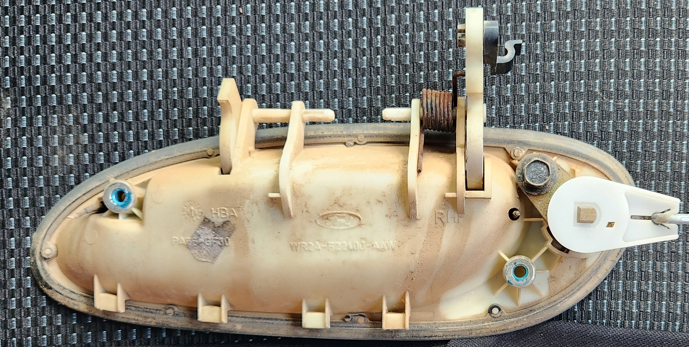
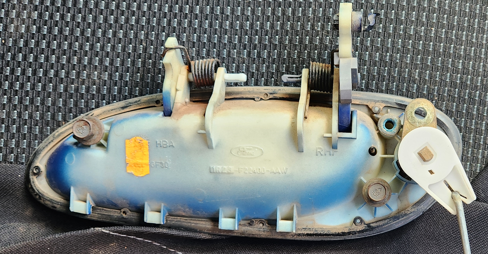
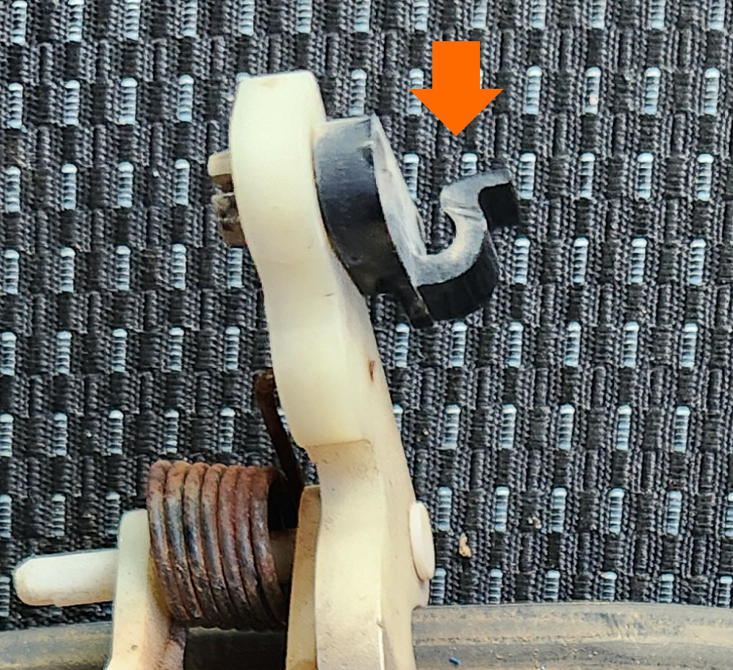
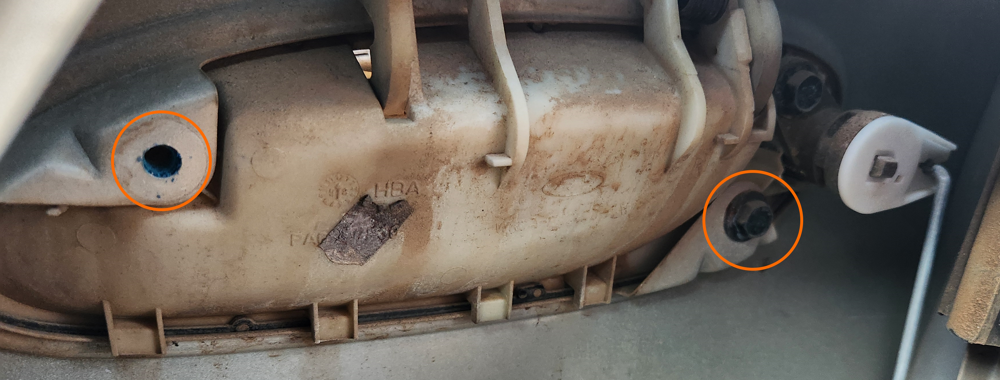
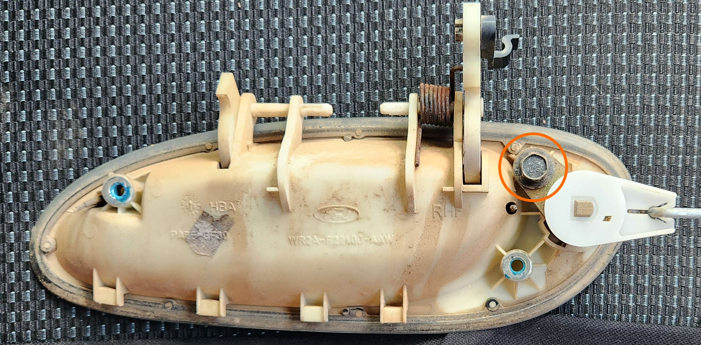
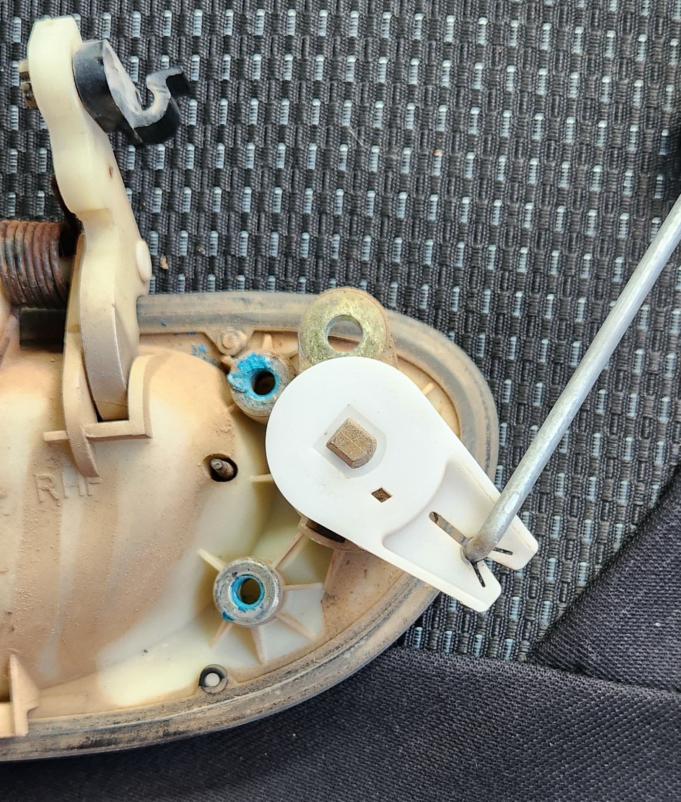
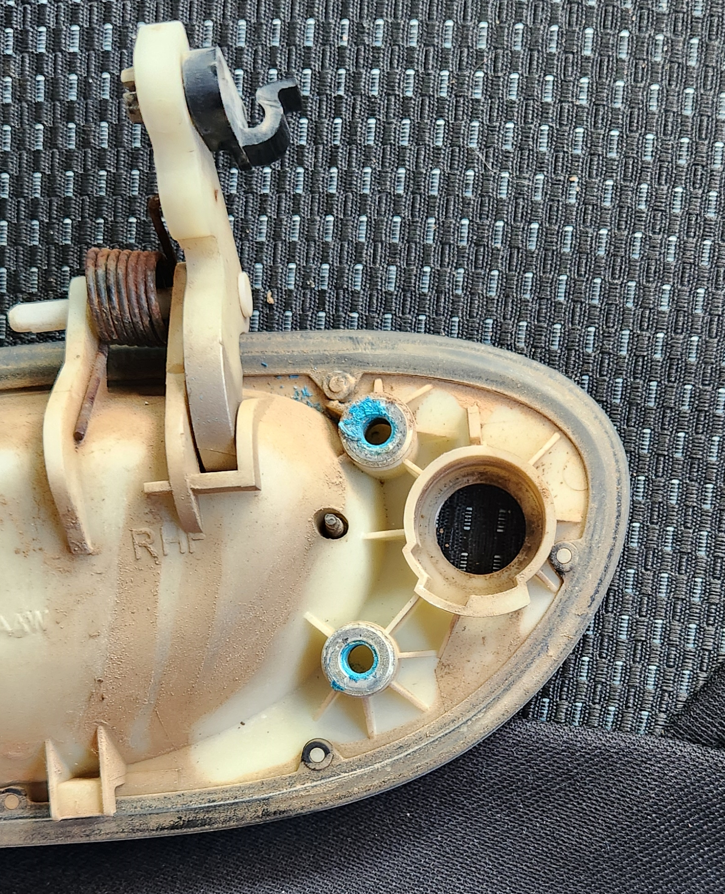

# Exterior Door Handles

The exterior door handles on the AU Falcon are relatively easy to remove and replace if required, however due to their materials, they are somewhat difficult to repair, as they rely on plastic locking pins and relatively thin springs.

## Differences
In some selected models of AU-BFIII Falcons, a second spring was added to the door handles. This is the preferred handle assembly to get if a replacement is required, as a single spring handle **CANNOT** be fitted with an additional spring (as it is missing a plastic tab for holding the second spring in place). Information on the models that the additional spring is present on is scarce, but the recommendation is to look for higher trim models (Fairmont, Fairlane, etc.)

> Photos of the single and dual spring handles respectively. Note that these were both from Forte (S1 and S3 respectively), indicating a change between the 2 models. note where the spring to the left of the S3 handle sits on a plastic indent that isn't present on the S1s

## Replacement

Use the following steps to remove the exterior door handle:

1. Remove the door card, noting the following:
    - Manual window winding models will need to have the handle removed first (use a phillips head screwdriver)
    - Electronic window models will need to have the button plate gently removed (use a trim removal tool or a flat head screwdriver)
    - The mirror switch will need to be unplugged (if drivers door)
    - Extra care will need to be taken around the door lock stalk (if drivers door)

    

    > Photo of screw locations

1. gently peel back the sound deadening behind where the exterior door handle is, and:
    - Unclip the steel rod connecting the handle to the door lock actuator from the *handle* end (the actuator itself does **NOT** need to be removed)
    - (If removing driver door handle) Unclip the steel rod connecting the key hole to the actuator from the *actuator* end

    > The clips themselves are easily removed by simply rotating the clip and pulling out the rod from the hole it sits in, however be careful as these clips are plastic and may break if too much force is applied
    {: .block-note}

    

    > Photo of one of the clips from a drivers door handle (black plastic section). a push in the direction of the arrow will free the rod and allow you to pull the rod from the handle itself.

1. remove the 2 10mm bolts holding the door handle to the sheet steel door assembly

    

    > Bolt locations. Note that the left bolt is removed to show the sheet steel tab both bolts are fastened into

1. pull the door handle through on the exterior side. You will need to gently pull towards the front of the vehicle and up to unmount the bottom clips, and which point you can rotate the handle to feed the spring mount(s) and key hole rod through the door hole

1. (If replacing a driver door handle) remove the single 10mm bolt holding the key hole assembly in place, and rotate approximately 1/8 of a turn clockwise. From this position the key hole assembly should simply pull out and can be replaced by following this step in reverse order

    
    
    

    > Key hole assembly photos before and after turning clockwise, and post-removal. Barrel is able to be removed from the point in the second photo

1. using the new handle, follow all previous steps in reverse to reinstall
1. done