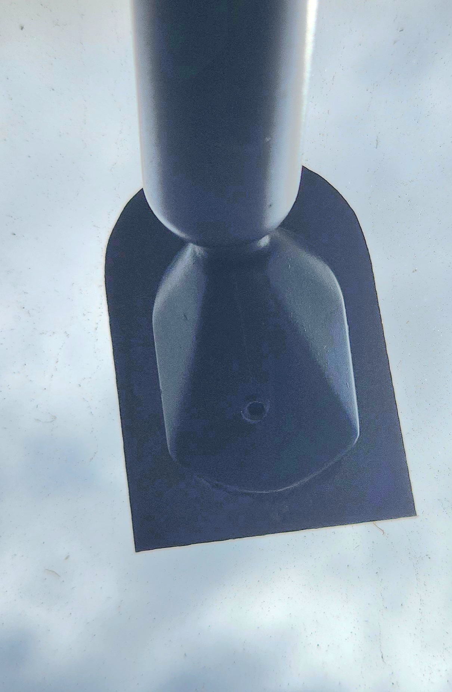

# Interior Mirror

## Differences

While the mounting points for the interior mirrors are the same between series' of AU Falcon, the way to remove them is different depending on the series, explained below

### Series 1 Removal/Replacement

The S1 mirrors can be easily removed in comparison to their newer counterparts. Steps to remove are below:

1. (optional) wait for the car to be as cold as possible around the window. Recommended that this job is done in winter or during nighttime if possible
2. remove the grub screw from the base of the plastic housing
    
    

    > Picture of the grub screw location to remove in the Series 1 AU Falcons. Note that this is a 2mm Hex head and as such requires a 2mm allen key to remove

3. gently slide the plastic housing from the steel on the window by wiggling the assembly back and forth a little. you may need to use a light tap from a small rubber mallet, however this is only to be used if absolutely required
4. to reinstall or replace, reverse all previous steps
5. done

### Series 2/3 Removal/Replacement

The Later models are much higher risk to remove, and as such are not a job to be done lightly. If possible, it is advised to replace with a aftermarket replacement or Series 1 mirror if possible to avoid issues in the future. To add insult to injury, these mirrors are the same as all Falcons and Territory models from the AUII onwards, and can be prone to rattling as they age due to the lack of a grub screw or similar. Steps to remove are below:

> NOTE: lack of pictures as project only involves S1 vehicle

> NOTE: Professional removal recommended. Windscreen repair shops may even do this for free if asked nicely

1. (optional, but recommended) wait for the car to be as cold as possible around the window. Recommended that this job is done in winter or during nighttime if possible
1. use a small implement to press the steel tabs on the assembly side of the mirror up and away from the steel mounting point. Known implements that may work are:
    - a large flat head screwdriver, twisted to wedge
    - a pair of medium sized hook nosed pliers
    - a small piece of dowel
1. while holding the implement in place, use a small rubber mallet to hit the mirror assembly with low to moderate force and bring it up and towards the back of the car from the window. Keep going until the clip is cleared and you no longer need the implement sitting in the base of the assembly
1. remove the assembly by rocking the base back and forth gently while pulling up and back
1. to reinstall or replace, gently push the new housing onto the metal clip, wiggling back and forth and using a small rubber mallet only if absolutely necessary. You should stop when the bottom of the base is past the end of the steel mounting point, and there is a click heard from the retaining clip
1. done

<!--TODO add pic of S3 mirror-->