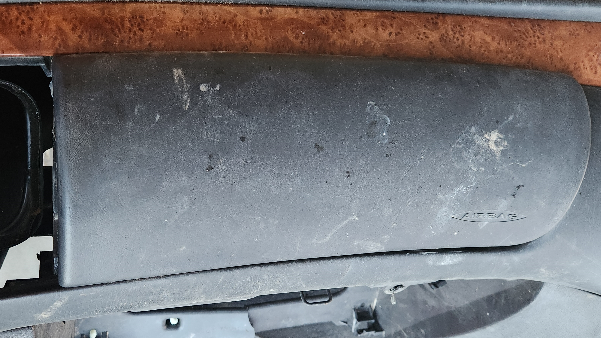
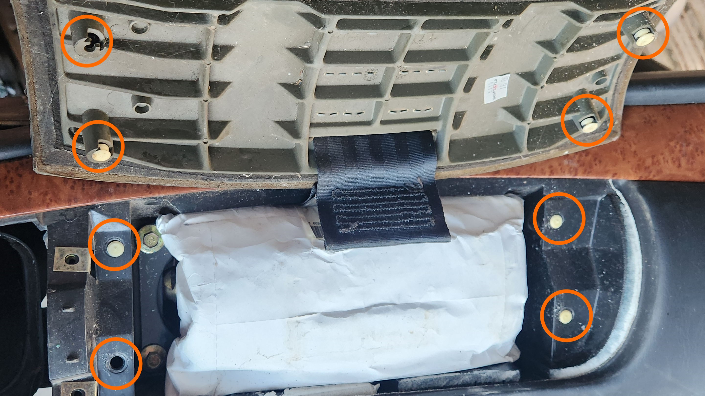
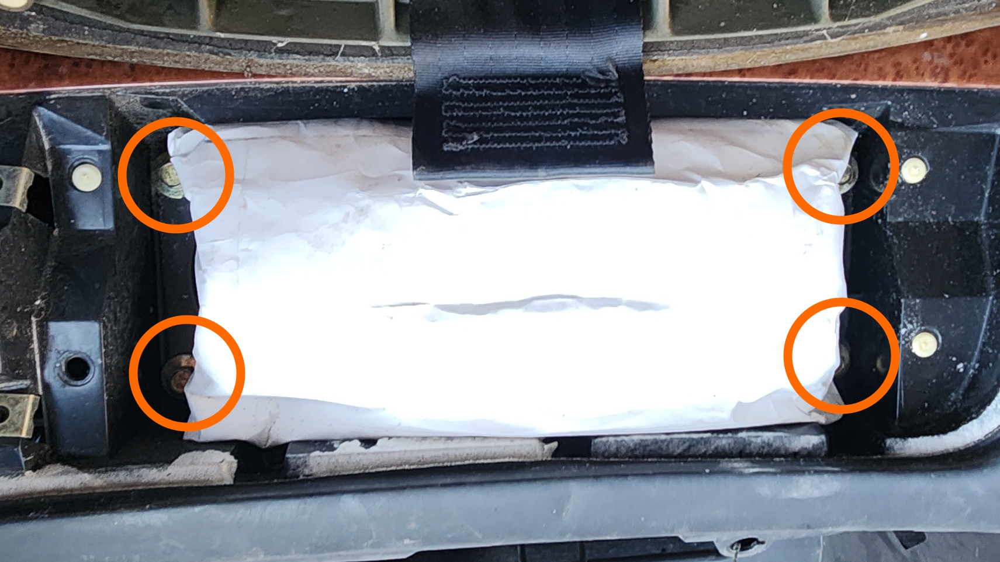
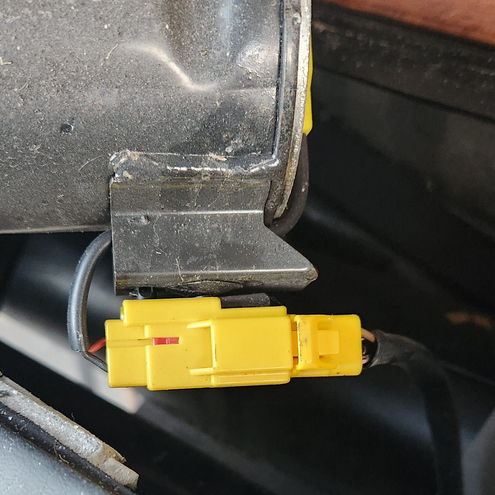
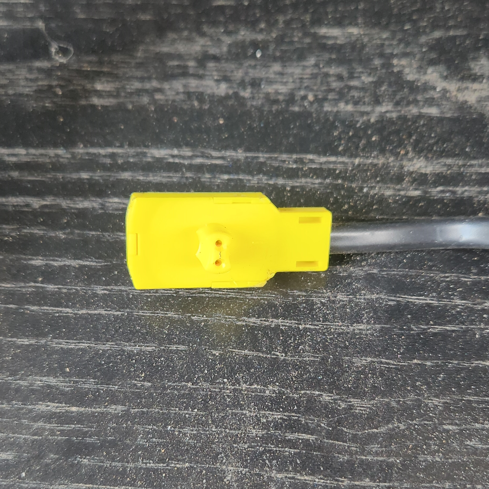
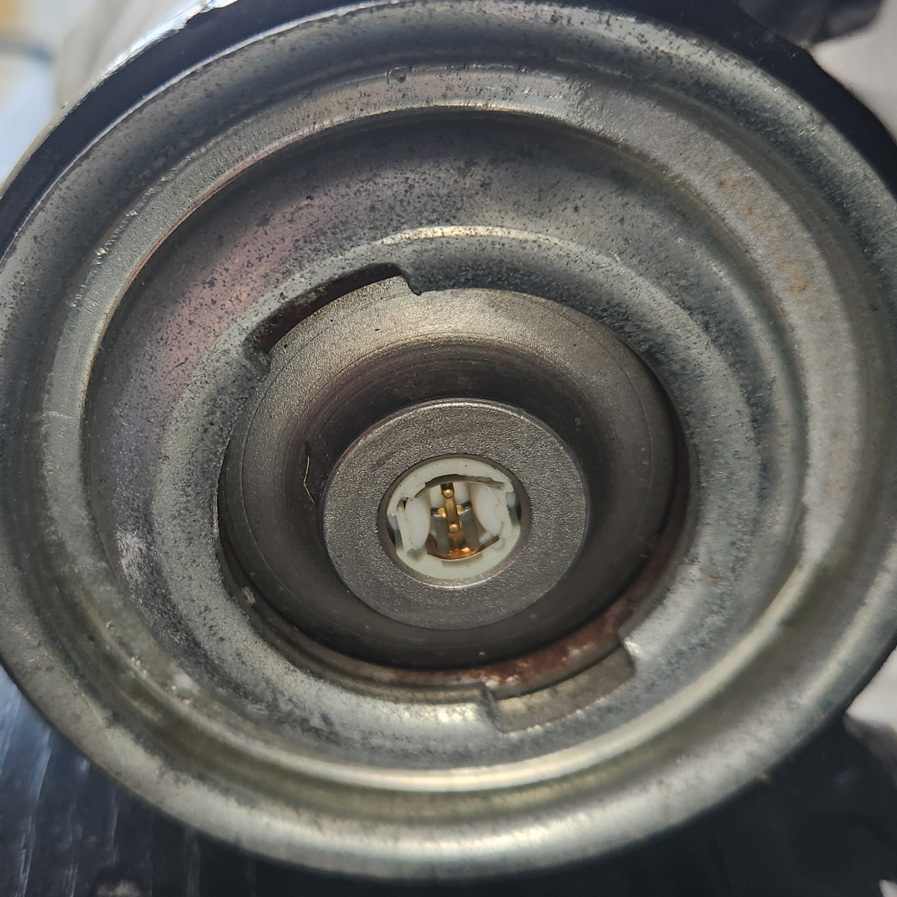
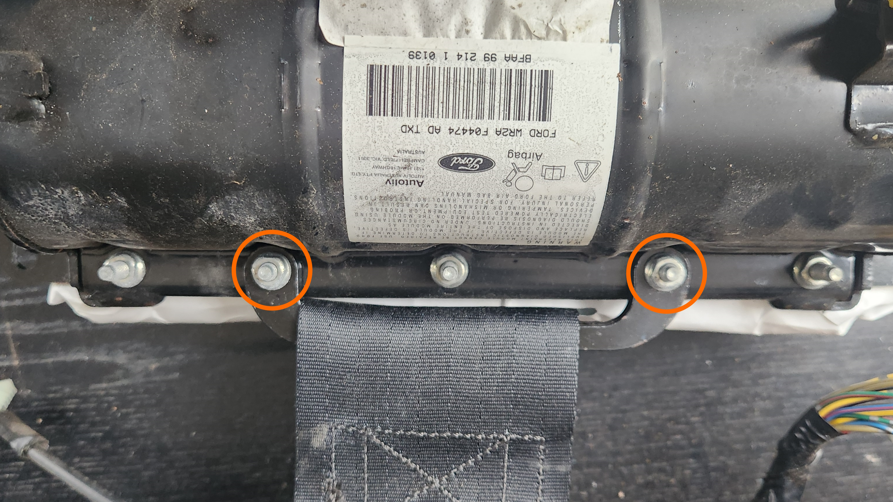

# Passenger Airbag

The passenger airbag can be removed and replaced using the instructions below if required:

> ***DISCONNECT THE BATTERY*** before performing any of these steps to avoid injury
{: .block-warning}

> These instructions were created using a water damaged Fairmont dash, but instructions are the same for other models
{: .block-note}

1. ***Disconnect the battery*** for at least 1hr (preferably overnight)
1. Remove the airbag cover by breaking the 4 tabs found on the inside of the panel itself

    > This step is required unfortunately, as there is no known way to remove the airbag without breaking either these tabs, or the dash/panel itself. Replacement tabs should be purchased as required, noting that used prices will only increase due to age and destructive requirement for removal
    {: .block-note}

    
    

    > Pictures of the airbag panel pre and post removal respectively. Note the locations of the clips

1. Undo and remove the 4 10mm bolts holding the airbag into place

    

    > Picture of the location of the bolts in the airbag

1. Gently pull the airbag from the dash, noting that the electrical connector for it is on the Driver side of the airbag assembly. Once removed, unplug the small yellow connector from the metal housing

    

    > Picture of the secondary connector on the airbag. Note that you can simply push the tab down and pull the plug from the assembly

1. (Optional, depending on if the small wiring loom is present on the assembly) The smaller, yellow connector on the driver side of the cylindrical section of the metal housing can be removed also, allowing for the removal of the short harness between the metal body and the airbag itself. Simply pull the small yellow connector out of the airbag itself, and push the connector disconnected in the previous step towards the passenger side to release it from the tab on the metal body

    
    

    > Pictures of the Loom Connector and the Airbag connector respectively

1. (Optional, depending on if the airbag cover colour matches the original dash) Flip over the Airbag assembly and remove the second and second-last nuts on the rear. Note that these nuts are some form of triangular security nut, but due to the low torque applied a shifter or vice grip pliers can be used to loosen the nut to the point where it can be removed by hand. Once removed the same can be done to the replacement airbag in reverse to install.

    

1. To reinstall, follow previous steps in reverse

1. Done