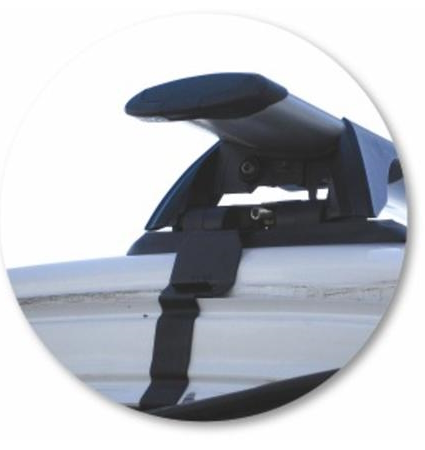
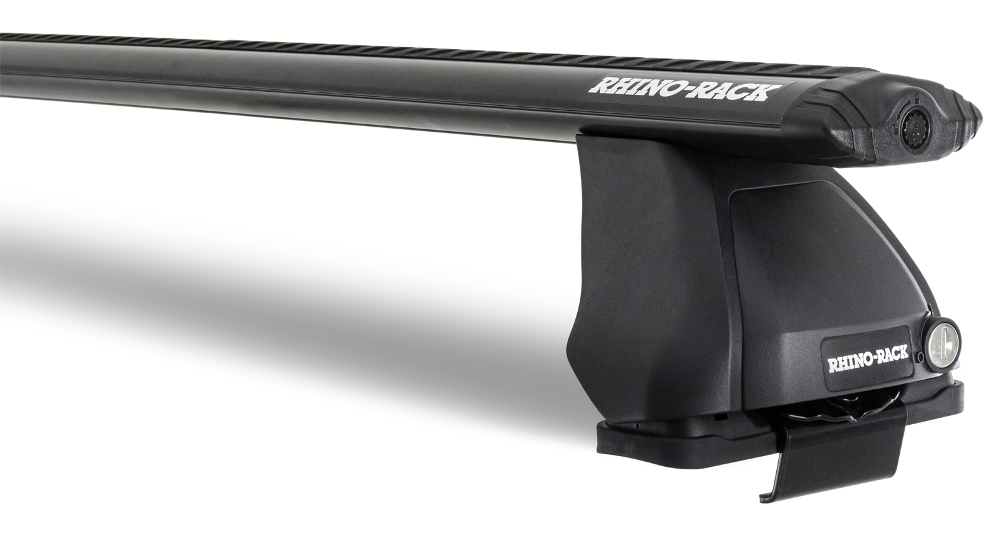
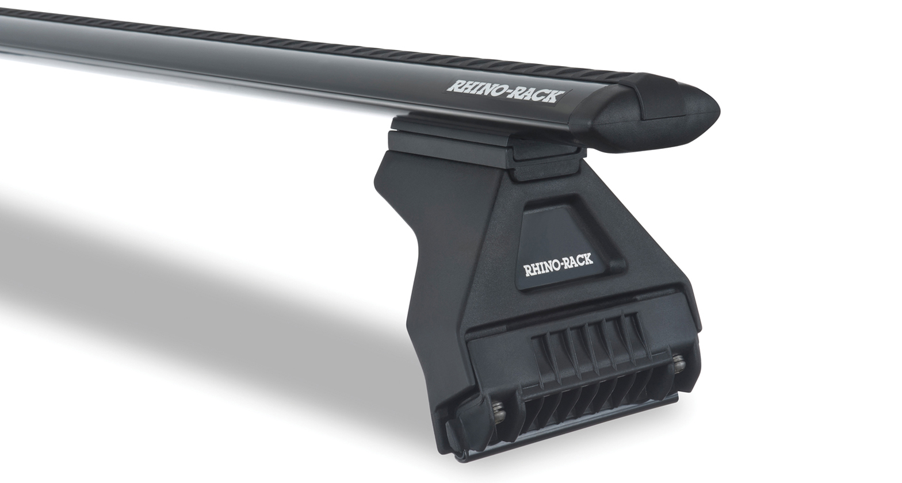
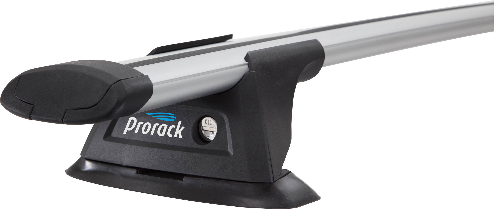

# Roof Racks

Roof racks for the AU Falcon is a topic that is limited due to the lack of options available. Any information found however has been added here:

> Information Sources:
> - [Prorack](../../Credits.md#sources)
> - [Rhino Racks](../../Credits.md#sources)
> - [eBay](../../Credits.md#sources)
> - Physical Inspection (1x [Sedan](#sedans), 1x [Wagon with factory rails](#station-wagons-with-factory-rails))
{: .info-sources}

## Sedans

The sedan models of AU Falcon do not have any mounting points for roof racks, and as a result the only options are door mounted clip style mounts. Thankfully these roof racks are readily available, and even better, the roof racks for BA/BF Falcon Sedans also fits the AU Falcon, extending the search further.

> Product image of a package product from [Prorack](../../Credits.md#sources) which contains a `S16B` roof bar and `K164` fitting kit

> Product image of a package product from [Rhino Racks](../../Credits.md#sources) with the product code of `JA1852`, which contains a `DK056` fitting kit, a `RLKVA` leg set, and a `VA118B` roof bar

## Station Wagons (Without factory rails)

Station wagons not fitted with OEM rails are limited to a similar range of clip-on style roof racks. These roof racks are also compatible with BA-BFIII station wagons due to the identical outer body shape, similar to the [Sedans](#sedans). Depending on the specific manufacturer of the roof rack, the mounting kit may even be the exact same as their Sedan variant

> Product image of a package product from [Rhino Racks](../../Credits.md#sources) with the product code of `JA1852`, which contains a `DK056` fitting kit, a `RLKVA` leg set, and a `VA118B` roof bar

## Station Wagons (With factory rails)

Certain models of AU Falcon Wagon were fitted with the same roof rails as their later BA-BFIII counterparts, and similarly to these later models use a gutter mount system. While these rails are relatively rare on the AU Falcons, they are confirmed on at least 1 AUIII and one AUI vehicle to date.

Due to the fact that these variants can use standard gutter mount roof racks, you can fit any adjustable length racks. Popular vehicle models where cheap roof racks are available at the time of writing include:

- 1998-2024 Suzuki Jimney
- 2005-2019 Toyota HiAce (Low roof preferred)
- 1985-2002 Toyota LandCruiser (various sub-models depending on year)
- 1979-2000 Nissan Patrol

Failing this, or if a model-specific option is preferred, [Rhino Racks](../../Credits.md#sources) appears to be the only roof rack manufacturer specifically selling Ford Falcon Station Wagon roof racks, however even this is hidden as being compatible with BA-BFIII Falcons and does not specify AU Falcon compatibility, confusing matters.

> Product image of a package product from [Rhino Racks](../../Credits.md#sources) with the product code of `JA2111`, which contains a `VA-FK1` fitting kit, a `RL110BA` leg set, and a `VA126B` roof bar

## Utes

Much like the [Sedans](#sedans) and most standard [Station Wagons](#station-wagons-without-factory-rails) within the AU Falcon model, the Ute body style also does not come with standard roof rack mounting points. In addition to this, you can generally only install one roof rack due to the short depth of the roof itself, meaning that a better option would be to use something similar to Sports Bars inside the original tub, or a custom roof rack solution on a canopy. Similar to the other variants, any roof racks found are compatible with BA-BFII vehicles

> Product image of a package product from [Prorack](../../Credits.md#sources) which contains a `S16Half` roof bar and `K156` fitting kit