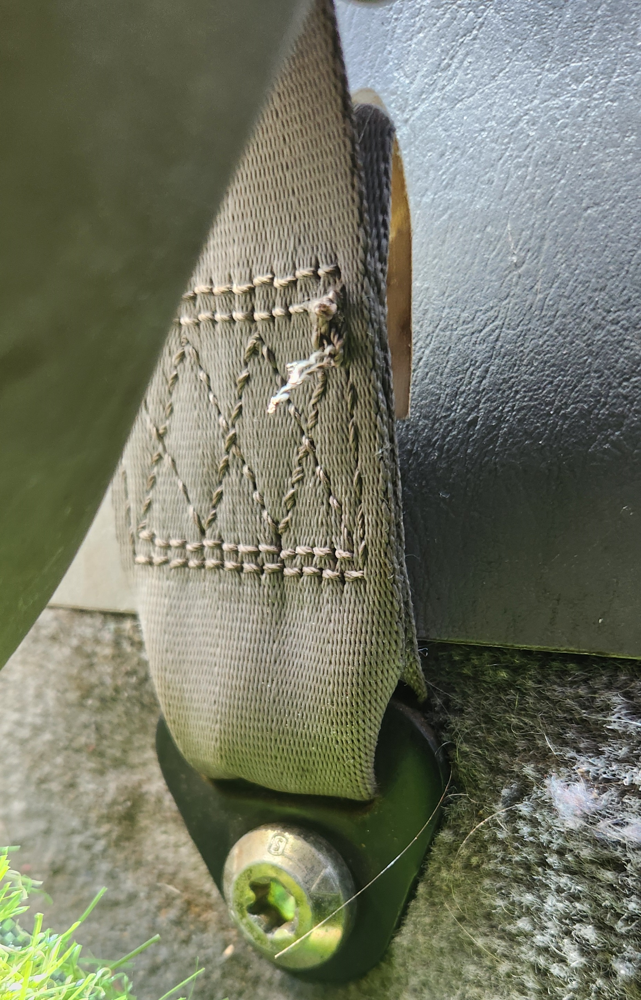
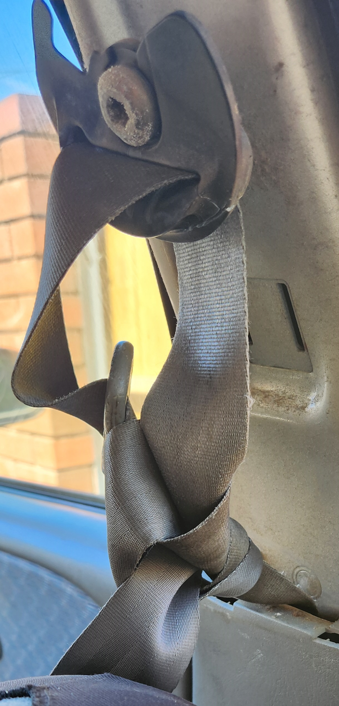
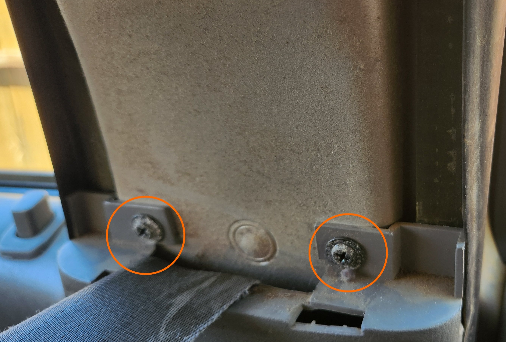
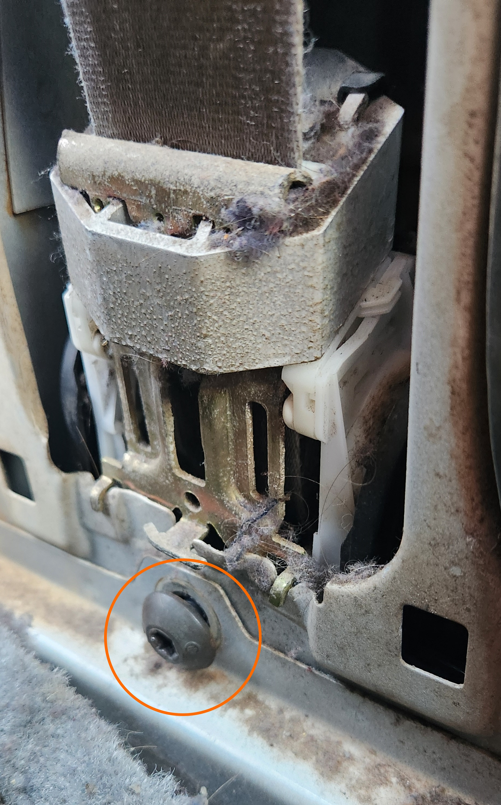

# Seatbelts

The seatbelts in the AU Falcons are largely easy to replace but require a single tool that may not be found in a standard toolbox, a T50 Torx socket. a 3/8" drive socket and ratchet is recommended as the bolts can be easily accessed without the ratchet fouling on the seat or without having a lack of leverage from a short handled 1/4" ratchet.

## Replacement

> photos not included as job last completed before project started
{: .block-note}

<!--TODO add photos to basically this whole page-->

1. remove the single T50 bolt holding the end of the seatbelt to the floor
    

    > The first T50 bolt. Note that there may be a small round plastic cover over this bolt, however this particular vehicle did not have it
    
1. while holding the end of the seatbelt away from where the bolt was, thread the seatbelt through the upper B-Pillar trim plastic. Try to keep as much tension on the seatbelt as possible while doing this, as it makes the process easier
1. (optional) tie the end of the seatbelt to a section of the seatbelt inbetween the upper anchor and the lower B-Pillar plastic trim. This will prevent the seatbelt from retracting too far and too fast upon removal, potentially saving the mechanism if you wish the reuse it

    

    > The type of knot to put into the seatbelt. This is simply to stop the seatbelt itself from retracting far enough and fast enough to break the retraction mechanism later

1. unscrew the 2 upper screws on the lower B-Pillar trim piece using a phillips head screwdriver, and gently pull the plastic from the chassis, noting that it is help in with 2 large metal clips towards the bottom. The lower trim can them be removed by unclipping the 2 metal clips towards the bottom of the plastic, and then sliding the assembly up until the lower plastic tabs come free of the steel body

    

    > Locations of the 2 phillips head screws to remove from the lower B-Pillar trim pieces

1. using the T50 socket, remove the bolt holding the retraction mechanism to the chassis.

    

    > Picture of the T50 bolt to remove for the retraction mechanism end of the seatbelt

1. using the T50 socket, remove the bolt holding the top anchor for the seatbelt in place.

    

    > Picture of the final bolt to remove for the upper anchor of the seatbelt. Note that if you have a height adjustable seatbelt mechanism, there will be additional plastic around this, however nothing should need to be removed other than the bolt.

1. remove assembly as a complete unit  with seatbelt, anchor, and retraction mechanism
1. to replace, simply follow all steps in reverse, making sure to tighten all bolts moderately

    > use red thread locker on the T50 bolts if available
    {: .block-note}

1. done

<!-- TODO test and report this
### Additional Notes

The following are notes for modifications to the seatbelt mechanism, mainly regarding the fitting of non-standard seatbelt assemblies:

- if replacing with a "universal" seatbelt, you may need to modify the upper B-Pillar trim plastic to fit the upper pulley in behind. As the fraying of the original seatbelt is [usually caused by this](#common-issues---upper-b-pillar-plastic-trim), an alternative to finding a good condition original plastic piece is replacing it with a "universal" seatbelt kit and using a rotary tool to simply cut a larger hole into the plastic, allowing for free movement of the new pulley. Alternatively you can simply remove the trim piece altogether, however this is not recommended as part of the B-Pillar upper trim piece contributes to the holding up of the headliner.
- while the bolts holding the static end and upper pulley of the seatbelt are T50 Torx headed with a 7/16" UNF thread, the bolt holding the retraction mechanism is a M10x1.5 thread. This can be easily remedied if using a "universal" seatbelt, as you can use a nut retainer bracket with a 7/16" UNF threaded nut, however these retainers can be hard to come by, with the only known seller at time of writing being [SeatSafe](../../Credits.md#collected-information-primarily-product-listing-images). If going this route, the recommended thread length is 1"
-->

## Common issues - Upper B-Pillar plastic trim

A common issue with older AU Falcons is the wearing of the seatbelt hole in the B-Pillar plastic trim. This appears to happen due to the plastic being prone to wear from the seatbelt rubbing, and if left unchecked can cause premature fraying on the seatbelt, which is a safety concern and Roadworthy requirement (where applicable). Recommendation is to replace the trim with a similar part, noting that earlier AU Falcon models did not come with an adjustable height seatbelt top anchor, however assuming that is uneconomical or not viable due to lack of parts available, please see below for a "poor-mans plastic welding" fix that can be used

### B-Pillar trim - "Plastic Welding"

#### Requirements
to complete this job you will need the following:
- Large soldering iron with screw-in tip
- any bolt or screw that can fit inside the shaft of the soldering iron (optional, provides a disposable tip as plastic is hard to remove from a soldering tip)
- bolt-cutters
- cable ties (light colored preferred)
- N95 mask (for plastic fumes)

#### Steps
1. (optional) using the bolt cutters, cut the head from the bolt or screw. Try to have as clean of a cut as possible as this may improve the surface of the finished repair
1. (optional, if completed step 1) place the bolt or screw in the soldering iron with the cut edge facing outwards
1. use some tape to cover the outside of the plastic trim where the plastic is cut away. Flip over the assembly and place short cuts of the cable ties across the inside of the cut
1. wear your N95 mask and heat the soldering iron to high heat. apply the soldering iron gently to the cable ties, allowing them to melt and flow into the cut. Note this may take some coaxing to get right but it is possible
1. cut and remove any unmelted or unneeded cable tie material, and use a high grit sandpaper to further smooth the edge of the cut where it used to meet the seatbelt hole
1. (optional) paint over repaired area or use the opportunity to respray the entire trim piece to your favorite color.
1. done