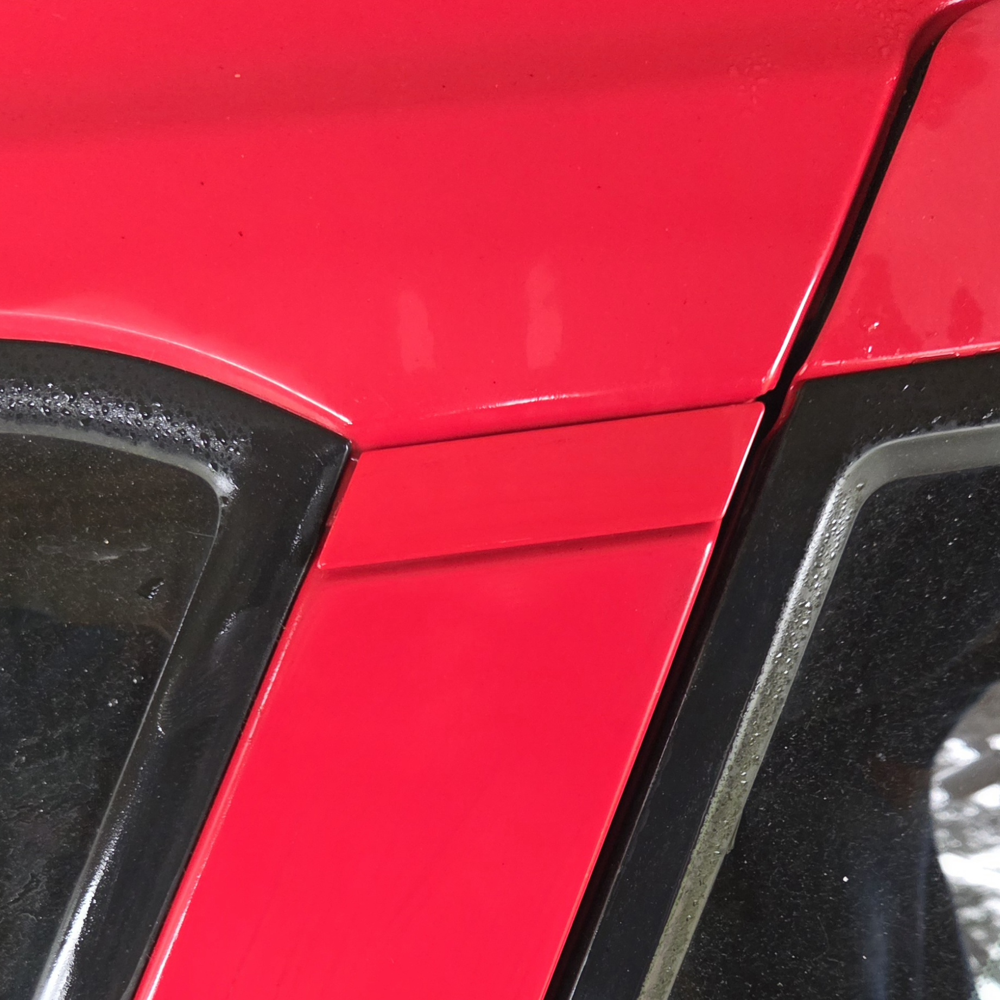
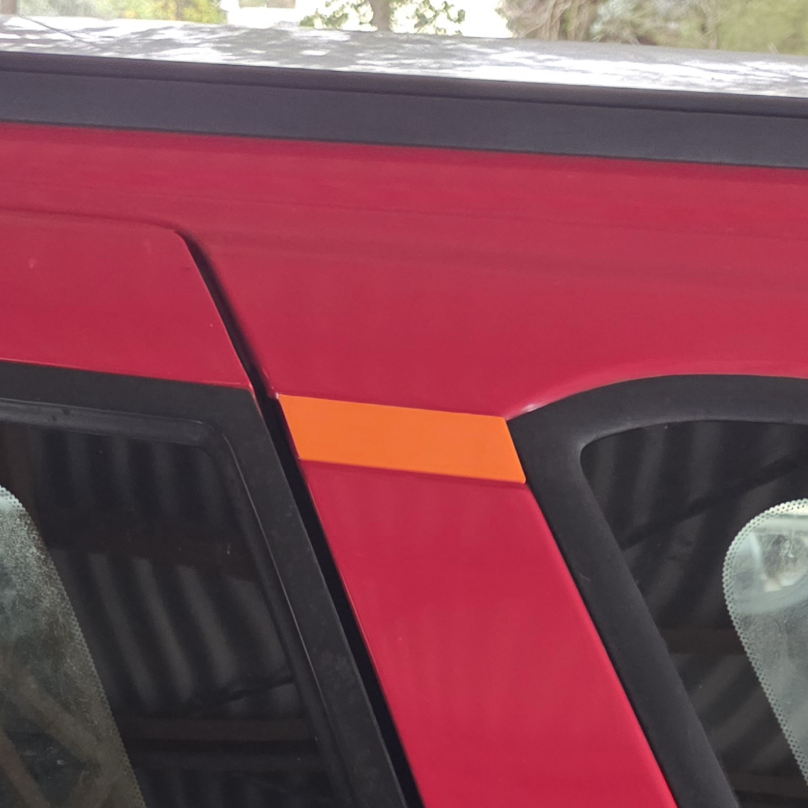

# Station Wagon Exterior C-Pillar Trim

> This section is not related to [SPUD](../../Disclaimer.md#spud) as it is a Sedan body type, but this has been created using another car, a Series 3 Forte SR Wagon, owned also by the author of this project

While a very minor part of a particular body type of the Ford Falcon, the exterior C-Pillar trim for the Wagon body can fall or be knocked off quite easily with age. By extension, these pieces can be broken easily as they are made of plastic and are not secured using any screws or clips (only 2 locating pins and adhesive foam)

## Location

This trim piece sits behind the rear doors on the exterior of the vehicle, on both sides. It serves no functional purpose, other than to hide the seam between the roof and the C-pillar itself.

> An image of one of these exterior trim pieces, on an AUIII Forte SR Station Wagon

## 3D Printing a replacement trim piece

Should you need a cheaply created replacement for these trim pieces, or you require a base for any potential modifications you would like to make to this, a 3D model can be found on GitHub, [HERE](https://github.com/digi-ron/AU-Falcon-Wagon-C-Trim), however this model is released under an open license and can be modified using any 3D modelling software capable of importing STL files.

> This model is made completely from scratch due to the lack of complexity in the original part. This part should be accurate and has been test fit on a station wagon as a precaution
>
> - [Trimble Sketchup Make 2017](../../Credits.md#software--hardware) (modelling software)
> - [Ender 3 V3 KE](../../Credits.md#software--hardware) (3D printer):
>   - Material used: ASA
>   - Supports: no (printed face down)

> In the interest of this projects vision, the published STL files are stored on this website as a backup [HERE](./wagon-trim.zip). *Last synced - 03/06/26*
{: .block-note}

> An image of the passenger side trim piece, 3D printed using orange PLA+ filament for contrast.