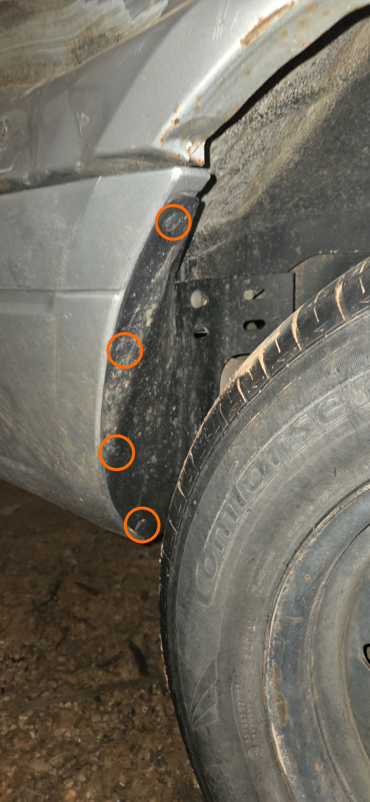
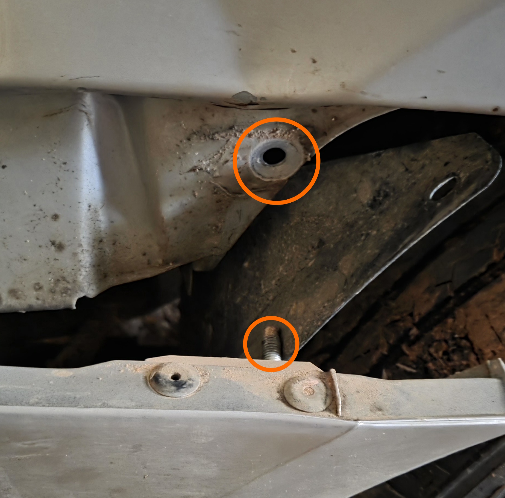
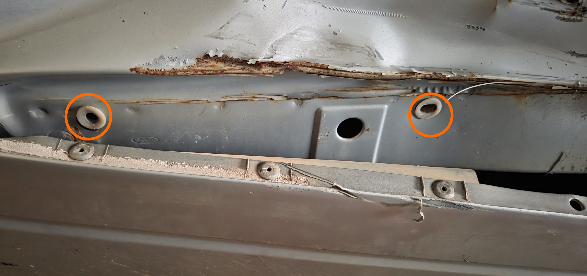
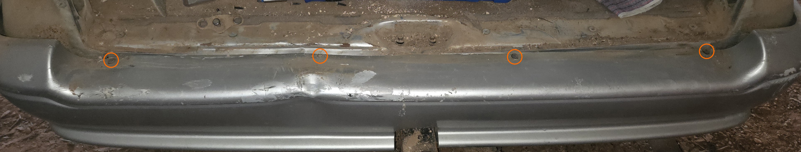
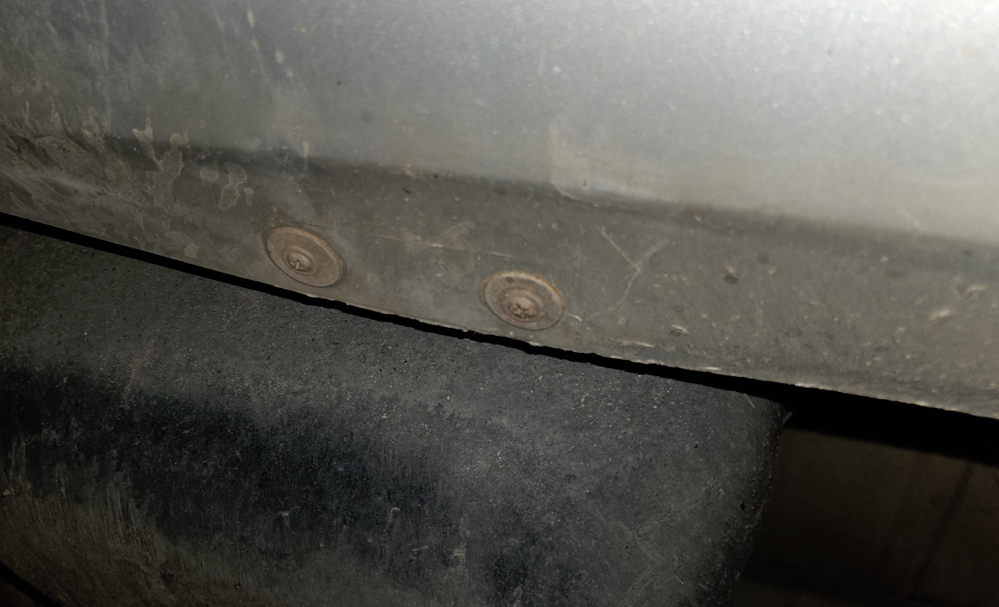
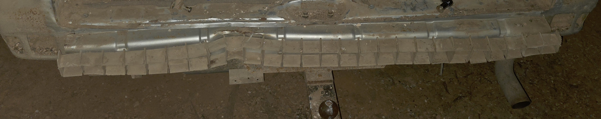

# Rear Bumper (Wagon Body)

Instructions for the removal of the rear bumper can be found below

> This section is not related to [SPUD](../../Disclaimer.md#spud) as it is a Sedan body type, but this has been created using an associated vehicle, [Roadkill](../../Disclaimer.md#associated-vehicles). Despite being a later model, these instructions should work without issue on AU Falcon Wagons

1. Locate the scrivets in the rear mudguards and remove. Repeat this step on both sides of the vehicle

    > Scrivets in this area of the car have been exposed to the elements and may prove impossible to remove non-destructively. Please ensure you have spare scrivets or another mounting solution for replacement as needed. The remaining scrivets may be removed if needed but most people's hands can fit in the gap made by removing the 4 circled scrivets below
    {: .block-note}

    
    > Picture of the scrivet locations on the driver side of the vehicle. The passenger side largely mirrors this layout

1. Reaching in behind the mudguard, remove a single 13mm nut from the front end side of the bumper. Repeat this step on both sides of the vehicle

    
    > Picture of the thread on the bumper that the nut mounts to, and the hole in the sheet steel of the body that serves as a mounting point for the bumper

1. Firmly pull the bumper outwards from the body to disengage the 2 mounting tabs holding the rest of the bumper side in. Repeat this step on both sides of the vehicle

    
    > Picture of the mounting holes for tabs on the bumper

1. If present, remove the trailer plug from the bumper, noting the following:
    - Factory trailer plugs (where fitted) were held in with 2 rivets and will need to be drilled to be removed
    - Non-standard or replacement trailer plugs are to be expected in this vintage of vehicle, and as such you should assess and remove on a case-by-case basis
    - If you intend to remove the entire trailer plug loom with the bumper, note that the [connecting plug](../../Electrical/TrailerPlug/TrailerPlug.md#plug-type) is located in the driver side boot panel (behind the emergency jack storage location). Also note that factory looms are attached to the body at multiple points, by cable ties and through the use of threading through holes in the body.

    > No pictures provided for this step as vehicle used has a non-standard trailer plug fitted
    {: .block-note}

1. On the rear of the bumper, remove the 4 scrivets on the top surface of the bumper.

    > Scrivets in this area of the car have been exposed to the elements and may prove impossible to remove non-destructively. Please ensure you have spare scrivets or another mounting solution for replacement as needed
    {: .block-note}

    
    > Picture of the scrivets on the top of the rear of the bumper

1. On the underside of the bumper, remove the 2 phillips head screws on the passenger side (near the fuel tank)

    > These screws have been exposed to the elements and will be difficult to remove (risk of stripping both the screw and the hole it's in). Assume replacement with Self-tapping screws will be required upon replacement as needed

    
    > Picture of the screws on the underside of the bumper

1. Pull the bumper from the vehicle, being careful not to use too much force to avoid risk of damage to the part

    
    > Picture of the rear of the vehicle, after the bumper has been removed

1. To replace with another bumper, follow the above steps in reverse

1. Done