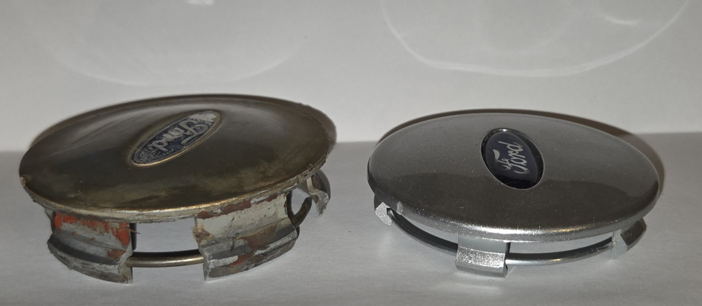
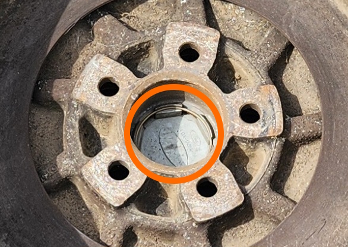

# Wheel Centre Caps

On mag wheels provided for the AU Falcon, a centre cap with the Ford logo on it is provided, to act as both a centrepiece and a dust cover for the wheel hub covers fitted to the car.

## Common properties

## Variations

There are 2 main variations of the wheel centre caps, which can be easily identified by the *depth* of the clip section of the covers.

> Information on which types of rims had each type of centre cap is hard to attain due to [lack of resources](../../Disclaimer.md#secondary-disclaimer---lack-of-resources).

### Option 1 - 10mm

This version of the centre cap appears to be the most common variant when looking for an aftermarket replacement. This is assisted by the fact that these fit later models of Falcon, with BA-FGX Falcons and SX-SZ Territory mags sharing the same dimensions (in most but not all cases)

### Option 2 - 15mm

This version of the centre cap is less common, generally only found through more specialist manufacturers or more obscure listings on sites such as [eBay](../../Credits.md#sources).

## Plastic Caps - Visual Representation

> Picture of the 2 main sizes of plastic centre cap, with the [15mm variant](#option-2---15mm) on the left and the [10mm variant](#option-1---10mm) on the right. Note the following when viewing this image:
> * The 10mm variant is aftermarket, compared to the OEM 15mm
> * The 15mm variant is damaged and has been siliconed to fit a Series 1 Fairmont rim, which uses the 10mm variant. Silicone should *not* be present unless it is the wrong sized centre cap
> * The 15mm variant in this image is heavily faded and damaged. Plastic centre caps should more closely match the colour of the 10mm variant

### Other variations

> Information on other variations for mags used on the Fairlane/LTD high models is unavailable due to [lack of resources](../../Disclaimer.md#secondary-disclaimer---lack-of-resources). Similarly, Tickford mag wheels, such as those available on the TE50/TS50/TL50 had a steel centre cap, which appear to have a smaller centre cap, making them incompatible with standard mag wheels, however this is also unknown.
{: .block-note}

## Removal

Removal of the centre caps is easy but requires the removal of the wheel. Please use the following steps as needed:

1. Remove the wheel and look on the inside of it. Remove the small metal ring on the inside of the centre cap using a pair of pliers

    
    
    > Picture of the ring inside the centre cap

1. Push the centre cap towards the outside of the rim to remove the plastic part of the cap
1. To reinstall, insert the metal ring into the centre cap, and push the whole assembly onto the rim from the outside
1. done