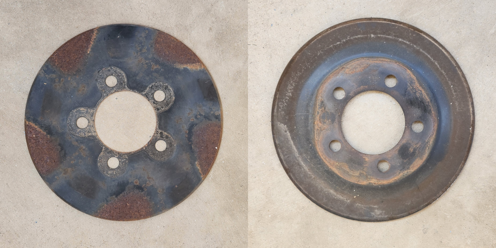

# Wheels & Tyres

## Known factory tyre sizes
use the below table as a reference for wheel sizes that should fit all models of Falcon

> NOTE: all sizes collected from Mycar website (formerly Kmart tyre & auto). As such information may be incomplete or incorrect

| Size | Diameter | Notes |
| --- | --- | --- |
| 205/65R15 | 648mm | low models S1 |
| 215/55R16 | 643mm | Falcon S |
| 215/60R16 | 653mm | low models S2&3 |
| 225/50R16 | 632mm | XR6/XR8 |
| 225/60R16 | 677mm | Fairlane GHIA |
| 225/50R17 | 657mm | Fairmont GHIA |
| 235/45R17 | 644mm | TL50/TE50/TS50 |
| 245/40R18 | 654mm | TS50 |

## General notes - how to read tyre sizes

using the example of 205/65R15:

- 205 is the width in mm (from outer to inner rim) of the tyre
- 65 is the aspect, so the percentage of the tyre width that makes the section width (distance from edge of the tyre to the edge of the rim).
- R15 is the size of the rim it is designed for, in inches

## PCDs & Offsets

- PCD: 5x114.3
- Offset: varies, generally +30mm to +50mm
- Thread: 1/2"

## Wheel Dust Covers

many AU Falcons came with wheel dust covers that functioned by blocking brake dust from settling on the mag wheel options that the model had, however they came with their own long term problems, such as:

- becoming rusty over time (for models with steel covers)
- fouling on the side of brake calipers if dented, and most importantly;
- becoming a potential catalyst for front brake rotor warping conditions, a significant maintenance problem within these models

If the additional cleaning of the wheels is acceptable, it is recommended that you remove these covers as they cause more problems than they solve on the whole

> photo of plastic cover on a S1 15" Mag (highlighted orange in picture to the right). Note that the plastic cover is apparently glued to the wheel and will likely need to be broken to be removed

> photo of steel covers, which can be found on newer 16" mags. These particular ones were taken from a S3 with "Sharkfin" style mags specifically

## Removal
Removal of the wheel dust covers is simple, as below:
1. remove the desired wheel
1. pull the dust cover from the exposed area
    > NOTE: There may be rust holding the cover to the rotor, but ***DO NOT*** use prying tools if the steel cover is on the rotor as this may damage the brakes

    > NOTE: Some earlier mags came with plastic covers instead, which aren't as likely to cause issues but are harder to remove. A chisel can be used to snap one edge of the plastic cover, and the rest of the cover can be removed with moderate force. Note this will render them useless after the fact, and there is no known way to get them off consistently in one piece due to age and adhesives used (see image before these steps)

1. reinstall the wheel, noting:
    - before you install the wheel, now may be a good time to clean behind the wheel unobstructed
    - you should tighten as much as possible while the wheel is in the air, then tighten again once the car is on the ground, to ensure a snug fit