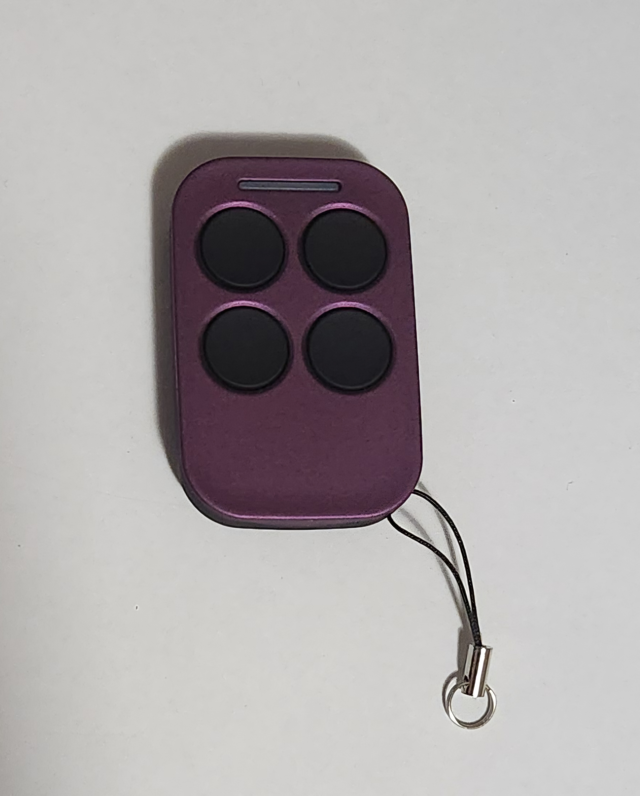
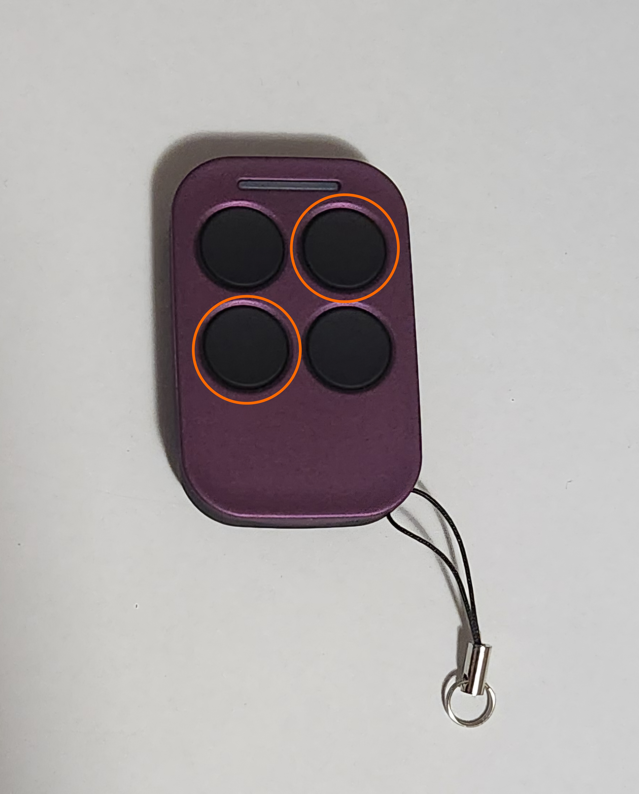
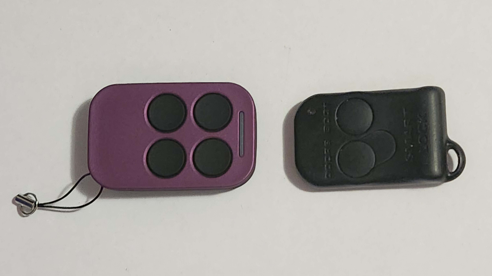

# Manufacturer Specific Instructions - CodeEzy

## What you need
- A CodeEzy Idol universal remote, model number CE1009

    > As of time of writing, CodeEzy do not sell these remotes directly. The largest known online supplier of these remotes is [RemotePro](../../../Credits.md#wall-of-shame---information-gatekeepers-and-time-wasters), however they can also be found through sellers on online marketplaces such as [eBay](../../../Credits.md#sources). Third-party "knock-off" remotes using the same design can be found on overseas marketplaces such as [AliExpress](../../../Credits.md#sources), however these were not tested and may not function
    {: .block-note}

> A CodeEzy CE1009

## Instructions

1. hold the top right and bottom left buttons of the CodeEzy remote until the indicator LED blinks once

    

    > The buttons to press in order to start the pairing process

1. press the button you want to set on the CodeEzy remote
1. with the original remote facing the CodeEzy remote, press and hold the button you would like to set the CodeEzy remote button to on the original remote, e.g. Lock/Unlock, until the indicator LED on the CodeEzy remote flickers quickly, then release

    

    > The position your 2 remotes should be in to minimize clone failure

1. (optional) set the remaining buttons by repeating previous steps until all 4 buttons are programmed
1. done