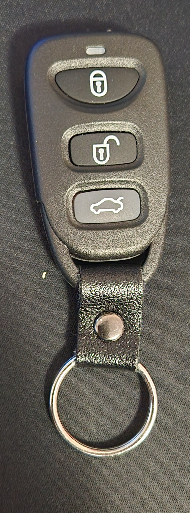
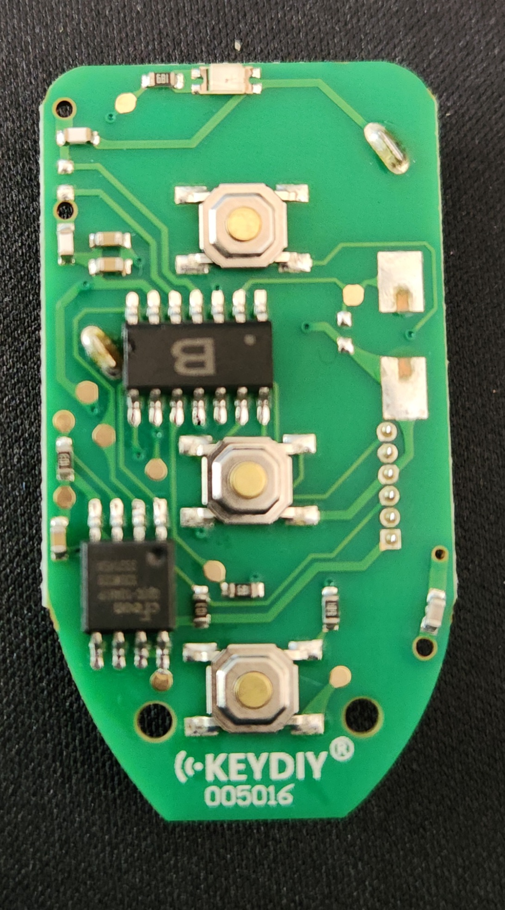

# Central Locking Keyfobs

## Types
Due to the change from Smartlock to Smartshield midway through the AU Falcon S1 production, the key fobs for these cars are split in 2

### S1 Smartlock
These remotes are actually inherited from the EL Falcon before it, and are a 304mHz sender with a Ford specific security chip built in. As a result of their age, finding good condition original ones are becoming harder, and even once found the rubber buttons are prone to wearing quicker than their S2-3 counterparts.

> NOTE: As of time of writing in 2024, the only manufacturer of aftermarket keyfobs for this model is [KEYDIY](../../Credits.md#information-cross-referencing), however their remotes have a high failure rate

> Image cropped from [The Key Guys](../../Credits.md#collected-images-primarily-product-listing-images) product page, which was advertising a aftermarket replacement that looks completely different

> NOTE: The S1 Ute remotes are missing the boot button (right)

### S2/S3 Smartshield
these remotes are far closer to what would become the standard for the BA/BF model Ford Falcons after them, utilizing a 433mHz frequency and becoming far more standard allowing for a much lower aftermarket replacement cost. They are noticeably larger than their S1 counterparts, however they are also far more durable, reparable, and ultimately, replaceable*

* at the time of writing, 2024

> Image taken from [The Key Guys](../../Credits.md#collected-images-primarily-product-listing-images) product page for aftermarket replacement. Original is almost identical barring a Ford logo stamped into the back of the shell

> NOTE: The S2/3 Ute remotes are missing the boot button (bottom right)

## Programming Keyfobs

> NOTE: the following steps must be started within 10 seconds of closing the door

> NOTE: these steps will not work if you're cars electronic locks are faulty i.e if the [lock actuator requires rebuilding](../../Body/DoorLockActuators/DoorLockActuators.md#replacement)

1. ensure all doors are closed and car is unlocked, then insert the key into the ignition and turn to the "ACC" position (1 click from off, not 2)
1. press the rear demister switch 3 times. If successful, the door locks should cycle (unlocked-locked-unlocked)
1. press any button on the remote. once registered, the car should cycle the locks again
1. repeat previous steps for any other remote
1. remove key
1. done

## Aftermarket replacements

Below is discovered information found while attempting to create a DIY aftermarket guide to creating Smartlock/Smartshield remotes using off the shelf solutions (bias towards Smartlock due to higher ROI if successful):

### KEYDIY
- confirmed available aftermarket fob is KEYDIY B09-3 universal fob, however known low success rate (seemingly depends on calibration of each car)
- profiles available for both Smartlock and Smartshield, but appear to use fixed code, meaning that the buttons are sometimes unresponsive, and likely means any other fob programmed with the same profile can open your car.
- OEM fobs unable to be cloned using any available cloning method in KEYDIY Android App (tested using cable programmer and KD 900 PLUS)

#### Smartlock configuration

Smartlock models of AU Falcon can seemingly only be configured manually, as there is no known profile available in the KEYDIY app by default.

> NOTE: While this configuration is confirmed working, it stands to reason that any *other* car using these settings would be able to be unlocked using the same fob. This information is solely here as a guide or potentially a base for someone else to crack the pattern to make *unique* codes.

| Property | Value |
| --- | --- |
| Frequency | 303.86 MHz |
| Modulation | ASK |
| Prefix Characters | Unused |
| Prefix Character Bit Number | 0 |
| Type Header | Unused |
| Min Pulse Width | 1591 us |
| Unlock Data | `0F33334D534D3553D51400000000` |
| Lock Data | `879999A6A9A69AA96A0A00000000` |
| Trunk Data | `0F4D333535CDD434350100000000` |

#### Smartshield configuration

For the Smartshield models of AU Falcon, you can use one of the built in profiles in the KEYDIY app. Select the profile with the following details:

| Property | Value |
| --- | --- |
| Name | FALCON 00-02 |
| ID | R02193 |
| Frequency | 303.8 ASK |

> Photos of the casing and board of a KEYDIY based keyfob provided by [RemotePro](../../Credits.md#wall-of-shame---information-gatekeepers-and-timewasters) but promptly returned after multiple failed attempts to pair to a AU Falcon S1 Smartlock system

### XHorse
- aftermarket remote unavailable
- Android app doesn't appear to have any profile matching the Ford Falcon

### RemoteKing
- aftermarket remote confirmed as model RCR15 (untested)
- difficult to acquire after 22/06/2022 due to changes in battery safety standards