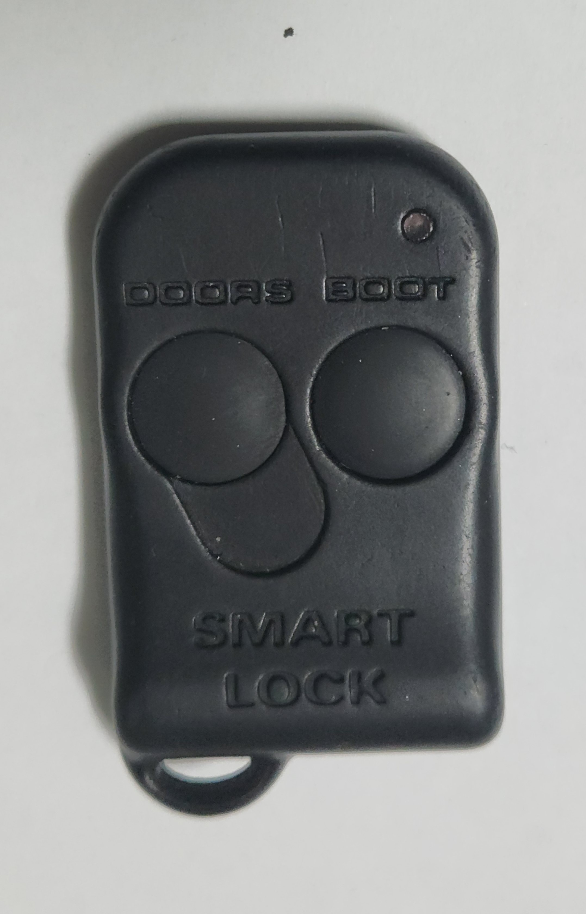
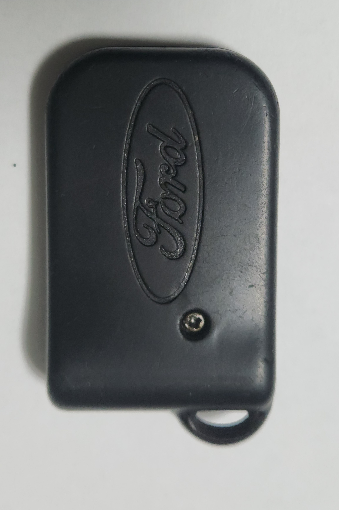
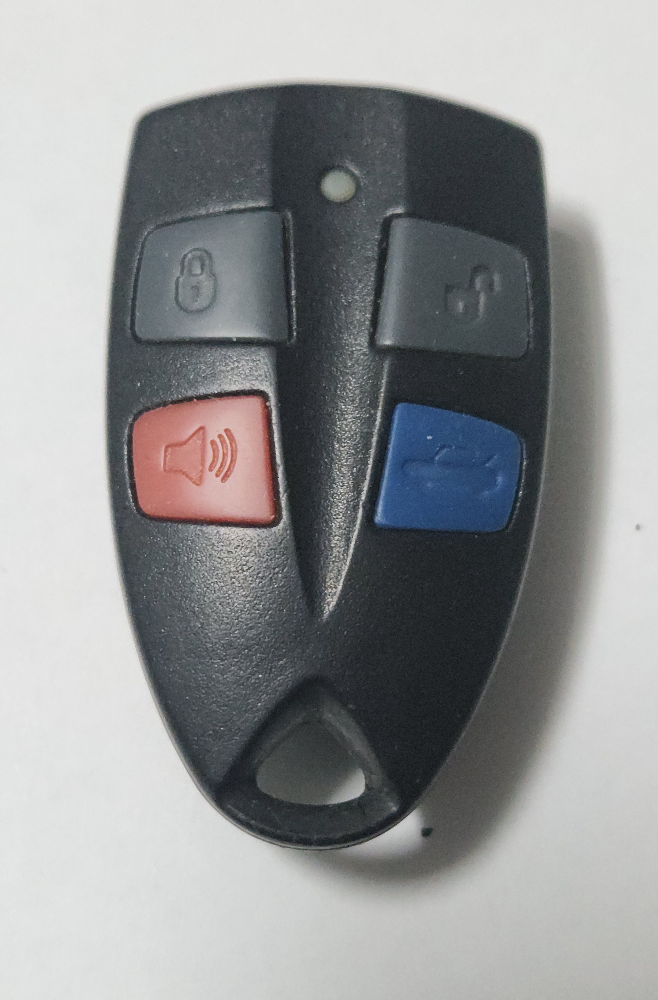
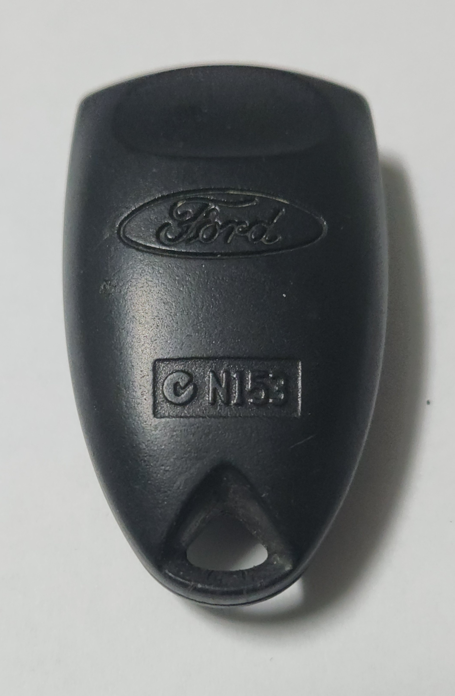
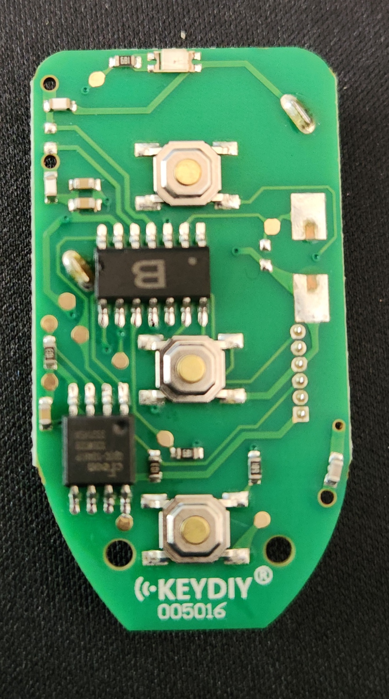
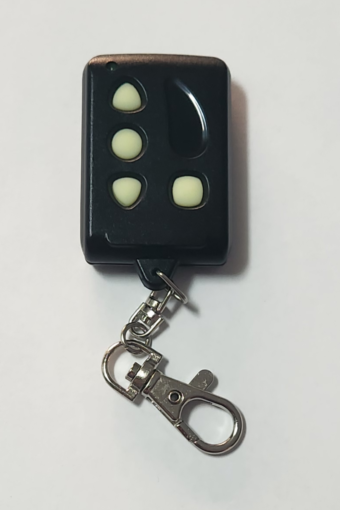
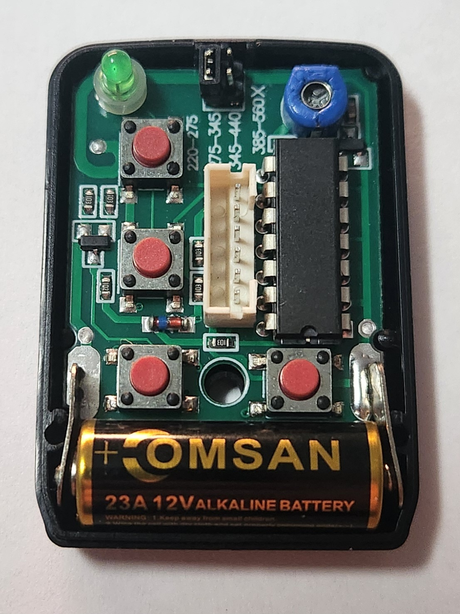

# Central Locking Keyfobs

## Types
Due to the change from Smartlock to Smartshield midway through the AU Falcon S1 production, the key fobs for these cars are split in 2

### S1 Smartlock
These remotes are actually inherited from the EL Falcon before it, and are a 304mHz sender with a Ford specific secure code built in to discern individual remotes. As a result of their age, finding good condition original ones are becoming harder, and even once found the rubber buttons are prone to wearing quicker than their S2-3 counterparts.

> NOTE: As of time of writing in 2024, the only manufacturer of aftermarket keyfobs for this model is [KEYDIY](../../Credits.md#information-cross-referencing), however their remotes have a high failure rate

> Photos of an OEM Series 1 keyfob

> NOTE: The S1 Ute remotes are missing the boot button (right)

### S2/S3 Smartshield
these remotes are far closer to what would become the standard for the BA/BF model Ford Falcons after them, however they still employ a 304mHz frequency. These remote have more aftermarket replacements available* an are easier to find replacements for due to their relatively higher commonness, and appear to employ a double-length security code to discern specific remotes, theoretically making them more secure. They are noticeably larger than their S1 counterparts, however they are also far more durable, reparable, and ultimately, replaceable*

* at the time of writing, 2024

> Photos of an OEM Series 1 keyfob

> NOTE: The S2/3 Ute remotes are missing the boot button (bottom right)

## Programming Keyfobs

> NOTE: the following steps must be started within 10 seconds of closing the door

> NOTE: these steps will not work if you're cars electronic locks are faulty i.e if the [lock actuator requires rebuilding](../../Body/DoorLockActuators/DoorLockActuators.md#replacement)

1. ensure all doors are closed and car is unlocked, then insert the key into the ignition and turn to the "ACC" position (1 click from off, not 2)
1. press the rear demister switch 3 times. If successful, the door locks should cycle (unlocked-locked-unlocked)
1. press any button on the remote. once registered, the car should cycle the locks again
1. repeat previous steps for any other remote
1. remove key
1. done

## Changing locking mode (Smartshield models only)

In the smartshield models of AU Falcon (Late S2-3), a locking mode can be specified using a factory remote. Note that this does *not* work on any known aftermarket remote, only the Ford OEM Remotes. To change the remote mode, simply hold down the lock and unlock buttons at the same time for approximately 3-5 seconds, the car will acknowledge with a flash of the indicators. The 2 modes available are:

- Single press (one press of the unlock button unlocks all doors)
- Double press (one press of the unlock button unlocks the drivers door only, another press unlocks the remaining doors)

## Aftermarket replacements

Below is discovered information found while attempting to create a DIY aftermarket guide to creating Smartlock/Smartshield remotes using off the shelf solutions (bias towards Smartlock due to higher ROI if successful):

### KEYDIY
- confirmed available aftermarket fob is KEYDIY B09-3 universal fob, however known low success rate (seemingly depends on calibration of each car)
- profiles available for both Smartlock and Smartshield, however due to unknown issues, buttons are sometimes unresponsive. Any fob programmed to the same code is likely to be able to open any other car coded the same way due to method of duplication, making widespread use non-viable.

    > NOTE: profiles only available on the Android App version of KEYDIY as of time of writing

- OEM fobs unable to be cloned using any available cloning method in KEYDIY Android App (tested using cable programmer and KD 900 PLUS)

#### Smartlock configuration

Smartlock models of AU Falcon can seemingly only be configured manually, as there is no known profile available in the KEYDIY app by default.

> NOTE: While this configuration is confirmed working, it stands to reason that any *other* car using these settings would be able to be unlocked using the same fob. This information is solely here as a guide or potentially a base for someone else to crack the pattern to make *unique* codes.

| Property | Value |
| --- | --- |
| Frequency | 303.86 MHz |
| Modulation | ASK |
| Prefix Characters | Unused |
| Prefix Character Bit Number | 0 |
| Type Header | Unused |
| Min Pulse Width | 1591 us |
| Unlock Data | `0F33334D534D3553D51400000000` |
| Lock Data | `879999A6A9A69AA96A0A00000000` |
| Trunk Data | `0F4D333535CDD434350100000000` |

#### Smartshield configuration

For the Smartshield models of AU Falcon, you can use one of the built in profiles in the KEYDIY app. Select the profile with the following details:

| Property | Value |
| --- | --- |
| Name | FALCON 00-02 |
| ID | R02193 |
| Frequency | 303.8 ASK |

> NOTE: specific codes not available due to lack of available information for officially published KEYDIY profiles

> Photos of the casing and board of a KEYDIY based keyfob. Device provided by [RemotePro](../../Credits.md#wall-of-shame---information-gatekeepers-and-time-wasters) but promptly returned after multiple failed attempts to pair to a AU Falcon S1 Smartlock system

### Remocon
- compatible aftermarket remote confirmed as model RMC-555 (requires RMC-888 programmer, first confirmed 18/12/24)
- can only be used to copy existing remote, therefore one OEM remote required.
- [Instructions (Series 1 Smartlock only)](./Remocon/Remocon.md)

> NOTE: The Remocon RMC-600, which advertises the ability to copy codes without the use of a programmer was tested to ***NOT*** work when trying to copy an OEM Series 1 remote. It does work with already copied RMC-555 remotes, but this may present a signal degradation issue in making copy-of-copy remotes, and makes the ability to copy without the RMC-888 a moot point.

> Photos of the casing and board of a Remocon RMC-555 programmable keyfob. Device provided by [AliExpress](../../Credits.md#collected-information-primarily-product-listing-images)

### RemoteKing
- aftermarket remote confirmed as model RCR15 (untested)
- difficult to acquire after 22/06/2022 due to changes in battery safety standards
- not pursued due to difficulty acquiring

### XHorse
- aftermarket remote unavailable
- Android app doesn't appear to have any profile matching the Ford Falcon

### Other Remotes
- Various unbranded "copy any remote" remotes tested from [AliExpress](../../Credits.md#collected-information-primarily-product-listing-images)
- 4 remotes tested, 4 remotes failed
- assumed that frequency/signal/baud rate not compatible with cloning sequence for "universal" remotes