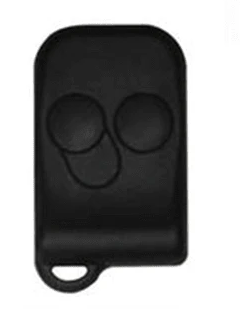
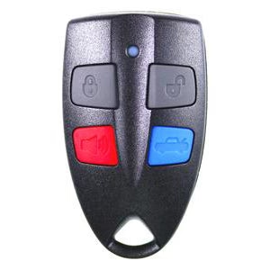

# Central Locking Keyfobs

## Types
Due to the change from Smartlock to Smartshield midway through the AU Falcon S1 production, the key fobs for these cars are split in 2

### S1 Smartlock
These remotes are actually inherited from the EL Falcon before it, and are a 304mHz sender with a Ford specific security chip built in. As a result of their age, finding good condition original ones are becoming harder, and even once found the rubber buttons are prone to wearing quicker than their S2-3 counterparts.

> Image cropped from The Key Guys product page, which was advertising a aftermarket replacement that looks completely different

> NOTE: The S1 Ute remotes are missing the boot button (right)

### S2/S3 Smartshield
these remotes are far closer to what would become the standard for the BA/BF model Ford Falcons after them, utilizing a 433mHz frequency and becoming far more standard allowing for a much lower aftermarket replacement cost. They are noticeably larger than their S1 counterparts, however they are also far more durable, reparable, and ultimately, replaceable*

* at the time of writing, 2024

> Image taken from The Key Guys product page for aftermarket replacement. Original is almost identical barring a Ford logo stamped into the back of the shell

> NOTE: The S2/3 Ute remotes are missing the boot button (bottom right)

## Programming Keyfobs

> NOTE: the following steps must be started within 10 seconds of closing the door

> NOTE: these steps will not work if you're cars electronic locks are faulty i.e if the lock actuator requires rebuilding

1. ensure all doors are closed and car is unlocked, then insert the key into the ignition and turn to the "ACC" position (1 click from off, not 2)
1. press the rear demister switch 3 times. If successful, the door locks should cycle (unlocked-locked-unlocked)
1. press any button on the remote. once registered, the car should cycle the locks again
1. repeat previous steps for any other remote
1. remove key
1. done

<!--TODO add KEYDIY instructions if worked out-->