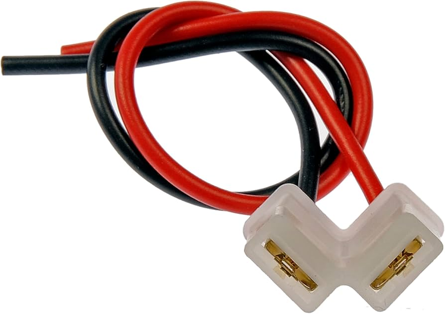
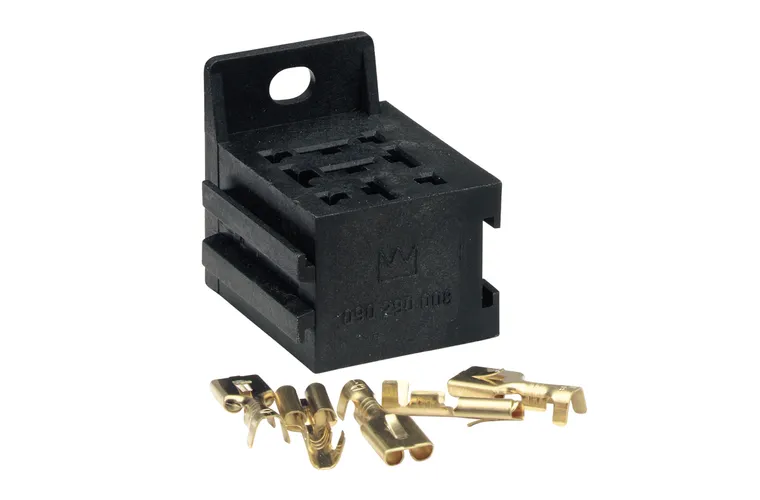
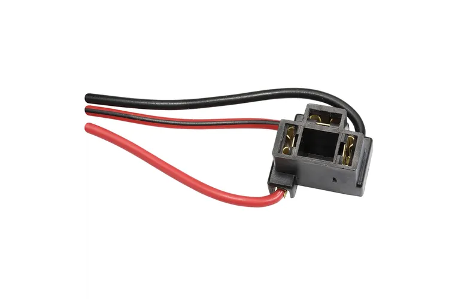
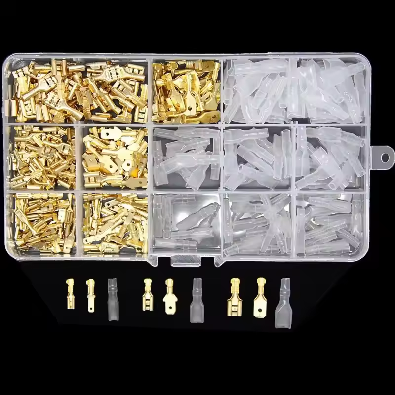

# 12V Accessory Power Source (Cigarette Lighter)

The 12V accessory plug on the AU Falcon is located in the bottom of the centre dash inside the cabin, and while it was historically used for a Cigarette lighter (fitted as standard), the AU Falcon was the last Falcon model to come with this and ashtrays fitted, with BA/BF Falcon and SX/SY Territory models available with a "smoker's pack" option as required, which was later phased out entirely by the release of the FG/FGX Falcons and SZ Territory

## Plug Type

The 12v Accessory plug in the AU Falcon uses a connector housing with 2 terminals, a Positive 6.3mm terminal, and a Ground 4.8mm terminal, in a right angle configuration. Should you wish to manufacture a loom for the 12V Accessory to other devices, there are a few possible known options available, listed below:

### Universal Flasher Relay Connector

Vehicles from the 60s and 70s primarily used a 2 pin flasher relay for the functioning of the indicator bulbs in the vehicles. Known Ford Falcon models range from the 1960 model XK Falcon through to the 1979 XC Falcon, with it being phased out in the following XD model later. If choosing this connector, note the following:
- Due to the age of the connector used, salvage parts are non-viable
- A new connector can only be sourced using keywords such as "2-pin flasher relay connector". Marketplaces such as [eBay](../../Credits.md#sources) and [AliExpress](../../Credits.md#sources) appear to be the most reliable source of these connectors at time of writing.
- These connectors feature 2 6.3mm female terminals. This will fit physically over the 2 different sized terminals, but the positive terminal will have gaps on either side of the male terminal.

> A product listing image for a Dorman branded flasher relay plug (female). Male connector housings appear to be only available through universal kits.

> The brand Dorman appears to be the most common manufacturer of these connector housings, however this brand is generally non-viable for Australia due to international postal cost.
{: .block-note}

### Relay Connector

Thanks to similar spacings within the plug, a 3, 4 or 5 way relay connector may be used, however note the following:

- There are only 2 configurations that can be used, both utilizing the top centre pin in the relay connector, as this is the only pin with a perpendicular angle to other pins
- Due to the physical size of the connector, superfluous pins may need to be sanded or cut off, as the 12V Accessory port is fit close to the ashtray compartment in the centre dash
- In the case of the below [Narva](../../Credits.md#sources) connector, only 2 of 9 pins will be populated
- The available configurations this connector allows feature 2 6.3mm female terminals. This will fit physically over the 2 different sized male terminals, but the positive terminal will have gaps on either side of the male terminal.

> A [Narva](../../Credits.md#sources) branded universal relay connector, part number `68084`

### H4 Connector

Again thanks to similar spacings within the plug, a H4 headlight connector may be used, noting the following:

- 2 configurations known working, both using the bottom connector on the plug
- only 2 of the 3 connector pins will be populated
- the spare unused pin may need to be sanded or cut off, however this is unlikely to be needed due to the small size of the connector housing itself.
- The available configurations this connector allows feature 2 6.3mm female terminals. This will fit physically over the 2 different sized male terminals, but the positive terminal will have gaps on either side of the male terminal.

> A [Narva](../../Credits.md#sources) branded H4 Female Terminal Connector Housing, part number `49894BL`

### Blade Terminals

The most straightforward solution to the 12V Accessory connection is to simply connect terminal connections as required. If you wish to perform this, note the following:

- Additional reinforcement may be required as connecting 12V Accessory in this way loses the tight fit that other options present. The most common solutions involve either wiring loom cloth tape or electrical tape
- 2 different sizes are required, with 6.3mm terminals used for the negative connection and 4.8mm terminals used for the positive connection. This may make it more economical to buy a multi-pack of terminals
- There is a limited possibility of the terminals touching as they are not in a housing. Please use appropriate insulation per terminal
- Cheapest reliable known source of terminals are online marketplaces such as [eBay](../../Credits.md#sources) or [AliExpress](../../Credits.md#sources)

> A picture from an [AliExpress](../../Credits.md#sources) listing for a set of 2.8/4.8/6.3mm crimp terminal connectors