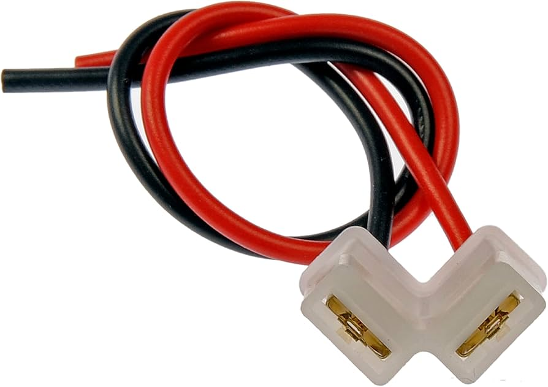
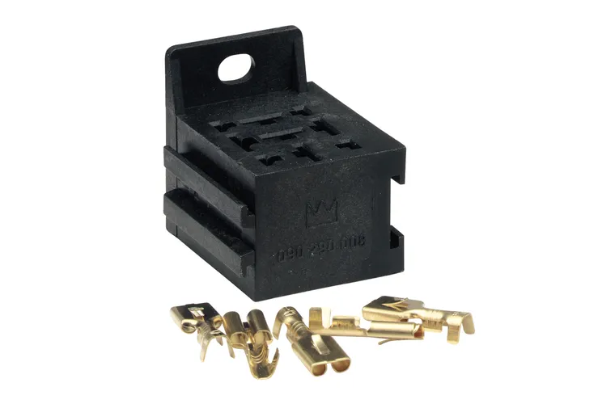
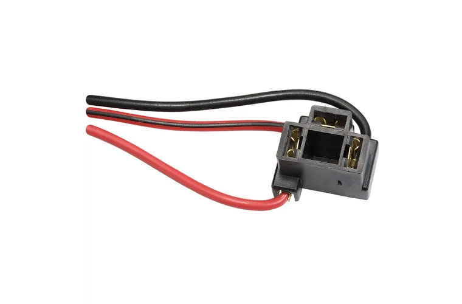
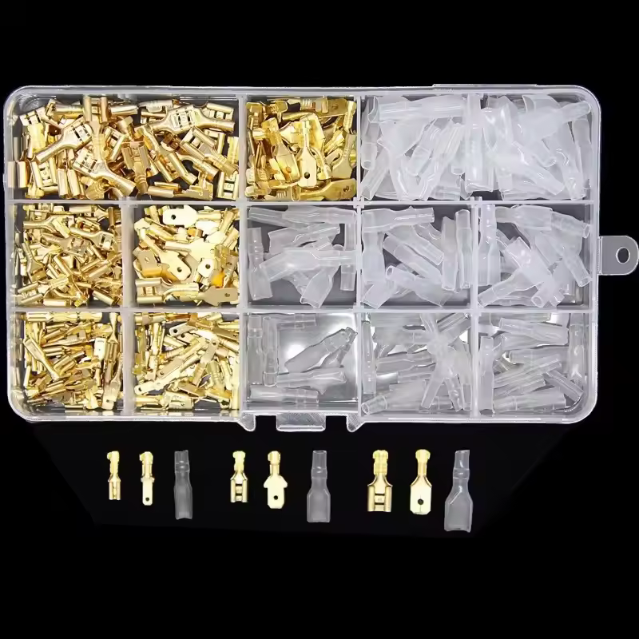
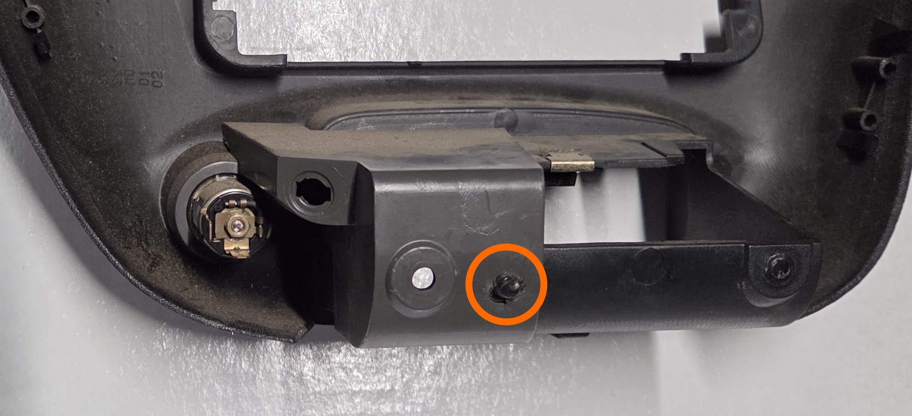
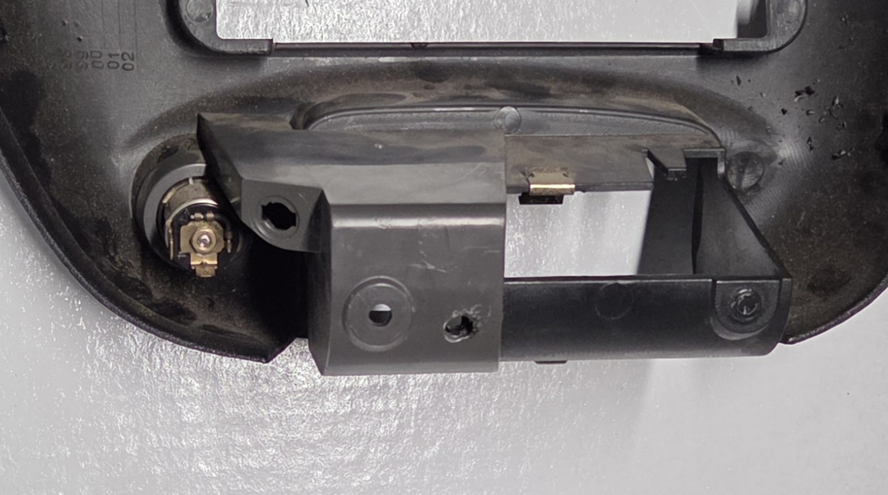
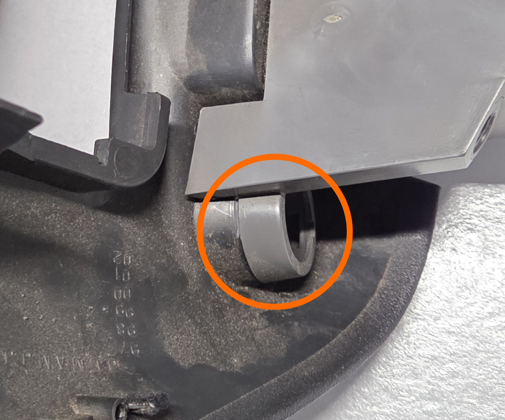
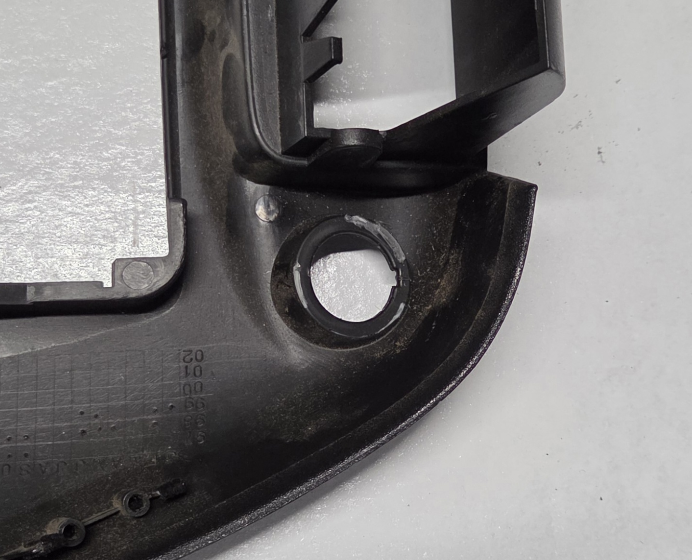
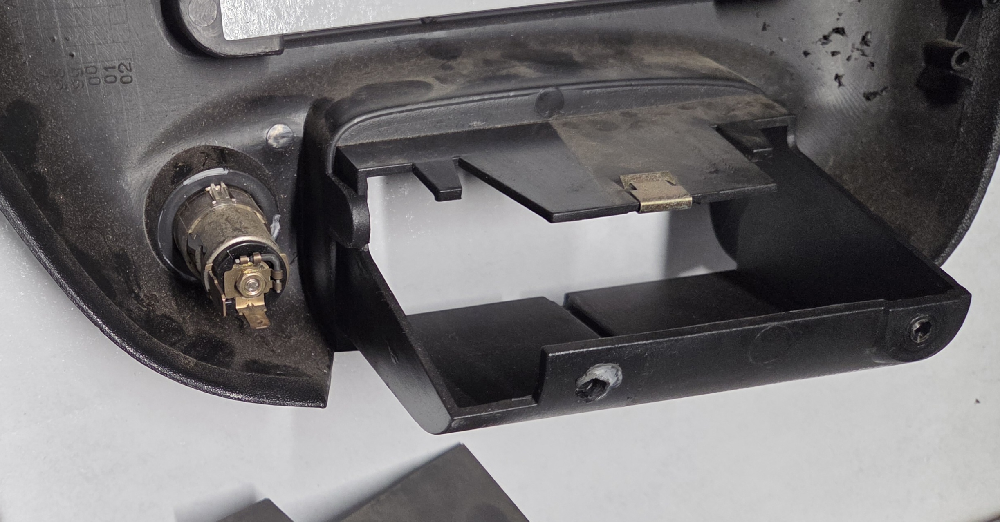
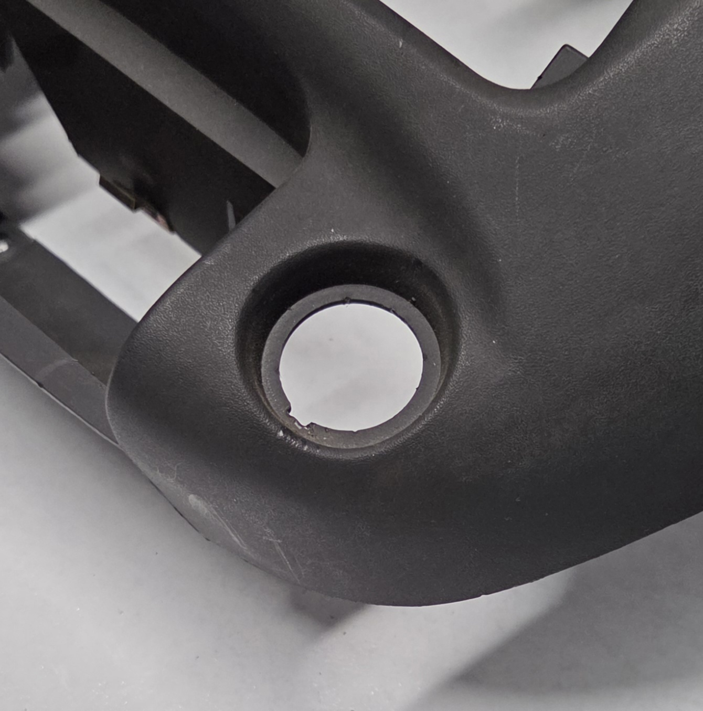

# 12V Accessory Power Source (Cigarette Lighter)

The 12V accessory plug on the AU Falcon is located in the bottom of the centre dash inside the cabin, and while it was historically used for a Cigarette lighter (fitted as standard), the AU Falcon was the last Falcon model to come with this *and* ashtrays fitted, with BA/BF Falcon and SX/SY Territory models available with a "smoker's pack" option as required, which was later phased out entirely by the release of the FG/FGX Falcons and SZ Territory

## Plug Type options

The 12v Accessory plug in the AU Falcon uses a connector housing with 2 terminals, a Positive 6.3mm terminal, and a Ground 4.8mm terminal, in a right angle configuration. Should you wish to manufacture a loom for the 12V Accessory to other devices, there are a few possible known options available, listed below:

### Wreck Parts

The simplest and most guaranteed fit is of course to source parts from a wreck vehicle. This is however only viable while stocks of AU Falcons are available in wreckers, which is not guaranteed long-term.

### Universal Flasher Relay Connector

Vehicles from the 60s and 70s primarily used a 2 pin flasher relay for the functioning of the indicator bulbs in the vehicles. Known Ford Falcon models range from the 1960 model XK Falcon through to the 1979 XC Falcon, with it being phased out in the following XD model later. If choosing this connector, note the following:
- Due to the age of the connector used, salvage parts are non-viable
- A new connector can only be sourced using keywords such as "2-pin flasher relay connector". Marketplaces such as [eBay](../../Credits.md#sources) and [AliExpress](../../Credits.md#sources) appear to be the most reliable source of these connectors at time of writing.
- These connectors feature 2 6.3mm female terminals. This will fit physically over the 2 different sized terminals, but the positive terminal will have gaps on either side of the male terminal.

> A product listing image for a Dorman branded flasher relay plug (female). Male connector housings appear to be only available through universal kits.

> The brand Dorman appears to be the most common manufacturer of these connector housings, however this brand is generally non-viable for Australia due to international postal cost.
{: .block-note}

### Relay Connector

Thanks to similar spacings within the plug, a 3, 4 or 5 way relay connector may be used, however note the following:

- There are only 2 configurations that can be used, both utilizing the top centre pin in the relay connector, as this is the only pin with a perpendicular angle to other pins
- Due to the physical size of the connector, superfluous pins may need to be sanded or cut off, as the 12V Accessory port is fit close to the ashtray compartment in the centre dash
- In the case of the below [Narva](../../Credits.md#sources) connector, only 2 of 9 pins will be populated
- The available configurations this connector allows feature 2 6.3mm female terminals. This will fit physically over the 2 different sized male terminals, but the positive terminal will have gaps on either side of the male terminal.

> A [Narva](../../Credits.md#sources) branded universal relay connector, part number `68084`

### H4 Connector

Again thanks to similar spacings within the plug, a H4 headlight connector may be used, noting the following:

- 2 configurations known working, both using the bottom connector on the plug
- only 2 of the 3 connector pins will be populated
- the spare unused pin may need to be sanded or cut off, however this is unlikely to be needed due to the small size of the connector housing itself.
- The available configurations this connector allows feature 2 6.3mm female terminals. This will fit physically over the 2 different sized male terminals, but the positive terminal will have gaps on either side of the male terminal.

> A [Narva](../../Credits.md#sources) branded H4 Female Terminal Connector Housing, part number `49894BL`

### Blade Terminals

The most straightforward solution to the 12V Accessory connection is to simply connect terminal connections as required. If you wish to perform this, note the following:

- Additional reinforcement may be required as connecting 12V Accessory in this way loses the tight fit that other options present. The most common solutions involve either wiring loom cloth tape or electrical tape
- 2 different sizes are required, with 6.3mm terminals used for the negative connection and 4.8mm terminals used for the positive connection. This may make it more economical to buy a multi-pack of terminals
- There is a limited possibility of the terminals touching as they are not in a housing. Please use appropriate insulation per terminal
- Cheapest reliable known source of terminals are online marketplaces such as [eBay](../../Credits.md#sources) or [AliExpress](../../Credits.md#sources)

> A picture from an [AliExpress](../../Credits.md#sources) listing for a set of 2.8/4.8/6.3mm crimp terminal connectors

## Removal

> These removal instructions should be universal, however have not been tested on a Series 2/3 Low Model Dash. These instructions use a dash fascia from a Series 1.5 High Model Dash, and assume that any replacement is either from another factory dash, or will be modified to suit, as the clear plastic sleeve on the connector itself is *not* removable through non-destructive means
{: .block-note}

Despite popular belief, the 12V accessory plug *can* be removed, however it *cannot* be removed without damaging the centre dash fascia. Use the following instructions for the lowest destruction level possible while retaining the 12V accessory plug intact.

1. Locate a small blob of melted plastic at the rear of the [Ashtray](../../Body/CentreDashAshtray/CentreDashAshtray.md) holder

    

    > A picture of the location of the plastic blob. Locations will vary somewhat per fascia

1. Using a drill and a 6-8mm drill bit, drill through the blob until you have cleared both layers of plastic from the rear housing and the centre fascia

    > Less damage to the original part may be achieved through only drilling through the first layer of the 2 layers of plastic melted together at that point, however this places both pieces of plastic at greater risk of breaking in later steps.
    {: .block-note}

    

    > A picture of the fascia, after being drilled with a 6mm drill bit

1. At the rear of the 12V plug, separate the glue holding the assembly together by prying the 2 pieces of plastic apart using a small pry tool, pick or screwdriver

    

    > A picture of the glue location

    

    > A picture of the glue spread on the rear of the fascia, post-removal

1. Gently pry the 2 plastic layers apart using fine pry tools or a small flat-head screwdriver. Be firm but careful around the drilled hole and the rear of the 12V connector as there may still be residual glue or melted plastic holding the pieces together

    

    > A picture of the rear of the fascia, post-removal

1. Remove the 12V connector by pushing the assembly through the front of the fascia. Prying with a small tool will be required, first to force the lower tab through the keyed location on the bottom of the fascia, and then to either:
    - Rotate the connector 180n degrees so the top tab is in line with the key in the fascia hole and force it through, OR;
    - Simply force the tab through the top of the keyed hole, which should have less resistance now that the bottom tab is pushed through

    

    > A picture of the keyed hole in the fascia, post-removal

    1[Connector assembly tabs](./oem-12v-assembly-tabs.jpg)

    > A picture of the 2 tabs which must be forced through the fascia

1. Replace with your new assembly as needed, or modify for any 12V Connector or similar equivalent assembly.

    > For notes to assist with modification, refer to the [Modification Tolerances](#modification-tolerances) section

1. Done

## Modification Tolerances

In aide of replacing the 12V connector with something of similar but modern utility, such as a hard wire 12V USB adapter, please note the following measurements:

| Location | Measurement (approx.) |
| --- | --- |
| Fascia hole diameter (excluding key) | 25mm |
| Fascia hole key depth | 2mm |
| Fascia indent width | 32mm |
| Original assembly depth | 56mm |