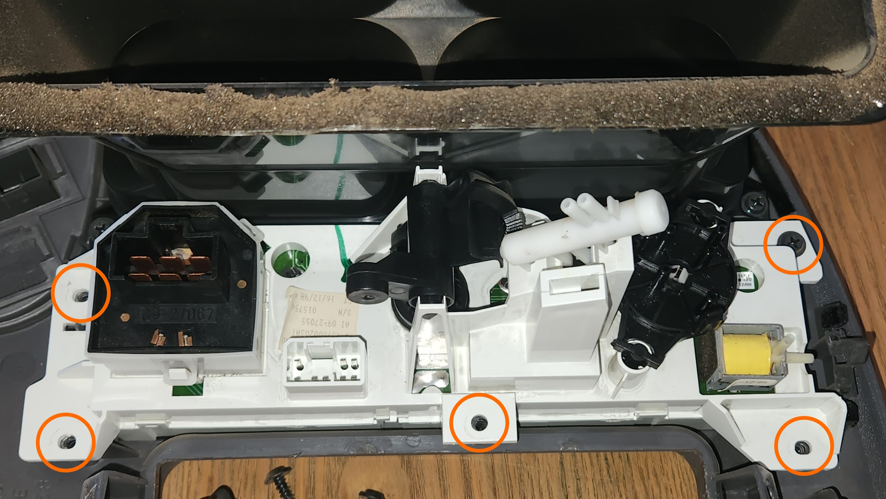
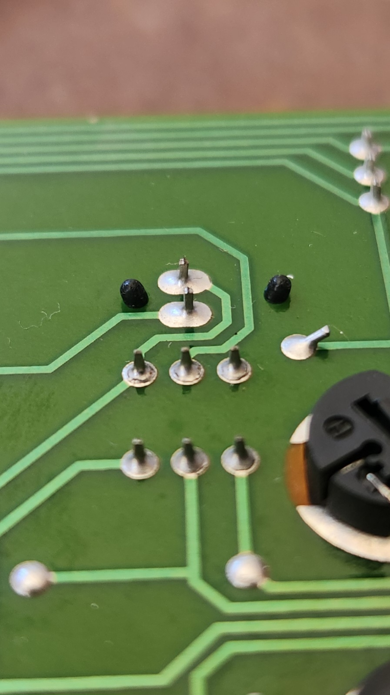
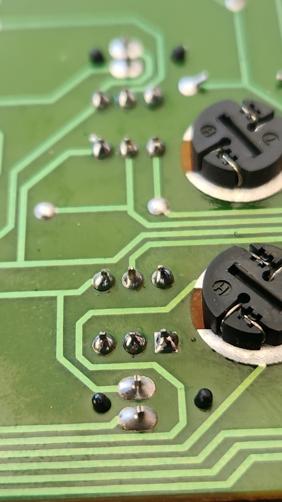
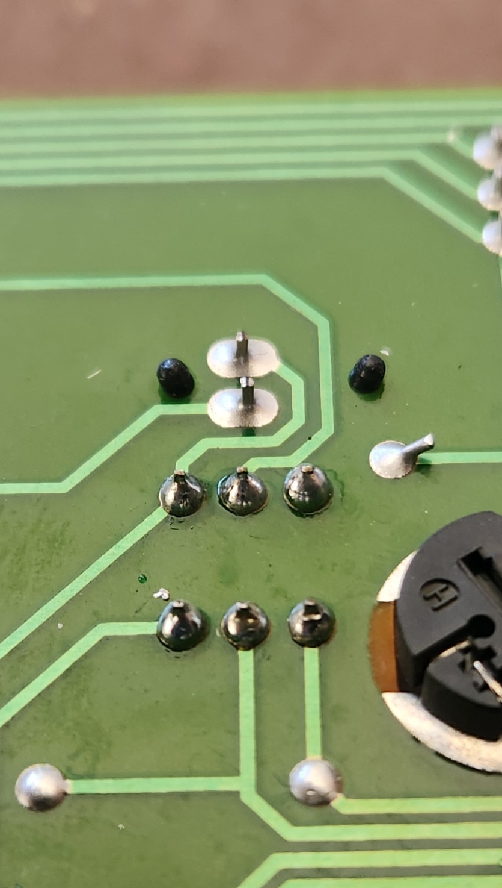

# Air Conditioner Controls - Series 1

## Repairing solder connections on the AC and AC Max. Buttons

A somewhat common fault in the S1 AU Falcons is an issue where the AC and AC Max. buttons on the dash work intermittently, generally knocking loose in the course of normal driving. These buttons present a further issue by not being able to be held down, as they are only registered as a button press *after* the button is released. If you are experiencing this issue, follow the steps below to repair:

> Limited photos due to tight working spaces
{: .block-note}

1. remove the radio and front ash tray

    > You will need specialty tools to remove the radio if it is the stock unit
    {: .block-note}

1. remove the 2 screws behind where the radio was, remove the 2 phillips head screws behind where the cigarette tray was, then use a trim removal tool to disengage the clips around the top of the centre dash panel

    > These metal clips can pop off of the fascia panel and leave itself on the car side. If this happens, some superglue has been proven to hold the clips in place on reinstallation
    {: .block-note}

1. gently pull the dash panel away, and start unplugging the following, noting where everything goes for later:

    - cable for ECON, DEMIST and other [Accessory Buttons](../CentreConsoleButtons/CentreConsoleButtons.md) (where fitted)
    - control cable for Fan Speed Controls (6 pin large flat connector)
    - control cable for Button Controls (AC/Flow) (8 pin Multilock-style connector)
    - connecting rod for heater box controls

        > This final step is exceedingly hard, and should difficulties arise in removing this cable from the dash side, the best secondary method is to remove the glovebox, unclip the small plastic clip holding in the heater box end of the cable, pop the cable end out, and feed it back through to where the dash is
        {: .block-note}

        <!--TODO add picture of where the heater control switch is-->

1. with the dash fascia removed, place it down on a flat surface and remove the 5 phillips head screws holding in the AC Controls

    

1. remove all dials from the AC Controls and remove the white assembly from the fascia, then unclip the front plastic from the assembly. The assembly is held in with 6 small clips (3 on the top, 3 on the bottom), they are somewhat easy to break, and the faces of the AC, AC Max, and the Air Recirculation buttons will come off with the fascia on removal

    > Pictures not provided for this section due to difficulty taking images while taking assembly apart
    {: .block-note}

1. once you have access to the board, unscrew the 3 phillips head screws holding the board in place and inspect the solder connections

    
    

    > Examples of broken solder connections on both the AC and AC Max buttons of the tested unit respectively

1. reflow the soldering for any cracked connections. You may also add a little extra solder to each point if needed, however a lead-core solder and a low temperature soldering iron is recommended if so.

    > While not required, it is recommended that you use a fine tipped, temperate controlled soldering iron at about 250oC
    {: .block-note}

    
    

    > Photos of the reflowed solder, with some extra solder added to all connections

1. reverse all steps prior to soldering the board to reassemble and refit the AC Controls into the vehicle. Once refitted, test functionality to confirm this has solved the issue

1. done