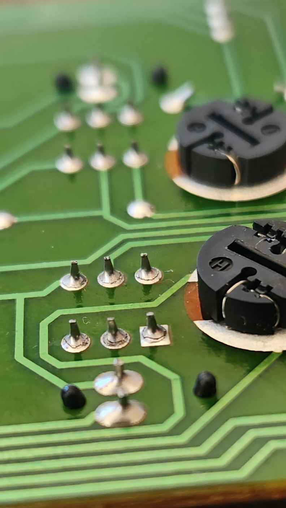

# Air Conditioner Controls - Series 1

## Diagnosis

Diagnosis of the AC and AC Max. buttons on a [Series 1](../../Miscellaneous/SeriesInformation/SeriesInformation.md#series-1) AU Falcon is simple. If the button lights activate on press but then turn off when a sufficient bump in the road is driven over, then it is likely the repair [below](#repairing-solder-connections-on-the-ac-and-ac-max-buttons) is required.

## Repairing solder connections on the AC and AC Max. Buttons

A somewhat common fault in the S1 AU Falcons is an issue where the AC and AC Max. buttons on the dash work intermittently, generally knocking loose in the course of normal driving. These buttons present a further issue by not being able to be held down, as they are only registered as a button press *after* the button is released. If you are experiencing this issue, follow the steps below to repair:

> Limited photos due to tight working spaces
{: .block-note}

1. Remove the radio and front ash tray

    > You will need specialty tools to remove the radio if it is the stock unit
    {: .block-note}

1. Remove the 2 screws behind where the radio was, remove the 2 phillips head screws behind where the cigarette tray was, then use a trim removal tool to disengage the clips around the top of the centre dash panel

    > These metal clips can pop off of the fascia panel and leave itself on the car side. If this happens, some superglue has been proven to hold the clips in place on reinstallation
    {: .block-note}

1. Gently pull the dash panel away, and start unplugging the following, noting where everything goes for later:

    - Cable for ECON, DEMIST and other [Accessory Buttons](../CentreConsoleButtons/CentreConsoleButtons.md) (where fitted)
    - Control cable for Fan Speed Controls (6 pin large flat connector)
    - Control cable for Button Controls (AC/Flow) (8 pin Multilock-style connector)
    - Connecting rod for heater box controls

        > This final step is exceedingly hard, and should difficulties arise in removing this cable from the dash side, the best secondary method is to remove the glovebox, unclip the small plastic clip holding in the heater box end of the cable, pop the cable end out, and feed it back through to where the dash is
        {: .block-note}

        
        > Heater Core Cable location. Note that the plastic clip in this picture is already unclipped, and the clip itself is easily broken

1. With the dash fascia removed, place it down on a flat surface and remove the 5 phillips head screws holding in the AC Controls

    

1. Remove all dials from the AC Controls and remove the white assembly from the fascia, then unclip the front plastic from the assembly. The assembly is held in with 6 small clips (3 on the top, 3 on the bottom), they are somewhat easy to break, and the faces of the AC, AC Max, and the Air Recirculation buttons will come off with the fascia on removal

    
    
    > Top and bottom clips (respectively) to be removed from the air conditioner controls

1. Once you have access to the board, unscrew the 3 phillips head screws holding the board in place and inspect the solder connections

    
    > Locations of the 3 phillips head screws in the front of the Air conditioner PCB

    
    

    > Examples of broken solder connections on both the AC and AC Max buttons of the tested unit respectively

1. Reflow the soldering for any cracked connections. You may also add a little extra solder to each point if needed, however a lead-core solder and a low temperature soldering iron is recommended if so.

    > While not required, it is recommended that you use a fine tipped, temperature controlled soldering iron at about 250oC
    {: .block-note}

    
    

    > Photos of the reflowed solder, with some extra solder added to all connections

1. Reverse all steps prior to soldering the board to reassemble and refit the AC Controls into the vehicle. Once refitted, test functionality to confirm this has solved the issue

1. Done

## Other Components

The other components related to the Series 1 Base Air Conditioner Controls are listed below, with any useful information for each section:

### Ventilation Control

The ventilation control is determined via a multi-position vacuum valve and a vacuum line which leads to the engine bay. There are no electrical components to this dial, and as such the only diagnosis methods for this dial not working is:
- A lack of vacuum
- A disconnect in the vacuum line
- The dial itself being physically broken.

### Temperature Control

The temperature control is determined via a bowden cable. There are no electrical components to this dial, and as such the only diagnosis methods for this dial not working is:
- The bowden cable not being attached to the rear of the temperature control dial
- The bowden cable not being fastened securely to the vehicle (check mount on rear of centre dash as this is prone to failure

    > The bowden cable can be fastened securely to steel inside the dash if the original mount points have unclipped or broken over time
    {: .block-note}

- The bowden cable not being connected to the heater box

    

    > The mounting point for the heater box bowden cable, with the plastic clip already opened. Note that this clip is prone to breaking on attempted removal

- The dial itself or the cog mechanism directly behind it being physically broken

### Fan Speed Control

The fan speed control is a 5 position switch (Off-1-2-3-4) which determines the fan speed. As the only dial control that contains electrical wiring for the control of the system, additional wiring information is listed below:

#### Plug Type

<!-- TODO confirm this -->

The plug used for fan speed control is known as a 250 Series Quick Connect 6-way connector. There are many manufacturers for these connectors such as [Narva](../../Credits.md#sources), and as such it should be relatively trivial to find one from an Automotive Shop.

Note that the Loom end connector is the female connector housing and the connector on the unit itself is a male connector housing

> Picture taken from [Narva](../../Credits.md#sources) product page for a pack of both 1 female connector housing (left) and one male connector housing (right) (product code 56276BL)

#### Pin Layout

The following notes assume pin numbers where you are looking at the dial unit itself, with the clip cut-out facing up:

| `01` | `02` | `03` |
| -- | -- | -- |
| **`04`** | **`05`** | **`06`** |

| Pin | Function | Notes |
| --- | --- | --- |
| 01 | Fan trigger 1 | |
| 02 | Fan trigger 3-4 | Activates for either high setting, reason unknown |
| 03 | GND | |
| 04 | Fan trigger 2 | |
| 05 | Fan Trigger 3 | |
| 06 | Fan Trigger 4 | |

<!-- TODO confirm and finish

### Main PCB plug

There is 1 

| Pin | Function | Notes |
| --- | --- | --- |
| 01 | LED -? | |
| 02 | | |
| 03 | | |
| 04 | LED +? | |
| 05 | GND | |
| 06 | | |
| 07 | | |
| 08 | | | -->