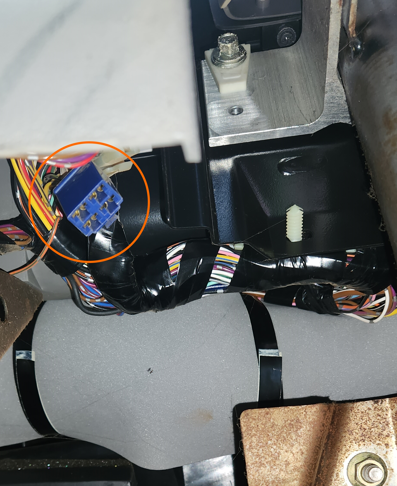

# Accessory plug

## How to find it
The accessory plug is a blue plug that was 1 of 2 plugs initially intended for the Mobile Office option for the AU Falcon, and should be easy enough to find under the driver-side dash. You are looking for a 4-way quick connect connector, which should be a deep blue color. Information on this part is sparce, but some sources note it as a 250 style connector, which is manufactured by multiple sources, such as Narva

> image taken from Narva product page for part number 56274BL

> photo of accessory plug in it's natural habitat

## IMPORTANT
These quick connect connectors are somewhat generic, and as such many manufacturers sell then, however ensure you buy the ones with the key notches on the *same side* as the locking clip, and some are manufactured with them on the opposite side and will ***NOT*** fit as a result

> image taken from an Aliexpress listing, note the notches in the bottom of the plug instead of the top

## Pinout
Use the following diagram and pinout list for reference. This diagram assumes that the clip is facing up and you are looking at the female housing connector (the blue plug or loom end wiring connector)

| 01 | 02 |
| --- | --- |
| 03 | 04 |

- 01 - 12v constant power
- 02 - GND
- 03 - Ignition power (low power, for standby switch most likely)
- 04 - N/a