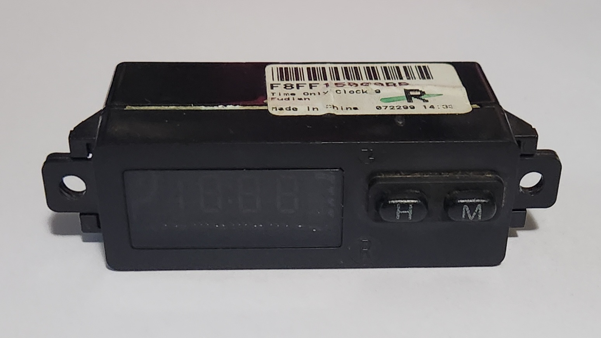
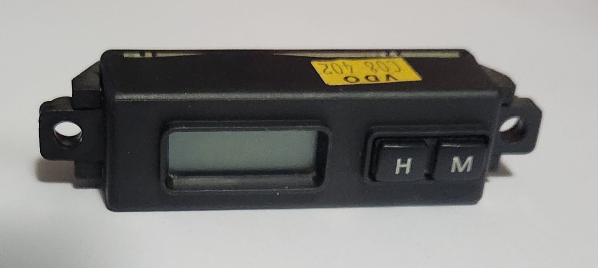
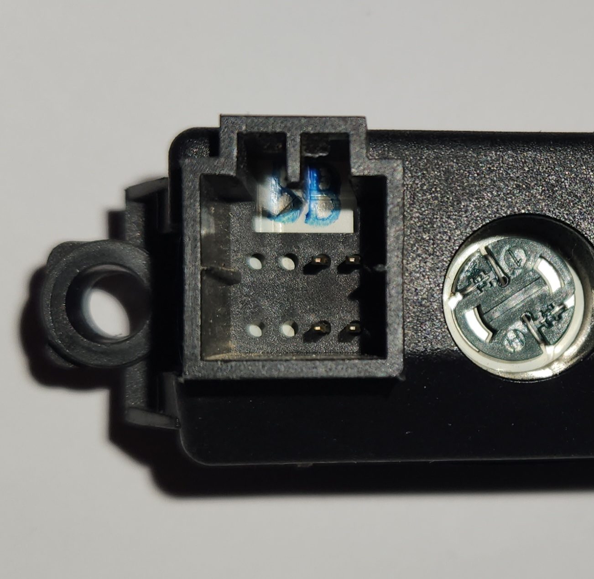
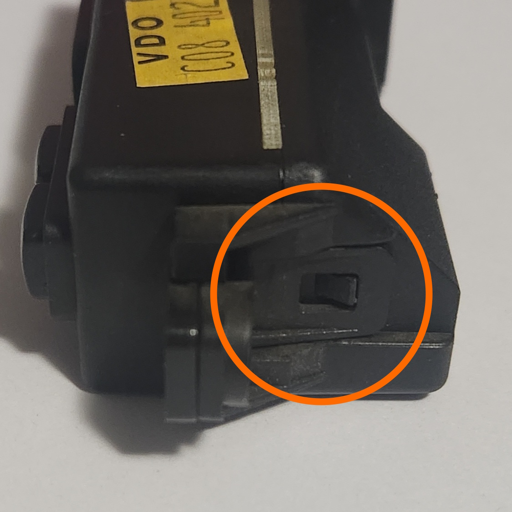
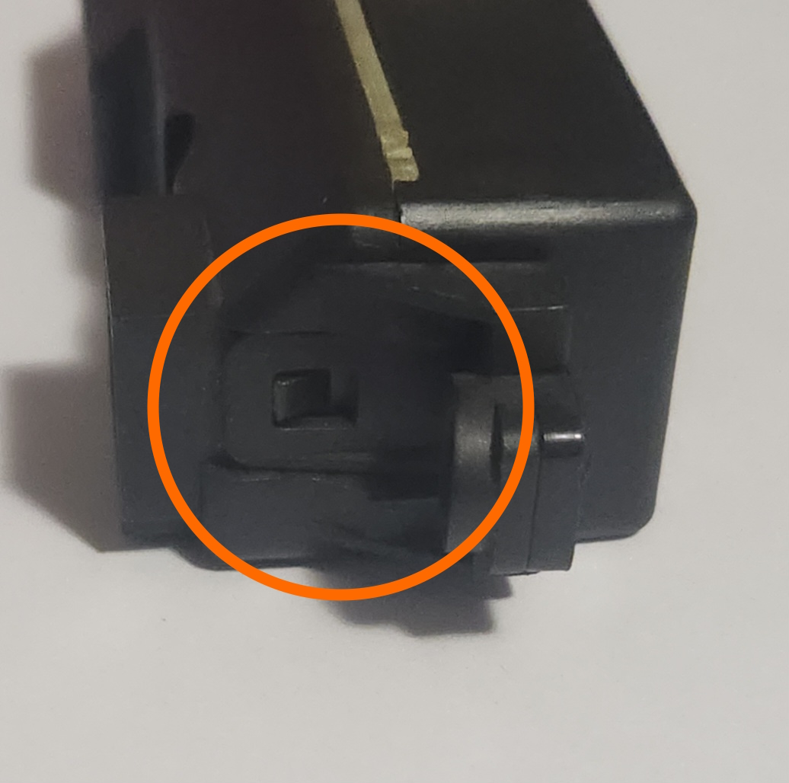
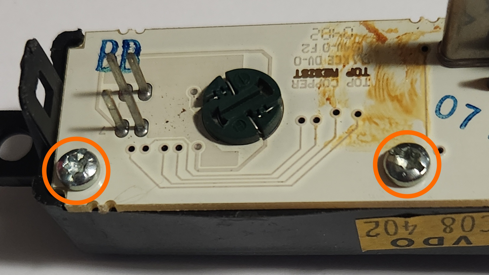
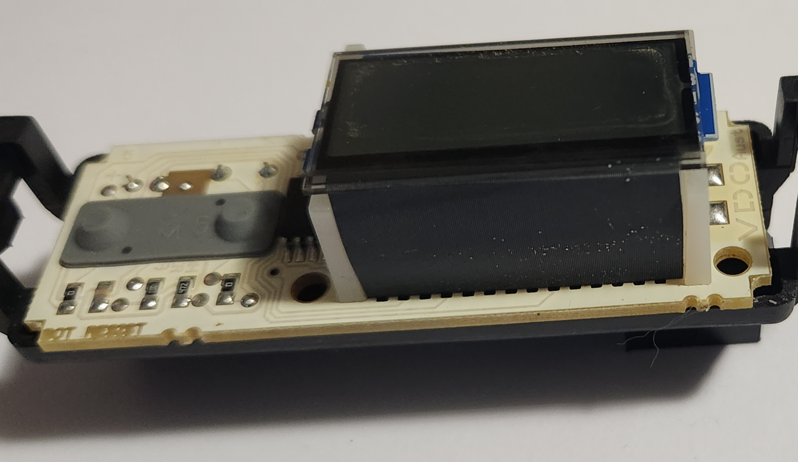
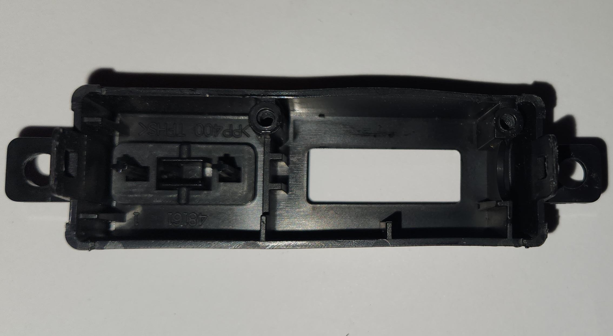

# Digital Clock

Most trim levels of AU Falcon contain a small digital clock, which is a standalone digital clock which sits above the [Head unit](../../Audio/HeadUnit/HeadUnit.md) and Air Conditioner Controls. It is a small and simple clock that only requires power and trigger wires where required.

## Variations

The AU Falcon clock came in 2 variations, based on the Series of AU Falcon:

LED:
- Uses an older display, similar to old digital alarm clocks
- Identified by coloured numbers on an otherwise blackened display and round buttons
- Commonly found in [Non-Falcon models](#other-models)
- Fitted to the S1 and S1.5 AU Falcons
- 8/8 plug pins present (5 used)
- OEM - Fudian

> Picture of a Series 1 digital clock assembly

> Picture of the plug on the rear of the Series 1 clock assembly

LCD:
- Uses a newer LCD style display, similar to odometers in the AUII-BFIII Falcon Instrument cluster
- Identified by black numbers on a backlit grey display (backlight colour determines background tint from grey) and small square buttons
- Specific clock unique to the S2 and S3 AU Falcons
- Thinner than the S1-1.5 counterparts
- 4/8 pins present (4 used)
- OEM - VDO Australia

> Picture of a Series 3 digital clock assembly (identical to Series 2)

> Picture of the plug on the rear of the Series 2-3 clock assembly

## Exceptions

There are 2 subsets of AU Falcon that *do not* have the digital clock installed, which are:

- Some low model [Series 1](../../Miscellaneous/SeriesInformation/SeriesInformation.md#series-1) vehicles (typically Forte/Futura, contains a small blanking plate that says "falcon" with the requisite wiring behind the centre dash)

    > There are conflicting reports that Series 1 AU Falcons fitted with the [low BCM](../../PCMBCM/BCM/BCM.md#model-variations) have no clock wiring present, and may require custom wiring to fit a clock behind this blanking plate
    {: .block-note}

- Any high model vehicle (Fairmont/Fairlane/LTD/T*-50), which contains an analogue clock as part of the more advanced climate control module in the same area of the centre dash.

## Other Models

There are some Ford models which contain the same clock as the AU Falcon, which may be useful information to source parts. Use the table below for models with the same plug, wiring and clock available:

> Most of these models are international, and as a result may cost more than AU Falcon parts. This is here as a supplement should Falcon parts become scarce
{: .block-note}

| Make | Model | Years | Best-Fit model(s) | Notes |
| --- | --- | --- | --- | --- |
| Ford | Crown Victoria | 1998-2002 | S1-1.5 | LED Green numbering. Clock assumed removed 2003-2011 |
| Ford | Courier | 1999-2006 | S1-1.5 | LED Green/White numbering. Model is identical to Mazda Bravo |
| Ford | Mustang | 1994-2004 | S1-1.5 | LED Blue numbering |
| Ford | Taurus | 1993-1995 | S1-1.5 | LED Green numbering |
| Ford | Territory | 2004-2011 | S2-3 | LCD display with generally coloured backlight. Buttons are larger than AU Falcon clock button holes so centre dash or clock will require [modification for fitment](#series-2-3---replacing-the-cover-on-the-digital-clock) |
| Ford | Ranger | 1995-2007 | S1-1.5 | LED Green numbering. Clock assumed removed 2008-2011 |
| Lincoln | Blackwood | 2002-2003 | S1-1.5 | LED Green numbering. Rare vehicle model |
| Lincoln | Navigator | 1998-2002 | S1-1.5 | LED White numbering, later models used an analogue clock instead |
| Lincoln | Town Car | 1993-1997 | S1-1.5 | LED White numbering. Rare vehicle model |
| Mazda | Bravo | 1999-2006 | S1-1.5 | LED Green/White numbering. Model is identical to Ford Courier |
| Mercury | Marauder | 2003-2004 | S1-1.5 | LED Green numbering. Rare vehicle model |
| Mercury | Grand Marquis | 1995-2005 | S1-1.5 | LED Green numbering. Analogue clock fitted 1993-1994, and assumed no clock installed 2006-2011 |
{: .sortable-table}

## Plug Type

### Series 1

> The plugs for the wiring of the series 1 clock loom have no known aftermarket part number at time of writing. Wiring kits do exist overseas for [other models](#other-models), however they are expensive to acquire new to Australia or New Zealand. Details are below for OEM plugs, however the recommended course of action for the foreseeable future is to source wreck parts locally where possible
{: .block-note}

The plugs for the wiring of the S1-1.5 AU Falcon clock looms are identified as OEM-specific plugs. The only known part numbers are listed below, sourced from [Motorcraft](../../Credits.md#sources) Parts listings

| Name | Product Number(s) | Notes |
| --- | --- | --- |
| Female Connector Housing | 1W3Z-14S411-AB   1W3Z-14S411-AC   WPT-100   WPT-1046 | Confirmed from 2016 dated parts listing |
| Male Connector Housing | *UNKNOWN* | No known availability but assumed manufactured by Motorcraft internally and soldered to clock components only |

### Series 2-3

The plugs for the wiring of the later series' clock loom are MULTILOCK 040 II connectors, similar to the [Instrument Cluster](../../PCMBCM/InstrumentCluster/InstrumentCluster.md#plug-types).

| Name | Product Number | Notes |
| --- | --- | --- |
| Male Connector Housing | 175964-2 | Loom end connector |
| Female Connector Housing (PCB Mount) | 175973-2 | Clock end connector |

## Pinout

The following information assumes you are looking at the connector on the back of the clock (male terminal housing) with the connector clip cutout facing up:

| `01` | `02` | `03` | `04` |
| --- | --- | --- | --- |
| **`05`** | **`06`** | **`07`** | **`08`** |

### Series 1

> Not confirmed accurate at time of writing. The following information is based on a Non-AU Falcon parts listing and is yet to be confirmed
{: .block-warning}

<!-- TODO confirm this - based on mustang clock ebay listing currently -->

| Pin | Function | Notes |
| --- | --- | --- |
| 01 | | |
| 02 | | |
| 03 | GND | |
| 04 | 12v + | |
| 05 | Headlight trigger | |
| 06 | | |
| 07 | Illumination (+ assumed) | |
| 08 | Headlight trigger | |

### Series 2-3

| Pin | Function | Notes |
| --- | --- | --- |
| 01 | N/a | no pin |
| 02 | N/a | no pin |
| 03 | GND | |
| 04 | 12v + | |
| 05 | N/a | no pin |
| 06 | N/a | no pin |
| 07 | Illumination (+ assumed) | |
| 08 | Headlight trigger | |

## Series 2-3 - Replacing the Cover on the Digital Clock

If you own a Series 2-3 digital clock that has failed electrically, and due to external factors only have access to the later Ford Territory digital clock, the existing AU Falcon clock surround can be used with the internals of the Territory electrics. Follow the instructions below to replace the clock surround:

> These instructions do *not* work with Series 1 digital clocks, as they are different both electrically and structurally. However, this will work if the opposite supply issue is true, and you wish to replace Territory clock internals with that of a later model AU Falcon.
{: .block-note}

1. Unclip and remove the 2 side clips on the assembly and slide the rear plastic away from under the tabs of the rest of the assembly

    
    

    > Pictures of the 2 clips to be pried away from the rear plastic

1. Remove the 2 PCB screws using either a flat-head screwdriver or a T10/TR10 Torx bit screwdriver

    

    > Picture of the locations of the 2 screws to be removed

1. **CAREFULLY** remove the front plastic from the assembly, making sure to have the clock face pointing up while you pull the plastic away from the board

    > This is important as the screen itself is not physically held in by anything other than the 2 screws. instead, it is pressured into place in front of a diffuser sheet and a spacer/elastomeric connector
    {: .block-warning}

    

    > Picture of the removed PCB sitting inverted on the front plastic. Note the additional parts between the PCB and the LCD screen

    

    > Picture of the inside of the AU front plastic housing. Note that there is no clips or screws to hold the PCB in place, barring the 2 holes where the screws were removed

1. Reverse all previous steps using the AU Falcon plastic surround and the Territory electrical components

1. Done