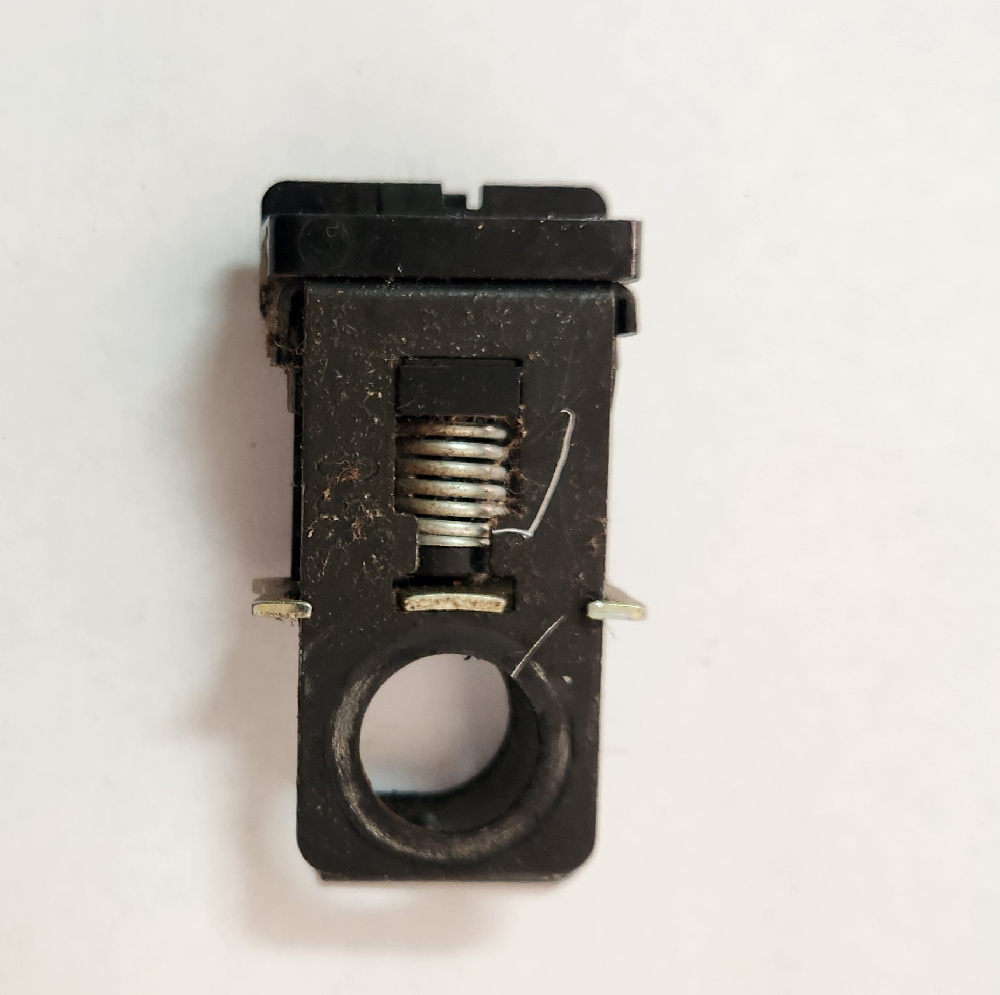

# Brake Switch

If you find that your brake lights are not turning on when you expect, or you find the cruise control is not disengaging when pressing the brake pedal, you may find that you have a faulty brake switch. The brake switch is the electrical component that tells the car that you have pressed the brakes, as without it the car only mechanically activates the brake booster.

> The brakes will not fail due to a brake switch failure. If you find any symptoms with your brakes mechanically then there is a problem with the brake system itself
{: .block-warning}

## Diagnosis

Diagnosis for this part is simple. Start the vehicle and put your foot lightly on the brake pedal, in any gear. Have another person check for brake light funtionality

> Alternatively, 2-3 standard red bricks can be wedged into place to force the brake pedal down, however this is a last resort option if no one else is available
{: .block-note}

## Replacement

Follow the below steps to replace your brake switch:

> These steps are easiest completed with the driver seat removed, but can be done from the side of the car or by laying upside-down on the drive seat, depending on your flexibility
{: .block-note}

1. Find and remove the yellow retaining pin from the end of the brake pedal shaft, located on the passenger-side of the brake pedal lever, towards the top.

    

    > Yellow retaining pin on brake pedal shaft. Note picture was taken after replacement due to space constraints.

1. If present, remove the small green plastic ring from the brake lever pin by pulling it from the brake pedal shaft.

    > This ring *should* be present, but in older models, they could potentially break or not be reinstalled if the switch was replaced previously
    {: .block-note}

1. Remove the brake switch by pulling the passenger side section (with the complete hole) over the top of the shaft, and then pulling the driver side section (the semi-circle opening) of the switch away from the shaft. The switch sits around the brake booster level, with the closed end to the left of and the open end on the right of the lever.

    > Alternatively you can pull the brake booster lever off of the brake pedal shaft all at once, however this was found to be inefficient

    

    > Picture of the brake booster lever, after the brake switch has been removed

    

    > The closed side of the factory brake switch. This is the section that will need to be pulled over the shaft

    

    > The open side of the factory brake switch. This is the section that can be pulled away from the brake pedal shaft once the closed side is removed

1. Unplug the electrical connector by pulling up on the retaining tab on the loom end connector

    

    > Picture of the factory brake switch connector. The clip on the brake switch itself is reinforced from underneath, necessitating removal by moving the retaining clip of the loom end connector instead.

1. Reverse all previous steps to reinstall, ensuring that the switch has:
    - The open side on the driver side of the brake booster lever
    - The closed side on the passenger side of the brake booster lever
    - Been secured in using the green plastic ring and retaining pin
    - Is electrically connected to the loom
    
    

    > Picture of the switch after installation. Note the pin, green ring, and location of the brake booster lever

1. Done