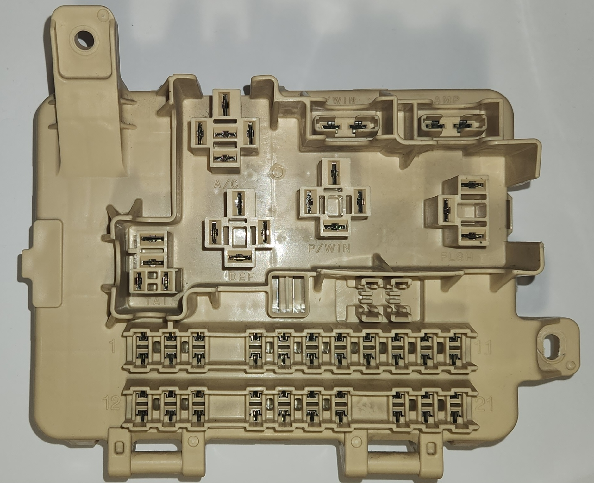
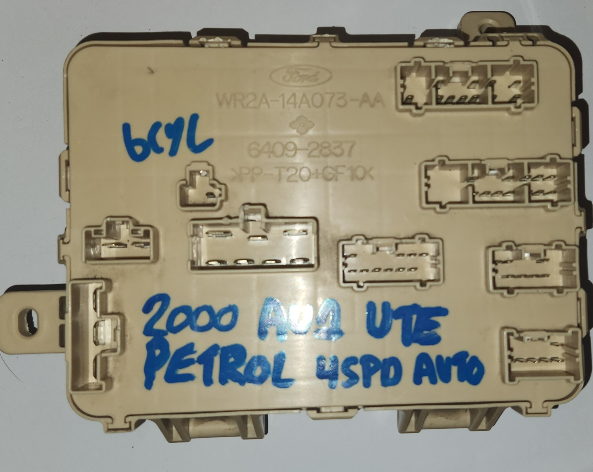
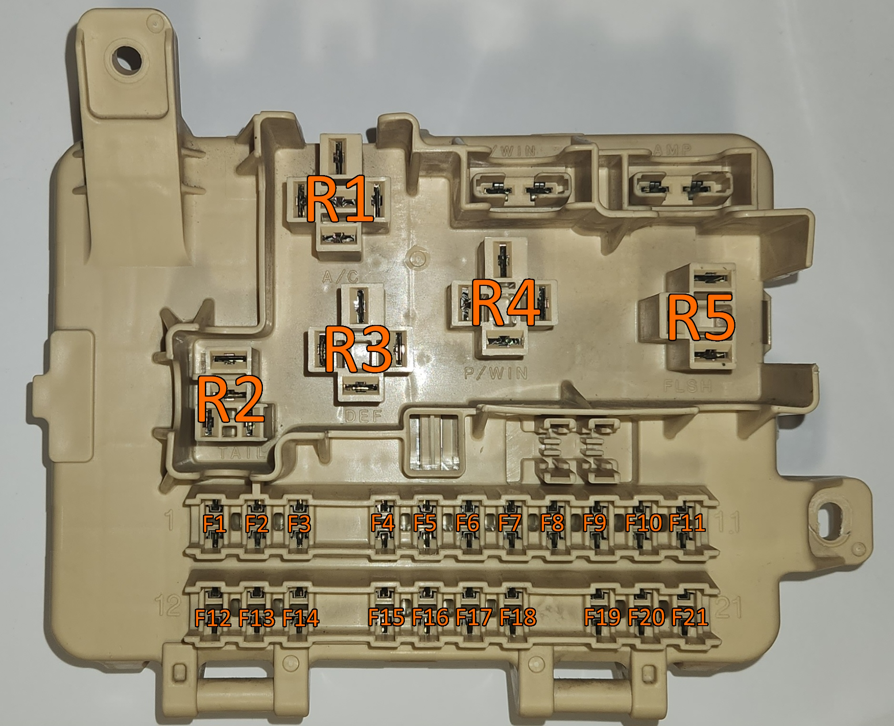
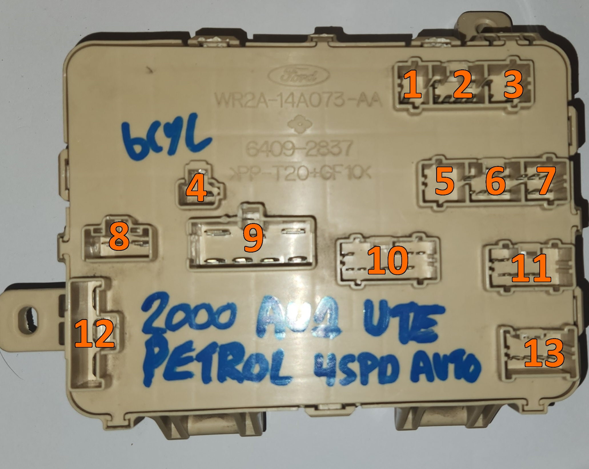

# Cabin Fuse Panel

> This is a more technical page, if you are simply looking for vehicle-specific fuse and relay information or minimum required fuses, see [HERE](../Fuses/Fuses.md) instead, and for general relay information, see [HERE](../Relays/Relays.md)

> NOTE: This page is a half complete mess from an idea that went as well as a lead balloon. The only reason this page still exists is due to the time it took to create, and the hope that someone can make sense of anything discovered in here. Every attempt has been made to make the notes here legible, but this is not guaranteed.

the cabin fuse box has 11 individual electrical plugs that comprise it's wiring, and as such the wiring has been divided as below per plug.

> NOTE: all diagrams assume that you are facing either the front or the back of the cabin fuse panel, with the relays at the top.

> Pictures of how the fuse panel should be facing you from the front a rear respectively

## Reading this guide

Use the legends table below to decipher what each code means. This was made in order to make more sense of the pins on both the front ***AND*** back of the cabin fuse box

| Code | Meaning | Notes |
| --- | --- | --- |
| F`x`-`y` | Fuse location by number index | requires below diagram or labelled cabin fuse panel. e.g. F1-1 for the top pin of fuse 1, F1-2 for fuse 1's bottom pin, etc. (assume you are facing the cabin fuse panel with the relays at the top and the fuses down the bottom)|
| R`x`-`y` | Relay pin location by index | requires guide below, e.g. R1-1 for the top pin of the A/C relay |

## Fuse & Relay Connectors (Front)

These connectors are identifiable according to the annotated image:

> NOTE: the P/WIN and AMP fuses are not marked on purpose, both because they are clearly marked ***AND*** because depending on the manual, these have different designations, which overlap with the existing fuses in the bottom

### Main Fuse Cluster

Below is a layout of all fuse block pins:

<table class="large-table diagram-table">
  <tr>
    <td><code>F1-1</code></td>
    <td><code>F2-1</code></td>
    <td><code>F3-1</code></td>
    <td></td>
    <td><code>F4-1</code></td>
    <td><code>F5-1</code></td>
    <td><code>F6-1</code></td>
    <td><code>F7-1</code></td>
    <td><code>F8-1</code></td>
    <td><code>F9-1</code></td>
    <td><code>F10-1</code></td>
    <td><code>F11-1</code></td>
  </tr>
  <tr>
    <td><code>F1-2</code></td>
    <td><code>F2-2</code></td>
    <td><code>F3-2</code></td>
    <td></td>
    <td><code>F4-2</code></td>
    <td><code>F5-2</code></td>
    <td><code>F6-2</code></td>
    <td><code>F7-2</code></td>
    <td><code>F8-2</code></td>
    <td><code>F9-2</code></td>
    <td><code>F10-2</code></td>
    <td><code>F11-2</code></td>
  </tr>
  <tr>
    <td><code>F12-1</code></td>
    <td><code>F13-1</code></td>
    <td><code>F14-1</code></td>
    <td></td>
    <td><code>F15-1</code></td>
    <td><code>F16-1</code></td>
    <td><code>F17-1</code></td>
    <td><code>F18-1</code></td>
    <td></td>
    <td><code>F19-1</code></td>
    <td><code>F20-1</code></td>
    <td><code>F21-1</code></td>
  </tr>
  <tr>
    <td><code>F12-2</code></td>
    <td><code>F13-2</code></td>
    <td><code>F14-2</code></td>
    <td></td>
    <td><code>F15-2</code></td>
    <td><code>F16-2</code></td>
    <td><code>F17-2</code></td>
    <td><code>F18-2</code></td>
    <td></td>
    <td><code>F19-2</code></td>
    <td><code>F20-2</code></td>
    <td><code>F21-2</code></td>
  </tr>
</table>

### relay 1 - A/C Relay

This relay is a the only full-sized 5 way relay connector present in the cabin fuse panel. For the following assume the following layout:

<table style="text-align:center">
    <tr>
        <td colspan="3"><b><code>R1-1</code></b></td>
    </tr>
    <tr>
        <td><b><code>R1-2</code></b></td>
        <td><b><code>R1-3</code></b></td>
        <td><b><code>R1-4</code></b></td>
    </tr>
    <tr>
        <td colspan="3"><b><code>R1-5</code></b></td>
    </tr>
</table>

#### Pin definitions

| Index | Relay Terminal Number |
| --- | --- |
| R1-1 | 87 |
| R1-2 | 85 |
| R1-3 | 87a |
| R1-4 | 86 |
| R1-5 | 30 |

> More information: [Relays](../Relays/Relays.md#5-way-mini-iso-relay)

### relay 2 - TAIL Relay

This relay is a half-size 4 way relay connector. For the following assume the following layout:

<table style="text-align:center">
    <tr>
        <td colspan="2"><b><code>R2-1</code></b></td>
    </tr>
    <tr>
        <td colspan="2"><b><code>R2-2</code></b></td>
    </tr>
    <tr>
        <td><b><code>R2-3</code></b></td>
        <td><b><code>R2-4</code></b></td>
    </tr>
</table>

#### Pin definitions

| Index | Relay Terminal Number |
| --- | --- |
| R2-1 | 2 |
| R2-2 | 1 |
| R2-3 | 5 |
| R2-4 | 3 |

> NOTE: these half-size relays are generally 5-way relays rather than 4-way, however in the Original part, the pin between `R2-1` and `R2-2` (relay terminal pin number 4) has been cut off

> More information: [Relays](../Relays/Relays.md#4-way-micro-iso-relay)

### relay 3 - DEF Relay

This relay is a full-size 4 way relay, for the following assume the following layout:

<table style="text-align:center">
    <tr>
        <td colspan="3"><b><code>R3-1</code></b></td>
    </tr>
    <tr>
        <td><b><code>R3-2</code></b></td>
        <td></td>
        <td><b><code>R3-3</code></b></td>
    </tr>
    <tr>
        <td colspan="3"><b><code>R3-4</code></b></td>
    </tr>
</table>

#### Pin definitions

| Index | Relay Terminal Number |
| --- | --- |
| R3-1 | 87 |
| R3-2 | 85 |
| R3-3 | 86 |
| R3-4 | 30 |

> More information: [Relays](../Relays/Relays.md#4-way-mini-iso-relay)

### relay 4 - P/WIN Relay

This relay is a full-size 4 way relay, for the following assume the following layout:

<table style="text-align:center">
    <tr>
        <td colspan="3"><b><code>R4-1</code></b></td>
    </tr>
    <tr>
        <td><b><code>R4-2</code></b></td>
        <td></td>
        <td><b><code>R4-3</code></b></td>
    </tr>
    <tr>
        <td colspan="3"><b><code>R4-4</code></b></td>
    </tr>
</table>

#### Pin definitions

| Index | Relay Terminal Number |
| --- | --- |
| R4-1 | 87 |
| R4-2 | 85 |
| R4-3 | 86 |
| R4-4 | 30 |

> More information: [Relays](../Relays/Relays.md#4-way-mini-iso-relay)

### relay 5 - FLSH Relay

This relay is a 3 way flasher relay, for the following assume the following layout:

<table style="text-align:center">
    <tr>
        <td rowspan="2"><b><code>R5-1</code></b></td>
        <td><b><code>R5-2</code></b></td>
    </tr>
    <tr>
        <td><b><code>R5-3</code></b></td>
    </tr>
</table>

#### Pin definitions

| Index | Relay Terminal Number |
| --- | --- |
| R5-1 | 49a |
| R5-2 | 31 |
| R5-3 | 49 |

> More information: [Relays](../Relays/Relays.md#3-way-flasher-relay)

## Connector Plugs (Rear)

These plugs are identifiable according to the annotated image below

### plug 1 - 1-way connector

this plug contains a single pin, noted as 1-1, which has continuity with F21-2

### plug 2 - 6-way connector

For the following assume the following plug layout:

| **`2-1`** | | | **`2-2`** |
| --- | --- | --- | --- |
| **`2-3`** | **`2-4`** | **`2-5`** | **`2-6`** |

These pins have continuity with the following:

| pin | continuity |
| --- | --- |
| 2-1 | [R1-2](#relay-1---ac-relay) |
| 2-2 | [R5-1](#relay-5---flsh-relay) |
| 2-3 | [R5-3](#relay-5---flsh-relay) |
| 2-4 | [Circuit 3](#circuit-3---tail) |
| 2-5 | [R1-3](#relay-1---ac-relay) |
| 2-6 | [Circuit 5](#circuit-5---misc-fuses--connector-pins)|

### plug 3 - 4-way connector

For the following assume the following plug layout:

| **`3-1`** | | **`3-2`** |
| --- | --- | --- |
| **`3-3`** | | **`3-4`** |

These pins have continuity with the following:

| pin | continuity |
| --- | --- |
| 3-1 | [R3-1](#relay-3---def-relay) |
| 3-2 | [Circuit 4](#circuit-4---ac--flsh) |
| 3-3 | left pin - AMP fuse |
| 3-4 | [F14-2](#main-fuse-cluster) |

### plug 4 - 1-way connector

This plug has a single pin, noted as 4-1, which has continuity to Pin [R4-1](#relay-4---pwin-relay)

### plug 5 - blank

This plug does not have any connectors in the Forte models

> NOTE: this may be different in other models, information limited as project only involved Forte cabin fuse boxes

### plug 6 - 6-way connector

For the following assume the following plug layout:

| **`6-1`** | | | **`6-2`** |
| --- | --- | --- | --- |
| **`6-3`** | **`6-4`** | **`6-5`** | **`6-6`** |

These pins have continuity with the following:

| pin | continuity |
| --- | --- |
| 6-1 | [F9-2](#main-fuse-cluster) |
| 6-2 | [Circuit 5](#circuit-5---misc-fuses--connector-pins) |
| 6-3 | [R3-2](#relay-3---def-relay) |
| 6-4 | [F10-1](#main-fuse-cluster) |
| 6-5 | connected to pin 6-4 |
| 6-6 | [Circuit 4](#circuit-4---ac--flsh) |

### plug 7 - 6-way connector
for the following assume the following plug layout:

| **`7-1`** | **`7-2`** | **`7-3`** |
| --- | --- | --- |
| **`7-4`** | **`7-5`** | **`7-6`** |

These pins have continuity with the following:

| pin | connectivity |
| --- | --- |
| 7-1 | [F1-1](#main-fuse-cluster) |
| 7-2 | [F12-2](#main-fuse-cluster) |
| 7-3 | [Circuit 4](#circuit-4---ac--flsh) |
| 7-4 | [F19-2](#main-fuse-cluster) |
| 7-5 | [F19-2](#main-fuse-cluster) |
| 7-6 | [F5-2](#main-fuse-cluster) |

### plug 8 - 2-way connector

for the following assume the following plug layout:

<table class="diagram-table">
    <tr>
        <td><code>8-1</code></td>
        <td><code>8-2</code></td>
    </tr>
</table>

These pins have continuity with the following:

| pin | continuity |
| --- | --- |
| 8-1 | [R1-1](#relay-1---ac-relay) |
| 8-2 | [Circuit 6](#circuit-6---misc-fuses--connector-pins-no-2) |

### plug 9 - 7-way connector

Plug 9 is unique as it has 2 different pin sizes within the plug housing. There are 3 pins on the top row and 4 on the bottom, as below:

<table style="text-align:center">
    <tr>
        <td colspan="4"><b><code>9-1</code></b></td>
        <td colspan="4"><b><code>9-2</code></b></td>
        <td colspan="4"><b><code>9-3</code></b></td>
    </tr>
    <tr>
        <td colspan="3"><b><code>9-4</code></b></td>
        <td colspan="3"><b><code>9-5</code></b></td>
        <td colspan="3"><b><code>9-6</code></b></td>
        <td colspan="3"><b><code>9-7</code></b></td>
    </tr>
</table>

These pins have continuity with the following:

| pin | continuity |
| --- | --- |
| 9-1 | right pin - P/WIN fuse |
| 9-2 | [F18-2](#main-fuse-cluster) |
| 9-3 | [Circuit 7](#circuit-7---misc-fuses--connector-pins-no-3) |
| 9-4 | [R1-1](#relay-1---ac-relay) |
| 9-5 | [Circuit 2](#circuit-2---def) |
| 9-6 | [R4-1](#relay-4---pwin-relay) |
| 9-7 | [Circuit 6](#circuit-6---misc-fuses--connector-pins-no-2) |

### plug 10 - 10-way connector

for the following assume the following plug layout:

| **`10-1`** | | | | **`10-2`** | **`10-3`** | **`10-4`** |
| --- | --- | --- | --- | --- | --- | --- |
| **`10-5`** | **`10-6`** | **`10-7`** | **`10-8`** | **`10-9`** | **`10-10`** | |

These pins have continuity with the following:

| pin | continuity |
| --- | --- |
| 10-1 | [F7-1](#main-fuse-cluster) |
| 10-2 | [F2-2](#main-fuse-cluster) |
| 10-3 | [Circuit 3](#circuit-3---tail) |
| 10-4 | [R2-3](#relay-2---tail-relay) |
| 10-5 | [R4-2](#relay-4---pwin-relay) |
| 10-6 | [F3-1](#main-fuse-cluster) |
| 10-7 | [F6-1](#main-fuse-cluster) |
| 10-8 | [F4-1](#main-fuse-cluster) |
| 10-9 | [F3-1](#main-fuse-cluster) |
| 10-10 | [F5-2](#main-fuse-cluster) |

### plug 11 - 7-way connector

for the following assume the following plug layout:

| **`11-1`** | **`11-2`** | | | **`11-3`** | |
| --- | --- | --- | --- | --- | --- |
| | **`11-4`** | **`11-5`** | **`11-6`** | **`11-7`** | |

These pins have continuity with the following:

| pin | continuity |
| --- | --- |
| 11-1 | [Circuit 11](#circuit-11---tail) |
| 11-2 | [Circuit 3](#circuit-3---tail) |
| 11-3 | [F12-2](#main-fuse-cluster) |
| 11-4 | [F14-1](#main-fuse-cluster) |
| 11-5 | [Circuit 4](#circuit-4---ac--flsh) |
| 11-6 | [Circuit 4](#circuit-4---ac--flsh) |
| 11-7 | [F13-2](#main-fuse-cluster) |

### plug 12 - 3 way connector

for the following assume the following layout:

<table class="diagram-table">
    <tr>
        <td>
            <code>12-1</code>
            <code>12-2</code>
            <code>12-3</code>
        </td>
    </tr>
</table>

These pins have continuity with the following:

| pin | continuity |
| --- | --- |
| 12-1 | [Circuit 8](#circuit-8---amp) |
| 12-2 | [Circuit 9](#circuit-9---misc-fuses) |
| 12-3 | [Circuit 10](#circuit-10---pwin) |

### plug 13 - 6-way connector

for the following assume the following layout:

| | | | | **`13-1`** |
| --- | --- | --- | --- | --- |
| **`13-2`** | **`13-3`** | **`13-4`** | **`13-5`** | **`13-6`** |

These pins have continuity with the following:

| pin | continuity |
| --- | --- |
| 13-1 | [F19-2](#main-fuse-cluster) |
| 13-2 | [F16-1](#main-fuse-cluster) |
| 13-3 | [F20-1](#main-fuse-cluster) |
| 13-4 | [Circuit 4](#circuit-4---ac--flsh) |
| 13-5 | [Circuit 4](#circuit-4---ac--flsh) |
| 13-6 | [R3-1](#relay-3---def-relay) |

## Additional Circuits

### Circuit 1 - P/WIN

There is a direct link between the following pins, related to the Power Windows circuit
- [R4-4](#relay-4---pwin-relay)
- [R4-3](#relay-4---pwin-relay)
- left pin P/WIN fuse

### Circuit 2 - DEF

There is a direct link between the following pins, related to the Rear Window Defrost circuit
- [F8-1](#main-fuse-cluster)
- [R3-4](#relay-3---def-relay)

### Circuit 3 - TAIL

There is a direct link between the following pins, related to the Tail light circuit
- [connector pin **`10-3`**](#plug-10---10-way-connector)
- [connector pin **`2-4`**](#plug-2---6-way-connector)
- [connector pin **`13-2`**](#plug-13---6-way-connector)
- [R2-1](#relay-2---tail-relay)

### Circuit 4 - A/C & FLSH

There is a direct link between the following pins, related to the FLSH and A/C circuits:
- [R5-2](#relay-5---flsh-relay)
- [R1-4](#relay-1---ac-relay)
- [connector pin **`3-2`**](#plug-3---4-way-connector)
- [connector pin **`7-3`**](#plug-7---6-way-connector)
- [connector pin **`7-6`**](#plug-7---6-way-connector)
- [connector pin **`11-6`**](#plug-11---7-way-connector)
- [connector pin **`11-7`**](#plug-11---7-way-connector)
- [connector pin **`13-4`**](#plug-13---6-way-connector)
- [connector pin **`13-5`**](#plug-13---6-way-connector)
- [connector pin **`13-6`**](#plug-13---6-way-connector)

### Circuit 5 - Misc. Fuses & Connector Pins No. 1

There is a direct link between the following pins, related to a single fuse, and multiple rear connector pins:
- [F11-2](#main-fuse-cluster)
- [connector pin **`6-2`**](#plug-6---6-way-connector)
- [connector pin **`6-5`**](#plug-6---6-way-connector)

### Circuit 6 - Misc. Fuses & Connector Pins No. 2

There is a direct link between the following fuse pins, related to multiple connector pins and multiple fuses:
- [F1-2](#main-fuse-cluster)
- [F2-1](#main-fuse-cluster)
- [F6-2](#main-fuse-cluster)
- [F7-2](#main-fuse-cluster)
- [F17-1](#main-fuse-cluster)
- [F18-1](#main-fuse-cluster)
- [connector pin **`8-2`**](#plug-8---2-way-connector)
- [connector pin **`9-7`**](#plug-9---7-way-connector)

### Circuit 7 - Misc. Fuses & Connector Pins No. 3

There is a direct link between the following fuse pins, related to multiple connector pins and multiple fuses:
- [F3-2](#main-fuse-cluster)
- [F4-2](#main-fuse-cluster)
- [F12-1](#main-fuse-cluster)
- [F13-1](#main-fuse-cluster)
- [F14-2](#main-fuse-cluster)
- [connector pin **`9-3`**](#plug-9---7-way-connector)

### Circuit 8 - AMP

There is a direct link between the following pins, related to the Amplifier circuit
- [R1-5](#relay-1---ac-relay)
- right pin - AMP fuse

### Circuit 9 - Misc. Fuses

There is a direct link between the following pins, related to a single connector pin and multiple fuses:
- [F8-2](#main-fuse-cluster)
- [F9-1](#main-fuse-cluster)
- [F10-2](#main-fuse-cluster)
- [F11-1](#main-fuse-cluster)
- [F21-1](#main-fuse-cluster)
- [connector pin **`12-2`**](#plug-12---3-way-connector)

### Circuit 10 - P/WIN

There is a direct link between the following pins, related to the Power Window Circuit, one connector pin, and multiple fuses:
- right pin - P/WIN fuse
- [F15-2](#main-fuse-cluster)
- [F16-2](#main-fuse-cluster)
- [connector pin **`12-3`**](#plug-12---3-way-connector)

### Circuit 11 - TAIL

There is a direct link between the following pins, related to the TailLights relay and a fuse:
- [R2-2](#relay-2---tail-relay)
- [R2-4](#relay-2---tail-relay)
- [F15-1](#main-fuse-cluster)