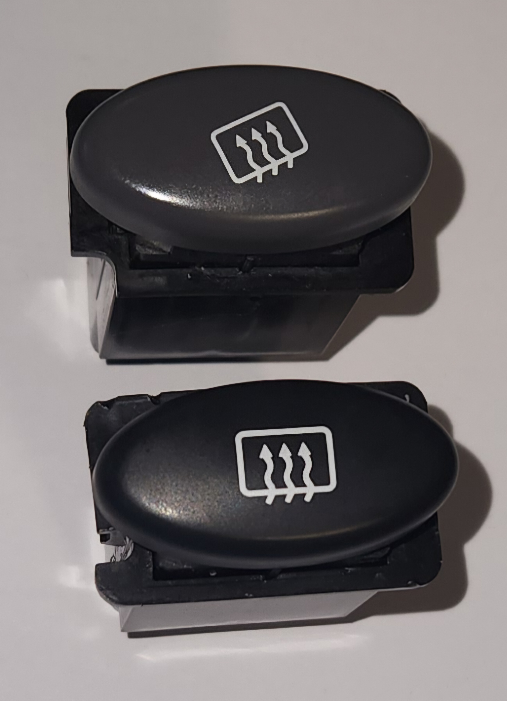

# Centre Console Buttons

> This does not cover buttons in the standard Series 2-3 dash, as they are tightly integrated with the newer designed climate control system.
{: .block-note}

The buttons within the centre dash area of some models of AU Falcon use connectors that are simply known as 090 Connectors, originally manufactured by [Yazaki](../../Credits.md#sources). These are similar connectors to those used throughout other interior plugs within the AU Falcon Cabin in particular.

## Known models

Due to a moderate redesign of the dash area of the AU Falcon between [Series 1](../../Miscellaneous/SeriesInformation/SeriesInformation.md#series-1) and [Series 2](../../Miscellaneous/SeriesInformation/SeriesInformation.md#series-2), only the following models appear to have these buttons present:

- AU Falcon ([Series 1](../../Miscellaneous/SeriesInformation/SeriesInformation.md#series-1) only, primarily Demist button)
- AU Fairmont
- AU Fairlane/LTD
- T-Series (T*-50)
- AU Falcon Ute (Where column shift transmission fitted, [ECON button](#specifics---econlock-button) only)

## Additional Notes

If you wish to replace or "upgrade" button(s) on a [Series 1](../../Miscellaneous/SeriesInformation/SeriesInformation.md#series-1) Falcon using parts from a high trim model (Fairmont/Fairlane/LTD/T*-50), the following should be considered before proceeding:

- [Series 1](../../Miscellaneous/SeriesInformation/SeriesInformation.md#series-1) low trim model vehicles have icons on an angle for alignment with the rest of the dash. Both the high trim models and the later series models (where fitted) contain black buttons with angles allowing for horizontal button placement (picture below list)

- High trim model buttons contain a smaller notch in the bottom left corner of the button switch mechanism for keyed mounting. This does not fit into the [Series 1](../../Miscellaneous/SeriesInformation/SeriesInformation.md#series-1) low trim models without either:

    - Cutting the notch off of the high trim model button
    - Cutting the small keys off of the centre dash trim of the recieving vehicle

- [Series 1](../../Miscellaneous/SeriesInformation/SeriesInformation.md#series-1) low trim models are fitted with grey buttons, whereas the high trim models are fitted with black buttons instead. This appears to be irrespective of the series of donor high trim model vehicle.

- Only one function appears to have the prerequisite wiring available in the [Series 1](../../Miscellaneous/SeriesInformation/SeriesInformation.md#series-1) low trim model vehicles, which is the [ECON button](#specifics---econlock-button). The plug is plugged into the back of the plastic fascia around the 3 button holes on the centre dash.

> A comparison between the [demister button]() from a [Series 1](../../Miscellaneous/SeriesInformation/SeriesInformation.md#series-1) Falcon Forte (top) and a [demister button]() from a wrecked Ford Fairmont (bottom)

## Plug Information

| Name | Code | Notes |
| --- | --- | --- |
| Female Housing | 7122-1300 | Button end connector |
| Male Connector | 7123-1300 | Loom end connector |

## Pin layout

The following notes assume pin numbers where you are looking at the switch unit itself, with the clip cut-out facing up:

> This layout is upside-down compared to how the button sits in the dash, but was used to better illustrate the connector
{: .block-note}

| `01` | `02` | `--` | `--` | `03` | `04` |
| -- | -- | -- | -- | -- | -- |
| **`05`** | **`06`** | **`07`** | **`08`** | **`09`** | **`10`** |

> Each of the following plugs are the same as above, but with some variation to active pins and latching
{: .block-note}

> Other buttons apart from those listed below are available, but these are not included due to limited resources
{: .block-note}

### Specifics - ANT button

On models where an electric antenna is present, a ANT button can be found. This button has 4 pins accessible, but is a toggle (latching) switch.

> These buttons are ideal for use for auxiliary functions while only filling the blank button locations present on lower models of Falcon.
{: .block-note}

| Pin | Function | Notes |
| --- | --- | --- |
| 01 | blank | cut pin |
| 02 | switch activation | - assumed |
| 03 | blank | cut pin |
| 04 | switch activation | + assumed |
| 05 | blank | |
| 06 | blank | |
| 07 | blank | |
| 08 | blank | |
| 09 | illumination | - assumed |
| 10 | illumination | + assumed |

> Photo of rear end of ANT button

### Specifics - Demist button

All models of AU falcon should be fitted with a rear demister button as standard. These are momentary switches:

| Pin | Function | Notes |
| --- | --- | --- |
| 01 | blank | cut pin |
| 02 | blank | cut pin |
| 03 | switch activation | - assumed |
| 04 | switch activation | + assumed |
| 05 | blank | |
| 06 | blank | |
| 07 | blank | |
| 08 | blank | |
| 09 | illumination | - assumed |
| 10 | illumination | + assumed |

> Photo of rear end of the Demister button

### Specifics - ECON/Lock button

On models fitted with a column shifter (e.g. bench seat optioned utes), an ECON button is fitted to the centre dash with the same plugs as the other buttons on this page. On Higher end models (Fairmont/Fairlane/LTD), a lock button is fitted to the centre dash. Both buttons are identical barring the pattern printed to the front, has 6 accessible pins, and are momentary switches:

| Pin | Function | Notes |
| --- | --- | --- |
| 01 | switch activation | continuity to pins 02, 03 and 04 |
| 02 | switch activation | continuity to pins 01, 03 and 04 |
| 03 | switch activation | continuity to pins 02, 02 and 04 |
| 04 | switch activation | continuity to pins 01, 02 and 03 |
| 05 | blank | |
| 06 | blank | |
| 07 | blank | |
| 08 | blank | |
| 09 | illumination | - assumed |
| 10 | illumination | + assumed |

> Photo of rear end of ECON button. This is identical to the Lock button

### Specifics - TCS button

On models where a Traction control System is present, a Traction control button can be found. This button has 4 accessible pins, and is a momentary switch:

| Pin | Function | Notes |
| --- | --- | --- |
| 01 | switch activation | - assumed |
| 02 | blank | cut pin |
| 03 | switch activation | + assumed |
| 04 | blank | cut pin |
| 05 | blank | |
| 06 | blank | |
| 07 | blank | |
| 08 | blank | |
| 09 | illumination | - assumed |
| 10 | illumination | + assumed |

> Photo of rear end of TCS button

## Replacing button faces

For cases where you wish to modify buttons to have different pictures than the one that came from the factory, or in the case that you wish to use a connector with more active pins or a latching switch, you can remove the faces by gently prying 2 tabs (one each side) of the face. the faces can then be placed back in the switches with a firm press, however note that they will not go in upside-down, and there should be minimal force required to press them back into place

> Photo of rear of the face plates that can be swapped between switches