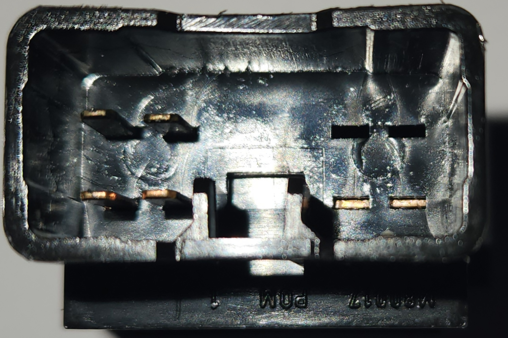

# Centre Console Buttons

> This does not cover buttons in the standard Series 2-3 dash, as they are tightly integrated with the newer designed climate control system.
{: .block-note}

Early and High models of AU Falcon have centre console buttons to control functions of the vehicle (depending on options fitted)

## Known models

Due to a moderate redesign of the dash area of the AU Falcon between [Series 1](../../Miscellaneous/SeriesInformation/SeriesInformation.md#series-1) and [Series 2](../../Miscellaneous/SeriesInformation/SeriesInformation.md#series-2), only the following models appear to have these buttons present:

- AU Falcon ([Series 1](../../Miscellaneous/SeriesInformation/SeriesInformation.md#series-1) only, primarily Demist button)
- AU Fairmont
- AU Fairlane/LTD
- T-Series (T*-50)
- AU Falcon Ute (Where column shift transmission fitted, [ECON button](#specifics---econlock-button) only)

## Additional Notes

If you wish to replace or "upgrade" button(s) on a [Series 1](../../Miscellaneous/SeriesInformation/SeriesInformation.md#series-1) Falcon using parts from a high trim model (Fairmont/Fairlane/LTD/T*-50), the following should be considered before proceeding:

- [Series 1](../../Miscellaneous/SeriesInformation/SeriesInformation.md#series-1) low trim model vehicles have icons on an angle for alignment with the rest of the dash. Both the high trim models and the later series models (where fitted) contain black buttons with angles allowing for horizontal button placement (picture below list)

- High trim model buttons contain a smaller notch in the bottom left corner of the button switch mechanism for keyed mounting. This does not fit into the [Series 1](../../Miscellaneous/SeriesInformation/SeriesInformation.md#series-1) low trim models without either:

    - Cutting the notch off of the high trim model button
    - Cutting the small keys off of the centre dash trim of the recieving vehicle

- [Series 1](../../Miscellaneous/SeriesInformation/SeriesInformation.md#series-1) low trim models are fitted with grey buttons, whereas the high trim models are fitted with black buttons instead. This appears to be irrespective of the series of donor high trim model vehicle.

- Only one function appears to have the prerequisite wiring available in the [Series 1](../../Miscellaneous/SeriesInformation/SeriesInformation.md#series-1) low trim model vehicles, which is the [ECON button](#specifics---econlock-button). The plug is plugged into the back of the plastic fascia around the 3 button holes on the centre dash.

> A comparison between the [demister button]() from a [Series 1](../../Miscellaneous/SeriesInformation/SeriesInformation.md#series-1) Falcon Forte (top) and a [demister button]() from a wrecked Ford Fairmont (bottom)

## Plug Type

The centre dash buttons are simply known as 090 Connectors, originally manufactured by [Yazaki](../../Credits.md#sources). These are similar connectors to those used throughout other interior plugs within the AU Falcon Cabin in particular.

| Name | Product Number | Notes |
| --- | --- | --- |
| Female Housing | 7122-1300 | Button end connector |
| Male Connector | 7123-1300 | Loom end connector |

> Information Sources:
> - [RS Components Australia](../../Credits.md#sources)
> - [Yazaki](../../Credits.md#sources)
{: .info-sources}

## Pin layout

The following notes assume pin numbers where you are looking at the switch unit itself, with the clip cut-out facing up:

> This layout is upside-down compared to how the button sits in the dash, but was used to better illustrate the connector
{: .block-note}

| `01` | `02` | `--` | `--` | `03` | `04` |
| -- | -- | -- | -- | -- | -- |
| **`05`** | **`06`** | **`07`** | **`08`** | **`09`** | **`10`** |

> Each of the following plugs are the same as above, but with some variation to active pins and latching
{: .block-note}

> Other buttons apart from those listed below are available, but these are not included due to limited resources
{: .block-note}

### Specifics - ANT button

> Factory Wiring Harness Plug Colour - Blue

On models where an electric antenna is present, a ANT button can be found. This button has 4 pins accessible, but is a toggle (latching) switch.

> These buttons are ideal for use for auxiliary functions while only filling the blank button locations present on lower models of Falcon.
{: .block-note}

| Pin | Function | Notes |
| --- | --- | --- |
| 01 | blank | cut pin |
| 02 | switch activation | - assumed |
| 03 | blank | cut pin |
| 04 | switch activation | + assumed |
| 05 | blank | |
| 06 | blank | |
| 07 | blank | |
| 08 | blank | |
| 09 | illumination | - assumed |
| 10 | illumination | + assumed |

> Photo of rear end of ANT button

### Specifics - Demist button

> Factory Wiring Harness Plug Colour - White

All models of AU falcon should be fitted with a rear demister button as standard. These are momentary switches:

| Pin | Function | Notes |
| --- | --- | --- |
| 01 | blank | cut pin |
| 02 | blank | cut pin |
| 03 | switch activation | - assumed |
| 04 | switch activation | + assumed |
| 05 | blank | |
| 06 | blank | |
| 07 | blank | |
| 08 | blank | |
| 09 | illumination | - assumed |
| 10 | illumination | + assumed |

> Photo of rear end of the Demister button

### Specifics - ECON/Lock button

> Factory Wiring Harness Plug Colour (ECON) - Orange

> Factory Wiring Harness Plug Colour (Lock) - Green

On models fitted with a column shifter (e.g. bench seat optioned utes), an ECON button is fitted to the centre dash with the same plugs as the other buttons on this page. On Higher end models (Fairmont/Fairlane/LTD), a lock button is fitted to the centre dash. Both buttons are identical barring the pattern printed to the front, has 6 accessible pins, and are momentary switches:

| Pin | Function | Notes |
| --- | --- | --- |
| 01 | switch activation | continuity to pins 02, 03 and 04 |
| 02 | switch activation | continuity to pins 01, 03 and 04 |
| 03 | switch activation | continuity to pins 02, 02 and 04 |
| 04 | switch activation | continuity to pins 01, 02 and 03 |
| 05 | blank | |
| 06 | blank | |
| 07 | blank | |
| 08 | blank | |
| 09 | illumination | - assumed |
| 10 | illumination | + assumed |

> Photo of rear end of ECON button. This is identical to the Lock button

### Specifics - TCS button

> Factory Wiring Harness Plug Colour - UNKNOWN

On models where a Traction control System is present, a Traction control button can be found. This button has 4 accessible pins, and is a momentary switch:

| Pin | Function | Notes |
| --- | --- | --- |
| 01 | switch activation | - assumed |
| 02 | blank | cut pin |
| 03 | switch activation | + assumed |
| 04 | blank | cut pin |
| 05 | blank | |
| 06 | blank | |
| 07 | blank | |
| 08 | blank | |
| 09 | illumination | - assumed |
| 10 | illumination | + assumed |

> Photo of rear end of TCS button

### Specifics - Dimmer button

> Factory Wiring Harness Plug Colour - White

> Very little is known abut the Dimmer buttons, as they were only fitted to vehicles with the police pack from factory (Option 20 or OPT20). The functionality is that it disables the interior lights on demand.
{: .block-note}

## Replacing button faces

For cases where you wish to modify buttons from [compatible models](../../Miscellaneous/PartsSharing/PartsSharing.md#parts-sharing-table) to have different pictures than the one that came from the factory, or in the case that you wish to use a connector with more active pins or a latching switch, you can remove the faces by gently prying 2 tabs (one each side) of the face. the faces can then be placed back in the switches with a firm press, however note that they will not go in upside-down, and there should be minimal force required to press them back into place

> Photo of rear of the face plates that can be swapped between switches

## Series 1 Low Model Fascia

> These instructions only apply to low model Series 1-1.5 Falcons (e.g. Forte/Futura/S/XR)
{: .block-note}

In the low model early falcons, there is a panel on the driver side of the centre console which contains provisions for 3 factory buttons, hidden behind a fascia that generally only has one hole in it for the [rear demister](#specifics---demist-button).

### Fitting buttons from High model vehicles

Simply fitting the buttons from a high model into a low model S1 vehicle can be a challenge due to the different locating notch locations in the high model buttons, which becomes an issue due to the relatively more common nature of different types of buttons to be found in high model vehicles. In order to remedy this, either the notches in the centre console plastic or the plastic below the notch in the high model button must be cut off. Cutting the notches in the centre console plastic is recommended due to the ease of removal and the negligible difference this makes to fitment.

> Images of plastic notches in the centre console of a S1 Forte, before and after removal respectively.

> A set of 1 Forte button (top) and 2 Fairlane buttons fitted to a S1 Forte Centre plastic

### 3D Printing a 3 Button Fascia

Should you wish to add 2 additional factory buttons, without the need to drill additional holes in the existing fascia, you can use the rudimentary 3D model found on GitHub, [HERE](https://github.com/digi-ron/AU-Falcon-S1-CentrePanel-3Hole). This model is released under an open license and can be modified using any 3D modelling software capable of importing STL files.

> This model is a modified scan of an original fascia. The following tools and settings were used, however due to the relative inexperience of the author and the relatively low-quality equipment used, this is a functional, but possibly not "showroom ready", model. It is provided nevertheless, with the intention that someone with sufficient skill may be able to improve on this:
>
> - Revopoint Inspire (3D scanner)
> - AESUB Blue vanishing spray (3D scanning spray)
> - Blender (Modelling software):
>   - Model modified with additional material for rigidity, and with larger clips and outer edge to prevent vibration
> - Ender 3 V1 (3D printer):
>   - Material used: ASA
>   - Supports: yes
>   - Notes: Printed vertically for decreased printing lines, printer modified for high temperature printing material.
> - Fitting note: Installation should be done with the driver side clips first, then by pushing the passenger side clips in after. Due to intentionally tight fitment, a small screwdriver or trim removal tool may be required for removal.

> In the interest of this projects vision, the published STL file is stored on this website as a backup [HERE](.//centrepanel.stl). *Last synced - 14/11/25*
{: .block-note}

> Picture of a printed fascia using the materials and tools listed above. This is representative of the models state as of 14/11/25