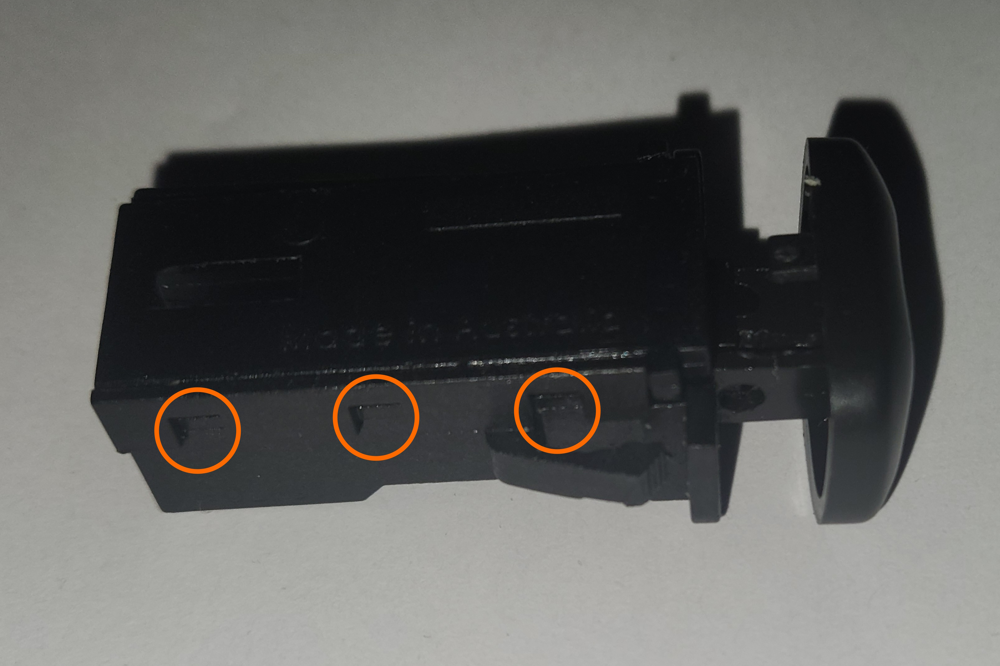
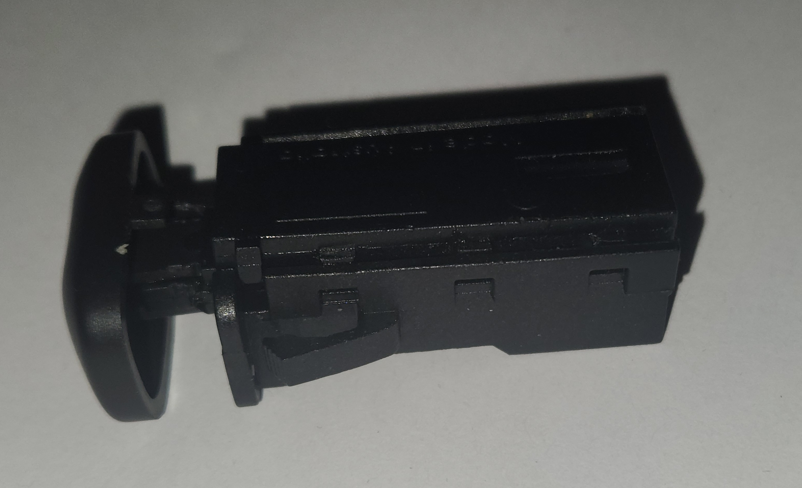
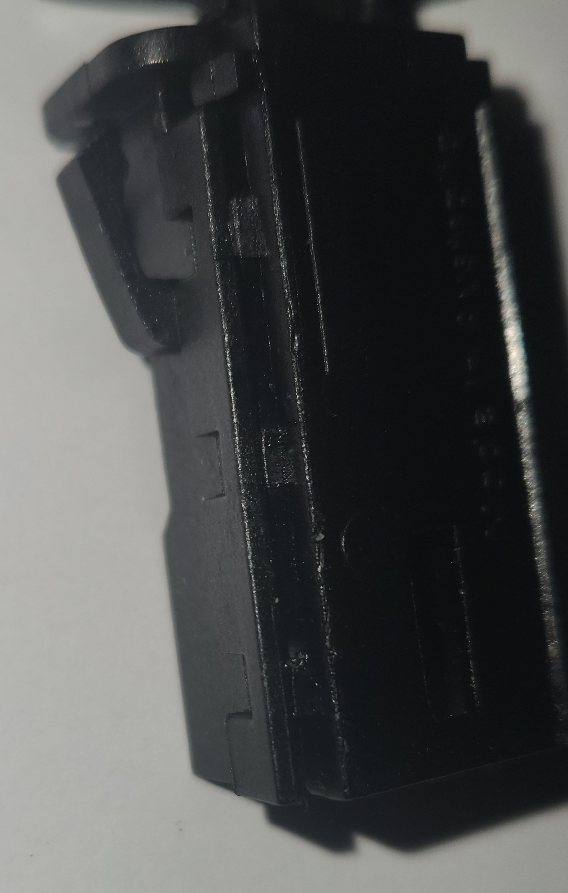
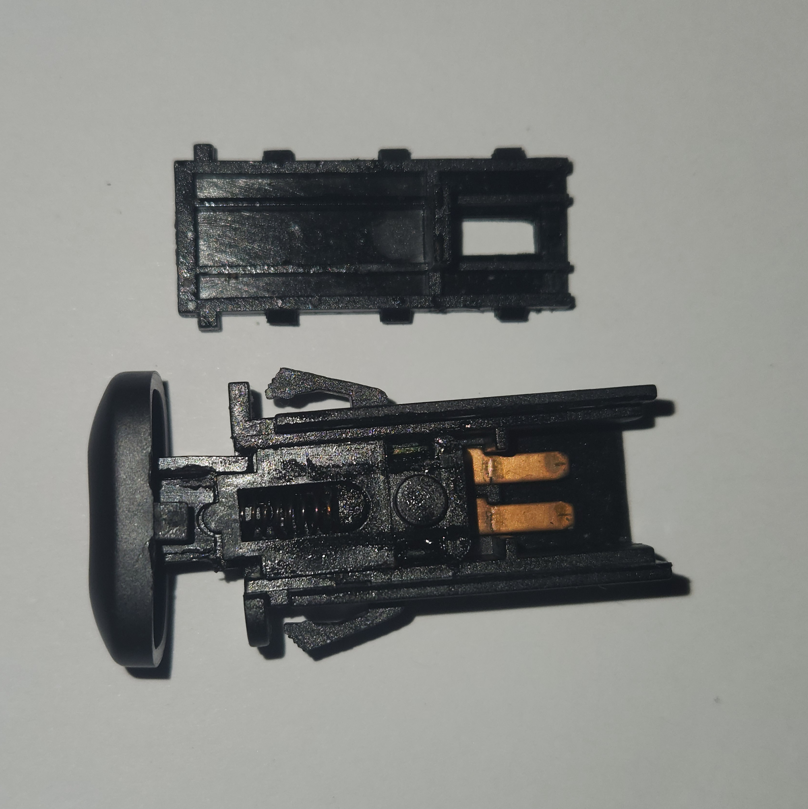
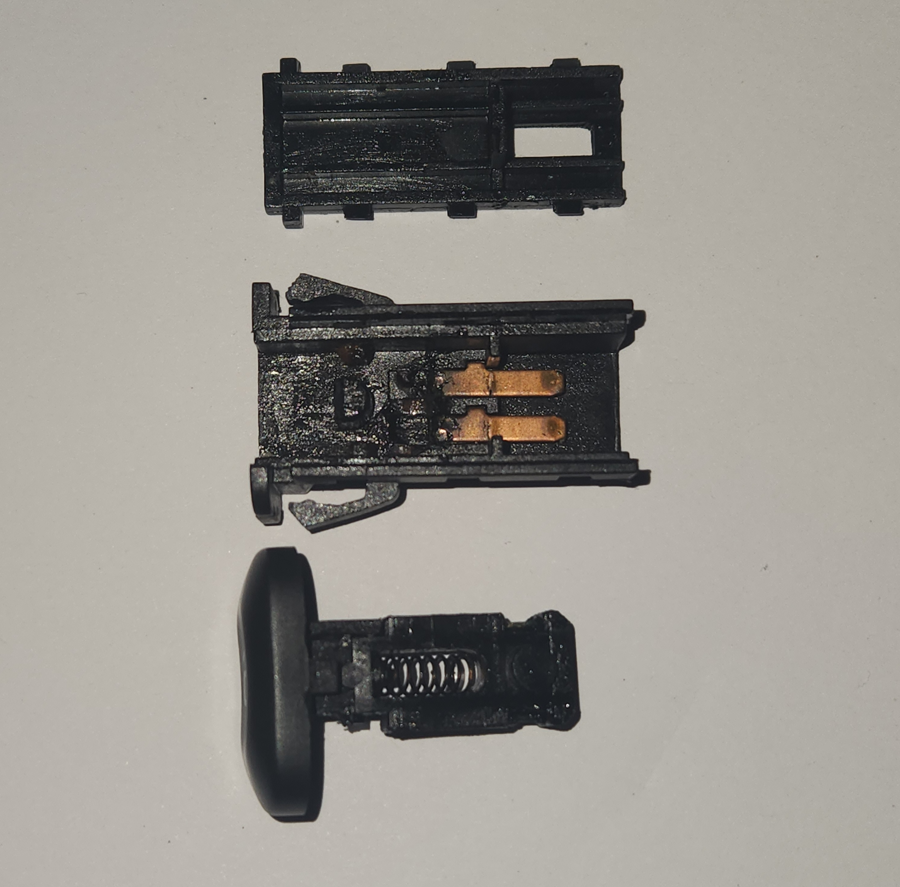
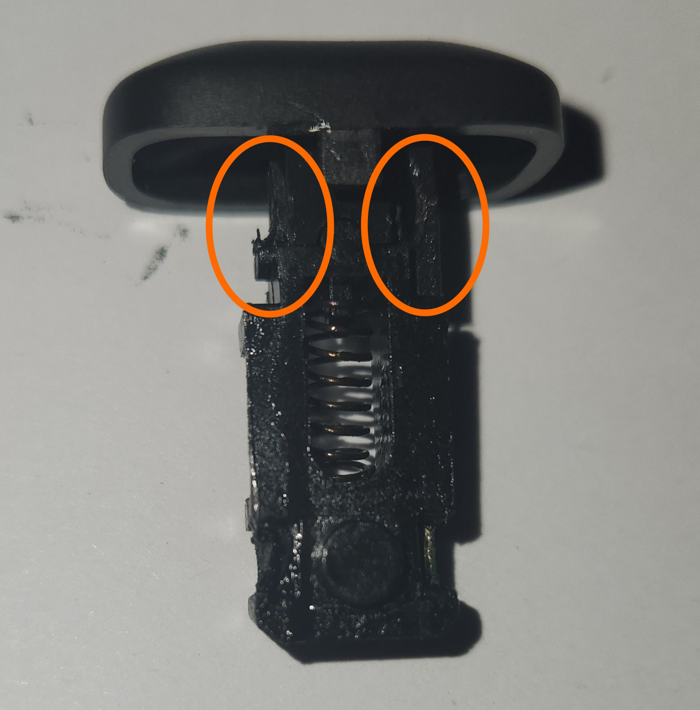
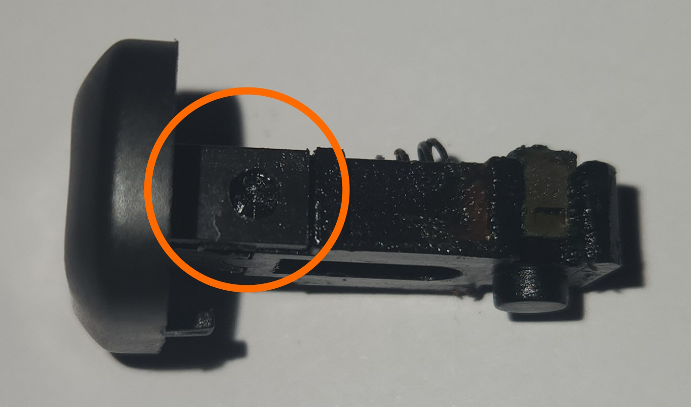
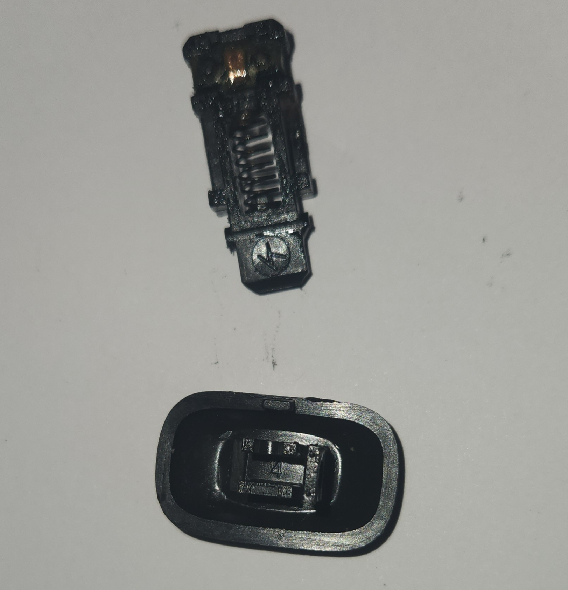

# Interior Driver Buttons

## Lock & Boot Buttons

### Lock button - additional

While the lock button isn't special due to anything technically interesting about it, it is surprisingly absent from the [Series 1](../../Miscellaneous/SeriesInformation/SeriesInformation.md#series-1) AU Falcons. Making things even stranger, the lock button was reinstated in the [Series 2](../../Miscellaneous/SeriesInformation/SeriesInformation.md#series-2) as part of a moderate interior redesign, and existed on the previous EF Body Ford Falcon *and* the [Series 1](../../Miscellaneous/SeriesInformation/SeriesInformation.md#series-1) Fairlane models (as a [Centre Console Button](../CentreConsoleButtons/CentreConsoleButtons.md)). The reason for this omission is unknown.

### Plug Type

The plug for the lock and the boot release buttons are a 090 connector, originally manufactured by [Yazaki](../../Credits.md#sources)

| Name | Part Number | Notes |
| --- | --- | --- |
| Female Terminal Housing | 6098-0239 | Loom end connector |
| Male Terminal Housing | 6098-0240 | Button end connector |
| Female Terminal | 8240-4422 | for 0.5-1.25mm2 wire |
| Male Terminal | 8230-4282 | for 0.5-1.25m2 wire |

> Information Sources:
> - [RS Components Australia](../../Credits.md#sources)
> - [Yazaki](../../Credits.md#sources)
{: .info-sources}

### Pin Layout

The following assume you are looking at the loom end connector with the clip facing up

> The wiring in these switches is completely interchangeable thanks to the fact that it is simply button circuitry. This is only added for clarity
{: .block-note}

<table>
    <th><code>01</code></th>
    <th><code>02</code></th>
</table>

| Position | Colour | Function |
| --- | --- | --- |
| 01 | Pink/Green | 12v + |
| 02 | Black/Grey | GND |

## Fuel Button

> The fuel release button plug specification and wiring is currently unknown, pending information from part manufacturer(s). More information is listed below as discovered
{: .block-note}

The following is known about the connectors for the fuel button, however no part number or original manufacturer has been discerned:

<!-- TODO find this damned connector if at all possible. Notes follow.
- Noted as C-170 in the workshop manual connector listing
- apparently between models AU-BF at least. Known used EB-BF
- May be OEM but should at least be from another international model
- Possibly Yazaki 7118-3020 (male terminal housing) and Yazaki 7119-3020 (female terminal housing) but they can't be bought anymore
-->

- Confirmed used in XE-ED Falcons as the Brake Light Switch connector
  - Bosch part number `9 340 063 086` (confirmed no further information)
  - Nice part number `BS61` (unconfirmed)
- Confirmed Factory Workshop Manual references it as connector `C-170`. This number continues into the BA Falcon Workshop Manual
- Confirmed used as fuel button release switch connector from EB-BFIII Falcons, but [button cap requires replacement for fitment](#removing-the-button-caps)
- Suspected used in some Toyota models for brake light circuit cruise control functionality:
    - Models:
      - Corona/Avante RT142 & ST 141 (1983-1987)
      - MR2 AW11 (1987-1989)
    - [Tridon](../../Credits.md#sources) part number `TBS063` (confirmed product discontinued and price prohibitive)

> Information Sources:
> - Bosch (contacted directly)
> - Nice ([eBay](../../Credits.md#sources) listing used as reference)
> - [Tridon](../../Credits.md#sources) (contacted directly)
> - Factory Workshop Manuals (sourced through [FordForums](../../Credits.md#sources))
{: .info-sources}

### Removing The Button Caps

Should you need to remove the cap on a fuel door button, e.g. when swapping from a button assembly from a EB-EL or BA/BF Falcon, follow the instructions below:

> Images are taken from an already broken AU Falcon button, to prevent damage to good parts. Refer to the [parts sharing table](../../Miscellaneous/PartsSharing/PartsSharing.md#parts-sharing-table) for compatible model buttons
{: .block-note}

> Unlike the [Centre Console Buttons](../CentreConsoleButtons/CentreConsoleButtons.md), the caps for these buttons *cannot* be removed without disassembling the button. While it does appear to be possible, there is not enough clearance in the housing to allow for the tabs on the button cap to come out.
{: .block-warning}

1. Locate and unclip the 6 small clips holding in the bottom plastic for the switch housing, noting:
    - It is easier to unclip the 3 clips on one side, and keep the part lifted away from the original 3 clips while undoing the opposite side 3 clips
    - The pins will come loose once the plastic is removed

    
    > Photo of the clips on one side of the button assembly. This is mirrored on the other side

    
    
    > Photos of the other 3 clips, half removed in preparation for removal of the remaining sides clips

1. Make a note of how everything inside the button is configured, then carefully remove the switch mechanism, making sure the spring does not get lost during removal

    
    > Photo of the button in a partially disassembled state. Note the location of the small plastic notch inside the housing and the location of the spring.

    
    > Photo of the button in a completely disassembled state, barring the button cap

1. Unclip the 2 plastic clips on either side of the button cap using a very small flat-head screwdriver, and gently remove the button cap from the mechanism

    
    
    > Photos of the button cap clips from the bottom (based on button image orientation) and side. Note the cylindrical notch holding the clips in

    
    > Photo of button assembly post-disassembly

    > Photographed example has one clip broken and should look different to your own
    {: .block-note}

1. Replace button face on mechanism with AU Falcon equivalent (repeat previous steps if required), then complete all previous steps in reverse to return the button to it's original condition.

1. Done