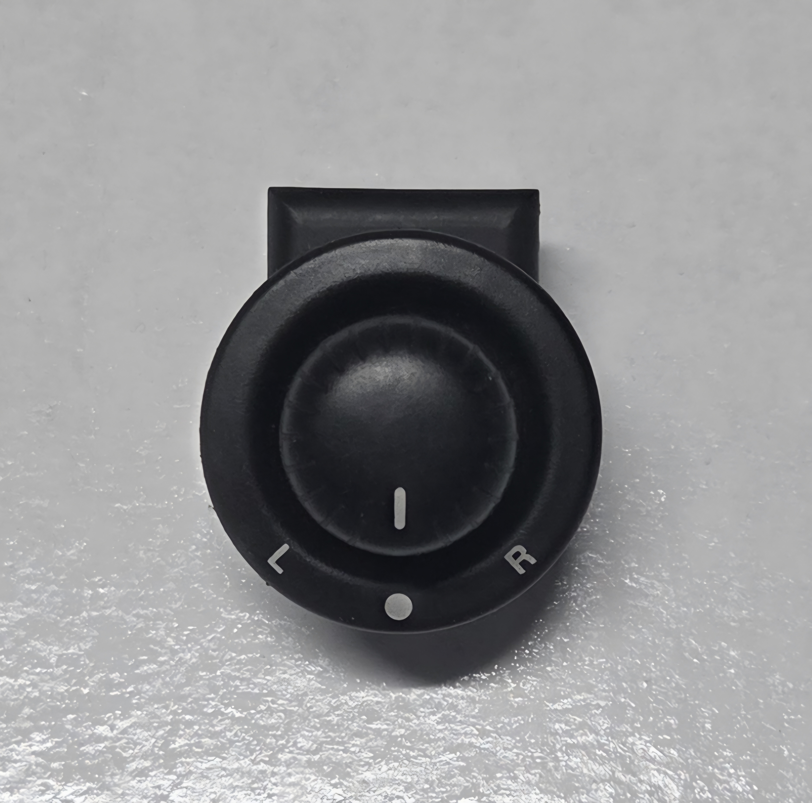
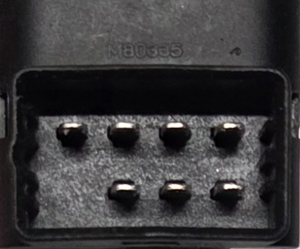

# External Mirror Controller

Electronic mirror switches are fitted to all models of AU Falcon, and control the side mirrors at the front of the vehicle.

> A picture of the mirror switch assembly, from a Series III Forte

## Plug Type

> The plug type used for the mirror switch is unknown
{: .block-note}

> An image of the connector on the rear of the mirror switch assembly

#### Pin Layout

The following notes assume pin numbers where you are looking at the mirror switch unit itself, with the clip cut-out facing up:

> Note that this section has a different layout to other Pin Layout sections for other plugs, as multiple circuits are engaged depending on the action performed

| `01` | `02` | `03` | |
| --- | --- | --- | --- |
| **`04`** | **`05`** | **`06`** | **`07`** |

| Connection #1 | Connection #2 | Mirror | Direction |
| --- | --- | --- | --- |
| 01-02 | 03-05 | Passenger | Up |
| 01-03 | 02-05 | Passenger | Down |
| 02-04 | 03-05 | Driver | Up |
| 02-05 | 03-04 | Driver | Down |
| 02-05 | 03-06 | Passenger | Left |
| 02-05 | 03-07 | Driver | Left |
| 02-06 | 03-04 | Passenger | Right |
| 02-07 | 03-05 | Driver | Right |