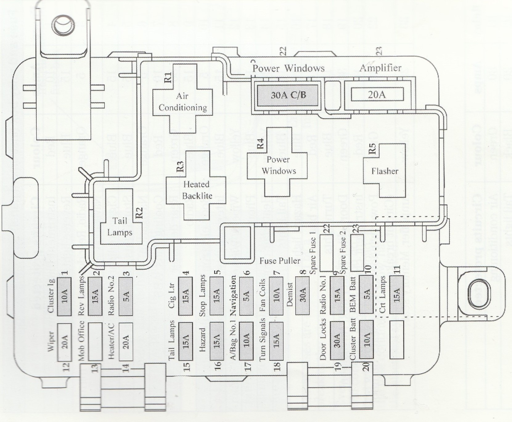
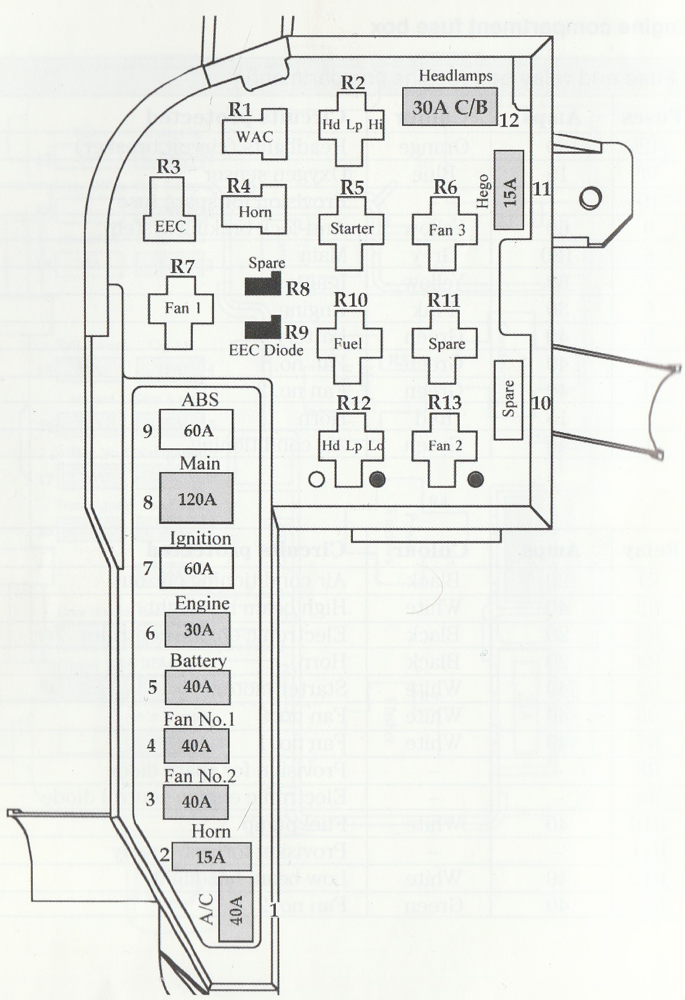
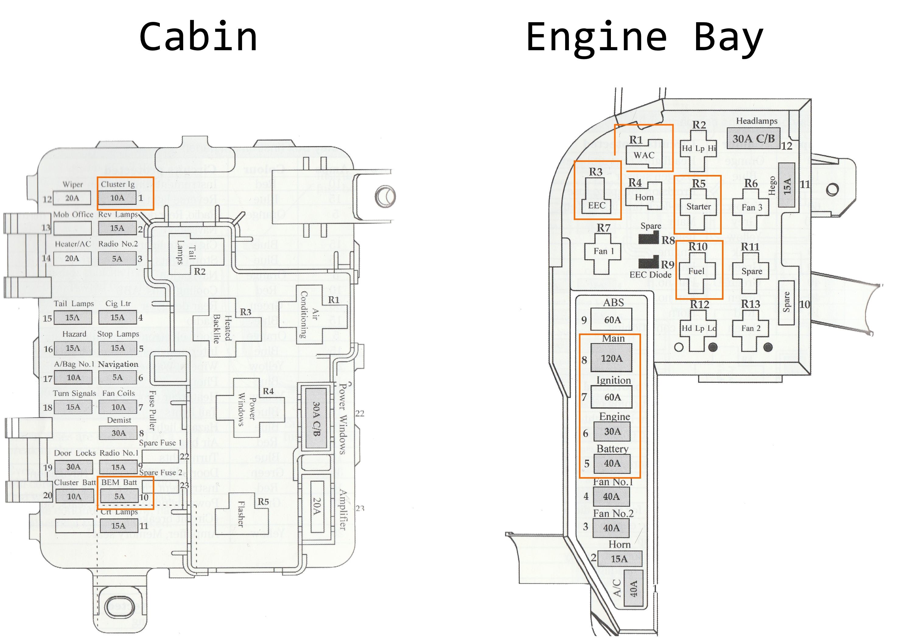

# Fuses & Relays

## Diagrams

> Information Sources:
> - Ford Australia Owners Manual (Series III Falcon Forte SR manual used but assumed universal)
{: .info-sources}

### Cabin

> Diagram scanned from user manual

### Engine Bay

> Diagram scanned from user manual

## Tables

### Cabin Fuses

Please refer to the table below for a list of cabin fuses, including which fuses are constant and which fuses are switched in the case of accessories being installed, such as hard-wired dash cameras and reversing cameras:

> If a circuit is switched, this simply means that it is not engaged when the key is not in the ignition. It is up to your own due diligence to discover if these circuits are enabled through the ignition or another source
{: .block-note}

| Fuse Location | Name | Amps | Switched/Constant |
| --- | --- | --- | --- |
| 1 | Cluster Ig | 5 | Switched |
| 2 | Rev Lamps | 15 | Switched |
| 3 | Radio No. 2 | 5 | Switched |
| 4 | Cig Ltr | 15 | Switched |
| 5 | Stop Lamps | 15 | Switched |
| 6 | Navigation | 5 | Switched |
| 7 | Fan Coils | 10 | Switched |
| 8 | Demist | 30 | Constant |
| 9 | Radio No. 1 | 15 | Constant |
| 10 | BEM Batt | 5 | Constant |
| 11 | Crt Lamps | 15 | Constant |
| 12 | Wiper | 20 | Switched |
| 13 | Mob Office | 15 | Switched |
| 14 | Heater/AC | 20 | Switched |
| 15 | Tail Lamps | 15 | Constant |
| 16 | Hazard | 15 | Constant |
| 17 | A/Bag No. 1 | 10 | Switched |
| 18 | Turn Signals | 15 | Switched |
| 19 | Door Locks | 30 | Constant |
| 20 | Cluster Batt | 10 | Constant |
| 21 | (Unused) | ?? | Constant |
| 22 | Power Windows | 30 (Breaker) | Constant |
| 23 | Amplifier | 20 | Constant |
{: .sortable-table}

> Positions 22 and 23 are referring to the larger fuses at the **top** of the cabin fuse diagram, rather than the spare fuses towards the bottom
{: .block-note}

## Minimum viable Fuses/Relays

As a result of experimentation, the minimum amount of fuses and relays required for starting the AU Falcon has been ascertained. This assumes a ***worst case scenario*** and comes with multiple caveats (listed below)

### Caveats

This guide ignores any systems not absolutely required to turn the car over, and as such many systems required for driving legally on Australian roads will be disabled. Please refer to the list below and compensate accordingly if needed, otherwise only use this in order to get a car onto a suitable transport:

Important systems disabled are:
- Windscreen Wipers
- ***ALL*** external facing lights (tail, head, indicators, etc.)
- ***ALL*** airbags
- The horn
- ***BOTH*** radiator cooling fans
- ABS/TCS
- ***ALL*** interior lighting including the backlight for the instrument cluster

This also assumes that:
- You are willing to remove the Idle Speed Control unit (may be closed too much or clogged at rest)

### List of required fuses and relays

below is a list of required parts, assuming the cabin and engine fuse boxes are empty:

| Name | QTY |
| --- | --- |
| 5A Mini Blade Fuse | 1 |
| 10A Mini Blade Fuse | 1 |
| 30A Fuse Link | 1 |
| 40A Fuse Link | 1 |
| 60A Fuse Link | 1 |
| 120A Fuse Link | 1 |
| ISO mini 4 way relay (SPST) | 2 |
| ISO micro 4 way relay | 2 |

> The 4 way relays in the above table are white if they are the Ford factory fitted relays. While the green 5 way relays *should* work there is no reason to have them in this scenario, and a 4 way relay is theoretically also easier to find
{: .block-note}

### Schematic

Below is a diagram and list of the minimum viable fuses and relays

#### Diagram

#### List

| Fuse Box | Position | Name | Type | Notes |
| --- | --- | --- | --- | --- |
| Cabin | 1 | Cluster Ig | 10A Fuse | required despite vehicle not requiring cluster itself to start (controls ignition handshake?) |
| Cabin | 10 | BEM Batt | 5A Fuse | Body Electronics Module |
| Engine bay | 5 | Battery | 40A Fuse Link | self-explanatory |
| Engine Bay | 6 | Engine | 30A Fuse Link | self-explanatory |
| Engine Bay | 7 | Ignition | 60A Fuse Link | self-explanatory |
| Engine Bay | 8 | Main | 120A Fuse Link | self-explanatory |
| Engine Bay | R1 | WAC | 5 Way Micro Relay | Wide open throttle A/C Relay, stalls quickly without it |
| Engine Bay | R3 | EEC | 5 Way Micro Relay | runs the EECV (Electronic Engine Control v5) module |
| Engine Bay | R5 | Starter | 4 Way Mini Relay | Starter motor relay |
| Engine Bay | R10 | Fuel | 4 Way Mini Relay | Fuel pump |