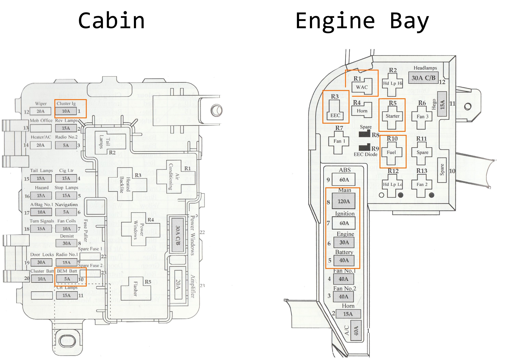

# Fuses & Relays

## Cabin

<!--TODO pics and an explaination-->

## Engine Bay

<!--TODO pics and an explaination-->

## Minimum viable Fuses/Relays

As a result of experimentation, the minimum amount of fuses and relays required for starting the AU Falcon has been ascertained. This assumes a ***worst case scenario*** and comes with multiple caveats (listed below)

### Caveats
Running the car on the bare minimum required to turn over the car, and as such many systems required for driving on Australian roads will be disabled. Please refer to the list below and compensate accordingly if needed, otherwise only use this in order to get a car onto a suitable transport:

Important systems disabled are:
- Windscreen Wipers
- ***ALL*** external facing lights (tail, head, indicators, etc.)
- ***ALL*** airbags
- the horn
- ***BOTH*** radiator cooling fans
- ABS/TCS
- ***ALL*** interior lighting including the backlights for the instrument cluster

This also assumes that:
- you are willing to remove the Idle Speed Control unit (if closed when attempting start)

### List of required fuses and relays
below is a list of required parts, assuming the cabin and engine fuse boxes are empty:

| Name | QTY |
| --- | --- |
| 5A Mini Blade Fuse | 1 |
| 10A Mini Blade Fuse | 1 |
| 30A Fuse Link | 1 |
| 40A Fuse Link | 1 |
| 60A Fuse Link | 1 |
| 120A Fuse Link | 1 |
| ISO mini 4 way relay (SPST) | 2 |
| ISO micro 5 way relay | 2 |

<!--TODO confirm the mini and micro relays are right-->

### Schematic
Below is a diagram and list of the minimum viable fuses and relays

#### Diagram

#### List
| Fuse Box | Position | Name | Type | Notes |
| --- | --- | --- | --- | --- |
| Cabin | 1 | Cluster Ig | 10A Fuse | required despite vehicle not requiring cluster itself to start (controls ignition handshake?) |
| Cabin | 10 | BEM Batt | 5A Fuse | Body Electronics Module |
| Engine bay | 5 | Battery | 40A Fuse Link | self-explainatory |
| Engine Bay | 6 | Engine | 30A Fuse Link | self-explainatory |
| Engine Bay | 7 | Ignition | 60A Fuse Link | self-explainatory |
| Engine Bay | 8 | Main | 120A Fuse Link | self-explainatory |
| Engine Bay | R1 | WAC | 5 Way Micro Relay | Wide open throttle A/C Relay, stalls quickly without it |
| Engine Bay | R3 | EEC | 5 Way Micro Relay | runs the EECV (Electronic Engine Control v5) module |
| Engine Bay | R5 | Starter | 4 Way Mini Relay | Starter motor relay |
| Engine Bay | R10 | Fuel | 4 Way Mini Relay | Fuel pump |