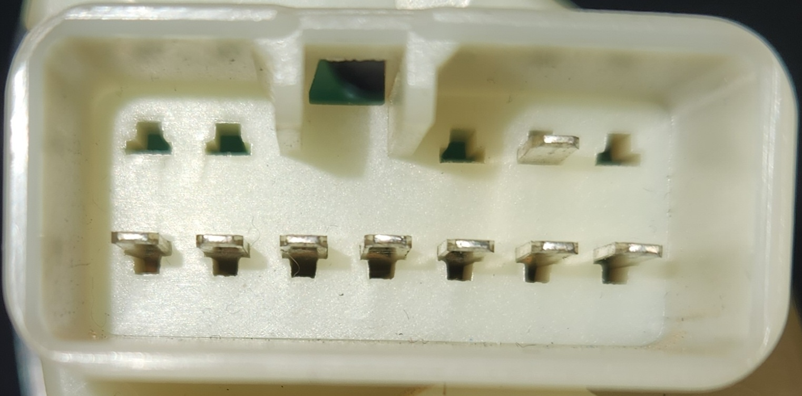
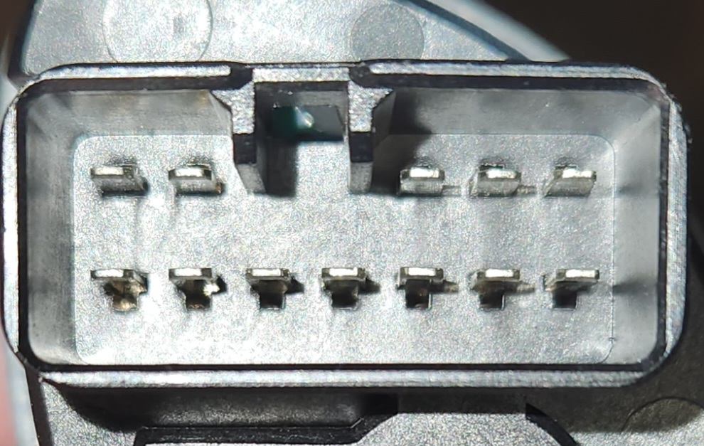

# Headlight Switches

## Plug Type
The plugs used for the headlight switch initially appear to be a AMP MULTILOCK .070 (174933-1/173851-1) design, but the pins are in the wrong location in the connector and the connector itself is off by approx. 1mm in width regardless. The true connector is a only known as a 090 Connector. At least one of the original manufacturers is a company known as Yazaki. They don't appear to be manufacturing these anymore so the only known source of these connectors would be online marketplaces such as AliExpress:

| Name | Code | Notes |
| --- | --- | --- |
| Female Housing | 7123-1210 | Loom end connector |
| Male Housing | 7122-1210 | Switch housing end connector |
| Female Terminal | 7116-1180 | brass insert for female housing, suited for 0.3/0.5mm2 wire |
| Female Terminal | 7116-1181 | brass insert for female housing, suited for 0.85/1.25mm2 wire |
| Male Terminal | 7114-1170 | brass insert for male housing, suited for 0.3/0.5mm2 wire |
| Male Terminal | 7114-1171 | brass insert for male housing, suited for 0.85/1.25mm2 wire |

## Variations
There seems to be a variation between the base model unit and the high model units in terms of wiring, beyond the expected low amount of difference expected from the 1 additional control.

### Pin layout - Rough diagram
The following notes assume pin numbers where you are looking at the switch unit itself, with the clip cut-out facing up and the 2 pin section of the top row to the left:

| `01` | `02` | `--` | `--` | `03` | `04` | `05` |
| --- | --- | --- | --- | --- | --- | --- |
| `06` | `07` | `08` | `09` | `10` | `11` | `12` |

### Low unit pins
- 01 = blank
- 02 = blank
- 03 = blank
- 04 = GND/SIG?
- 05 = blank
- 06 = GND/SIG?
- 07 = Dome light HIGH
- 08 = Dome light OFF
- 09 = Headlights LOW
- 10 = headlights OFF
- 11 = Dome light MID
- 12 = Headlights HIGH

> photo of headlight switch unit end plug (male pin connector)

### High unit pins
> NOTE: information is particularly incomplete here due to lack of a high model AU to discern wiring minutiae

- 01 = Illumination light (- assumed)
- 02 = Illumination light (+ assumed)
- 03 = Delay OFF & CONT to 12 when Headlight HIGH (likely part of delay function)
- 04 = Delay OFF & CONT to 05
- 05 = Delay OFF & CONT to 04
- 06 = GND/SIG?
- 07 = Dome light HIGH
- 08 = ??? (no CONT)
- 09 = Headlight LOW & CONT to 03 when Headlight LOW
- 10 = Dome light LOW
- 11 = ??? (also no CONT)
- 12 = Headlight HIGH & CONT to 03 when Headlight HIGH

> photo of headlight switch unit end plug (male pin connector)