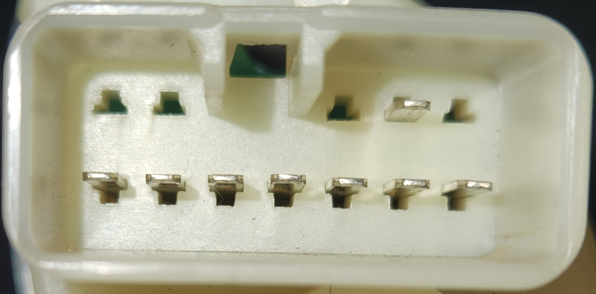

# Headlight Switches

## Plug Type

The plugs used for the headlight switch initially appear to be a AMP MULTILOCK .070 (174933-1/173851-1) design, but the pins are in the wrong location in the connector and the connector itself is off by approx. 1mm in width regardless. The true connector is a only known as a 090 Connector, originally manufactured by the companies Yazaki and Sumitomo:

| Name | Code | Notes |
| --- | --- | --- |
| Female Housing | 7123-1210 | Loom end connector |
| Male Housing | 7122-1210 | Switch housing end connector |
| Female Terminal | 7116-1180 | brass insert for female housing, suited for 0.3/0.5mm2 wire |
| Female Terminal | 7116-1181 | brass insert for female housing, suited for 0.85/1.25mm2 wire |
| Male Terminal | 7114-1170 | brass insert for male housing, suited for 0.3/0.5mm2 wire |
| Male Terminal | 7114-1171 | brass insert for male housing, suited for 0.85/1.25mm2 wire |

## Variations
There seems to be a variation between the base model unit and the high model units in terms of wiring, beyond the expected low amount of difference expected from the 1 additional control.

### Pin layout
The following notes assume pin numbers where you are looking at the switch unit itself, with the clip cut-out facing up and the 2 pin section of the top row to the left:

| `01` | `02` | `--` | `--` | `03` | `04` | `05` |
| --- | --- | --- | --- | --- | --- | --- |
| **`06`** | **`07`** | **`08`** | **`09`** | **`10`** | **`11`** | **`12`** |

####  Low unit pins

> Information incomplete due to testing outside of vehicle
{: .block-note}

| Pin | Function | Notes |
| --- | --- | --- |
| 01 | blank | |
| 02 | blank | |
| 03 | blank | |
| 04 | GND/SIG? | |
| 05 | blank | |
| 06 | GND/SIG? | |
| 07 | Dome Light 2 | high setting |
| 08 | Dome Light 0 | lowest setting |
| 09 | Headlights LOW | park lights |
| 10 | Headlights OFF | lowest setting |
| 11 | Dome Light 1 | middle setting |
| 12 | Headlights HIGH | normal headlights/high beams (if stalk active) |

> Photo of headlight switch unit end plug (male pin connector)

#### High unit pins

> Information is particularly incomplete here due to lack of a high model AU to discern wiring minutiae
{: .block-note}

| Pin | Function | Notes |
| --- | --- | --- |
| 01 | Illumination | - assumed |
| 02 | Illumination | + assumed |
| 03 | Additional? | if Delay switch off and Headlights set to HIGH, has continuity to pin 12. if Delay switch off and Headlights set to LOW, has continuity to pin 09 |
| 04 | Delay? | if Delay switch off, has continuity to pin 05 |
| 05 | Delay? | if Delay switch off, has continuity to pin 04 |
| 06 | GND/SIG? | |
| 07 | Dome Light 1 | equivalent to Dome Light 2 in [Low Models](#low-unit-pins)
| 08 | UNKNOWN | No continuity found |
| 09 | Additional? | If delay switch off and Headlights set to LOW, has continuity to pin 03 |
| 10 | Dome Light 0 | equivalent to Dome Light 1 in [Low Models](#low-unit-pins) |
| 11 | UNKNOWN | No continuity found |
| 12 | If delay switch off and Headlights set to HIGH, has continuity to pin 03 |

> Photo of headlight switch unit end plug (male pin connector)