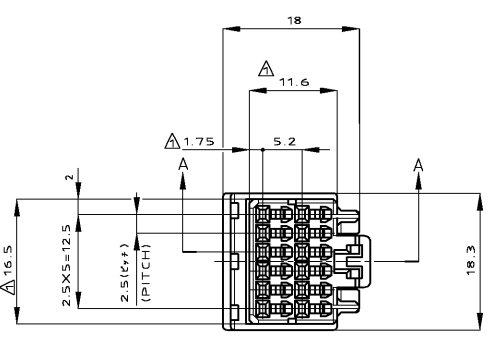
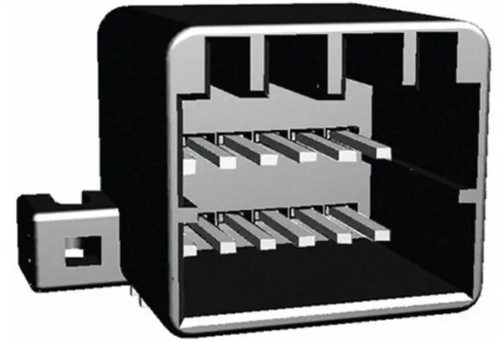
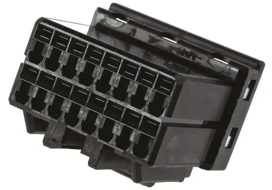
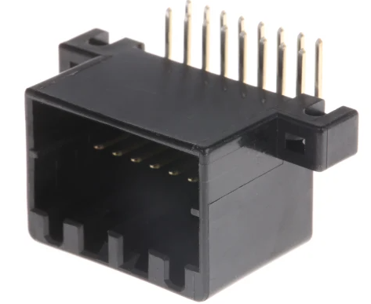
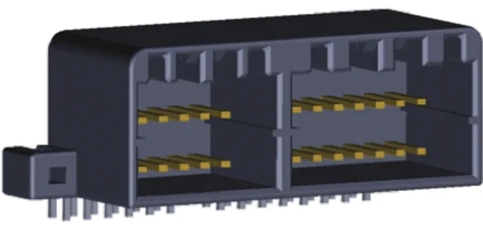
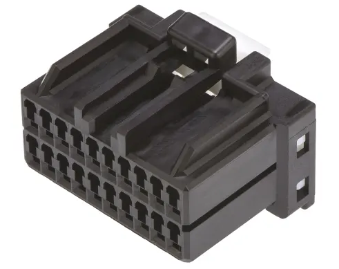
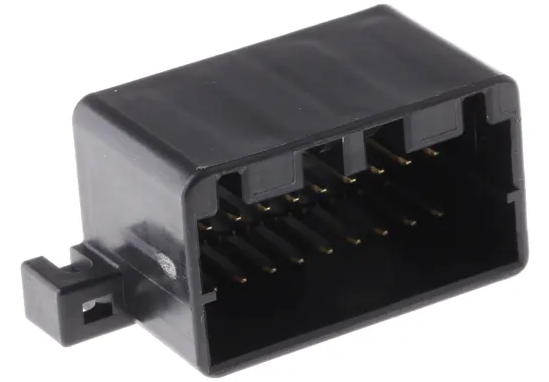

# Instrument Cluster
## Plug type
The plugs in the back of the instrument cluster all seem to be MULTILOCK 040 II connectors, seemingly manufactured by a company called TE Connectivity. Part information varies according to which specific plug is desired.

## IMPORTANT
note that the plugs are MULTILOCK 040 II and not MULTILOCK 040, as there are subtle differences between the 2 versions

---

> NOTE: information is specific to low model clusters due to project only involving 1 S1 Forte cluster and 1 S1 Pursuit cluster to date

---

### 12 way plug - top plug behind fuel gauge side of cluster

| Name | Code | Notes |
| --- | --- | --- |
| Male Connector Housing | 175965-2 | Loom end connector |
| Right Angle Through Hole Mount PCB Socket | 175974-2 | Cluster end connector, with right angle solder mounts behind |

> Male connector image taken from RS Components product page Datasheet (only good picture of front found)

> Female connector image taken from RS Components product page (3D model only known good image)

---

### 16 way plug - bottom plug behind fuel gauge side of cluster

| Name | Code | Notes |
| --- | --- | --- |
| Male Connector Housing | 175966-2 | Loom end connector |
| Connector Socket | 175615-2 | Cluster end connector, with right angle solder pins behind |

> Male connector image taken from RS Components product page

> Male connector image taken from RS Components product page

---

### combination 28 way mount - possible solder replacement for entire fuel gauge side plugs on instrument cluster

| Name | Code | Notes |
| --- | --- | --- |
| Right Angle PCB Socket | 1-175976-2 | UNTESTED |

> PCB Connector image taken from RS Components product page (3D model only known good image)

### 20 way plug - plug behind RPM gauge side of cluster

| Name | Code | Notes |
| --- | --- | --- |
| Male Connector Housing | 175967-2 | Loom end connector |
| Connector Socket | 175975-2 | Cluster end connector, with right angle solder pins behind |

> Male connector image taken from RS Components product page

> Female connector housing image take from RS Components product page