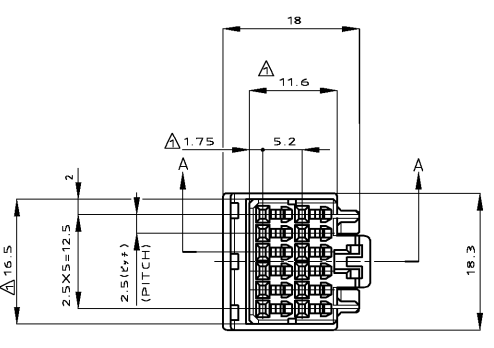
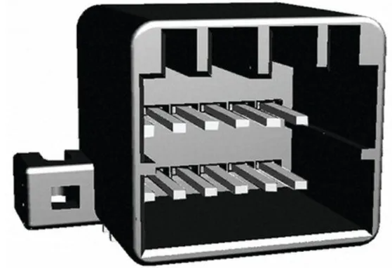
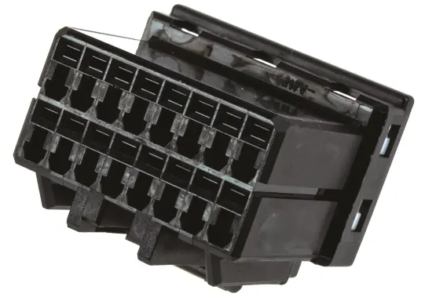
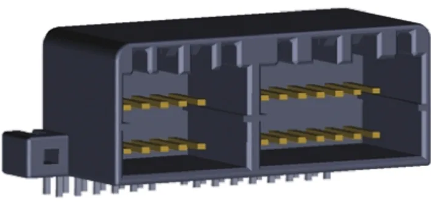
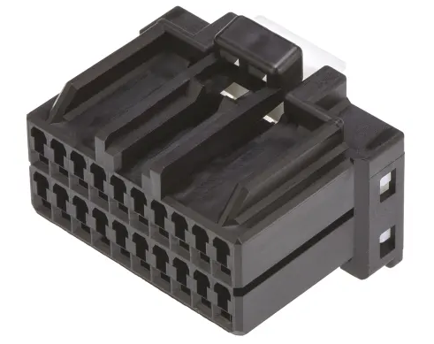

# Instrument Cluster

## General information
The clusters themselves come in various trims, which have differences ranging from tiny to severe. Please refer to the list below for *some* of the differences between the different models:

| Cluster | Used in | Notes |
| --- | --- | --- |
| Low | Forte/Futura/S/SR | Only contains rev, speedo, temp and fuel gauges. Base model cluster |
| Pursuit | Police Vehicles | police-modified low cluster with 240km/h max speed, marks every 2km/h, and programmable speedometer (for different tyre sizes) |
| Mid | XR6/XR8 | all base gauges as well as oil pressure and battery voltage gauges. increased max reading to 240km/h (V8 only?) and gear selector indicator |
| High | Fairmont/Fairlane/LTD | all mid cluster features, an upgraded Odometer display, more specific door ajar indicator, and additional warning lights (alternator, TCS, washer fluid, etc.) |

> NOTE: wiring between the low/pursuit clusters and the mid/high clusters is inherently different and require a moderate to large amount of rewiring for full functionality, however multiple online sources have stated that for basic functionality such as reading the speedo, the clusters are effectively "plug and play"

> NOTE: a cluster with a maximum speed reading of 240km/h can be fitted to a car with a 220km/h speedometer without issue, however series 1 clusters should be avoided due to conflicting information on this

## Pursuit Cluster - Speedometer Calibration
Pursuit clusters are not only sought after as they are, in theory the rarest type of speedometer available for the AU Falcon, they are also useful for on-the-fly speedometer calibration, allowing for much more flexibility with wheel sizes and differential ratios.

> NOTE: the calibration mode allows for 10% of calibration in either direction (so 90-110% stock) and increments about 0.5% each button press. for more than this, you will need to play with transmission gearing to an external speedometer calibration tool to achieve the desired effect

1. switch the ingition key to the "On" position
1. hold the instrument cluster for 5-7 seconds. the word `SPEEDO 0.0` should show up
    > NOTE: the 0.0 in the display stands for the default, if you have changed yours previously it will be a different number
1. press the instrument cluster button until the number next to `SPEEDO` on the display is at the desired value, noting:
    - a short press (less than 1 second) will increase the number by 0.5
    - a longer press (less than 5 seconds) will decrease the number by 0.5
1. press and hold the instrument cluster button for about 7 seconds to exit calibration mode
1. done

## Plug type
The plugs in the back of the instrument cluster all seem to be MULTILOCK 040 II connectors, seemingly manufactured by a company called TE Connectivity. Part information varies according to which specific plug is desired.

### IMPORTANT
note that the plugs are MULTILOCK 040 II and not MULTILOCK 040, as there are subtle differences between the 2 versions

---

> NOTE: information is specific to low model clusters due to project only involving 1 S1 Forte cluster and 1 S1 Pursuit cluster to date

---

### 12 way plug - top plug behind fuel gauge side of cluster

| Name | Code | Notes |
| --- | --- | --- |
| Male Connector Housing | 175965-2 | Loom end connector |
| Right Angle Through Hole Mount PCB Socket | 175974-2 | Cluster end connector, with right angle solder mounts behind |

> Male connector image taken from RS Components product page Datasheet (only good picture of front found)

> Female connector image taken from RS Components product page (3D model only known good image)

---

### 16 way plug - bottom plug behind fuel gauge side of cluster

| Name | Code | Notes |
| --- | --- | --- |
| Male Connector Housing | 175966-2 | Loom end connector |
| Connector Socket | 175615-2 | Cluster end connector, with right angle solder pins behind |

> Male connector image taken from RS Components product page

> Male connector image taken from RS Components product page

---

### combination 28 way mount - possible solder replacement for entire fuel gauge side plugs on instrument cluster

| Name | Code | Notes |
| --- | --- | --- |
| Right Angle PCB Socket | 1-175976-2 | UNTESTED |

> PCB Connector image taken from RS Components product page (3D model only known good image)

### 20 way plug - plug behind RPM gauge side of cluster

| Name | Code | Notes |
| --- | --- | --- |
| Male Connector Housing | 175967-2 | Loom end connector |
| Connector Socket | 175975-2 | Cluster end connector, with right angle solder pins behind |

> Male connector image taken from RS Components product page

> Female connector housing image take from RS Components product page