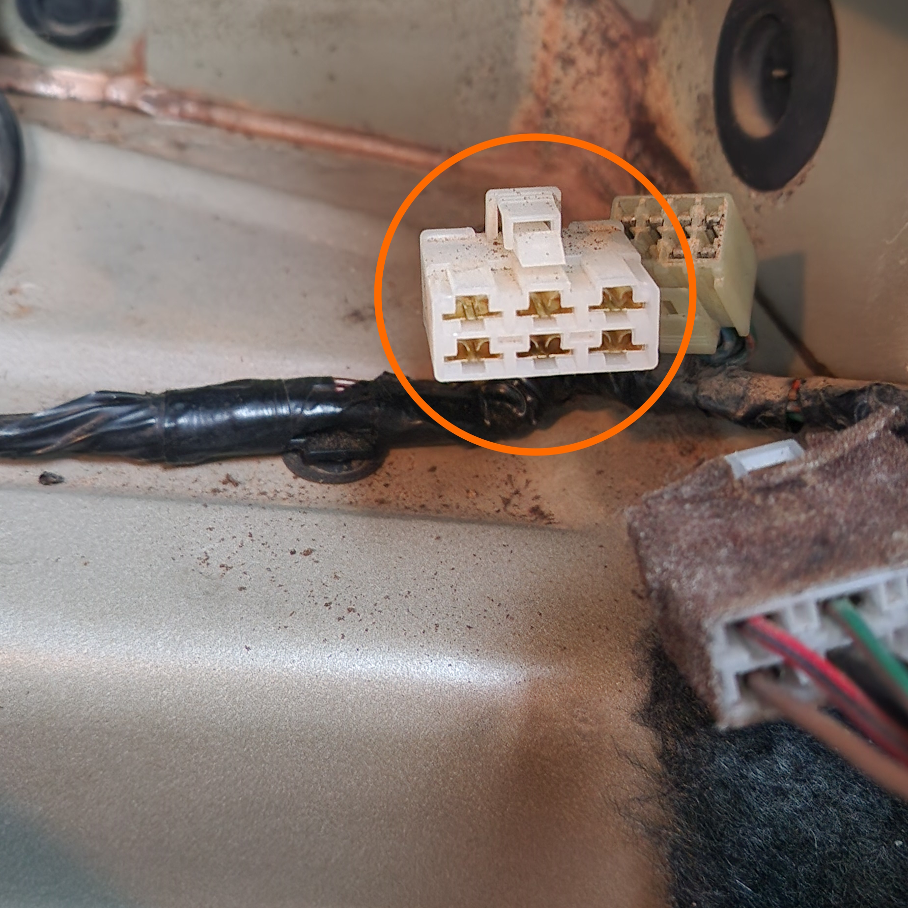
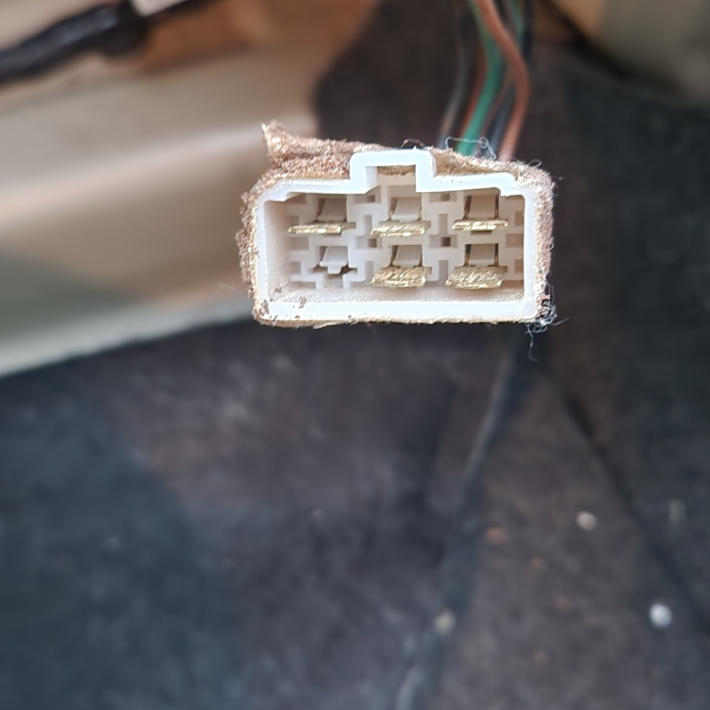

# Rear Lights Connector

The rear light connector can be a great location to wire in Accessory trigger wire(s) for auxiliary system such as a reversing camera. In the case that you would like to tap into this wiring without soldering or modifying the vehicles own wiring loom, the following information could be found to be useful.

## Plug Type

The plug used for the tail light connector is known as a 250 Series Quick Connect 6-way connector. There are many manufacturers for these connectors such as [Narva](../../Credits.md#sources), and as such it should be relatively trivial to find one from an Automotive Shop

> Pictures of the car loom end connector (female connector housing) and the light end connector (male connector housing) respectively

## Pinout

Use the following diagram and pinout list for reference. This diagram assumes that the clip is facing up and you are looking at the female housing connector (the loom end wiring connector)

| 01 | 02 | 03 |
| --- | --- | --- |
| **04** | **05** | **06** |

| Pin | Colour | Purpose |
| --- | --- | --- |
| 01 | Red/Black | Reverse Lights |
| 02 | Green/Red | Brake Lights |
| 03 | Green | Indicator/Hazards |
| 04 | Brown | Tail Lights |
| 05 | Black | Ground |
| 06 | N/a | Not populated |