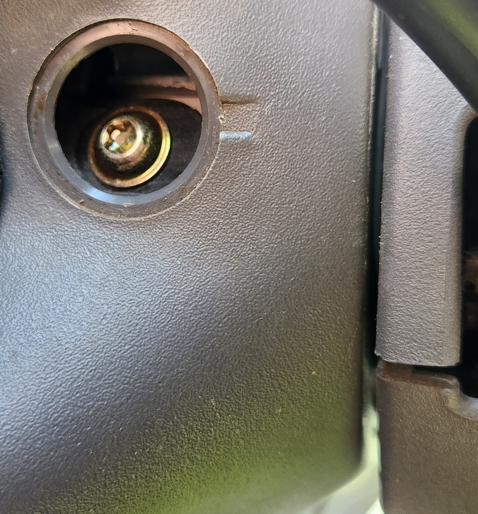

# Steering Wheel Controls

The steering wheel controls for the AU falcon are one of the most fragile parts of an otherwise nigh-indestructible interior, which is made more unfortunate by the fact that the cruise control buttons (where fitted) are controlled from the right side buttons of the steering controls. On top of this they are only accessible by removing the steering wheel airbag, which is held in with 2 non-standard bolts, further complicating matters

> This page uses a model of AU Falcon that has both Cruise Control and Media Buttons fitted, some controls may not be present depending on your models options
{: .block-note}

## Plug Type

The 2 connectors for the Steering wheel controls (other than the blade style horn connector) were originally manufactured by a company known as Delphi as part of the 150 Series of Connectors. While the manufacturer is now known as Aptiv, the following product codes are still relevant, and can be purchased from online marketplaces such as [AliExpress](../../Credits.md#sources)

| Name | Code | Notes |
| --- | --- | --- |
| Connector 4F | 12047785 | Female Terminal Housing (loom end connector) |
| Connector 4M | 12047786 | Male Terminal Housing (button end connector) |
| Female Terminal Unsealed - 1.0-0.8mm2 | 12047767 | |
| Male Terminal Unsealed - 1.0-0.8mm2 | 12047581 | |

## Pin Layout

The following notes assume pin numbers where you are looking at the steering wheel controls plug (male housing), with the clip facing up:

| `01` | `02` |
| --- | --- |
| **`03`** | **`04`** |

### Pin Wiring

| Position | Color | Function |
| --- | --- | --- |
| 01 | Red/Black | Media Controls + |
| 02 | Orange/Black | Horn + |
| 03 | Grey/Black | Cruise Controls + |
| 04 | Black | GND (x2, 1 for Cruise and 1 for Horn) |

> While there is a GND connection required for the Media Controls, the original part for this is handled by a single wire, starting from the Cruise Controls PCB and ending at the Media Control board
{: .block-note}

## Removing/Replacing Steering Wheel controls

> You will need one specific tool for this job, a Torx T30 star socket (5 point with tamper hole). There is mixed success by tapping a standard (6 point) Torx head socket into the bolts, using a modified screwdriver, or using an extractor, however using this specific socket means that the bolts can be reused without the risk of never being able to remove it easily ever again after reinstallation
{: .block-note}

1. ***DISCONNECT THE BATTERY*** and leave for at least 1hr (ideally overnight)
1. remove the plastic caps on the sides of the rear plastic section of the steering wheel and remove the tamper bolts

    
    

    > See the pictures above for the bolts location on the driver side and passenger side respectively

1. ***GENTLY*** pull the airbag from the front of the steering wheel, and remove **BOTH** the airbag connector (yellow with 2 pins) and the horn ground connector (small blade connector)

    

1. remove the steering control plug (square black connector with red plug inside)

    

1. unscrew the 4 mounting screws on the sides of the steering wheel

    

    Buttons missing from photos due to the originals being broken (ironic)
    {: .block-note}
    
1. unclip the wiring loom for the steering controls from the back plastic of the steering wheel. Gently pry the back plastic of the steering wheel back enough to pull the button housings past the back of the steering wheel frame

    

    > Gently pull until the back of your steering wheel looks like this. From here, you can feed the wire through the gap by holding the plastic back a little more and pulling the wire through

1. done

> If reinstalling the steering wheel controls, be careful of the screws that hold it in place, as they are easy to cross-thread due to the material the steering wheel itself seems to be made of
{: .block-note}

## 3D Printing steering wheel control housings
Due to the fragility of these components, there is likely to come a time where buying original parts, even through the second hand market, will become non-viable. To this end, if you have access to a 3D printer and some UV resistant filament such as ABS or ASA, you can easily print the button housings yourself, reducing the need for complete parts, or in some cases, without replacing the original button PCBs. A rudimentary 3D model can be found on GitHub, [HERE](https://github.com/digi-ron/AU-Falcon-Steering-Controls), however this model is released under an open license and can be modified using any 3D modelling software capable of importing STL files, or [Sketchup](https://www.sketchup.com/)

> In the interest of this projects vision, the published STL files are stored on this website as a backup [HERE](./steering-controls.zip). *Last synced - 03/03/25*
{: .block-note}

## Steering control wiring
unlike most basic controls within the Falcon, the Steering controls appear to be activated by specific resistances, as the connector itself only has 4 pins between the 2 sets of 3 buttons. Each button can be activated using the following resistors and a simple momentary switch:

### Cruise control side

| Button | Resistance |
| --- | --- |
| Cruise Res/Coast | 1500Ω |
| Cruise + | 560Ω |
| Cruise - | 180Ω |

### Media control side

| Button | Resistance |
| --- | --- |
| Seek | 0Ω |
| Volume + | 250Ω |
| Volume - | 910Ω |