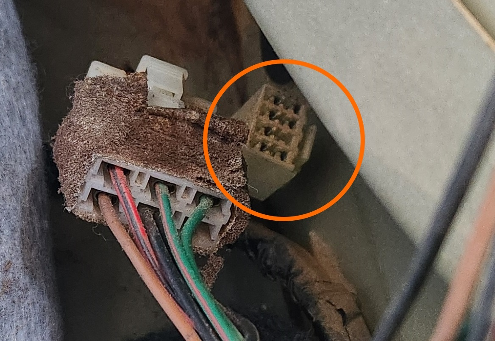

# Trailer Auxiliary plug

The trailer plug is the plug that allows for the connection of either a [round 7 pin](#7-pin-round-layout-large), or more commonly, a [7](#7-pin-layout) or [12](#12-pin-layout) pin rectangular trailer connector, for use with a towbar and related accessories.

> This plug appears is standard in all Falcons AU-BFIII (1998-2016) and all Territory models, however pinout includes additional wires in later models due to additional features
{: .block-note}

> Trailer plug inside the boot of a S1 Sedan

## Plug Type

The connectors used for the trailer plug are known as 090 connectors, originally manufactured by [Yazaki](../../Credits.md#sources).

| Name | Product Number | Notes |
| --- | --- | --- |
| Female Housing | 6090-1021 | Car loom end connector |
| Male Connector | 6090-1051 | Trailer adapter end connector |
| Female Pin | 8240-4422 | For use in Car loom end connector |
| Male Pin | 8230-4282 | For use in trailer adapter end connector |

> Information Sources:
> - [RS Components Australia](../../Credits.md#sources)
> - [Yazaki](../../Credits.md#sources)
{: .info-sources}

## Pin Layout
The following notes assume pin numbers where you are looking at the trailer adapter loom plug (female housing), with the clip cut-out facing up:

| `01` | `02` | `03` | `04` |
| --- | --- | --- | --- |
| **`05`** | **`06`** | **`07`** | **`08`** |

### Pin Wiring

> For the Standard Colour, refer to the [Australian Standard Pinouts](#australian-standard-pinouts)
{: .block-note}

| Position | Colour | Function | Standard Colour* |
| --- | --- | --- | --- |
| 01 | Green/Red | Brake lights | Red |
| 02 | Brown/Grey | Tail lights | Brown |
| 03 | N/a | Blank (no wire) | N/a |
| 04 | Red/Black | Reverse Lights | Black |
| 05 | Black | GND/Earth | White |
| 06 | Green/Blue | Driver Indicator | Yellow |
| 07 | Green/Grey | Passenger Indicator | Green |
| 08 | Yellow/Black | 12V Constant | Orange/Pink/Purple ([12-Pin configuration](#12-pin-layout) only) |

## Australian Standard Pinouts

> Information Sources:
> - [Narva](../../Credits.md#sources)
> - [TAG](../../Credits.md#special-thanks---information-sharers-and-timesavers)
{: .info-sources}

### 7 Pin layout

While the AU Falcon originally came with a 12 pin flat connector, a more appropriate and cost-effective connector to be used at the time of writing is actually a 7 Pin layout. This is simply as many trailers with the 12 pin connector exceed normal towing conditions for vehicles, unless you intend on towing an older Caravan or other heavy duty trailer.

#### Car Socket End

<!--coded as a HTML table as single line-->
<table>
    <thead>
        <th><code>01</code></th>
        <th><code>06</code></th>
        <th><code>05</code></th>
        <th><code>03</code></th>
        <th><code>02</code></th>
        <th><code>07</code></th>
        <th><code>04</code></th>
    </thead>
</table>

#### Trailer Connector End

<table>
    <thead>
        <th><code>04</code></th>
        <th><code>07</code></th>
        <th><code>02</code></th>
        <th><code>03</code></th>
        <th><code>05</code></th>
        <th><code>06</code></th>
        <th><code>01</code></th>
    </thead>
</table>

---

#### Pinout Information

| Pin # | Colour | Function |
| --- | --- | --- |
| 01 | Yellow | Passenger Indicator |
| 02 | Black | Reversing lights |
| 03 | White | GND |
| 04 | Green | Driver Indicator |
| 05 | Blue | Electric Brakes (Where fitted) |
| 06 | Red | Brake lights |
| 07 | Brown | tail light |

### 12 Pin layout

The 12 pin layout is the standard layout for the Factory trailer looms in the Ford Falcon. If you are intend on using a 12 pin layout, note that the AU Falcon only implements a partial implementation of this standard, due to certain functions, like fog lights, not being present on the host vehicle. The implementation for this plug is noted below:

#### Car Socket End

<table>
    <thead>
        <th colspan="7"><code>08</code></th>
        <th colspan="7"><code>09</code></th>
        <th colspan="7"><code>10</code></th>
        <th colspan="7"><code>11</code></th>
        <th colspan="7"><code>12</code></th>
    </thead>
    <thead>
        <th colspan="5"><code>01</code></th>
        <th colspan="5"><code>06</code></th>
        <th colspan="5"><code>05</code></th>
        <th colspan="5"><code>03</code></th>
        <th colspan="5"><code>02</code></th>
        <th colspan="5"><code>07</code></th>
        <th colspan="5"><code>04</code></th>
    </thead>
</table>

#### Trailer Connector End

<table>
    <thead style="text-align: center">
        <th colspan="7"><code>12</code></th>
        <th colspan="7"><code>11</code></th>
        <th colspan="7"><code>10</code></th>
        <th colspan="7"><code>09</code></th>
        <th colspan="7"><code>08</code></th>
    </thead>
    <thead>
        <th colspan="5"><code>04</code></th>
        <th colspan="5"><code>07</code></th>
        <th colspan="5"><code>02</code></th>
        <th colspan="5"><code>03</code></th>
        <th colspan="5"><code>05</code></th>
        <th colspan="5"><code>06</code></th>
        <th colspan="5"><code>01</code></th>
    </thead>
</table>

#### Pinout Information

| Pin # | Colour | Function |
| --- | --- | --- |
| 01 | Yellow | Passenger Indicator |
| 02 | Black | Reversing lights |
| 03 | White | GND |
| 04 | Green | Driver Indicator |
| 05 | Blue | Electric Brakes (Where fitted) |
| 06 | Red | Brake lights |
| 07 | Brown | tail light |
| 08 | Orange | Battery Charger |
| 09 | Pink | Auxiliary (Battery) |
| 10 | White | GND |
| 11 | Grey | Fog Lamps |
| 12 | Purple | Auxiliary (Other) |

### 7 Pin Round layout (Large)

> It is highly recommended that you use the opportunity, if available, to upgrade the socket to either a [7 Pin flat](#7-pin-layout) or a [12 Pin flat](#12-pin-layout) if working on this. This information is an example of what you *can* do rather than what you *should* do, due to this plug being largely phased out as being obsolete
{: .block-note}

#### Car Socket End

<table>
    <tr>
        <th colspan="3"><code>01</code></th>
    </tr>
    <tr>
        <th><code>02</code></th>
        <th rowspan="2"><code>07</code></th>
        <th><code>06</code></th>
    </tr>
    <tr>
        <th><code>03</code></th>
        <th><code>05</code></th>
    </tr>
    <tr>
        <th colspan="3"><code>04</code></th>
    </tr>
</table>

#### Trailer Plug End

<table>
    <tr>
        <th colspan="3"><code>01</code></th>
    </tr>
    <tr>
        <th><code>06</code></th>
        <th rowspan="2"><code>07</code></th>
        <th><code>02</code></th>
    </tr>
    <tr>
        <th><code>05</code></th>
        <th><code>03</code></th>
    </tr>
    <tr>
        <th colspan="3"><code>04</code></th>
    </tr>
</table>

#### Pinout Information

| Pin # | Colour | Function |
| --- | --- | --- |
| 01 | Yellow | Passenger Indicator |
| 02 | Black | Reversing lights |
| 03 | White | GND |
| 04 | Green | Driver Indicator |
| 05 | Blue | Electric Brakes (Where fitted) |
| 06 | Red | Brake lights |
| 07 | Brown | tail light |