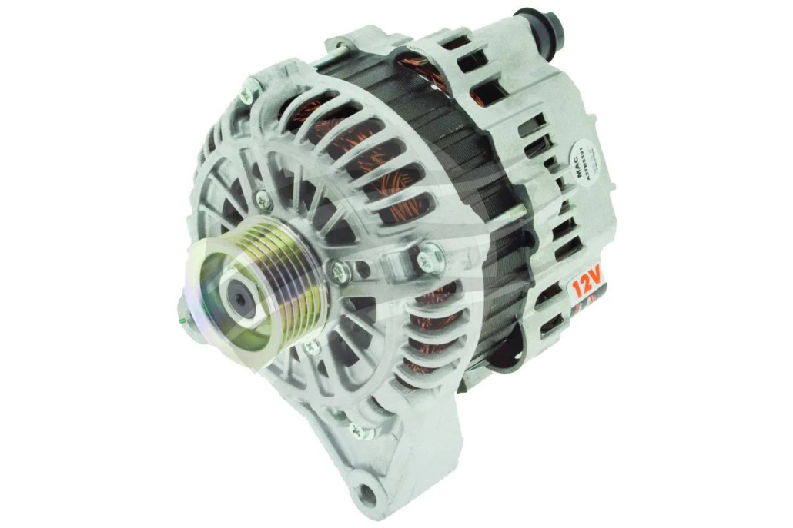
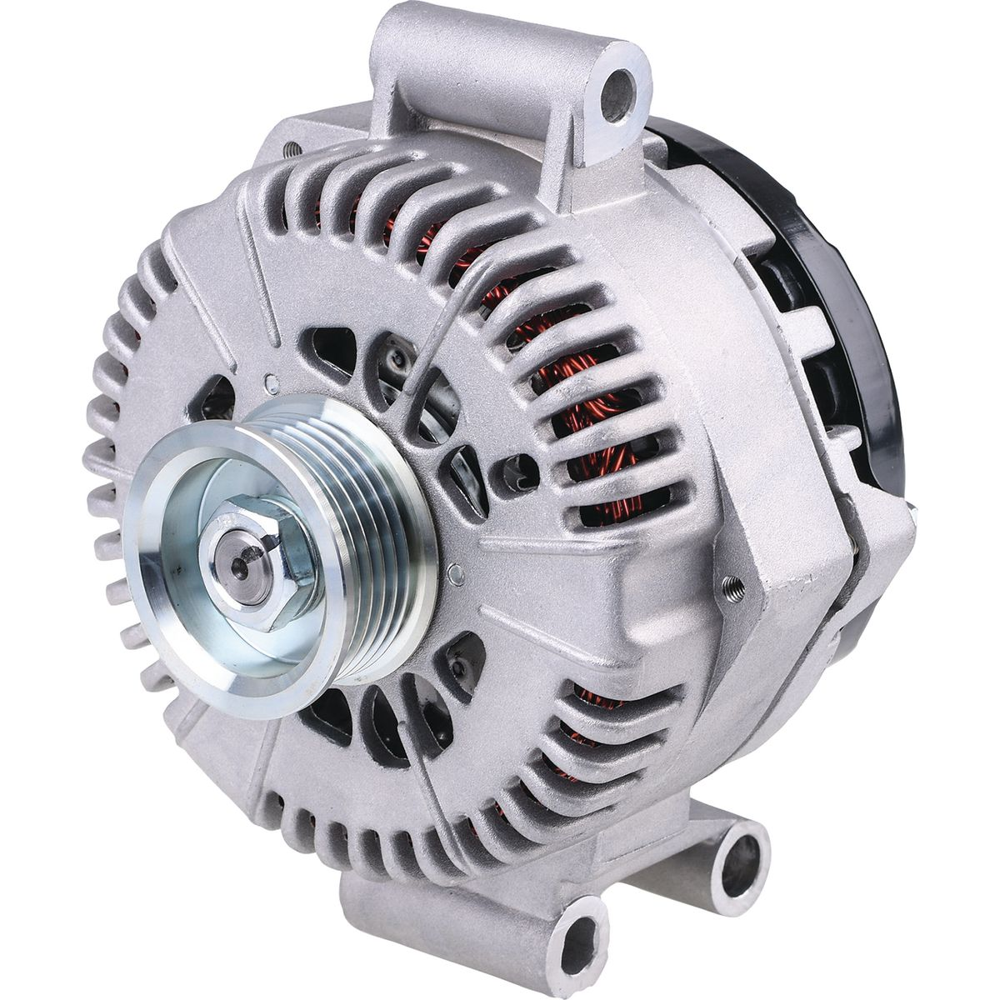
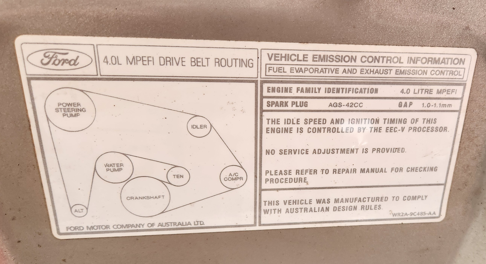

# Alternator

## Types

The AU Falcon has 2 types of alternators depending on if you have the 4L I6 (VCT or non-VCT) or the 5L V8:

### 4L I6

The base model AU Falcon alternator can be identified by the 2 pin connector and 2 main mounting bracket holes, and is situated directly below the power steering reservoir. This last point is unfortunate as the stock power steering high pressure line is prone to leaking failure that renders the alternator faulty due to power steering fluid making it into the alternator casing. This model of alternator is compatible with all AU-FG Falcons and all SX-SZ Territory models where an Intech/Barra motor is fitted, due to the fact that the Barra is a dual camshaft evolution of the Intech. Unfortunately this model is not compatible with older, EL models due to different mounting positions

> image taken from [T.I Performance](../../Credits.md#collected-information-primarily-product-listing-images) product listing page

### 5L V8

The V8 alternator, likely due to different engine configuration and power requirements, is inherently different to the 6cyl version. 

> image taken from [Repco](../../Credits.md#collected-information-primarily-product-listing-images) product listing page

## Replacement (I6 Only)

> NOTE: V8 replacement not covered due to project only including I6 models

> NOTE: no pictures as job most recently completed before creation of this project

To replace the Alternator, follow the steps below:
1. **DISCONNECT THE BATTERY**
1. remove the 2 10mm bolts holding in the thermo fans onto the back of the radiator, and gently remove the fan shroud, keeping in mind:
    - there is a small coolant hose that runs along the top of the radiator that may interfere with removal
    - the electrical connections for the fans must be disconnected prior to removal
1. reaching behind the power steering reservoir to the alternator rear, undo the 10mm nut holding the main electrical connection from the alternator to the rest of the vehicle wiring loom, and unplug
1. also on the back of the alternator, undo the 12mm nut holding the positive ring terminal for the alternator and remove.
1. note the configuration that the serpentine belt is currently in (if sticker denoting configuration is not still present on inside of hood lid)
    
    

    > Photo of the (Non-VCT) inline 6 Serpentine belt layout

1. remove the serpentine belt from the front of the belt by placing a 3/8" breaker bar into the square hole on the Automatic tensioner, and turning clockwise
    > NOTE: avoid using any adapters e.g. 1/2" to 3/8" as aging tensioners can become brittle with too much shear force and adapters will exacerbate that issue
1. from the front of the engine block, undo the 2 bolts holding the alternator in and carefully remove through the top of the ending bay
    > NOTE: generally it is a better idea to undo the bottom bolt first, and cradle the alternator as you undo the top bolt so there is no excessive pressure on the bolt
1. reinstall by repeating all previous steps in reverse
1. done