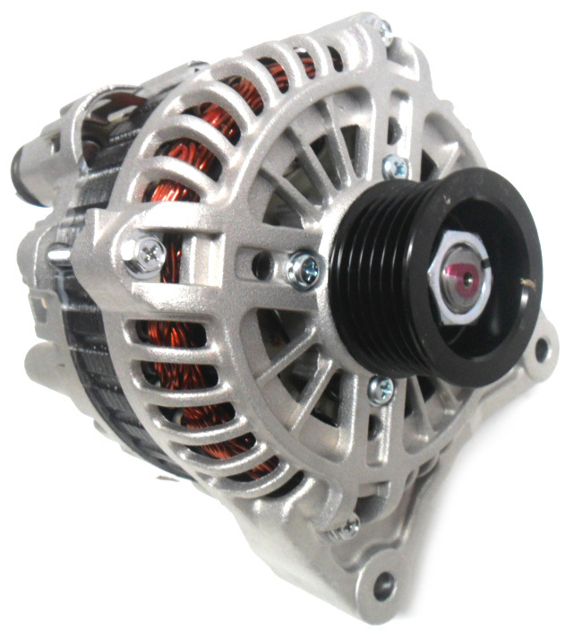
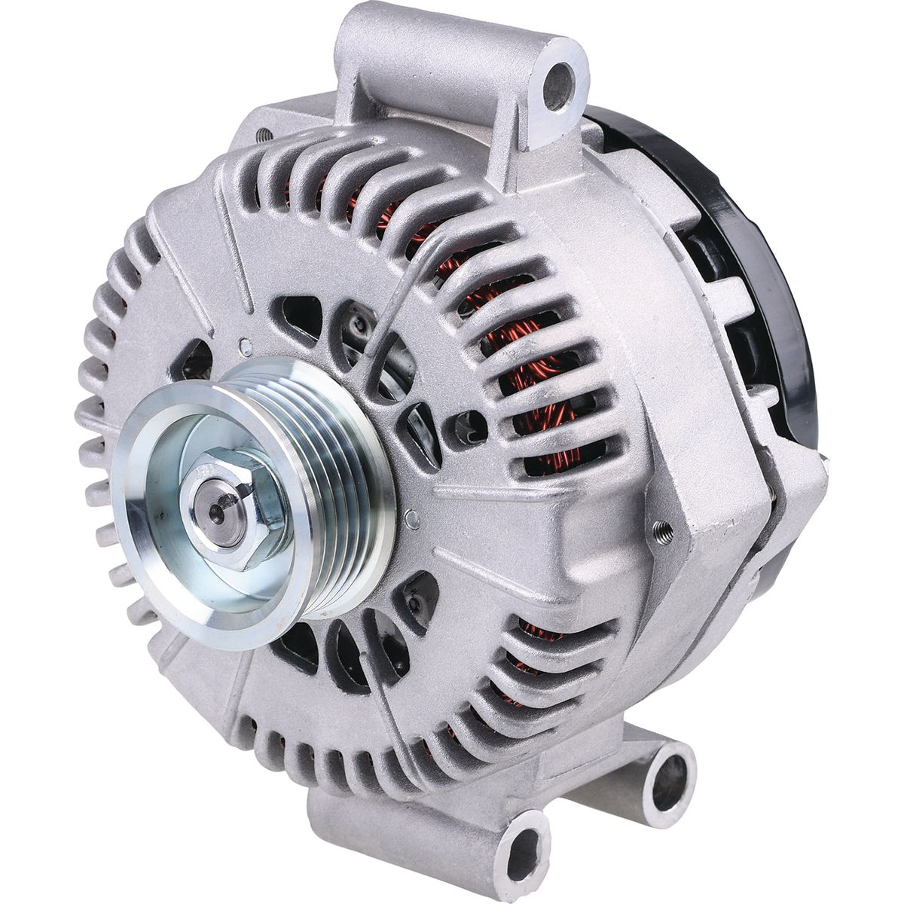
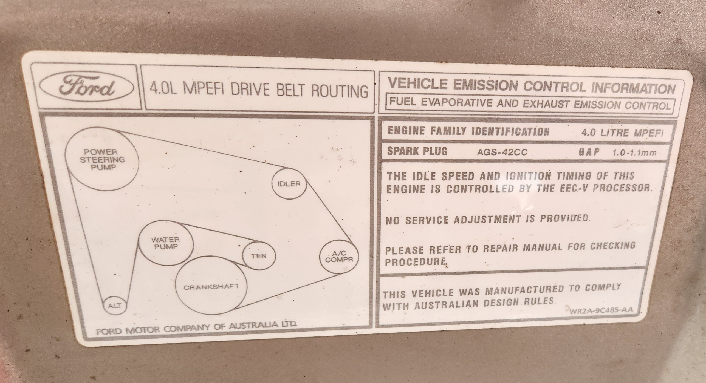

# Alternator

## Alternator Types

The AU Falcon has 3 types of alternators depending on factors such as series and engine option:

### 4L I6

The base model AU Falcon alternator can be identified 2 main mounting bracket holes, and is situated directly below the power steering reservoir. This is unfortunate as the stock power steering high pressure line is prone to o-ring failure over time, which renders the alternator faulty due to power steering fluid making it into the alternator casing.

> Image taken from [Auto Parts Supply](../../Credits.md#sources) product listing page

### 5L V8

The V8 alternator, due to different engine configuration and power requirements, is inherently different to the 6cyl version. 

> Image taken from [Repco](../../Credits.md#sources) product listing page

> Further information on the V8 models are limited here due to [lack of resources](../../Disclaimer.md#secondary-disclaimer---lack-of-resources)
{: .block-note}

## Plug Type

> Plug connectors for Series 1 I6 models removed as they were proven inaccurate. Accurate details will be added once confirmed!
{: .block-warning}

| Plug | Product # | Series | Engine | Location | Notes |
| --- | --- | --- | --- | --- | --- |
| Yazaki 2 pin female terminal housing | `58X-2S-2` | 2-3 | I6 | Loom End Connector | |
| Yazaki 2 pin male terminal housing | `58X-2P-2` | 2-3 | I6 | Alternator End connector | |
| Jaylec 3-pin connector | `53-605` | All | V8 | Loom end connector | UNCONFIRMED: [Lack of resources](../../Disclaimer.md#secondary-disclaimer---lack-of-resources) |
| JAS 3-pin to 2-pin alternator adapter | `E38-2050` | All | V8 | Adapter Loom | UNCONFIRMED: [Lack of resources](../../Disclaimer.md#secondary-disclaimer---lack-of-resources). Adapter itself is not known to be useful for V8 models, however this appears to be the only known way to get the Alternator End Connector for these models |
| UNKNOWN | | All | V8 | Alternator end connector | Information sparce on this connector, unlikely that it can even be sourced |

<!--
| AMP 3P Male Terminal Housing | `184192-1` | 1 | I6 | Alternator end connector | Difficult to source |
| AMP 3P Female Terminal Housing | `184032-1` | 1 | I6 | Loom end connector | |
-->

> Information Sources:
> - [eBay](../../Credits.md#sources) (parts listings)
> - [Yazaki](../../Credits.md#sources)
{: .info-sources}

<!-- TODO confirm this information -->
<!-- ## Pinout - Series 1 I6

For the following, assume you are looking at the alternator end connector, with the clip holder facing up

<table>
    <thead>
        <th>01</th>
        <th>02</th>
        <th>03</th>
    </thead>
</table>

| Position | Colour | Function |
| --- | --- | --- |
| 01 | Yellow/White | Sense, used for regulation |
| 02 | N/a | Not used |
| 03 | Red/Grey | Warning Lamp (for instrument cluster) |

## Pinout - Series 2-3 I6

For the following, assume you are looking at the alternator end connector, with the clip holder facing up

<table>
    <thead>
        <th>01</th>
        <th>02</th>
    </thead>
</table>

| Position | Colour | Function |
| --- | --- | --- |
| 01 | Yellow/White | Sense, used for regulation |
| 02 | Red/Grey | Warning Lamp (for instrument cluster) | 

## Additional notes - Series inter-compatibility (I6)

AU Series 1 vehicles share a connector with the BF/FG/FGX Falcons and SY/SZ Territory models, however the latter model alternators have additional "smart charge" features that would be lost on the AU and may cause unforeseen issues. The more widely accepted solution is to simply make a short adapter loom using the above pinouts ([1](#pinout---series-1), [2-3](#pinout---series-2-3)), the above [plug types](#plug-type) and an AUII-BA/SX Alternator.

AU Series 2-3 vehicles share a connector with the BA Falcon and SX Territory models, and require no modification. -->

## Diagnosis

Diagnosis of a bad alternator can be easily checked using a multimeter. Follow the steps below to verify alternator failure:

1. Confirm battery age and condition. If suspected bad battery, test using battery tester or use professional services to determine battery condition
1. Do not start the car for 24hrs, and check the battery voltage at the terminals with the multimeter. The voltage should read 12-13V. If not proceed to next step
1. Start the car and leave in Park (Neutral if manual). check terminals while car running with multimeter. The voltage should read 13-14.5V. If not, proceed to next step or assume replacement required
1. (optional) Disconnect battery terminals and jumpstart vehicle using jumpstarter or jumper leads and a known good battery/vehicle. Once jumped, disconnect jumper leads and leave car in idle. If car stalls quickly after disconnect, alternator likely at fault.

## Replacement (I6 Only)

> V8 replacement not covered due to project only including I6 models
{: .block-note}

> No pictures as job most recently completed before creation of this project
{: .block-note}

To replace the Alternator, follow the steps below:
1. **DISCONNECT THE BATTERY**
1. Remove the 2 10mm bolts holding in the thermo fans onto the back of the radiator, and gently remove the fan shroud, keeping in mind:
    - There is a small coolant hose that runs along the top of the radiator that may interfere with removal
    - The electrical connections for the fans must be disconnected prior to removal
1. Reaching behind the power steering reservoir to the alternator rear, undo the 10mm nut holding the main electrical connection from the alternator to the rest of the vehicle wiring loom, and unplug
1. Also on the back of the alternator, undo the 12mm nut holding the positive ring terminal for the alternator and remove.
1. Note the configuration that the serpentine belt is currently in (if sticker denoting configuration is not still present on inside of hood lid)
    
    

    > Photo of the (Non-VCT) inline 6 Serpentine belt layout

1. Remove the serpentine belt from the front of the belt by placing a 3/8" breaker bar into the square hole on the Automatic tensioner, and turning clockwise

    > Avoid using any adapters e.g. 1/2" to 3/8" as aging tensioners can become brittle with too much shear force and adapters will exacerbate that issue
    {: .block-note}

1. From the front of the engine block, undo the 2 bolts holding the alternator in and carefully remove through the top of the ending bay

    > Generally it is a better idea to undo the bottom bolt first, and cradle the alternator as you undo the top bolt so there is no excessive pressure on the bolt
    {: .block-note}
    
1. Reinstall by repeating all previous steps in reverse
1. Done