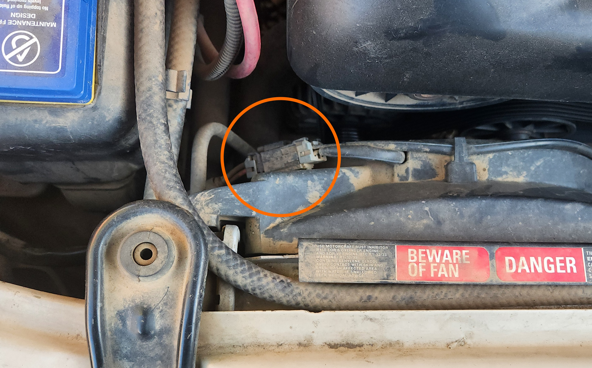
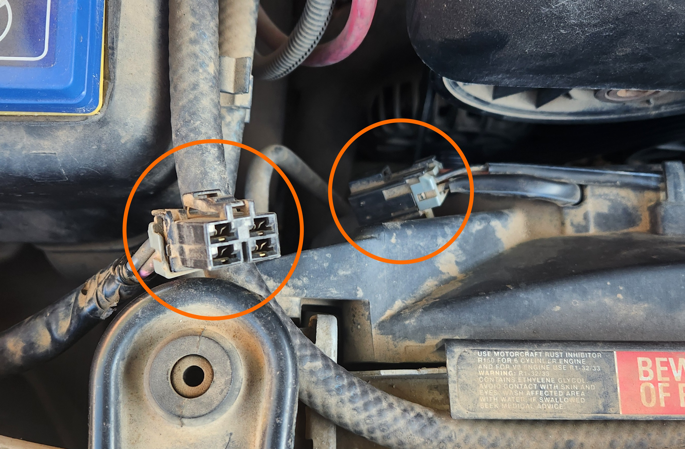
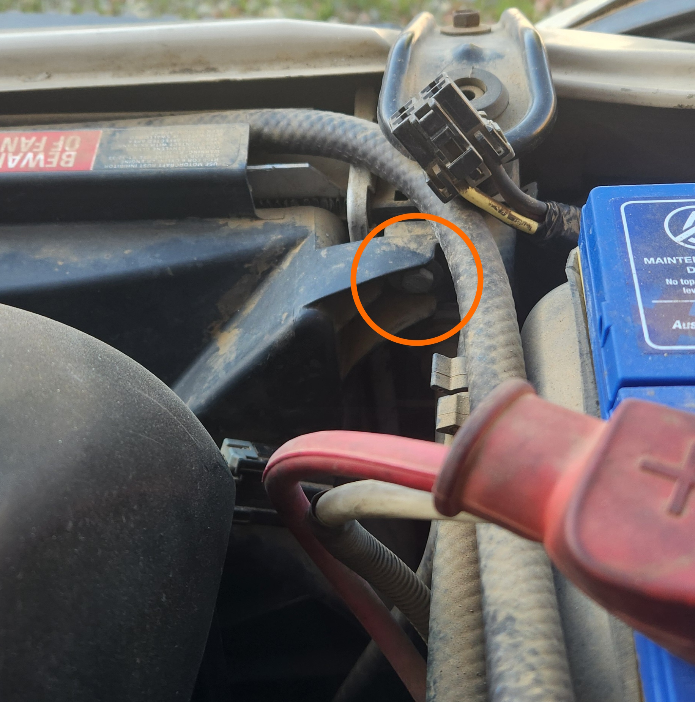
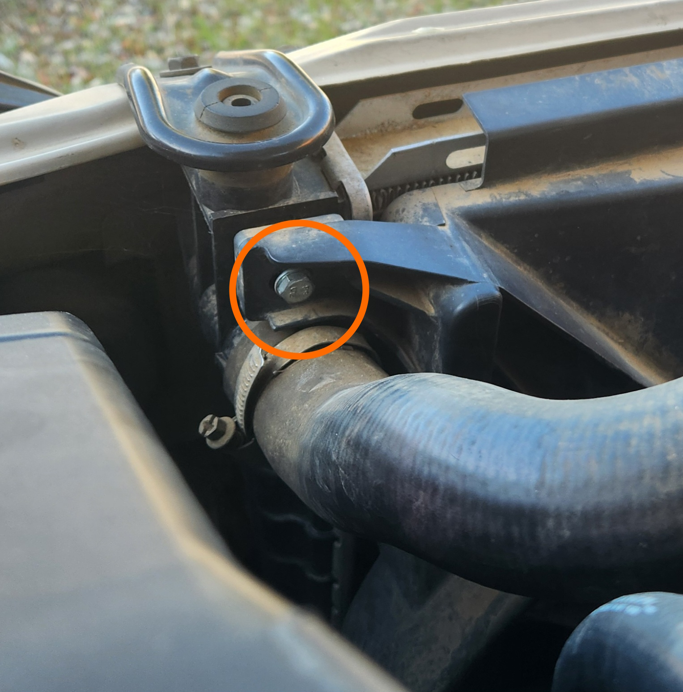
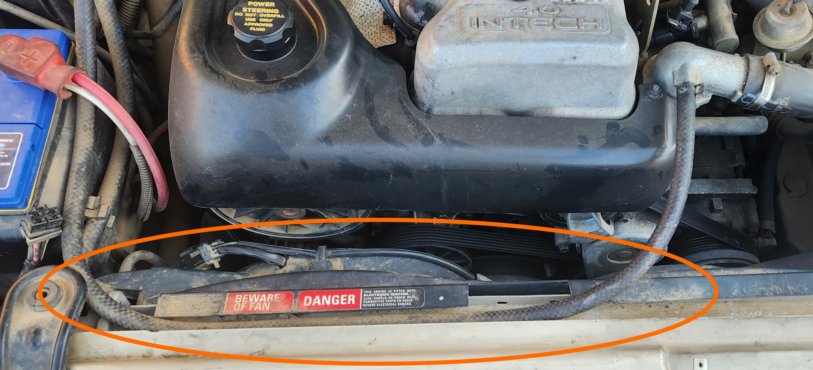
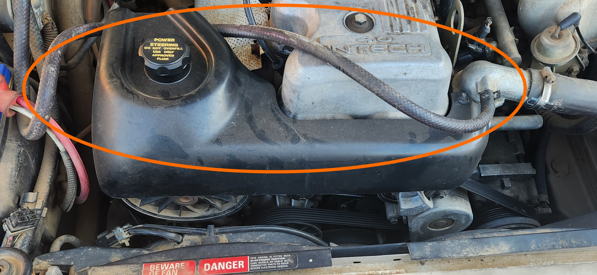
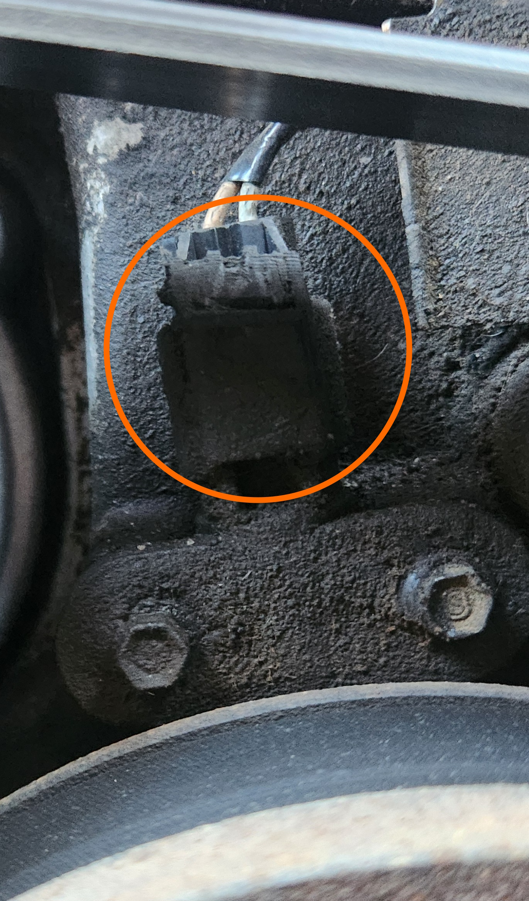
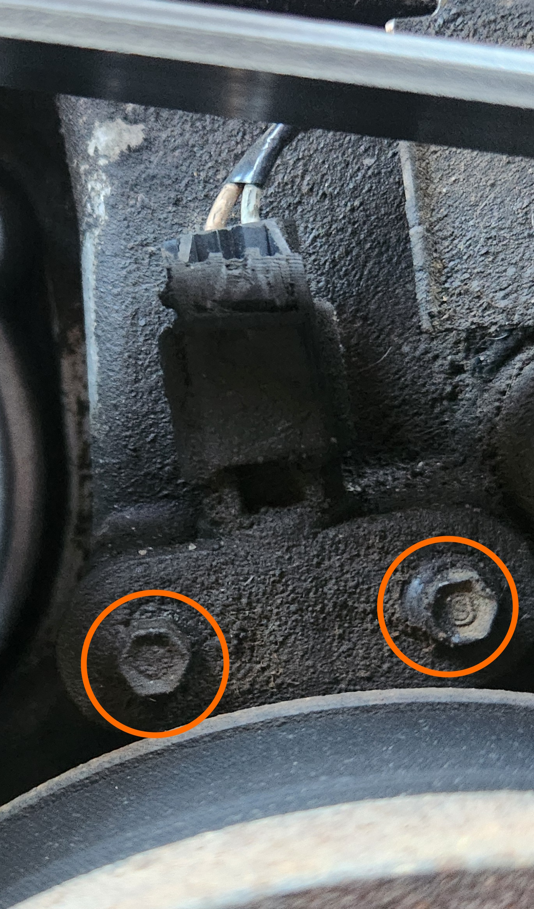

# Crankshaft Angle Sensor

> Information on this page focuses on the I6 model due to project not involving V8 model. Information has been added where possible but is otherwise ***incomplete indefinitely***
{: .block-note}

## Purpose
<!-- TODO add link to theoretical ABS page -->

The purpose of the Crankshaft Angle Sensor, or CAS, is simple: report to the ECU when the crank makes a fraction of a rotation, so that the Engine Management System can monitor and adapt to changes in the engine running. it does this using a sensor quite similar to an ABS Sensor, where a small voltage is recorded when a metallic object comes past the sensor itself. In the case of the I6 models of AU Falcon, the metallic object is a set of teeth on the harmonic balancer, at the base of the front of the engine block.

## Diagnosis

Diagnosis of this part is relatively tricky, as a failing CAS will send *incorrect* but *valid* information to the ECU, meaning it is unlikely to trip a [trouble code](../../ECUBCM/DTCCodes/DTCCodes.md#dtcs). Due to this, it is better to check for signs of any of the following which would at least suggest a replacement is recommended:

- Age - Cars are now in excess of 20 years old at time of writing, and as such the factory sensors are unlikely to be reliable
- Ingress - check for signs of excessive grime, oil, or similar both on the CAS housing *and* inside the plug
- Cracks - check for any cracks in the sensor unit plastics
- Car non-starting but checked for fuel/air/spark could indicate CAS failure as car won't start without it

## Additional Information

> Note that there is a different sensor between the I6 and V8 models of the AU Falcon. While the specifics of the difference is unknown, the mounting between these sensors do not align with eachother and should be avoided.
{: .block-note}

## Replacement

Replacement of the Crankshaft Angle Sensor is quite simple and can be completed using the following steps:

1. (optional) for increased working space:

    - Remove the 2 phillips head screws holding the intake snorkel to the airbox, and remove by pulling the snorkel from the airbox.

        
        > Picture of snorkel screw locations

    - Unplug the thermo fan electrical connector by pushing the table on the loom end connector down and pulling the 2 plug housings apart.

        
        
        > Pictures of thermo fan electrical connector, before and after removal respectively

    - Unbolt the 2 10mm bolts holding the top of the thermo fan assembly to the rear of the radiator

        
        
        > Pictures of the thermo fan housing bolt locations, for the driver side and passenger sides respectively

    - Adjust the thermostat housing coolant return line away from the working area

        
        
        > Pictures of the Thermostat coolant return line, before and after moving respectively

    - Remove the thermo fan assembly by pulling the assembly up and out

        > Be careful of the passenger side of the thermo fan assembly, as it will foul on the thermostat housing outlet pipe if pulled directly up. Some rotation will be required
        {: .block-note}

    > These steps allow for more working space, however a well positioned 1/4" drive ratchet with a sufficiently short extension should allow for removal if needed. You may also remove the Serpentine belt if additional space is required beyond this.
    {: .block-note}

1. Unplug the CAS connector by gently pushing the tab on the front of the plug housing towards the front of the vehicle, and pulling the cable up.

    
    > Picture of the CAS plug housing clip location (mind the grime). The clip is facing the front of the vehicle and can be pulled forward using a small flathead screwdriver if required.

    > Picture not completely accurate due to previously damaged housing
    {: .block-note}

1. Remove the 2 7mm bolts holding the plug assembly to the front of the engine, starting with the driver-side bolt, and gently pull the sensor from the front of the block

    
    > Picture of the CAS plug housing bolts locations (mind the grime).

    > After removal of the 2 bolts, the sensor should only be held by the keyed recessed sleeve in the passenger side bolt hole of the sensor, however depending on duration installed, it may be stuck on with grime or other debris. The driver-side bolt is the preferred starting point due to the aforementioned keyed sleeve.
    {: .block-note}

1. Replace by following all previous steps in reverse
1. done