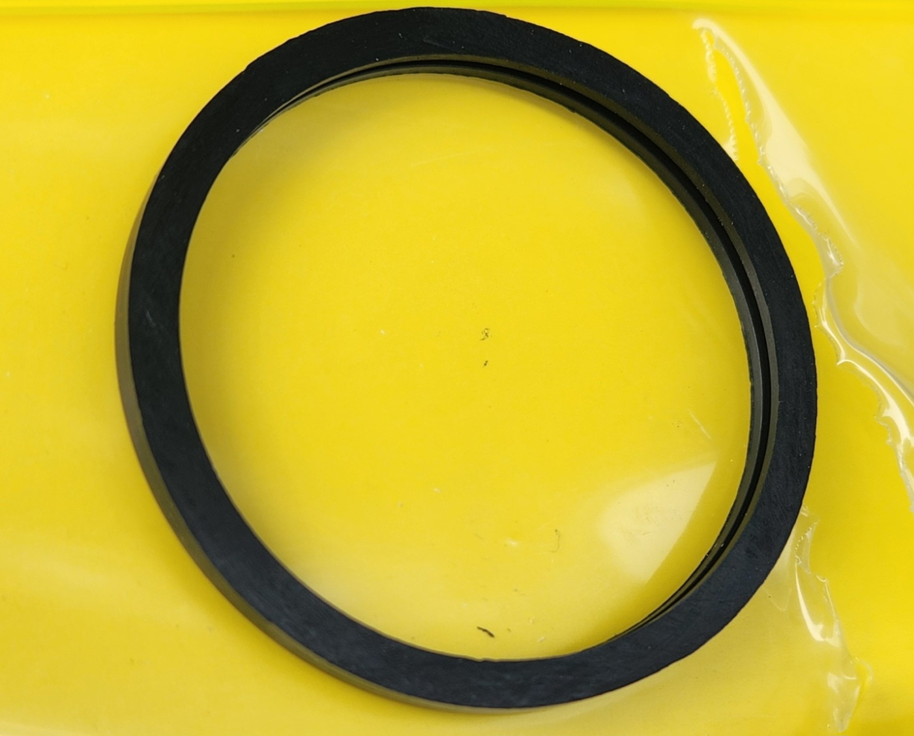
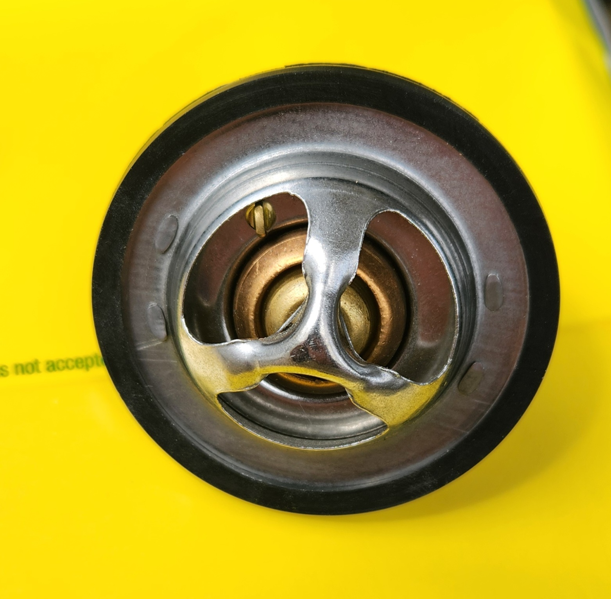
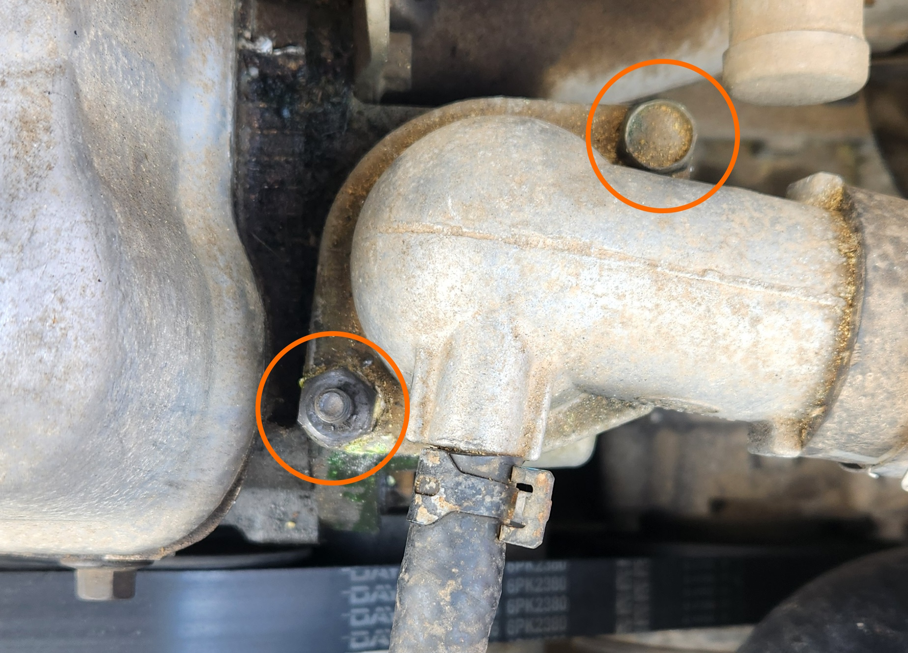
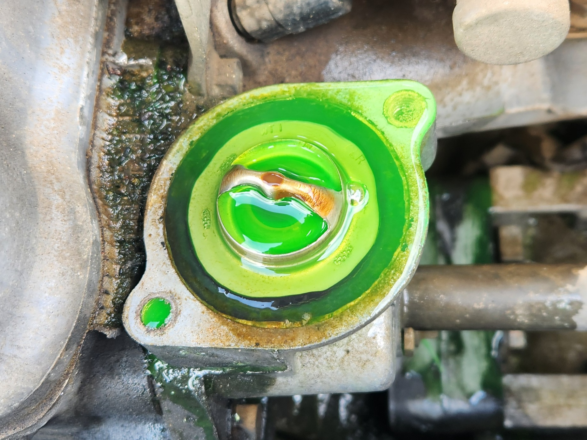
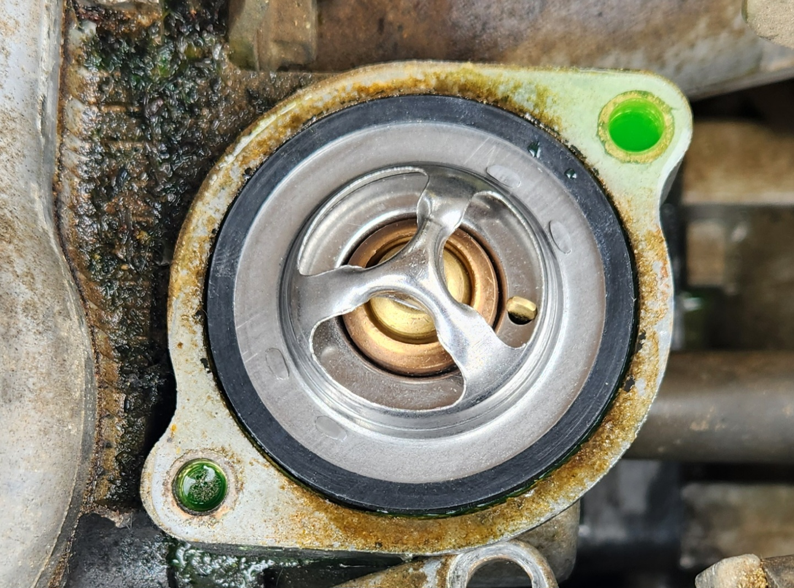

# Cooling Systems

## Thermostat replacement
Replacing the thermostat in an AU Falcon is a very simple job to do, and can save you from issues such as overheating or high fuel consumption if it become stuck. Follow the steps below to replace the thermostat:

1. (if not pre-assembled) assemble your thermostat and rubber seal. Note that the rubber seal should have a groove in it that the thermostat sits inside of.

    > NOTE: **UNDER NO CIRCUMSTANCES** is it advisable to reuse old rubber seals

    

    > Photo of rubber seal that fits on thermostat. Note the seam around the middle of the seal that the thermostat sits in

    

    > Photo of assembled thermostat

1. (optional) drain radiator and overflow tank to at below where the top radiator pipe meets the radiator

    > NOTE: this is not required if you are willing to lose approx 500ml of coolant to either a towel or the ground beneath the car. It will hit the AC Compressor on the way down also, so if you choose to remove with coolant you should be wary of the electrical plug on the passenger side of the compressor housing. It should be waterproof but it is also old by now

1. (if your vehicle has a belt cover) remove your belt cover by removing the lid of the Power Steering pump reservoir and removing the single 10mm bolt holding the shroud to the top of the thermostat housing

    

1. remove the 2 13mm bolts holding in the thermostat housing to the side of the engine and gently lift up the thermostat housing.

    > NOTE: if you did not drain the radiator, this is where the majority of the coolant will come out

    

1. remove the old thermostat by pulling up while gently prying at the rubber seal from the side
    
    > NOTE: you may need to use a trim removal tool to remove an older seal, however avoid using a screwdriver as it may damage the mating surfaces of the thermostat housing

    
    

    > Photos taken before and after removal of original thermostat respectively. Note the radiator was not drained prior

1. (optional) if required, clean the mating surfaces of both the thermostat housing and the engine side connector using a cloth

    > NOTE: the thermostat housing is the most likely location to need cleaning, due to it being where the rubber seal presses onto the bracket

1. install the new assembled thermostat into the housing

    

1. reinstall the 2 13mm bolts that hold the thermostat housing down

    > NOTE: ensure you have installed them the bolts in the correct position if you have a belt cover, as only one has the thread on the top to hold the cover on
    
1. (if you drained the coolant) refill coolant back to the "MAX" line on the overflow tank

    > NOTE: Refilling the radiator may require running the car for a time after this process is complete for the coolant to Cycle through or "burp", allowing for another few litres of coolant to be added. Make sure this is monitored if this is the case

1. (if your vehicle has a belt cover) reinstall the belt cover and screw down the 10mm nut once in place
1. start and run the vehicle for 2-5mins and ensure that there are no leaks coming from the thermostat housing
1. done