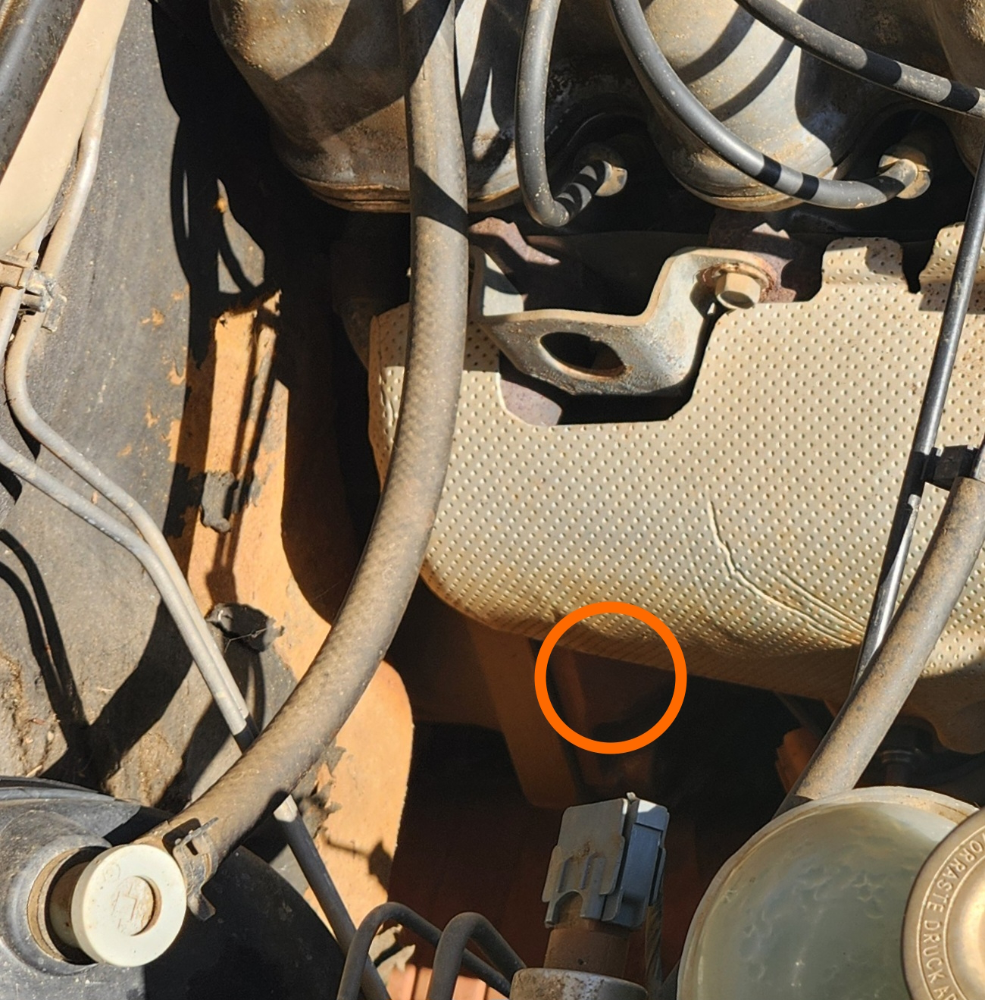
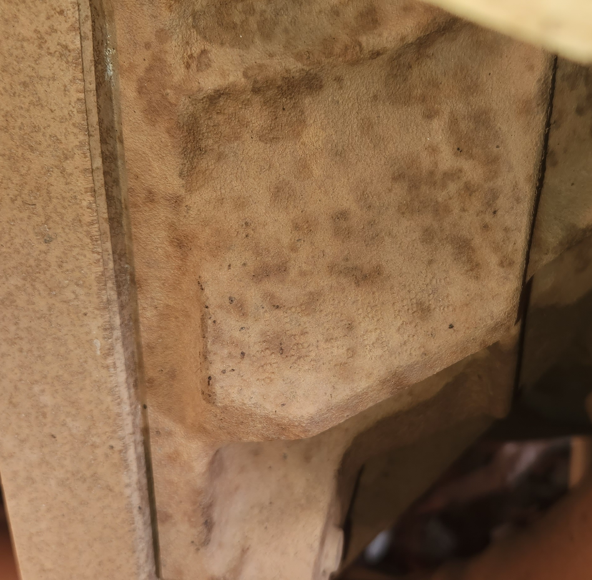
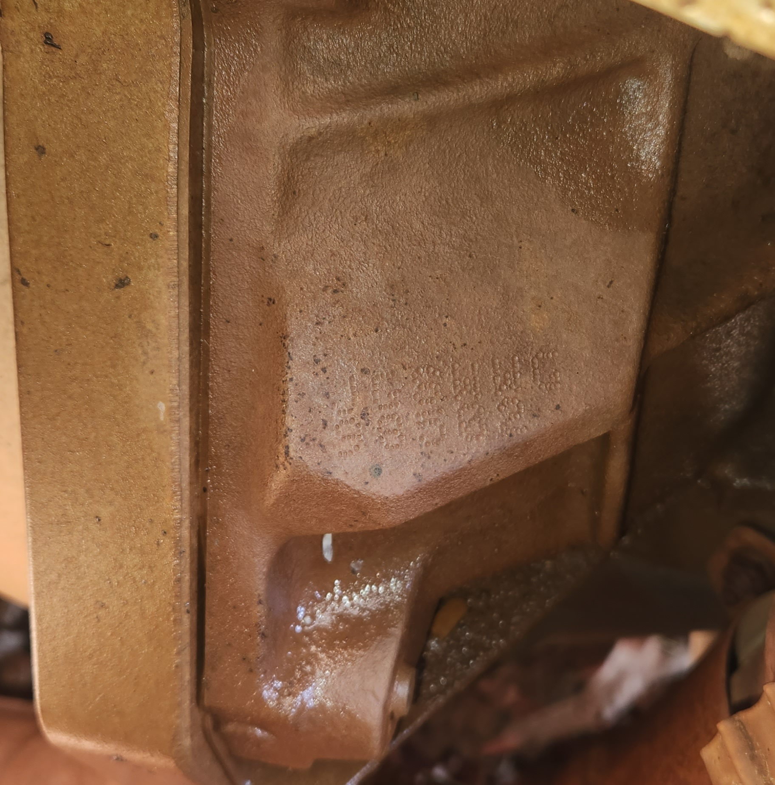

# Engine Number

> Information on the V8s are unavailable due to lack of resources. Information researched suggests it should be located above the starter motor, similar to the I6 model, but no further information is known
{: .block-note}

To ensure that you have the matching engine to the original chassis, you can check the number stamped into the engine block to determine if it matches the Body stamped VIN Number and the [VIN Plate](../../Miscellaneous/VIN/VIN.md#characters-1-3---6fp).

> The engine number should match the last 11 digits of the VIN number for the vehicle, e.g. the following VIN:
> 
> `6FPAAAJGSWYB12345`
>
> Should have the following engine number:
>
> `JGSWYB12345`
{: .block-note}

The Engine number is located on a piece of cast metal, on the driver side of the engine block, on the front of the transmission mating surface. It is dot-matrix stamped in and may require a bit of cleaning to see properly due to age and condition of the vehicle. Cleaning the surface with degreaser is an easy first step, but failing this the best known methods are to use either flour or chalk to attempt to make the lettering more legible.

> Engine number location within the engine bay

> Engine number close-up, before cleaning. Other models may have more or less rust/dust/grime depending on condition. For reference this is a 1998 built Series 1, so this *should* be representative of a worse example.

> Engine number, after cleaning with degreaser and a workshop rag