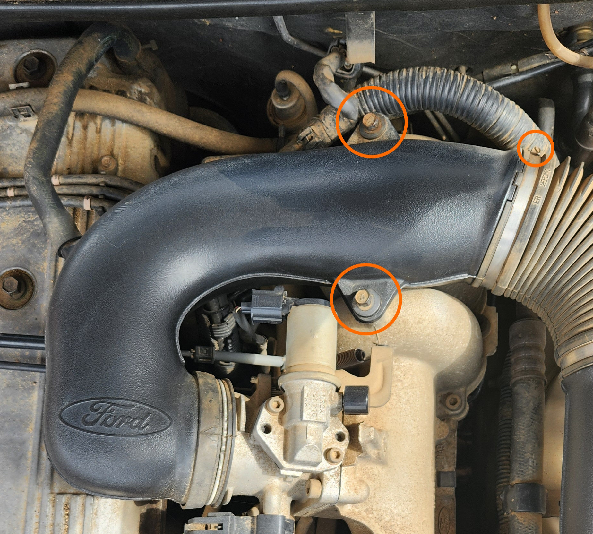
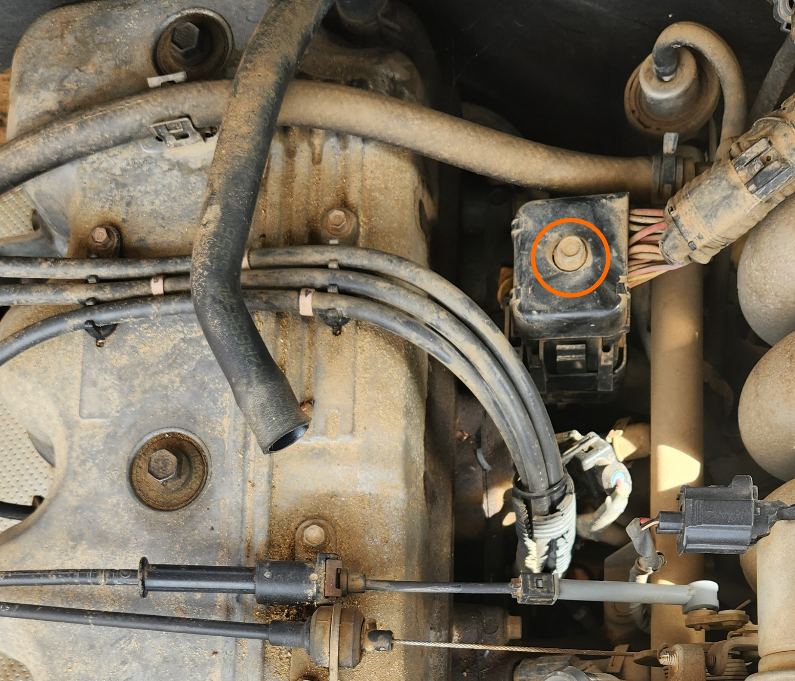
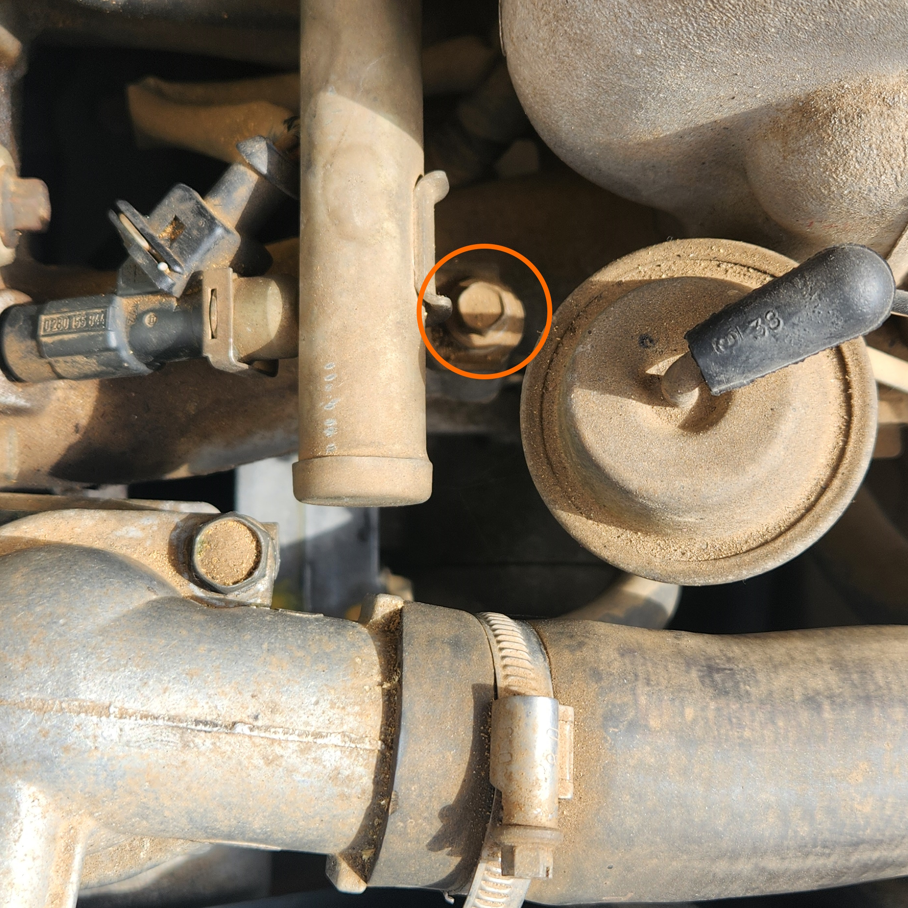
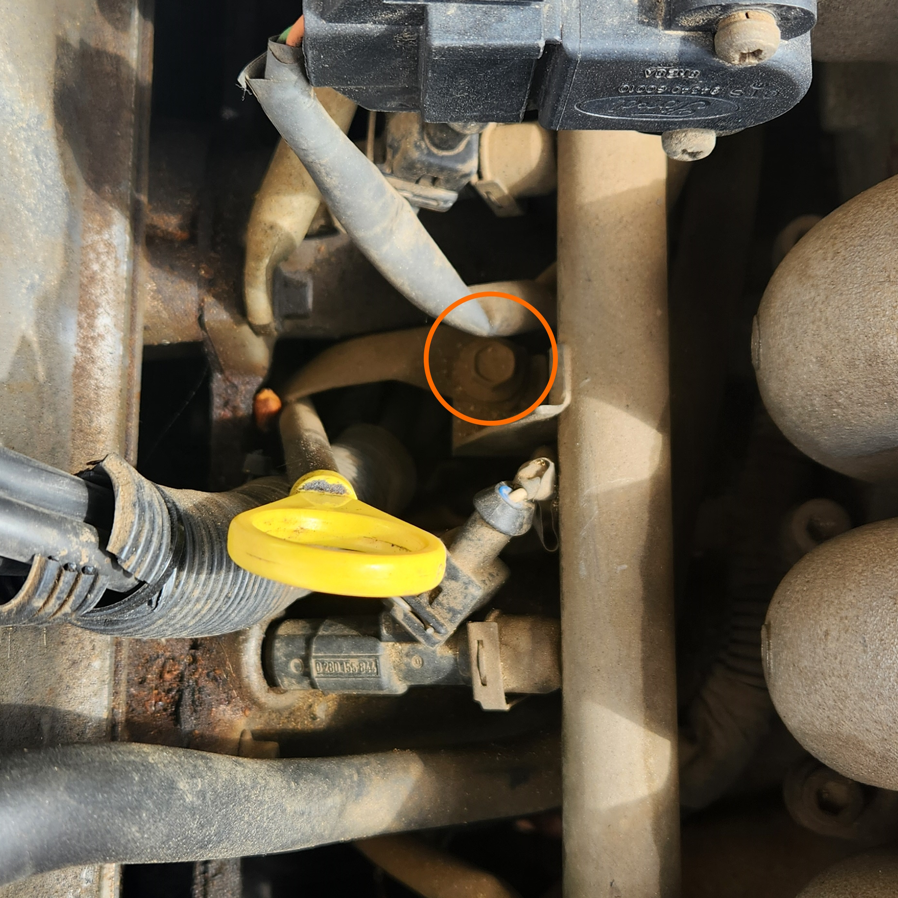
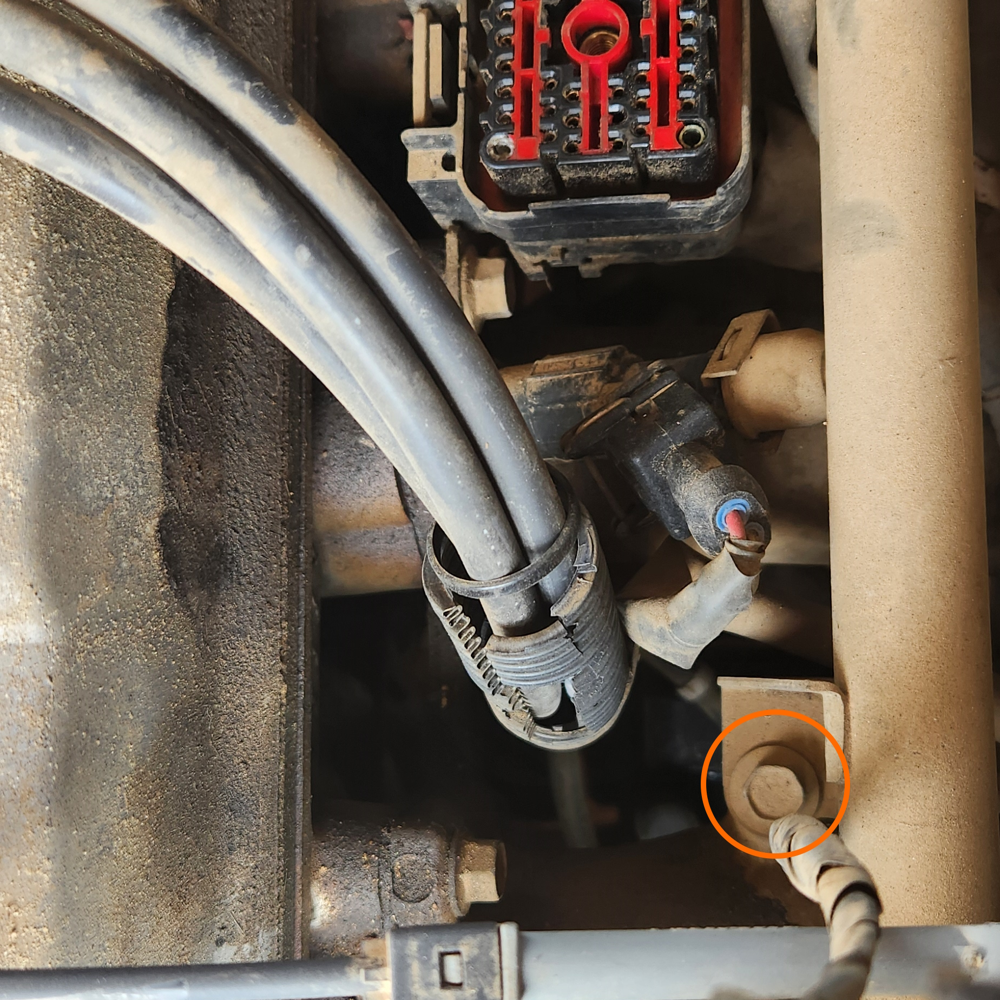
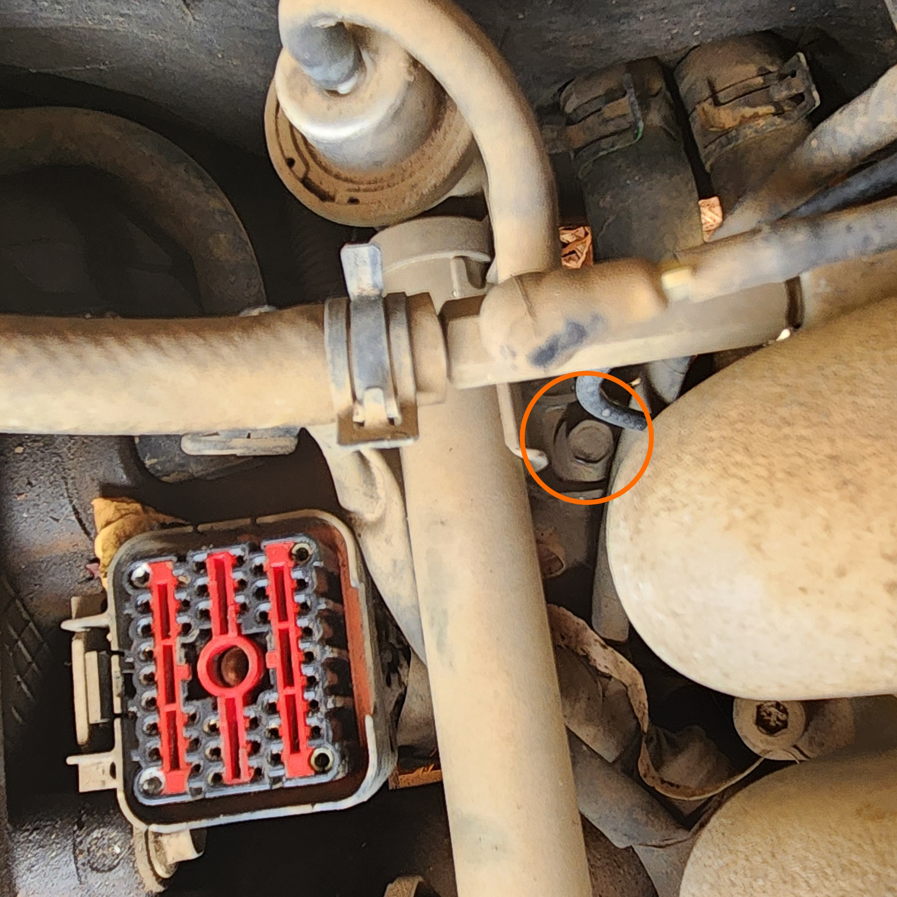
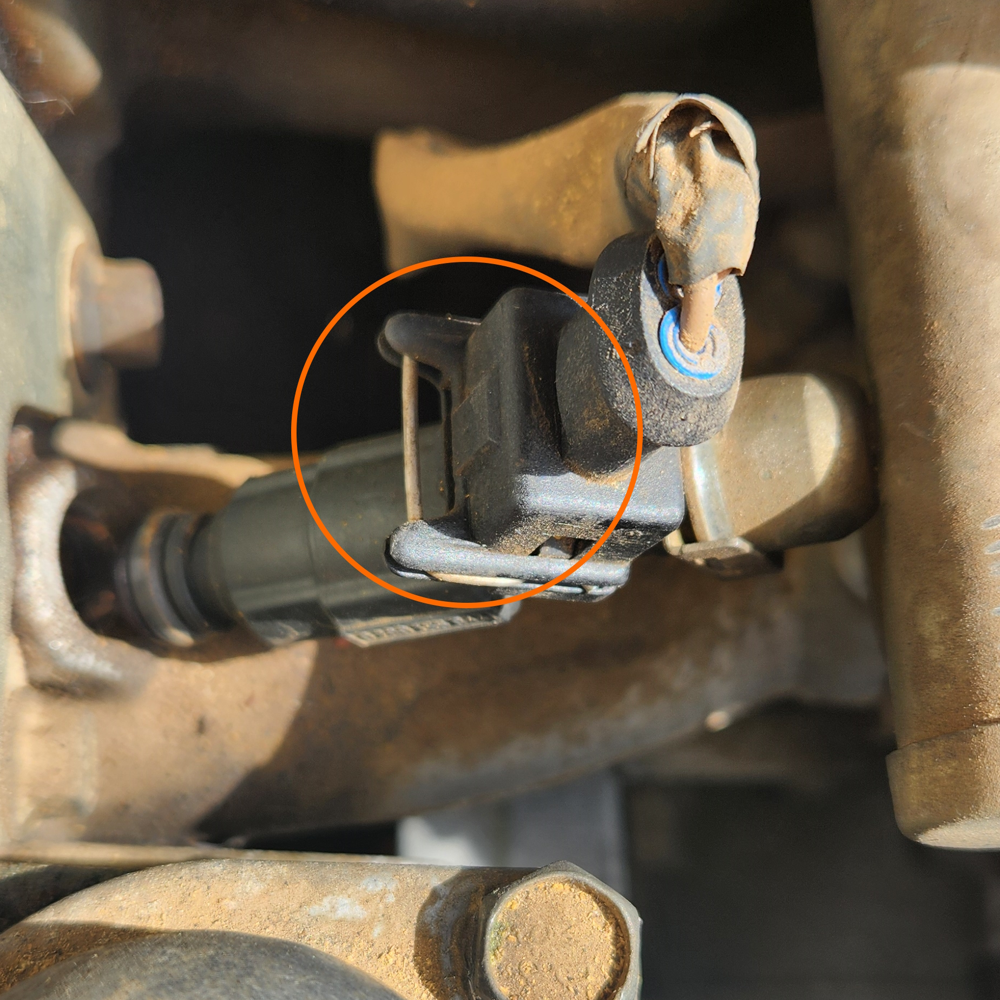
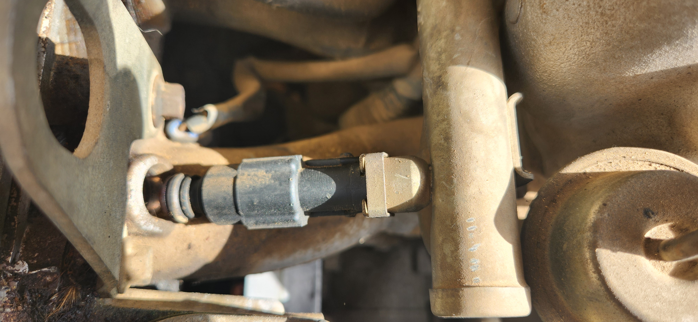

# Fuel Injectors

## Location

The fuel injectors can be found running down the intake/passenger side of the engine, connected to the fuel rail which sits directly below the throttle body

> Fuel injectors can be found in this area of the engine bay, although some are hidden by the intake manifold and throttle body assemblies

## Diagnosis

### Symptoms

Common reasons you may need to check or replace your fuel injectors include:

- rough/staggering ignition
- misfire when fuel trim changed e.g. sudden acceleration from stop
- misfire only when engine idle *and* warm

### Verification of fuel injector

In order to be more confident in the diagnosis of a faulty fuel injector, the following items should be checked first:

- Confirm problem is not for the entire fuel system. AU Falcons are prone to fuel pump issues over time, and as such the priming noise for the pump itself should be heard each time the ignition is clicked to "ACC" (the second click from off). The fuel regulator may also be at fault, however this is harder to diagnose and is not covered here.
- Verify specific cylinder(s). Fuel injectors are unlikely to fail all at once, so this can be achieved without specialty tools by simply removing the ignition lead for a cylinder, starting the vehicle, and comparing the engine cadence (noise/vibration). make a note of any cylinder disconnected where removal of the ignition lead made either minimal or no difference in cadence.
- [Replace the spark plug](../SparkPlugs/SparkPlugs.md#replacement) for that cylinder. If you do not have a used spark plug, swap the diagnosed cylinder from the previous step with a known good cylinder, and check that the misfire does not move
- Check the spark plug lead for the known bad cylinder(s), and swap with a known good cylinder to check that the misfire does not move.

    > If swapping the lead for a cylinder, ensure you also swap the connection on the coil pack itself, which may require removal of intake piping
    {: .block-note}

## Replacement

> These replacement instructions assume that you do not wish to remove the intake manifold or the throttle body. While this does make the procedure more difficult, this allows for the continued use of old gaskets and allows for the avoidance of hex-head bolts holding the manifold and throttle body in from rounding out
{: .block-note}

1. remove the upper intake piping from the top of the engine. Note this only requires 2 10mm bolts and a steel hose clamp be removed, and if desired, you could instead just remove the 2 10mm bolts and set the piping aside

    

    > Upper intake bolts that will need to be removed for access

1. remove the 10mm bolt holding the large engine management plug, then carefully remove the plug itself

    

    > Single bolt holding the engine management plug in. Note this bolt is captive and remains on the top of the housing upon removal

1. remove the 4 10mm bolts holding the fuel rail onto the engine

    > These bolts can only be accessed using an extension bar. care should be taken not to drop bolts into the engine bay, and to use a telescopic magnet or similar implement where possible
    {: .block-note}

    
    
    
    

    > Fuel line bolt locations, starting from the front

1. for each injector:
    1. rotate the injector so that the electrical plug is facing up, and carefully remove the small retaining wire clip in the electrical connector, followed by the electrical connector itself

        

        > Location of the small wire retention clip in the fuel injector electrical connector for cylinder #1

    1. from this position, rotate the injector 180o and remove the square retaining clip in the rear of the fuel injector. This clip can be removed by hand but care should be taken not to drop it upon removal

        

        > Location of the square retaining clip at the rear of the fuel injector of cylinder #1

    1. remove the injector from the engine, then the fuel line, using a moderate amount of force

        > Fuel injector o-rings may get stuck in the rail depending on the age of the old injectors. If this is the case, the O-ring can be removed using a small allen key or small metal pick

1. complete steps in reverse for reinstallation
1. done