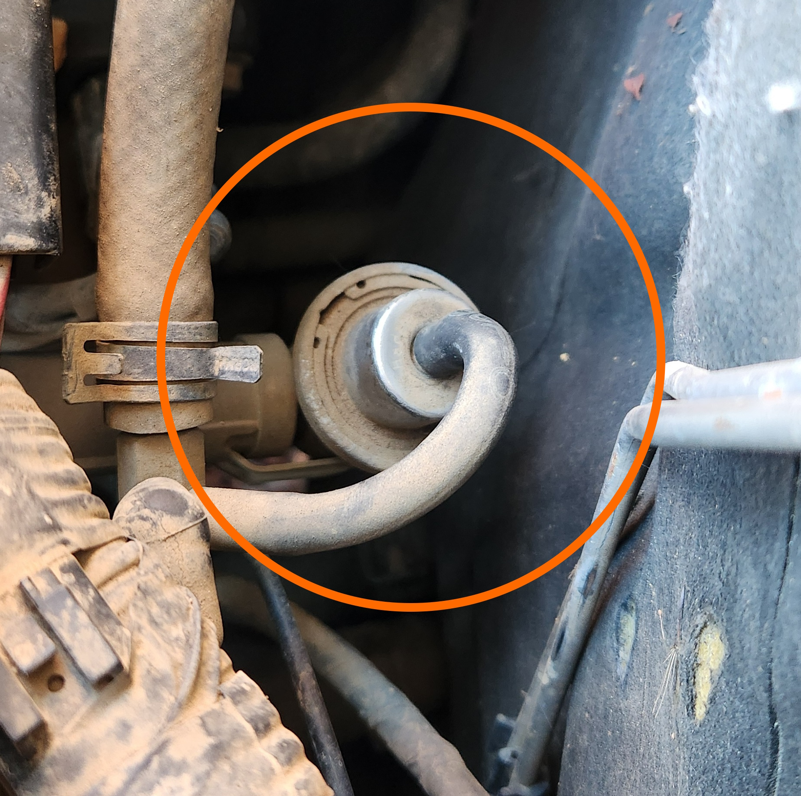

# Fuel Pressure Regulator

The fuel pressure regulator is the valve responsible for maintaining the correct fuel pressure in the fuel line, and returning any overflow fuel back into the fuel tank.

## Location

The fuel pressure regulator is located at the rear of the engine bay on the Passenger side of the engine. It is connected to the end of the fuel rail that runs along the intake side of the engine.

> Image of the Fuel Pressure Regulator

## Additional Note

Note that aftermarket fuel pressure regulators may come with the return line on a perpendicular angle to the valve on the bottom. This is a non-issue.

> Images of the 2 known types of fuel pressure regulators.

## Diagnosis

### Symptoms

Some of the reasons you may need to consider replacing the fuel pressure regulator are listed below:

- Vehicle running lean
- Vehicle running rich
- high fuel consumption
- Misfire on cylinders closest to the front of the engine (cylinders 1 & 2 predominately)
- Rough or hunting idle, particularly once vehicle is up to temperature

### Verification of Fuel Pressure Regulator

Generally speaking fuel pressure regulators are one of the first parts to be replaced when diagnosing a fuelling issue, however the following should be checked first:

- confirm no major Fuel Pump failure, signalled by lack of noise from fuel pump when car turned to accessories.
- confirm spark by checking spark plug quality ([replace if necessary](../SparkPlugs/SparkPlugs.md#replacement)), leads and [pack resistance](../IgnitionCoil/IgnitionCoil.md#primary-resistance) if possible. specific cylinders can be tested by swapping leads on each coil, i.e. 1 & 6, 2 & 5, 3 & 4

## Replacement

> These instructions assume removal of no other parts of the vehicle, however if more accessibility is required, the upper intake piping can be removed by way of 2 10mm bolts. It also assumes that the old regulator will be damaged on removal due to the use of vice grip pliers.
{: .block-note}

### Equipment

For this replacement the following equipment is required:

- Long-handled, medium sized flat head screwdriver
- Straight circlip pliers
- Vice grip pliers
- Petroleum jelly

### Steps

1. Remove the Fuel Relay from the [Engine Bay Fuse Panel](../../Electrical/Fuses/Fuses.md#engine-bay) and crank engine until unable to start

    > Alternatively you can leave the car not running for 24hrs before starting procedure
    {: .block-note}

    <!-- TODO add pic -->

1. Remove fuel return line from the top section of the fuel pressure regulator

    

    > Image of the fuel pressure regulator after the fuel return line has been removed

1. Use circlip pliers to remove the retaining circlip by locating the 2 holes in the circlip, inserting the small ends of the pliers, compressing the clip, and lifting the circlip up from its original location.

1. Remove the old fuel pressure regulator by using the vice grip pliers on a looser setting and pulling up

    > While the fuel pressure regulator is only interference fitted to the fuel pressure regulator port, due to the long lifespans of these components they are generally unable to be removed by hand. This necessitates stronger removal methods, and by extension, means that due to the damage that will likely be caused, necessitates replacement regardless of inspection.
    {: .block-note}

1. On the new fuel pressure regulator, lightly lubricate the o-rings with petroleum jelly. When lubricating, ensure you do not block the valce on the bottom of the assembly

    > In a pinch, clean fuel can be used, however installation must be soon after lubrication in this case due to the evaporation speed of fuel
    {: .block-note}

    

    > Locations to lubricate on new fuel pressure regulator

1. Press the new fuel pressure regulator back into the regulator port on the vehicle with a firm press, and place the circlip on top ready for compression.

    > A *small* amount of force using a small rubber mallet can be used if absolutely necessary, but no steel tools should be used to place the fuel pressure regulator.
    {: .block-note}

    

    > The new fuel pressure regulator, post-placement

1. Use the circlip pliers and the screwdriver to reinstall the circlip. The easiest way to install the circlip is to press the closed end into the circlip groove using the screwdriver, while using the end of the circlip pliers to compress the open end and press into the other side of the circlip groove.

1. Done