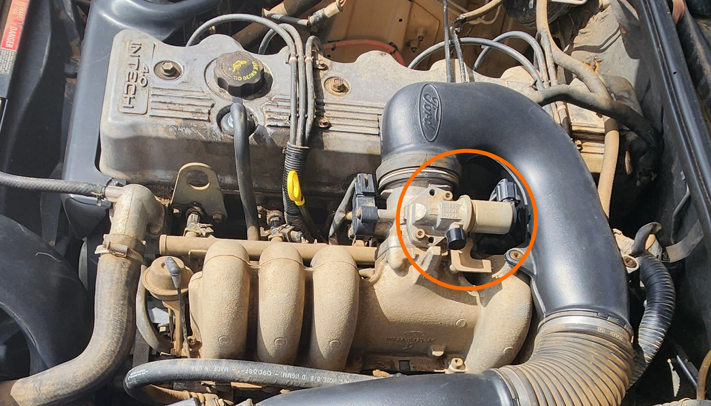

# Idle Speed Controller (ISC)

> This information is only relevant to the I6 models, due to lack of information on V8 models available
{: .block-note}

The Idle Speed Controller is the component on top of the Throttle body at the top of the motor responsible for controlling the idle while the throttle is completely shut.

## Diagnosis

Only one known test is available for the ISC to check for failure without removal, which is the vehicles inability to reliably cold start. Note that this is *not* a reliable test, and the movement of the ISC inner spring should be tested to confirm this diagnosis.

## Location

See the below picture for the exact location of the ISC on the I6 models of AU Falcon

## Removal

To remove the ISC, simply remove the 2 allen head bolts holding the controller in using a 5mm allen key.

> There is a small gasket under these controllers, be careful when removing unless you have a replacement gasket handy, as they will cause excess air issues if there is a gap on reinstallation
{: .block-quote}

## Cleaning

An important note on cleaning the components in the throttle body area of the engine is to never use degreaser. The correct cleaning products to use to ensure nothing is damaged by the cleaning product is one of the following:

- Throttle body cleaner
- Brake cleaner
- Paper towels
- Cotton swabs (if really required)